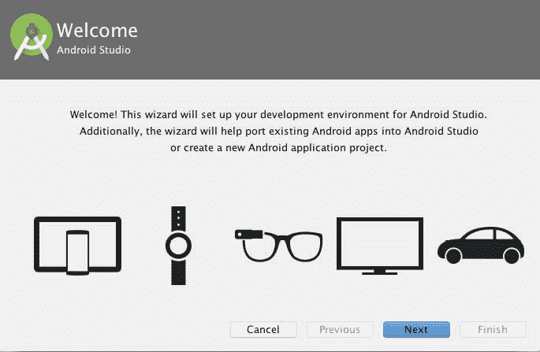
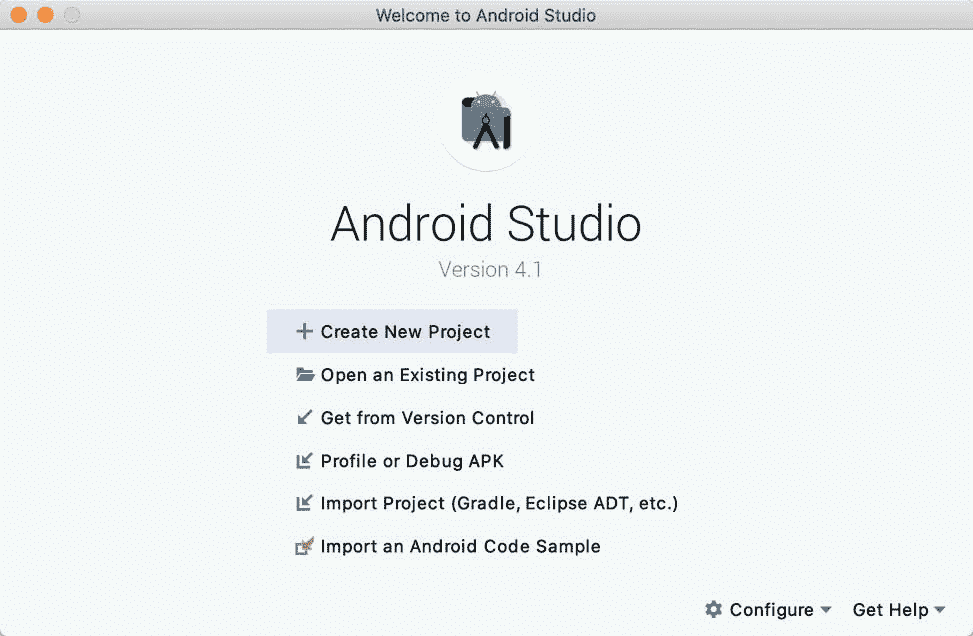
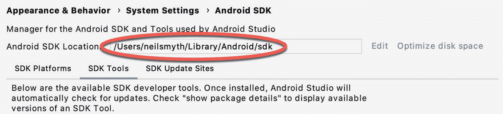
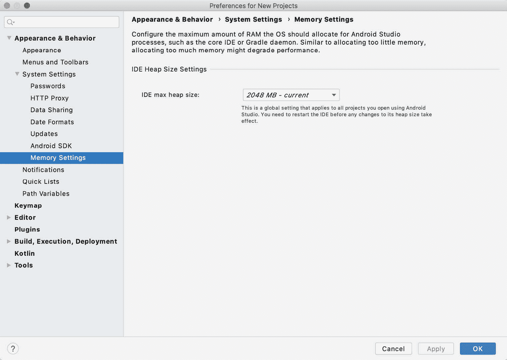

# 二、设置AndroidStudio开发环境

在开发安卓应用的任何工作开始之前，第一步是配置一个计算机系统作为开发平台。这涉及到许多步骤，包括安装AndroidStudio集成开发环境(IDE)，其中还包括安卓软件开发工具包(SDK)和 OpenJDK Java 开发环境。

本章将涵盖在基于 Windows、macOS 和 Linux 的系统上安装 Android 应用开发所需组件的必要步骤。

2.1 系统要求

安卓应用开发可以在以下任何系统类型上执行:

Windows 7/8/10 (32 位或 64 位，尽管安卓仿真器只能在 64 位系统上运行)

macOS 10.10 或更高版本(仅基于英特尔的系统)

配备英特尔 i5 或更高版本以及最低 8GB 内存的 ChromeOS 设备

带有 2.19 版或更高版本的 GNU C 库(glibc)的 Linux 系统

最少 4GB 内存(首选 8GB)

大约 4GB 的可用磁盘空间

最小屏幕分辨率为 1280 x 800

2.2 下载AndroidStudio包

为安卓开发应用所涉及的大部分工作将使用AndroidStudio环境来执行。本书中的内容和示例是基于 Android Studio 版本，使用 Android 11.0 (Q) API 30 SDK 创建的，在撰写本文时，这些版本是当前版本。

然而，AndroidStudio经常更新，所以自从这本书出版以来，可能已经发布了一个更新的版本。

AndroidStudio的最新版本可以从主下载页面下载，该页面可以在以下网址找到:

[https://developer.android.com/studio/index.html](https://developer.android.com/studio/index.html)

如果本页提供了下载新版AndroidStudio的说明，那么需要注意的是，这本书和软件之间可能会有一些小的不同。AndroidStudio 4.1 的网络搜索应该提供下载旧版本的选项，以防这些差异成为问题。或者，访问以下网页，在档案中找到 Android Studio 4.1:

[https://developer.android.com/studio/archive](https://developer.android.com/studio/archive)

2.3 安装AndroidStudio

下载后，安装AndroidStudio的具体步骤会因执行安装的操作系统而异。

2.3.1 安装在窗户上

在 windows 资源管理器窗口中找到下载的 Android Studio 安装可执行文件(名称为 Android-Studio-ide-<version>-Windows . exe)，双击该文件开始安装过程，如果出现“用户帐户控制”对话框，请单击“是”按钮。</version>

AndroidStudio设置向导出现后，通过各种屏幕来配置安装，以满足您对AndroidStudio应该安装到的文件系统位置以及是否应该提供给系统其他用户的要求。当提示选择要安装的组件时，请确保AndroidStudio和安卓虚拟设备选项都已选中。

虽然没有严格规定AndroidStudio应该安装在系统的什么位置，但本书的其余部分将假设安装是在 C:\ Program Files \ Android \ Android Studio 中执行的，并且 Android SDK 包已经安装到用户的 AppData\Local\Android\sdk 子文件夹中。配置好选项后，单击安装按钮开始安装过程。

在带有开始菜单的 Windows 版本上，新安装的AndroidStudio可以在安装过程中从添加到该菜单的条目中启动。可执行文件可以固定在任务栏上，以便通过导航到AndroidStudio\bin 目录，右键单击可执行文件并选择固定到任务栏菜单选项来轻松访问。请注意，可执行文件以 32 位(studio)和 64 位(studio64)可执行版本提供。如果您运行的是 32 位系统，请确保使用 studio 可执行文件。

2 . 3 . 2 macOS 上的 安装

macOS 的 Android Studio 是以磁盘映像的形式下载的(。dmg)文件。下载好 Android-studio-ide-<version>-MAC . dmg 文件后，在 Finder 窗口中找到并双击打开，如图[图 2-1](#_idTextAnchor012) :</version>


图 2-1

要安装软件包，只需将AndroidStudio图标拖放到应用文件夹中。AndroidStudio包将被安装到系统的应用文件夹中，这个过程通常需要几分钟才能完成。

要启动AndroidStudio，请使用 Finder 窗口在应用文件夹中找到可执行文件，然后双击它。

为了将来更容易地访问该工具，请将AndroidStudio图标从 Finder 窗口拖到 dock 上。

2.3.3 在 Linux 上的安装

下载完 Linux AndroidStudio包后，打开一个终端窗口，将目录更改为要安装AndroidStudio的位置，并执行以下命令:

```java
unzip /<path to package>/android-studio-ide-<version>-linux.zip
```

请注意，AndroidStudio捆绑包将被安装到一个名为AndroidStudio的子目录中。因此，假设上面的命令是在/home/demo 中执行的，软件包将被解包到/home/demo/android-studio 中。

要启动AndroidStudio，请打开终端窗口，将目录更改为AndroidStudio/bin 子目录，并执行以下命令:

```java
./studio.sh
```

当在 64 位 Linux 系统上运行时，在AndroidStudio运行之前，有必要安装一些 32 位支持库。在 Ubuntu 上，可以使用以下命令安装这些库:

```java
sudo apt-get install libc6:i386 libncurses5:i386 libstdc++6:i386 lib32z1 libbz2-1.0:i386
```

在基于红帽和软呢帽的 64 位系统上，使用以下命令:

```java
sudo yum install zlib.i686 ncurses-libs.i686 bzip2-libs.i686
```

2.4 AndroidStudio设置向导

AndroidStudio在安装后第一次启动时，会出现一个对话框，提供从以前的AndroidStudio版本导入设置的选项。如果您有以前版本的设置，并且希望将它们导入到最新的安装中，请选择适当的选项和位置。或者，指示您不需要导入任何以前的设置，然后单击“确定”按钮继续。

接下来，设置向导可能会出现，如图 2-2 所示，尽管该对话框不会出现在所有平台上 ms:



图 2-2

如果向导出现，请单击“下一步”按钮，选择“标准”安装选项，然后再次单击“下一步”。

AndroidStudio将继续下载和配置最新的安卓软件开发工具包和一些额外的组件和包。完成此过程后，单击下载组件对话框中的完成按钮，此时将出现欢迎使用AndroidStudio屏幕:



图 2-3

2.5 安装附加安卓软件开发工具包

到目前为止，执行的步骤已经安装了 Java、AndroidStudio集成开发环境和当前默认的安卓软件开发工具包。在继续之前，值得花一些时间来验证安装了哪些软件包，并安装任何丢失或更新的软件包。

此任务可以使用安卓软件开发工具包设置屏幕执行，该屏幕可以通过从AndroidStudio欢迎对话框中选择配置- >软件开发工具包管理器选项从AndroidStudio工具中启动。一旦调用，默认设置对话框的安卓软件开发工具包屏幕将出现，如图[图 2-4](#_idTextAnchor018) :


图 2-4

第一次安装AndroidStudio后，很可能只安装了最新发布的安卓软件开发工具包。要安装旧版本的安卓软件开发工具包，只需选择与版本对应的复选框，然后单击应用按钮。

也有可能更新将被列为可用于最新的软件开发工具包。要访问可用于更新的软件包的详细信息，请启用位于屏幕右下角的“显示软件包详细信息”选项。这将显示类似于[图 2-5](#_idTextAnchor019) 所示的信息:


图 2-5

上图突出显示了更新的可用性。要安装更新，请启用项目名称左侧的复选框，然后单击应用按钮。

除了安卓软件开发工具包，还安装了许多工具来构建安卓应用。要查看当前安装的软件包并检查更新，请停留在软件开发工具包设置屏幕中，并选择软件开发工具包工具选项卡，如图 2-6 所示:


图 2-6

在安卓软件开发工具包工具屏幕中，确保以下软件包在状态列中被列为已安装:

安卓软件开发工具包构建工具

安卓模拟器

安卓软件开发工具包平台工具

安卓软件开发工具包工具

谷歌游戏服务

英特尔 x86 仿真器加速器(HAXM 安装程序)

谷歌通用串行总线驱动程序(仅限 Windows)

布局检查器图像服务器

如果上述任何软件包被列为“未安装”或需要更新，只需选中这些软件包旁边的复选框，然后单击“应用”按钮启动安装过程。

安装完成后，请查看软件包列表，并确保所选软件包现在在“状态”列中列为“已安装”。如果任何一个被列为“未安装”，请确保它们已被选中，然后再次单击“应用”按钮。

2.6 使安卓软件开发工具包工具命令行可访问

大多数情况下，安卓软件开发工具包的底层工具将从AndroidStudio环境中访问。尽管如此，在某些情况下，从命令提示符或终端窗口调用这些工具还是很有用的。为了让您正在开发的操作系统能够找到这些工具，有必要将它们添加到系统的 PATH 环境变量中。

无论操作系统如何，PATH 变量都需要配置为包括以下路径(其中<path_to_android_sdk_installation>表示安装 Android SDK 的文件系统位置):</path_to_android_sdk_installation>

```java
<path_to_android_sdk_installation>/sdk/tools
<path_to_android_sdk_installation>/sdk/tools/bin
<path_to_android_sdk_installation>/sdk/platform-tools
```

可以通过启动 SDK 管理器并参考位于设置面板顶部的 Android SDK 位置:字段来识别您系统上 SDK 的位置，如[图 2-7](#_idTextAnchor022) 所示:



图 2-7

一旦确定了软件开发工具包的位置，将其添加到路径变量的步骤取决于操作系统:

2.6.1 Windows 7

1.右键单击桌面开始菜单中的计算机，并从结果菜单中选择属性。

2.在属性面板中，选择高级系统设置链接，并在生成的对话框中，单击环境变量…按钮。

3.在“环境变量”对话框中，在“系统变量”列表中找到路径变量，选择它并单击“编辑...”按钮。使用编辑对话框中的新建按钮，向路径中添加三个新条目。例如，假设 Android SDK 安装到 C:\ user \ demo \ AppData \ Local \ Android \ SDK 中，则需要添加以下条目:

```java
C:\Users\demo\AppData\Local\Android\Sdk\platform-tools
C:\Users\demo\AppData\Local\Android\Sdk\tools 
C:\Users\demo\AppData\Local\Android\Sdk\tools\bin
```

4.单击每个对话框中的确定，并关闭系统属性控制面板。

完成上述步骤后，通过打开命令提示符窗口(开始->所有程序->附件->命令提示符)验证路径设置是否正确，并在提示符下输入:

```java
echo %Path%
```

返回的路径变量值应该包括到 Android SDK 平台工具文件夹的路径。通过尝试运行 adb 工具，验证平台工具值是否正确，如下所示:

```java
adb
```

该工具在执行时应该输出一个命令行选项列表。

同样，通过尝试启动 AVD 管理器命令行工具，检查工具路径设置(如果 AVD 管理器工具报告 Java 有问题，请不要担心——这将在后面解决):

```java
avdmanager
```

如果一个或两个命令出现类似以下消息的消息，很可能是路径环境变量附加了不正确的路径:

```java
'adb' is not recognized as an internal or external command,
operable program or batch file.
```

2.6.2 Windows 8.1

1.在开始屏幕上，将鼠标移动到屏幕右下角，并从结果菜单中选择搜索。在搜索框中，输入控制面板。当控制面板图标出现在结果区域时，单击它以在桌面上启动该工具。

2.在控制面板中，使用类别菜单将显示更改为大图标。从图标列表中选择一个标记为系统的图标。

3.从步骤 2 到步骤 4，按照为 Windows 7 概述的步骤进行操作。

打开命令提示符窗口(将鼠标移动到屏幕右下角，选择搜索选项，并在搜索框中输入 cmd)。从搜索结果中选择命令提示符。

在命令提示符窗口中，输入:

```java
echo %Path%
```

返回的路径变量值应该包括到 Android SDK 平台工具文件夹的路径。通过尝试运行 adb 工具，验证平台工具值是否正确，如下所示:

```java
adb
```

该工具在执行时应该输出一个命令行选项列表。

同样，通过尝试运行 avdmanager 命令行工具，检查工具路径设置(如果 AVD Manager 工具报告 Java 有问题，请不要担心——这将在后面解决):

```java
avdmanager
```

如果一个或两个命令出现类似以下消息的消息，很可能是路径环境变量附加了不正确的路径:

```java
'adb' is not recognized as an internal or external command,
operable program or batch file.
```

2.6.3 窗口 10

右键单击开始菜单，从结果菜单中选择设置，并在查找设置文本字段中输入“编辑系统环境变量”。在系统属性对话框中，单击环境变量...按钮。从步骤 3 开始，按照为 Windows 7 概述的步骤操作。

2 . 6 . 4Linux

在 Linux 上，这种配置通常可以通过向。您主目录中的 bashrc 文件(具体内容可能会因使用的特定 Linux 发行版而异)。假设 Android SDK 捆绑包安装到/home/demo/Android/sdk 中，则。bashrc 文件的内容如下:

```java
export PATH=/home/demo/Android/sdk/platform-tools:/home/demo/Android/sdk/tools:/home/demo/Android/sdk/tools/bin:/home/demo/android-studio/bin:$PATH
```

还要注意，上面的命令将 android-studio/bin 目录添加到 PATH 变量中。这将允许执行 studio.sh 脚本，而不管终端窗口中的当前目录如何。

2.6.5 柔软

可以采用多种技术来修改 macOS 上的$PATH 环境变量。可以说，最干净的方法是在/etc/PATH . d 目录中添加一个新文件，其中包含要添加到$PATH 的路径。假设 Android SDK 安装位置为/Users/demo/Library/Android/SDK，可以通过在/etc/path . d 目录中创建新的名为 android-sdk 的文件来配置路径，该文件包含以下行:

```java
/Users/demo/Library/Android/sdk/tools
/Users/demo/Library/Android/sdk/tools/bin
/Users/demo/Library/Android/sdk/platform-tools
```

请注意，因为这是一个系统目录，所以在创建文件时需要使用 sudo 命令。例如:

```java
sudo vi /etc/paths.d/android-sdk
```

2.7 AndroidStudio内存管理

Android Studio 是一个大型复杂的软件应用，由很多后台进程组成。尽管AndroidStudio过去一直被批评提供的性能低于最佳水平，但谷歌在最近的版本中做出了显著的性能改进，并在每个新版本中继续这样做。这些改进的一部分包括允许用户配置AndroidStudio集成开发环境和用于构建和运行应用的后台进程使用的内存量。这允许软件利用具有更大内存量的系统。

如果您在具有足够的未使用内存来增加这些值的系统上运行AndroidStudio(此功能仅在具有 5GB 或更多内存的 64 位系统上可用)，并且发现AndroidStudio的性能似乎有所下降，则可能值得尝试这些内存设置。AndroidStudio可能还会通知您，可以通过类似如下所示的对话框来提高性能:


图 2-8

要查看和修改当前内存配置，请选择文件->设置...(AndroidStudio->首选项...在 macOS)菜单选项上，并在生成的对话框中，选择左侧导航面板中系统设置下列出的内存设置选项，如下图[图 2-9](#_idTextAnchor030) 所示。

更改内存分配时，请确保不要分配超过必要的内存，也不要在不降低其他进程速度的情况下分配超出系统可用空间的内存。



图 2-9

IDE 内存设置会调整分配给 Android Studio 的内存，并且无论当前加载的项目如何都适用。另一方面，当一个项目从AndroidStudio内部构建和运行时，许多后台进程(称为守护进程)执行编译和运行应用的任务。编译和运行大型复杂项目时，可能会通过调整守护进程堆设置来缩短构建时间。与 IDE 堆设置不同，这些设置仅适用于当前项目，并且只能在AndroidStudio中打开项目时访问。

2.8 更新AndroidStudio和 SDK

AndroidStudio和安卓软件开发工具包的新版本不时发布。新版本的软件开发工具包使用安卓软件开发工具包管理器安装。AndroidStudio通常会在更新准备好安装时通知你。

要手动检查 Android Studio 更新，请单击 Android Studio 欢迎屏幕中的配置->检查更新菜单选项，或使用帮助->检查更新...(AndroidStudio->检查更新...在 macOS 上)菜单选项，可从 Android Studio 主窗口中访问。

2.9 总结

在开始开发基于安卓的应用之前，第一步是建立一个合适的开发环境。这包括安卓软件开发工具包和AndroidStudio集成开发环境(也包括 OpenJDK 开发环境)。在本章中，我们已经介绍了在 Windows、macOS 和 Linux 上安装这些软件包所需的步骤。