# 三、在 AndroidStudio 创建安卓应用示例

本书的前几章已经介绍了使用 Android Studio IDE 配置适合 Android 应用开发的环境的必要步骤。在进入更高级的主题之前，现在是验证所有必需的开发包都已安装并正常运行的好时机。实现这一目标的最好方法是创建一个安卓应用，并编译和运行它。本章将介绍如何使用 AndroidStudio 创建安卓应用项目。项目创建完成后，下一章将探讨如何使用安卓模拟器环境来执行应用的测试运行。

3.1 关于项目

本章中创建的项目采用了一个基本的货币转换计算器的形式(事实上非常简单，它只将美元转换为欧元，并使用一个估计的转换率进行转换)。该项目还将利用最基本的 AndroidStudio 项目模板之一。这种简单性让我们可以介绍安卓应用开发的一些关键方面，而不会试图一次性引入太多概念，比如推荐的应用架构和安卓架构组件，从而让初学者不知所措。当遵循本章中的教程时，请放心，这个初始示例项目中使用的所有技术和代码将在后面的章节中更详细地介绍。

3.2 创建新的安卓项目

应用开发过程的第一步是在 AndroidStudio 环境中创建一个新项目。因此，首先启动 AndroidStudio，以便出现“欢迎来到 AndroidStudio”屏幕，如图 3-1 所示:

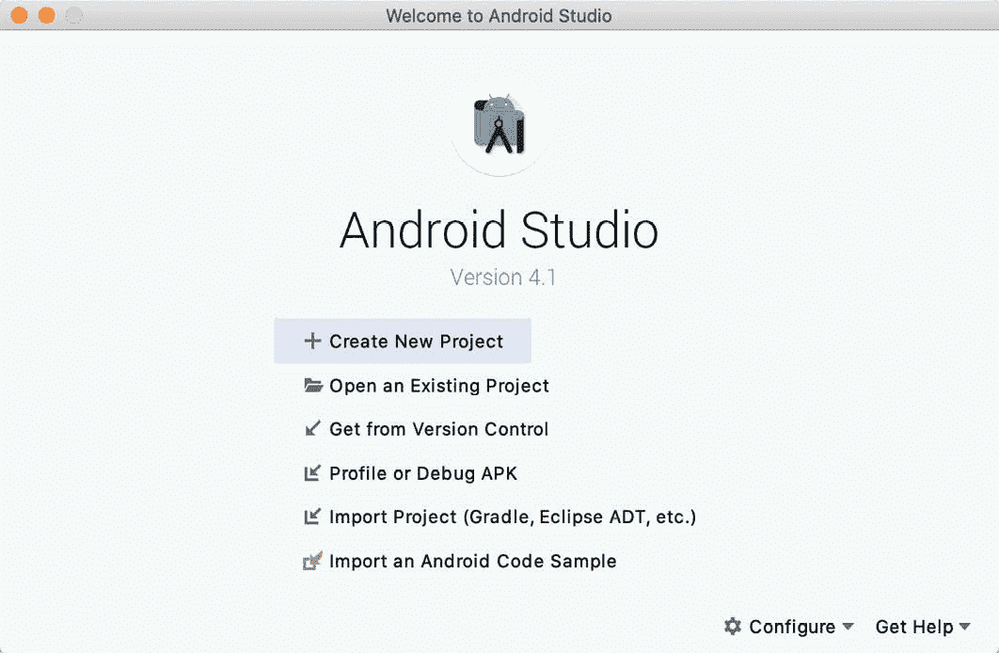

图 3-1

一旦这个窗口出现，AndroidStudio 就可以创建新项目了。要创建新项目，只需单击“创建新项目”选项，显示“新建项目”向导的第一个屏幕。

3.3 创建活动

第一步是定义要为应用创建的初始活动的类型。可以选择为手机和平板电脑、穿戴操作系统、电视、安卓音频或安卓设备创建项目。开发安卓应用时，有一系列不同的活动类型，其中许多将在后面的章节中详细介绍。但是，在本例中，只需选择在电话和平板电脑屏幕上创建空活动的选项。空活动选项创建由单个文本视图对象组成的模板用户界面。

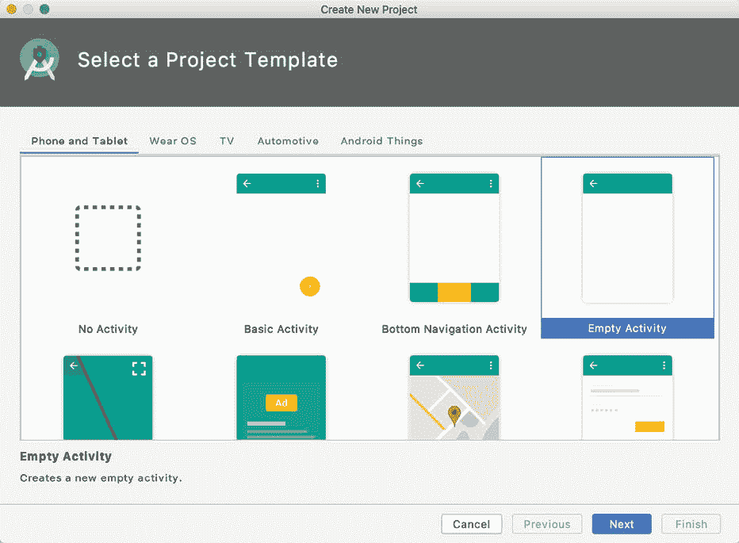

图 3-2

选择空活动选项后，单击下一步继续项目配置。

3.4 定义项目和软件开发工具包设置

在项目配置窗口([图 3-3](#_idTextAnchor042) )中，将名称字段设置为 AndroidSample。应用名称是在 AndroidStudio 中引用和识别应用的名称，也是如果完整的应用在谷歌游戏商店中销售时将使用的名称。

包名用于唯一标识安卓应用生态系统中的应用。虽然这可以设置为唯一标识您的应用的任何字符串，但它传统上是基于域名的反向网址，后跟应用的名称。例如，如果您的域是 www.mycompany.com，并且应用已被命名为 AndroidSample，那么包名可能被指定如下:

```java
com.mycompany.androidsample
```

如果您没有域名，您可以在“公司域”字段中输入任何其他字符串，或者您可以使用 example.com 进行测试，但这需要在发布应用之前进行更改:

```java
com.example.androidsample
```

“保存位置”设置将默认为位于主目录中名为“AndroidStudioProjects”的文件夹中的一个位置，并且可以通过单击包含当前路径设置的文本字段右侧的文件夹图标进行更改。

将最低 SDK 设置设置为 API 26: Android 8.0 (Oreo)。这是将在本书创建的大多数项目中使用的 SDK，除非某个必要的特性仅在较新的版本中可用。

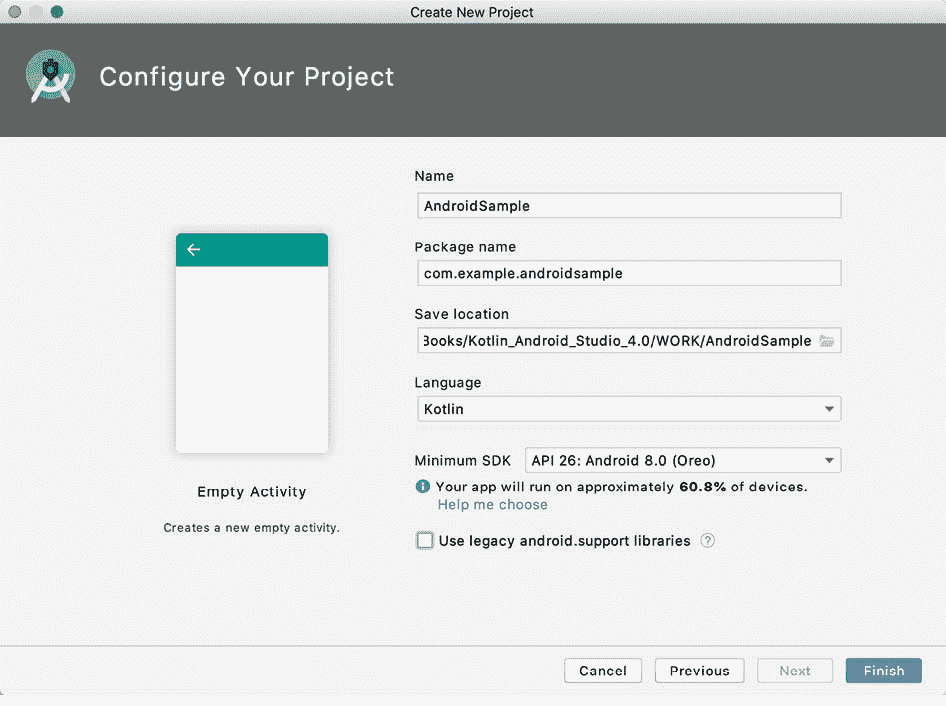

图 3-3

最后，将“语言”菜单更改为 Java，并单击“完成”启动项目创建过程。

3.5 修改示例应用

此时，Android Studio 已经创建了一个最小的示例应用项目，并打开了主窗口。


图 3-4

新创建的项目和对相关文件的引用列在位于主项目窗口左侧的项目工具窗口 中。“项目”工具窗口有多种显示信息的模式。默认情况下，该面板应该处于安卓模式。该设置由面板顶部的菜单控制，如[图 3-5](#_idTextAnchor046) 所示。如果面板当前不在安卓模式下，请使用菜单切换模式:

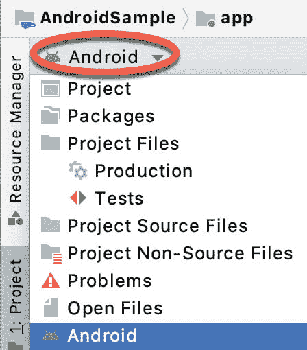

图 3-5

3.6 修改用户界面

我们活动的用户界面设计存储在一个名为 activity_main.xml 的文件中，该文件又位于项目文件层次结构中的 app -> res -> layout 下。一旦定位到项目工具窗口，双击文件将其加载到用户界面布局编辑器工具中，该工具将出现在 AndroidStudio 主窗口的中心面板中:


图 3-6

在布局编辑器窗口顶部的工具栏中有一个菜单(在上图中当前设置为像素)，它反映在布局编辑器面板中设备的视觉表示中。点击此菜单，可选择多种其他设备选项。

要在横向和纵向之间更改设备表示的方向，只需使用显示图标的设备选择菜单左侧的下拉菜单。

从设备屏幕中可以看到，内容布局已经包含了一个显示“Hello World！”消息。面板左侧是一个包含不同类别用户界面组件的面板，这些组件可用于构建用户界面，如按钮、标签和文本字段。然而，应该注意的是，并非所有的用户界面组件对用户来说都是明显可见的。一个这样的类别包括布局。安卓支持多种布局，可以对视觉用户界面组件在屏幕上的定位和管理方式进行不同程度的控制。虽然从用户界面的视觉表现上很难区分，但是当前的设计是使用约束布局创建的。这可以通过查看组件树面板中的信息来确认，该面板默认位于布局编辑器面板的左下角，如图 3-7 所示:

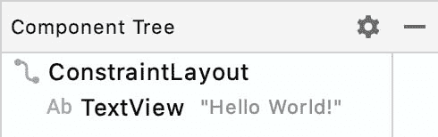

图 3-7

从组件树层次结构中我们可以看到，用户界面布局由一个 ConstraintLayout 父对象和一个 TextView 子对象组成。

在继续之前，还要检查布局编辑器的自动连接模式是否已启用。这意味着，当组件添加到布局中时，布局编辑器将自动添加约束，以确保组件针对不同的屏幕大小和设备方向正确定位(这一主题将在未来章节中详细介绍)。“自动连接”按钮出现在布局编辑器工具栏中，并由磁铁图标表示。禁用时，磁铁会出现一条穿过它的对角线([图 3-8](#_idTextAnchor050) )。如有必要，单击此按钮重新启用自动连接模式。


图 3-8

修改应用的下一步是向布局中添加一些附加组件，其中第一个组件将是一个按钮，供用户按下以启动货币转换。

“调色板”面板由两列组成，左侧一列包含视图组件类别列表。右侧列列出了当前选定类别中包含的组件。例如在[图 3-9](#_idTextAnchor051) 中，按钮类别中当前选择了按钮视图:

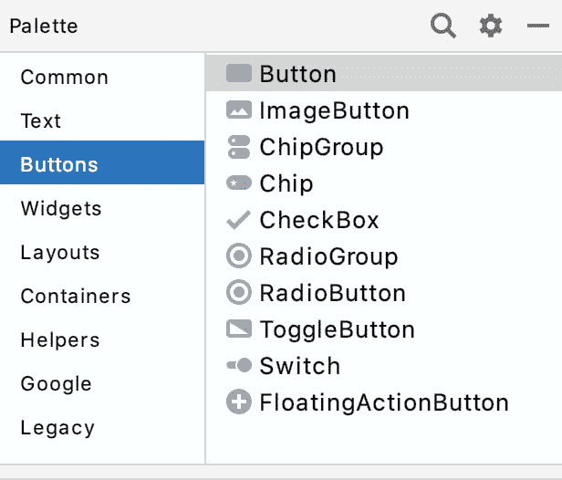

图 3-9

从“按钮”列表中单击并拖动按钮对象，将其放在用户界面设计的水平中心，使其位于现有文本视图小部件的下方:

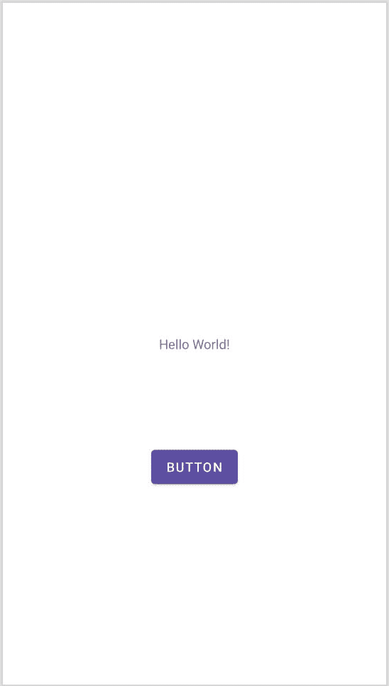

图 3-10

下一步是更改按钮组件当前显示的文本。位于设计区域右侧的面板是属性面板。此面板显示分配给布局中当前选定组件的属性。在该面板中，找到通用属性部分的文本属性，并将当前值从“按钮”更改为“转换”，如图 3-11 所示:

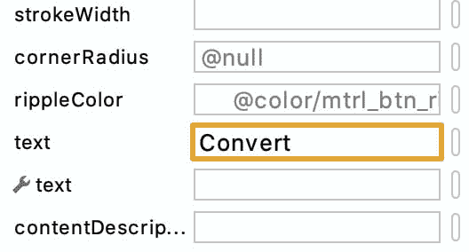

图 3-11

旁边带有扳手的第二个文本属性允许设置仅出现在布局编辑器工具中但在运行时不显示的文本属性。这有助于测试视觉组件和布局在不同设置下的行为方式，而无需重复运行应用。

以防自动连接系统无法设置所有布局连接，单击推断约束按钮([图 3-12](#_idTextAnchor053) )将任何缺失的约束添加到布局中:

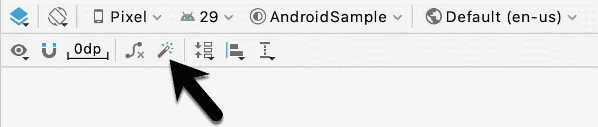

图 3-12

此时，解释位于布局编辑器工具右上角的警告按钮很重要，如图 3-13 所示。显然，这表明布局存在潜在问题。有关任何问题的详细信息，请单击按钮:


图 3-13

单击时，将出现一个面板([图 3-14](#_idTextAnchor055) )，描述问题的性质并提供一些可能的纠正措施:

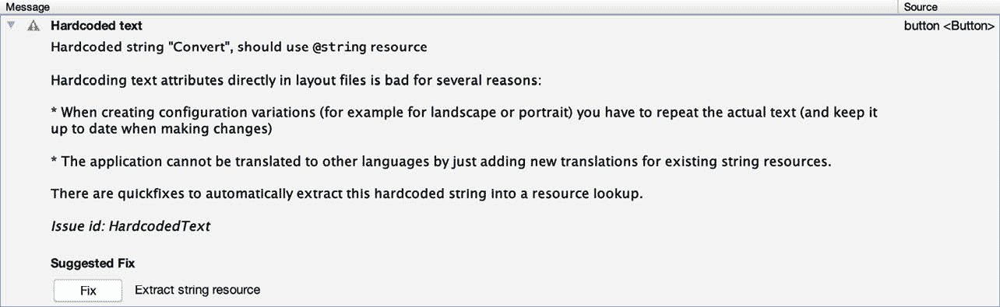

图 3-14

目前，列出的唯一警告如下:

```java
Hardcoded string "Convert", should use @string resource
```

这个 I18N 消息告诉我们，关于项目未来的国际化存在一个潜在的问题(“I18N”来自于“国际化”一词以“I”开头，以“N”结尾，中间有 18 个字母的事实)。警告是在提醒我们，在开发安卓应用时，文本字符串等属性和值应该尽可能以资源的形式存储。这样做可以通过修改资源文件而不是更改应用源代码来更改应用的外观。当将用户界面翻译成不同的口语时，这尤其有价值。例如，如果用户界面中的所有文本都包含在单个资源文件中，则该文件可以被提供给翻译者，翻译者随后将执行翻译工作并返回翻译后的文件以包含在应用中。这使得多种语言成为目标，而无需对源代码进行任何更改。在本例中，我们将创建一个名为 convert_string 的新资源，并为其分配字符串“convert”。

点击问题解释面板中的修复按钮，显示提取资源面板([图 3-15](#_idTextAnchor056) )。在此面板中，将资源名称字段更改为 convert_string，并将资源值设置为 convert，然后单击“确定”按钮。


图 3-15

下一个要添加的小部件是编辑文本小部件，用户将在其中输入要转换的美元金额。从小部件调色板中，选择文本类别，单击并拖动数字(十进制)组件到布局上，使其水平居中并位于现有文本视图小部件的上方。选择小部件后，使用属性工具窗口将提示属性设置为“美元”。单击警告图标，将字符串提取到名为 dollars_hint 的资源中。

本章后面编写的代码需要访问用户在编辑文本字段中输入的美元值。它将通过在用户界面布局中引用分配给小部件的 id 来实现这一点。当在布局中选择小部件时，AndroidStudio 分配给小部件的默认 id 可以从属性工具窗口中查看和更改，如图[图 3-16](#_idTextAnchor057) :


图 3-16

将 id 更改为 dollarText，并在“重命名”对话框中，单击“重构”按钮。这确保了项目中其他地方对旧 id 的任何引用都会自动更新以使用新 id:


图 3-17

通过单击“推断约束”按钮添加任何缺失的布局约束。此时，布局应类似于图 3-18 中所示的布局:


图 3-18

3.7 查看布局和资源文件

在进入下一步之前，我们将了解用户界面设计和资源处理的一些内部方面。在前一节中，我们通过使用布局编辑器工具修改 activity_main.xml 文件，对用户界面进行了一些更改。事实上，布局编辑器所做的只是提供一种用户友好的方式来编辑文件的底层 XML 内容。实际上，没有理由不直接修改 XML 来更改用户界面，在某些情况下，这实际上可能比使用布局编辑器工具更快。布局编辑器面板右上角有三个按钮，如下图[图 3-19](#_idTextAnchor060) 所示:


图 3-19

默认情况下，编辑器将处于设计模式，仅显示布局的视觉表示。最左边的按钮将切换到代码模式，显示布局的 XML，中间的按钮进入拆分模式，显示布局和 XML，如图[图 3-20](#_idTextAnchor061) :

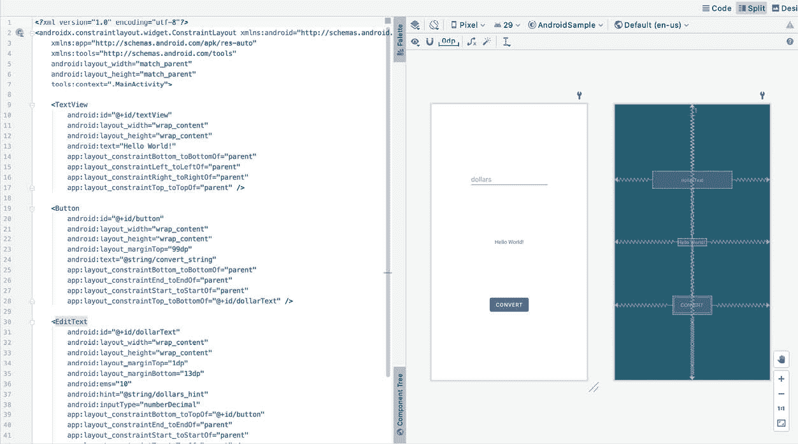

图 3-20

从 XML 文件的结构可以看出，用户界面由 ConstraintLayout 组件组成，而 ConstraintLayout 组件又是 TextView、Button 和 EditText 对象的父对象。例如，我们还可以看到，按钮的文本属性被设置为 convert_string 资源。尽管复杂性和内容各不相同，但所有用户界面布局都是以这种基于 XML 的分层方式构建的。

随着对 XML 布局的更改，这些更改将反映在布局画布中。布局也可以在布局画布面板中进行可视化修改，更改出现在 XML 列表中。要看到这一点，请切换到拆分模式并修改 XML 布局，将约束布局的背景颜色更改为红色，如下所示:

```java
<?xml version="1.0" encoding="utf-8"?>
<androidx.constraintlayout.widget.ConstraintLayout xmlns:android="http://schemas.android.com/apk/res/android"
    xmlns:app="http://schemas.android.com/apk/res-auto"
    xmlns:tools="http://schemas.android.com/tools"
    android:layout_width="match_parent"
    android:layout_height="match_parent"
    tools:context=".MainActivity"
    android:background="#ff2438" >
.
.
</androidx.constraintlayout.widget.ConstraintLayout>
```

请注意，布局的颜色会实时变化，以匹配 XML 文件中的新设置。还要注意，在包含颜色设置的行旁边的 XML 编辑器的左边距(也称为装订线)中会出现一个红色的小方块。这是一个视觉提示，表明红色已在属性上设置。单击红色方块将显示颜色选择器，允许选择不同的颜色:

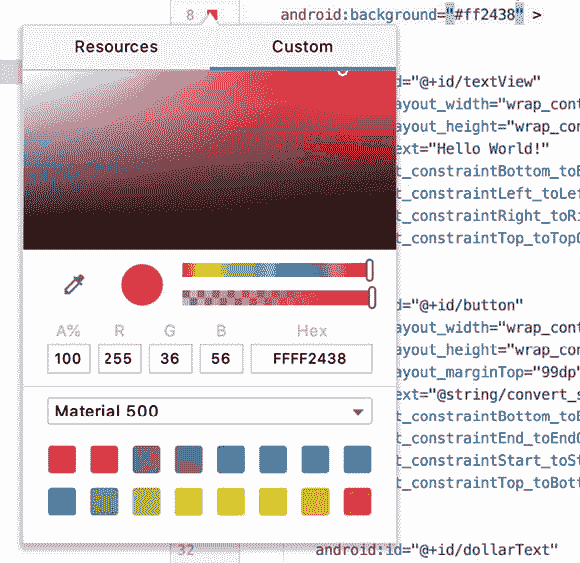

图 3-21

在继续之前，从布局文件中删除背景属性，以便背景返回到默认设置。

最后，使用“项目”面板找到 app -> res -> values -> strings.xml 文件，并双击它将其加载到编辑器中。目前，XML 应该如下所示:

```java
<resources>
    <string name="app_name">AndroidSample</string>
    <string name="convert_string">Convert</string>
    <string name="dollars_hint">dollars</string>
</resources>
```

作为资源的演示，将当前分配给 convert_string 资源的字符串值更改为“转换为欧元”，然后通过在编辑器面板中选择布局文件的选项卡返回到布局编辑器工具。请注意，布局已经为字符串选取了新的资源值。

还有一种快速访问 XML 文件中引用的资源值的方法。在拆分或代码模式下使用布局编辑器工具，单击“@string/convert_string”属性设置，使其高亮显示，然后按键盘上的 Ctrl-B(在 macOS 上为 Cmd-B)。AndroidStudio 随后将打开 strings.xml 文件，并带您进入该文件中声明该资源的那一行。利用此机会将字符串资源还原为原始的“转换”文本，并为字符串资源添加以下附加条目，这些条目将在应用代码中稍后引用:

```java
<resources>
.
.
    <string name="convert_string">Convert</string>
    <string name="dollars_hint">dollars</string>
    <string name="no_value_string">No Value</string>
</resources>
```

资源字符串也可以使用 AndroidStudio 翻译编辑器进行编辑。要打开这个编辑器，右键单击应用-> res -> values -> strings.xml 文件，然后选择打开翻译编辑器菜单选项。这将在 AndroidStudio 窗口的主面板中显示翻译编辑器:


图 3-22

该编辑器允许编辑分配给资源键的字符串，并管理多种语言的翻译。

3.8 添加交互

本示例项目的最后一步是使应用具有交互性，以便当用户在编辑文本字段中输入美元值并单击转换按钮时，转换后的欧元值会出现在文本视图中。这包括在按钮小部件上实现一些事件处理。具体来说，需要配置按钮，以便在触发 onClick 事件时调用应用代码中的方法。事件处理可以通过多种不同的方式实现，在后面题为[“安卓事件处理概述和示例”](26.html#_idTextAnchor596)的章节中有详细介绍。将布局编辑器返回到设计模式，在布局编辑器中选择按钮小部件，参考属性工具窗口并指定一个名为 convertCurrency 的方法，如下所示:

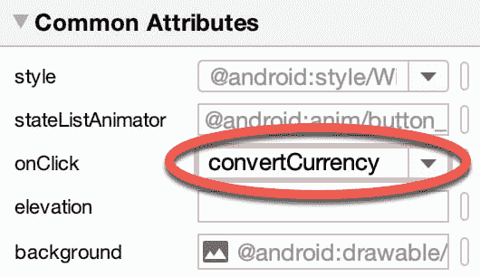

图 3-23

请注意，onClick 属性的文本字段现在用红色边框突出显示，以警告我们该按钮已被配置为调用尚不存在的方法。为了解决这个问题，双击项目工具窗口中的 MainActivity.java 文件(app-> Java-><package name="">->【main activity】，将其加载到代码编辑器中，并将 convertCurrency 方法的代码添加到类文件中，使其如下所示，注意还需要导入一些额外的 Android 包:</package>

```java
package com.ebookfrenzy.androidsample;

import androidx.appcompat.app.AppCompatActivity;

import android.os.Bundle;
import android.view.View;
import android.widget.EditText;
import android.widget.TextView;

public class MainActivity extends AppCompatActivity {

    @Override
    protected void onCreate(Bundle savedInstanceState) {
        super.onCreate(savedInstanceState);
        setContentView(R.layout.activity_main);
    }

    public void convertCurrency(View view) {

        EditText dollarText = findViewById(R.id.dollarText);
        TextView textView = findViewById(R.id.textView);

        if (!dollarText.getText().toString().equals("")) {

            Float dollarValue = Float.valueOf(dollarText.getText().toString());
            Float euroValue = dollarValue * 0.85F;
            textView.setText(euroValue.toString());
        } else {
            textView.setText(R.string.no_value_string);
        }
    } 
}
```

该方法首先通过调用一个名为 findViewById 的方法，传递布局文件中分配的 Id，获得对 EditText 和 TextView 对象的引用。然后进行检查，以确保用户输入了美元值，如果输入了，则提取该值，将其从字符串转换为浮点值，并转换为欧元。最后，结果显示在文本视图小部件上。如果有任何不清楚的地方，请放心，这些概念将在后面的章节中更详细地介绍。

3.9 总结

虽然不算太复杂，但是在建立安卓开发环境的过程中涉及到许多步骤。完成这些步骤后，值得通过一个示例来确保正确安装和配置环境。在本章中，我们创建了一个示例应用，然后使用 AndroidStudio 布局编辑器工具来修改用户界面布局。在这样做的时候，我们探索了尽可能使用资源的重要性，特别是在字符串值的情况下，并简要地谈到了布局的主题。接下来，我们看一下用于存储安卓应用用户界面设计的底层 XML。

最后，一个 onClick 事件被添加到一个按钮，该按钮连接到一个方法，该方法被实现为从编辑文本组件中提取用户输入，从美元转换为欧元，然后在文本视图上显示结果。

随着应用准备好进行测试，为测试目的设置仿真器的必要步骤将在下一章中详细介绍。