# 十八、安卓约束布局指南

正如在标题为[“了解安卓视图、视图组和布局”](16.html#_idTextAnchor318)的章节中所讨论的，安卓提供了许多布局管理器来设计用户界面。通过安卓 7，谷歌引入了一种新的布局，旨在解决旧布局管理器的许多缺点。这种新的布局称为 ConstraintLayout，它将简单、富有表现力和灵活性的布局系统与AndroidStudio布局编辑器工具中内置的强大功能相结合，便于创建响应迅速的用户界面布局，这些布局可以自动适应不同的屏幕大小和设备方向的变化。

本章将概述约束布局的基本概念，而下一章将详细概述如何在AndroidStudio布局编辑器工具中使用约束布局创建基于约束的布局。

18.1 约束布局如何工作

与所有其他布局一样，ConstraintLayout 负责管理它所包含的可视组件(也称为小部件)的定位和大小调整行为。它基于在每个子小部件上设置的约束连接来实现这一点。

为了充分理解和使用约束布局，了解以下关键概念非常重要:

制约因素

利润

反对限制

约束偏差

链条

链条样式

指导方针

团体

障碍

流动

18.1.1 约束

约束本质上是一组规则，规定了一个小部件相对于其他小部件的对齐方式和距离，包含约束布局的边和称为指导原则的特殊元素。约束还规定了活动的用户界面布局将如何响应设备方向的变化，或者何时在不同屏幕尺寸的设备上显示。为了进行充分配置，小部件必须具有足够的约束连接，以便约束布局引擎可以在水平和垂直平面上解析其位置。

18.1.2 边距

边距是一种指定固定距离的约束形式。考虑一个需要放置在设备屏幕右上角附近的 Button 对象。这可以通过从连接到父约束布局相应边的按钮的顶部和右侧边缘实现边距约束来实现，如图 18-1 中的所示:

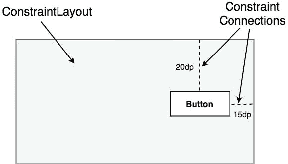

图 18-1

如上图所示，这些约束连接中的每一个都与一个边距值相关联，该边距值规定了小部件到父布局两侧的固定距离。在这种配置下，无论屏幕大小或设备方向如何，Button 对象都将按照两个约束连接的指定，分别位于距离父约束布局的顶部和右侧边缘 20 和 15 个设备无关像素(dp)的位置。

虽然上述配置在某些情况下是可以接受的，但在允许 ConstraintLayout 布局引擎调整小部件的位置以响应设备旋转和支持不同大小的屏幕方面，它没有提供任何灵活性。为了将这种响应性添加到布局中，有必要实现相反的约束。

18.1.3 对立约束

在单个小部件上沿同一轴运行的两个约束被称为相反的约束。换句话说，左侧和右侧都有约束的小部件被认为具有水平方向相反的约束。[例如，图 18-2](#_idTextAnchor400) 说明了在先前布局中添加水平和垂直方向相反的约束:

图 18-2

这里要理解的关键点是，一旦在特定的轴上实现了相反的约束，小部件的定位就变成了百分比而不是基于坐标。例如，小部件现在位于距离布局顶部 30%的位置，而不是固定在距离布局顶部 20dp 的位置。在不同的方向以及在更大或更小的屏幕上运行时，相对于父布局的尺寸，按钮将始终处于相同的位置。

现在重要的是要理解，图 18-2 中概述的布局不仅使用了相反的约束，还通过应用约束偏差来实现。

18.1.4 约束偏差

现在已经确定，约束布局中的小部件可能会受到相反的约束连接。默认情况下，相反的约束是相等的，导致相应的小部件沿着相反的轴居中。[例如，图 18-3](#_idTextAnchor403) 显示了一个小部件，它位于包含约束布局的中心，使用相反的水平和垂直约束:

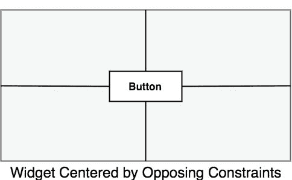

图 18-3

为了允许在约束相反的情况下调整小部件的位置，约束布局实现了一个称为约束偏差的特性。约束偏差允许小部件沿对称轴的定位偏向一个约束的特定百分比。[例如，图 18-4](#_idTextAnchor405) 显示了 75%水平偏差和 10%垂直偏差的先前约束布局:

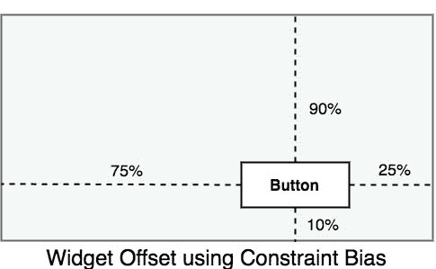

图 18-4

下一章名为[“AndroidStudio中使用 ConstraintLayout 的指南”](19.html#_idTextAnchor428)，将更详细地介绍这些概念，并解释这些功能是如何集成到AndroidStudio布局编辑器工具中的。然而，与此同时，ConstraintLayout 类还需要覆盖一些领域。

18.1.5 链条

ConstraintLayout 链提供了一种将两个或多个小部件的布局行为定义为一个组的方式。链可以在纵轴或横轴上声明，并配置为定义链中的小部件的间距和大小。

当通过双向约束连接在一起时，小部件被链接在一起。[图 18-5](#_idTextAnchor408) 举例说明了以这种方式链接的三个小部件:

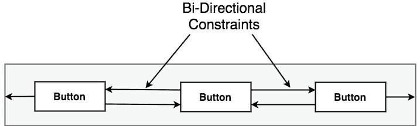

图 18-5

链中的第一个元素是 链头，它在垂直链中转换为顶部小部件，或者在水平链的情况下，转换为最左侧的小部件。整个链的布局行为主要通过在链头小部件上设置属性来配置。

18.1.6 链条样式

约束布局链的布局行为由应用于链头小部件的链样式设置决定。ConstraintLayout 类当前支持以下链布局样式:

扩展链–链中包含的小部件在可用空间中均匀分布。这是链的默认行为。

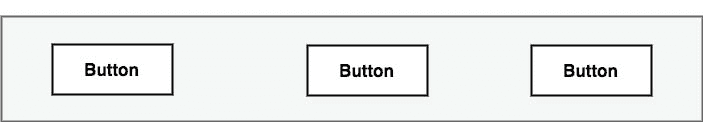

图 18-6

链内展开–链内包含的小部件在链头和链中最后一个小部件之间均匀展开。头部和最后一个小部件不包括在间距分布中。

图 18-7

加权链–允许通过加权属性定义链中每个小部件占用的空间。

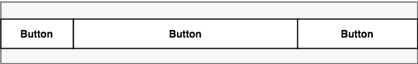

图 18-8

打包链–组成链的小部件被打包在一起，没有任何间距。可以施加偏压来控制链条相对于父容器的水平或垂直定位。

图 18-9

18.2 基线对齐

到目前为止，本章只提到了指示相对于小部件侧面对齐的约束(通常称为侧面约束)。然而，一个常见的要求是小部件相对于它显示的内容而不是小部件本身的边界对齐。为了满足这一需求，约束布局提供了基线对齐支持。

例如，假设从图 18-1开始的先前理论布局要求文本视图小部件位于按钮左侧 40dp 处。在这种情况下，文本视图需要与按钮视图基线对齐。这意味着按钮中的文本需要与文本视图中的文本垂直对齐。该布局的附加约束需要连接，如图 18-10 中的[所示:](#_idTextAnchor411)

图 18-10

文本视图现在沿着按钮的基线垂直对齐，并与按钮对象的左边缘水平对齐 40 度。

18.3 配置小部件尺寸

控制小部件的尺寸是用户界面设计过程的关键要素。ConstraintLayout 提供了三个选项，可以在单个小部件上进行设置，以管理大小调整行为。这些设置是为高度和宽度尺寸单独配置的:

固定–小部件固定在指定的尺寸。

匹配约束–允许布局引擎调整小部件的大小，以满足主要约束。也称为任意大小或匹配约束选项。

包装内容–小部件的大小取决于它包含的内容(即文本或图形)。

18.4 指南助手

指导方针是约束布局中可用的特殊元素，它提供了约束可能连接到的附加目标。可以向约束布局实例添加多个指导原则，该实例又可以水平或垂直方向进行配置。一旦添加，就可以建立从布局中的小部件到指南的约束连接。当多个小部件需要沿一个轴对齐时，这尤其有用。例如，在[图 18-11](#_idTextAnchor415) 中，约束布局中包含的三个按钮对象沿垂直 g 参考线进行约束:

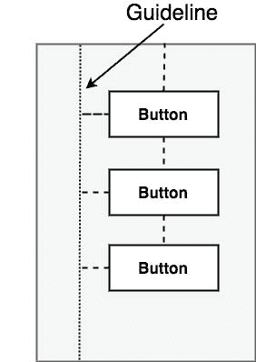

图 18-11

18.5 组助手

ConstraintLayout 的这一特性允许将小部件放入逻辑组中，并将这些小部件的可见性作为单个实体进行控制。组本质上是对布局中其他小部件的引用列表。定义后，更改组实例的可见性属性(可见、不可见或消失)会将更改应用于所有组成员。这使得通过单个属性更改来隐藏和显示多个小部件变得很容易。单个布局可能包含多个组，一个小部件可以属于多个组。如果组之间发生冲突，则在 XML 文件中声明的最后一个组优先。

18.6 屏障助手

与指导方针类似，障碍是虚拟视图，可用于约束布局内的视图。与指导方针一样，屏障可以是垂直的或水平的，并且一个或多个视图可以被约束到其上(为了避免混淆，这些视图将被称为约束视图)。然而，与指引线保持在布局内固定位置的指引线不同，屏障的位置由一组所谓的参考视图定义。引入障碍是为了解决经常出现的涉及观点重叠的问题。例如，考虑下面[图 18-12](#_idTextAnchor418) 所示的布局:

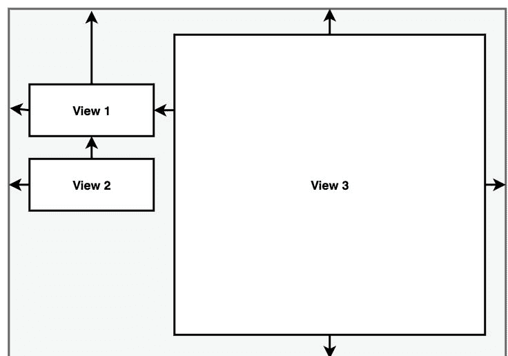

图 18-12

上述布局需要注意的要点是，视图 3 的宽度设置为匹配约束模式，视图的左手边连接到视图 1 的右手边。按照目前的实施方式，视图 1 宽度的增加将产生减小视图 3 宽度的预期效果:

图 18-13

但是，如果视图 2 的宽度增加而不是视图 1 的宽度增加，就会出现问题:

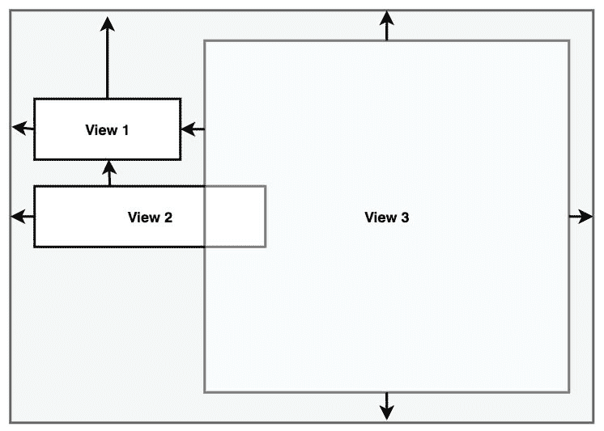

图 18-14

显然，因为视图 3 仅受视图 1 约束，所以它不会调整大小以适应视图 2 宽度的增加，从而导致视图重叠。

此问题的解决方案是添加一个垂直屏障，并将视图 1 和 2 指定为屏障的参考视图，以便它们控制屏障位置。视图 3 的左侧边缘将相对于障碍物进行约束，使其成为受约束的视图。

现在，当视图 1 或视图 2 的宽度增加时，屏障将移动以适应两个视图中最宽的视图，导致视图 3 的宽度相对于新屏障位置发生变化:

图 18-15

使用障碍时，可以与单个障碍关联的参考视图和约束视图的数量没有限制。

18.7 流量助手

“约束布局流”帮助器允许在流动网格样式布局中显示视图组。与组帮助器一样，Flow 包含对其负责定位的视图的引用，并提供各种配置选项，包括垂直和水平方向、环绕行为(包括环绕前部件的最大数量)、间距和对齐属性。链行为也可以应用于流布局，包括扩散、内部扩散和打包选项。

[图 18-16](#_idTextAnchor420) 显示了五个大小一致的按钮的布局，这些按钮在水平模式下使用无环绕设置的“流”帮助器实例进行定位:

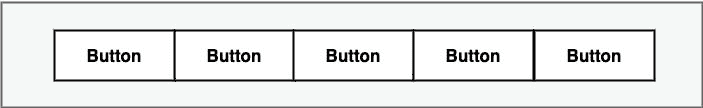

图 18-16

[图 18-17](#_idTextAnchor421) 显示了水平流配置中的相同按钮，包装设置为每三个小部件后出现一次:

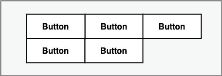

图 18-17

[另一方面，图 18-18](#_idTextAnchor422) 显示了使用内部展开将包装设置为链模式的按钮(由于第一行已满，其效果仅在第二行可见)。该配置还设置了 gap 属性来增加按钮之间的间距:

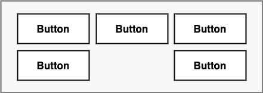

图 18-18

作为流程助手灵活性的最后一个演示，[图 18-19](#_idTextAnchor423) 显示了在水平打包链模式下配置的五个不同大小的按钮，每个第三个小部件后都有包装。此外，通过设置水平偏移值 1.0(值 0.0 将导致左对齐，而 0.5 将居中对齐网格内容)，网格内容已右对齐:

图 18-19

18.8 比率

小部件的尺寸可以使用比率设置来定义。例如，可以使用一个比率设置来约束一个小部件，使得不管任何调整大小的行为，宽度总是高度尺寸的两倍。

18.9 约束布局优势

ConstraintLayout 提供了一定程度的灵活性，允许使用单个布局实例来实现旧布局的许多功能，而以前需要嵌套多个布局。这样做的好处是，通过允许设计所谓的“平面”或“浅”布局层次结构，避免了布局嵌套中固有的问题，从而降低了布局的复杂性，并提高了运行时的用户界面呈现性能。

ConstraintLayout 的实现也是为了解决当今市场上广泛的安卓设备屏幕尺寸。ConstraintLayout 的灵活性使用户界面的设计更容易响应和适应运行应用的设备。

最后，正如将在标题为[“在AndroidStudio中使用 ConstraintLayout 的指南”](19.html#_idTextAnchor428)的章节中所展示的，AndroidStudio布局编辑器工具已经针对基于 ConstraintLayout 的用户界面设计进行了专门的增强。

18.10 约束布局可用性

虽然在安卓 7 中引入了 ConstraintLayout，但它是作为独立于主安卓 SDK 的支持库提供的，并且与早在 API Level 9(姜饼)的旧安卓版本兼容。这使得利用这种新布局的应用可以在运行旧版本安卓的设备上运行。

18.11 总结

ConstraintLayout 是安卓 7 引入的一个布局管理器。它旨在简化灵活布局的创建，以适应目前市场上许多安卓设备的大小和方向。约束布局使用约束来控制小部件相对于父约束布局实例、指南、障碍和布局中其他小部件的对齐和定位。ConstraintLayout 是新创建的 Android Studio 项目的默认布局，也是设计用户界面布局时的推荐选择。有了这种简单而灵活的布局管理方法，复杂而响应迅速的用户界面就可以令人惊讶地轻松实现。