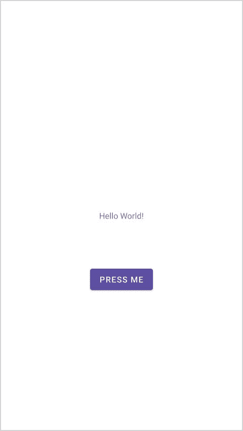
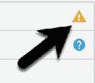

26\. 安卓事件处理概述及示例

前面几章已经讨论了很多关于安卓应用用户界面的设计。然而，一个尚未涉及的领域涉及用户与用户界面的交互触发底层活动来执行任务的方式。换句话说，从前面的章节中，我们知道了如何创建包含按钮视图的用户界面，但不知道当用户触摸应用时，如何在应用中发生一些事情。

因此，本章的主要目的是提供安卓应用中事件处理的概述，以及一个基于AndroidStudio的示例项目。

26.1 了解安卓事件

安卓系统中的事件可以采取各种不同的形式，但通常是响应外部动作而生成的。最常见的事件形式，尤其是对于平板电脑和智能手机等设备，涉及与触摸屏的某种形式的交互。这样的事件属于输入事件的范畴。

安卓框架维护一个事件队列，事件发生时会被放入其中。然后，以先进先出(FIFO)的方式将事件从队列中移除。在输入事件(例如屏幕上的触摸)的情况下，事件被传递到位于屏幕上发生触摸的位置的视图。除了事件通知之外，视图还被传递关于事件性质的一系列信息(取决于事件类型)，例如用户指尖和屏幕之间的接触点的坐标。

为了能够处理已经传递的事件，视图必须有一个事件侦听器。安卓视图类(所有用户界面组件都是从该类派生的)包含一系列事件侦听器接口，每个接口都包含一个回调方法的抽象声明。为了能够响应特定类型的事件，视图必须注册适当的事件侦听器并实现相应的回调。例如，如果一个按钮要响应一个点击事件(相当于用户像点击一个物理按钮一样触摸并释放按钮视图)，它必须注册 View.onClickListener 事件监听器(通过调用目标视图的 setOnClickListener()方法)并实现相应的 onClick()回调方法。如果在按钮视图位置的屏幕上检测到“点击”事件，当该事件从事件队列中移除时，安卓框架将调用该视图的 onClick()方法。当然，在 onClick()回调方法的实现中，应该执行任何任务或调用其他方法来响应按钮单击。

26.2 使用安卓:onClick 资源

在更详细地探索事件侦听器之前，值得注意的是，当用户“点击”用户界面中的按钮视图时，只需要调用回调方法，就可以使用快捷方式。考虑包含名为 button1 的按钮视图的用户界面布局，要求当用户触摸按钮时，调用活动类中声明的名为 buttonClick()的方法。实现此行为所需的全部工作是编写 buttonClick()方法(该方法将触发 Click 事件的视图的引用作为参数)，并在 XML 文件中的 button 视图声明中添加一行。例如:

```java
<Button
        android:id="@+id/button1"
        android:layout_width="wrap_content"
        android:layout_height="wrap_content"
        android:onClick="buttonClick"
        android:text="Click me" />
```

这提供了一种捕获点击事件的简单方法。但是，它没有提供事件处理程序提供的选项范围，这是本章其余部分的主题。正如后面几章所述，onClick 属性在涉及片段的布局中也有局限性。在AndroidStudio布局编辑器中工作时，当在设备屏幕布局中选择合适的视图类型时，可以在属性面板中找到并配置 onClick 属性。

26.3 事件监听器和回调方法

在本章后面概述的示例活动中，将详细介绍注册事件侦听器和实现回调方法所涉及的步骤。然而，在此之前，值得花一些时间来概述安卓框架中可用的事件侦听器以及与每个事件侦听器相关联的回调方法。

onClickListener–用于检测点击风格事件，用户通过该事件触摸并释放视图占据的设备显示区域。对应于 onClick()回调方法，该方法被传递一个对作为参数接收事件的视图的引用。

onLongClickListener–用于检测用户何时在视图上长时间保持触摸。对应于 onLongClick()回调方法，该方法作为参数传递给接收事件的视图。

onTouchListener–用于检测与触摸屏的任何形式的接触，包括单次或多次触摸和手势运动。与 onTouch()回调相对应，本主题将在标题为[“安卓触控和多点触控事件处理”](27.html#_idTextAnchor611)的章节中详细介绍。回调方法作为参数传递给接收事件的视图和 MotionEvent 对象。

onCreateContextMenuListener–监听长时间点击后的上下文菜单创建。对应于 onCreateContextMenu()回调方法。回调被传递给菜单、接收事件的视图和菜单上下文对象。

onfocuschangeelistener–检测焦点何时因与轨迹球或导航键的交互而从当前视图移开。对应于 onFocusChange()回调方法，该方法被传递给接收事件的视图和一个布尔值，以指示焦点是获得还是丢失。

OnKeyListener–用于在视图有焦点时检测设备上的某个键何时被按下。对应于 onKey()回调方法。作为参数传递的是接收事件的视图、被按下的物理键的键码和键事件对象。

26.4 事件处理示例

在本章的剩余部分，我们将创建一个AndroidStudio项目，该项目旨在演示事件侦听器和相应回调方法的实现，以检测用户何时点击了按钮。回调方法中的代码将更新文本视图，以指示事件已被处理。

从欢迎屏幕中选择创建新项目快速启动选项，并在生成的新项目对话框中选择空活动模板，然后单击下一步按钮。

在“名称”字段中输入 EventExample，并将 com . ebookwidge . event example 指定为包名。在单击完成按钮之前，将最低应用编程接口级别设置更改为应用编程接口 26:安卓 8.0(奥利奥)，并将语言菜单更改为 Java。

26.5 设计用户界面

本例中 MainActivity 类的用户界面布局由一个 ConstraintLayout、一个 Button 和一个 TextView 组成，如图 26-1 所示。



图 26-1

找到并选择 Android Studio 创建的 activity_main.xml 文件(位于 app -> res -> layouts 下的 Project 工具窗口中)，双击将其加载到 Layout Editor 工具中。

确保启用了自动连接，然后从调色板中拖动一个按钮小部件并移动它，使其位于布局的水平中心和现有文本视图小部件的下方。正确定位后，将小部件放置到位，以便自动连接系统添加适当的约束。

选择“你好世界！”文本视图小部件，并使用属性面板将标识设置为状态文本。重复此步骤，将按钮小部件的标识更改为我的按钮。

点击布局编辑器工具栏中的推断约束按钮，添加任何缺失的约束。

选择“按钮”小部件后，使用“属性”面板将文本属性设置为“按我”。使用位于布局编辑器右上角的黄色警告按钮([图 26-2](#_idTextAnchor607) ，显示警告列表，点击修复按钮，将按钮上的文本字符串提取到名为 pr ess_me 的资源中:



图 26-2

用户界面布局完成后，下一步是注册事件侦听器和回调方法。

26.6 事件监听器和回调方法

在本例中，需要为我的按钮视图注册一个 onClickListener 。这是通过调用按钮视图的 setOnClickListener() 方法，传递一个新的 OnClickListener 对象作为参数并实现 onClick()回调方法来实现的。因为这是一个只需要在创建活动时执行的任务，所以一个好的位置是 MainActivity 类的 onCreate()方法。

如果 MainActivity.java 文件已经在编辑器会话中打开，请通过单击编辑器面板中的选项卡来选择它。或者，通过导航到(app-> Java-> com . ebookwidge . event example-> main activity)并双击它将其加载到代码编辑器中，在项目工具窗口中找到它。加载后，找到模板 onCreate()方法并修改它以获得对按钮视图的引用，注册事件侦听器并实现 onClick()回调方法:

```java
package com.ebookfrenzy.eventexample;

import androidx.appcompat.app.AppCompatActivity;

import android.os.Bundle;
import android.view.View;
import android.widget.Button;
import android.widget.TextView;

public class MainActivity extends AppCompatActivity {

    @Override
    protected void onCreate(Bundle savedInstanceState) {
        super.onCreate(savedInstanceState);
        setContentView(R.layout.activity_event_example);
        Button button = findViewById(R.id.myButton);

        button.setOnClickListener(
                new Button.OnClickListener() {
                    public void onClick(View v) {

                    }
                }
        );
    }
.
.
}
```

上面的代码现在已经在按钮上注册了事件侦听器，并实现了 onClick()方法。但是，如果此时运行应用，将不会显示按钮上安装的事件侦听器正在工作，因为在 onClick()回调方法的主体中还没有实现任何代码。该示例的目标是在单击按钮时在文本视图上显示一条消息，因此需要进行一些进一步的代码更改:

```java
@Override
protected void onCreate(Bundle savedInstanceState) {
       super.onCreate(savedInstanceState);
       setContentView(R.layout.activity_event_example);

       Button button = findViewById(R.id.myButton);

      button.setOnClickListener(
               new Button.OnClickListener() {
                      public void onClick(View v) {
                         TextView statusText = 
                                 findViewById(R.id.statusText);
                         statusText.setText("Button clicked");
                      }
               }
        );
}
```

通过在 AVD 仿真器或物理安卓设备上编译和运行应用来完成本教程的这一阶段。触摸并释放按钮视图(也称为“点击”)后，文本视图应更改为显示“按钮点击”文本。

26.7 消费事件

检测视图上的标准点击(与长点击相反)是一个非常简单的事件处理案例。该示例现在将扩展到包括检测长点击事件，当用户点击并在屏幕上保持视图时，长点击事件发生，并且在这样做时，覆盖事件消费的主题。

考虑一下本章上面部分中 onClick()方法的代码。回调被声明为无效，因此，在它完成执行后，不会向安卓框架返回值。

另一方面，分配给 onLongClickListener 的代码需要向安卓框架返回一个布尔值。这个返回值的目的是向安卓运行时指示回调是否已经消耗了事件。如果回调返回真值，框架将丢弃该事件。另一方面，如果回调返回一个假值，安卓框架将认为事件仍然是活动的，并因此将其传递给在同一视图上注册的下一个匹配的事件侦听器。

与许多编程概念一样，这也许最好用一个例子来演示。第一步是向示例活动中的按钮视图添加用于长时间单击的事件侦听器和回调方法:

```java
@Override
protected void onCreate(Bundle savedInstanceState) {
      super.onCreate(savedInstanceState);
      setContentView(R.layout.activity_event_example);

      Button button = findViewById(R.id.myButton);

      button.setOnClickListener(
               new Button.OnClickListener() {
                      public void onClick(View v) {
                         TextView statusText = 
                             findViewById(R.id.statusText);
                     statusText.setText("Button clicked");
                      }
               }
        );

        button.setOnLongClickListener(
                 new Button.OnLongClickListener() {
                      public boolean onLongClick(View v) {
                        TextView statusText = 
                                 findViewById(R.id.statusText);
                        statusText.setText("Long button click");
                        return true;
                 }
               }
        );
    }
}
```

显然，当检测到长点击时，onLongClick() 回调方法将在文本视图上显示“长按钮点击”。但是，请注意，回调方法还返回一个 true 值，以指示它已经使用了该事件。运行应用，按住按钮视图，直到文本视图中出现“长按钮点击”文本。释放按钮后，文本视图继续显示“长按钮点击”文本，指示未调用 on click 侦听器代码。

接下来，修改代码，以便 onLongClick 侦听器现在返回一个假值:

```java
button.setOnLongClickListener(
    new Button.OnLongClickListener() {
         public boolean onLongClick(View v) {
                TextView myTextView = findViewById(R.id.myTextView);
                myTextView.setText("Long button click");
                return false;
         }
    }
);
```

再次编译并运行应用，长按按钮，直到出现长按消息。但是，在这次释放按钮时，请注意 onClick 侦听器也会被触发，并且文本会更改为“按钮单击”。这是因为 onLongClick 侦听器代码返回的 false 值向 Android 框架表明，该事件没有被方法使用，并且有资格传递给视图上的下一个注册侦听器。在这种情况下，运行时确定按钮上的 onClickListener 也对这种类型的事件感兴趣，并随后调用 onClickListener 代码。

26.8 总结

如果用户界面包含的视图不响应用户交互，那么用户界面几乎没有实际用途。安卓通过事件监听器和回调方法的概念，弥合了用户界面和应用后端代码之间的鸿沟。安卓视图类定义了一组事件监听器，可以在视图对象上注册。每个事件侦听器还关联了一个回调方法。

当一个事件发生在用户界面的视图上时，该事件被放入事件队列，并由安卓运行时以先进先出的方式进行处理。如果发生事件的视图注册了与事件类型匹配的侦听器，则调用相应的回调方法。然后，该代码在返回之前执行活动所需的任何任务。有些回调方法需要返回一个布尔值，以指示事件是否需要传递给在视图上注册的任何其他事件侦听器，或者由系统丢弃。

已经介绍了事件处理的基础，下一章将深入探讨触摸事件的主题，特别强调处理多次触摸。