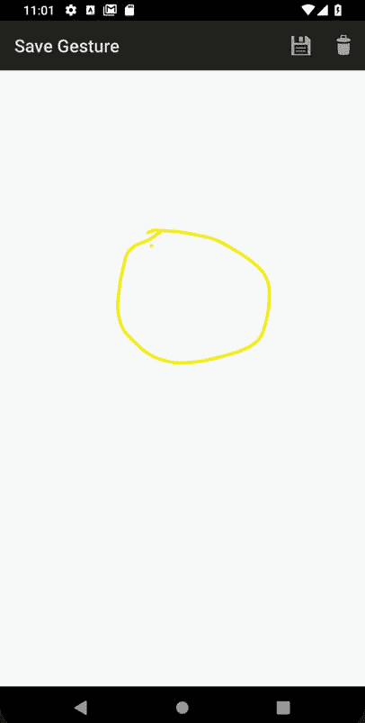
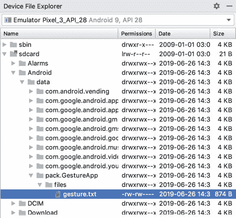

# 二十九、在安卓上实现自定义手势识别

前一章讲述了从安卓应用中检测所谓的“常见手势”。然而，在实践中，一个手势可能会涉及安卓设备显示屏上几乎任何顺序的触摸动作。认识到这一事实，Android SDK 允许应用开发人员定义几乎任何性质的自定义手势，并在用户执行时用于触发事件。这是一个多阶段的过程，其细节是本章的主题。

29.1 安卓手势生成器应用

安卓软件开发工具包允许开发人员设计定制手势，然后将其存储在与安卓应用包捆绑的手势文件中。这些自定义手势文件最容易使用手势生成器应用创建，该应用与作为安卓软件开发工具包一部分提供的示例包捆绑在一起。手势文件的创建包括在物理设备或仿真器上启动手势生成器应用，并“绘制”应用需要检测的手势。一旦设计好手势，包含手势数据的文件就可以从设备或仿真器的 SD 卡中取出，并添加到应用项目中。在应用代码中，该文件然后被加载到手势库类的实例中，在那里它可以用来搜索与用户在设备显示器上执行的任何手势的匹配。

29.2 手势重叠视图类

为了便于在应用中检测手势，安卓软件开发工具包提供了手势重叠视图类。这是一个透明视图，可以放置在用户界面中的其他视图之上，唯一的目的是检测手势。

29.3 检测手势

通过加载使用手势生成器应用创建的手势文件，然后在手势重叠视图类的一个实例上注册一个手势执行编辑器事件侦听器来检测手势。然后声明封闭类来实现 OnGesturePerformedListener 接口和该接口所需的相应 onGesturePerformed 回调方法。在监听器检测到手势的情况下，安卓运行时系统会触发对 onGesturePerformed 回调方法的调用。

29.4 识别特定手势

当检测到手势时，调用 onGesturePerformed 回调方法，并将对检测到手势的手势重叠视图对象的引用以及包含手势信息的手势对象作为参数传递。

通过访问手势对象，手势库可用于将检测到的手势与先前加载到应用中的手势文件中包含的手势进行比较。手势库通过计算每个手势的预测分数来报告用户执行的手势与手势文件中的条目匹配的概率。1.0 或更大的预测分数通常被认为是存储在文件中的手势和用户在设备显示器上执行的手势之间的良好匹配。

29.5 安装和运行手势生成器应用

创建手势文件最简单的方法是使用一个允许捕捉和保存手势动作的应用。尽管谷歌最初为此提供了一个应用，但它并没有得到充分的维护，以便在更近版本的安卓上使用。幸运的是，另一种选择是由马南·甘地开发的手势生成器应用，可从谷歌 Play 商店的以下网址获得:

[https://play.google.com/store/apps/details?id=pack。手势程序](https://play.google.com/store/apps/details?id=pack.GestureApp)

请注意，该应用在运行 Android 9.0 (API 28)或更早版本的设备或仿真器上运行效果最佳。

29.6 创建手势文件

加载手势构建器应用后，点击位于设备屏幕底部的添加按钮，然后在后续屏幕上使用圆形运动在屏幕上“绘制”手势，如图 29-1 所示。假设手势按要求出现(由设备屏幕上的黄线表示)，单击保存按钮将手势添加到手势的文件中，当提示输入名称时，输入“圆圈手势”:



图 29-1

保存手势后，返回主屏幕，手势生成器应用将显示当前定义的手势列表，此时，该列表将仅包含新的圆形手势。在继续之前，使用“测试”按钮验证手势是否按预期工作。

29.7 创建示例项目

从欢迎屏幕中选择创建新项目快速启动选项，并在生成的新项目对话框中选择空活动模板，然后单击下一步按钮。

在名称字段中输入自定义手势，并指定 com . ebookwidge . custom 手势作为包名。在单击完成按钮之前，将最低 API 级别设置更改为 API 26:安卓 8.0(奥利奥)，并将语言菜单更改为 Java。

29.8 从 SD 卡中提取手势文件

由于每个手势都是在手势构建器应用中创建的，因此它被添加到一个名为“手势. txt”的文件中，该文件位于运行该应用的仿真器或设备的存储器中。但是，在将该文件添加到 AndroidStudio 项目之前，必须先将其从设备存储中复制出来，并保存到本地文件系统中。这最容易通过使用 AndroidStudio 设备文件浏览器工具窗口来实现。使用视图->工具窗口->设备文件资源管理器菜单选项显示此工具。显示后，从下拉菜单中选择创建手势文件的设备或模拟器，然后通过文件系统导航到以下文件夹:

```java
sdcard/Android/data/pack.GestureApp/files
```

在此文件夹中找到手势. txt 文件，右键单击它，选择另存为…菜单选项，并将文件保存到一个临时位置，作为一个名为手势的文件。



图 29-2

一旦手势文件被创建并从设备存储中取出，它就可以作为资源文件添加到 AndroidStudio 项目中。

29.9 将手势文件添加到项目

在 AndroidStudio 项目工具窗口中，找到并右键单击 res 文件夹(位于应用下)，然后从结果菜单中选择新建->目录。在“新建目录”对话框中，输入 raw 作为文件夹名称，然后单击“确定”按钮。使用适合您的操作系统类型的文件资源管理器实用程序，找到先前从设备存储中提取的手势文件，并将其复制并粘贴到项目工具窗口中的新原始文件夹中。

29.10 设计用户界面

这个示例应用调用一个用户界面，该界面由一个 ConstraintLayout 视图和一个层叠在其上的 GestureOverlayView 组成，以拦截用户执行的任何手势。找到 app-> RES-> Layout-> activity _ main . XML 文件，双击将其加载到 Layout Editor 工具中，然后选择并删除默认的 TextView 小部件。

切换布局编辑器代码模式并修改 XML，使其如下所示:

```java
<?xml version="1.0" encoding="utf-8"?>
<androidx.constraintlayout.widget.ConstraintLayout 
    xmlns:android="http://schemas.android.com/apk/res/android"
    xmlns:app="http://schemas.android.com/apk/res-auto"
    xmlns:tools="http://schemas.android.com/tools"
    android:layout_width="match_parent"
    android:layout_height="match_parent"
    tools:context=".MainActivity">

    <android.gesture.GestureOverlayView
        android:id="@+id/gOverlay"
        android:layout_width="0dp"
        android:layout_height="0dp"
        app:layout_constraintBottom_toBottomOf="parent"
        app:layout_constraintEnd_toEndOf="parent"
        app:layout_constraintStart_toStartOf="parent"
        app:layout_constraintTop_toTopOf="parent" />
</androidx.constraintlayout.widget.ConstraintLayout>
```

29.11 加载手势文件

现在手势文件已经添加到项目中，下一步是编写一些代码，以便在活动启动时加载该文件。出于本项目的目的，实现这一点的代码将被添加到位于 MainActivity.java 源文件中的 MainActivity 类中，如下所示:

```java
package com.ebookfrenzy.customgestures;

import androidx.appcompat.app.AppCompatActivity;
import android.os.Bundle;
import android.gesture.GestureLibraries;
import android.gesture.GestureLibrary;
import android.gesture.GestureOverlayView;
import android.gesture.GestureOverlayView.OnGesturePerformedListener;

public class MainActivity extends AppCompatActivity
        implements OnGesturePerformedListener {

    private GestureLibrary gLibrary;

    @Override
    protected void onCreate(Bundle savedInstanceState) {
        super.onCreate(savedInstanceState);
        setContentView(R.layout.activity_custom_gestures);

        gestureSetup();
    }

    private void gestureSetup() {
        gLibrary =
                GestureLibraries.fromRawResource(this,
                        R.raw.gestures);
        if (!gLibrary.load()) {
            finish();
        }
    }
.
.
}
```

除了一些必要的导入指令之外，上面的代码还创建了一个名为 gLibrary 的手势库实例，然后将原始资源文件夹中的手势文件的内容加载到其中。活动类也被修改以实现 OnGesturePerformedListener 接口，这需要实现 onGesturePerformed 回调方法(将在本章的后面部分创建)。

29.12 注册事件监听器

为了让活动接收到用户已经在屏幕上执行手势的通知，有必要在 gLayout 视图上注册 OnGesturePerformedListener 事件侦听器，可以使用 findViewById 方法获取对该事件的引用，如以下代码片段中所述:

```java
private void gestureSetup() {
    gLibrary =
            GestureLibraries.fromRawResource(this,
                    R.raw.gestures);
    if (!gLibrary.load()) {
        finish();
    }

    GestureOverlayView gOverlay = findViewById(R.id.gOverlay);
    gOverlay.addOnGesturePerformedListener(this);
}
```

29.13 实施工程测试执行方法

在可以执行应用的初始测试运行之前，剩下的就是实现 OnGesturePerformed 回调方法。这是在手势重叠视图实例上执行手势时将调用的方法:

```java
package com.ebookfrenzy.customgestures;

import androidx.appcompat.app.AppCompatActivity;
import android.os.Bundle;
import android.gesture.GestureLibraries;
import android.gesture.GestureLibrary;
import android.gesture.GestureOverlayView;
import android.gesture.GestureOverlayView.OnGesturePerformedListener;
import android.gesture.Prediction;
import android.widget.Toast;
import android.gesture.Gesture;
import java.util.ArrayList;

public class MainActivity extends AppCompatActivity implements OnGesturePerformedListener {

    private GestureLibrary gLibrary;
.
.
    public void onGesturePerformed(GestureOverlayView overlay, Gesture
            gesture) {
        ArrayList<Prediction> predictions =
                gLibrary.recognize(gesture);

        if (predictions.size() > 0 && predictions.get(0).score > 1.0) 
        {

            String action = predictions.get(0).name;

            Toast.makeText(this, action, Toast.LENGTH_SHORT).show();
        }
    }
.
.
.
}
```

当安卓运行时检测到手势覆盖视图对象上的手势时，将调用 onGesturePerformed 方法。作为参数传递的是对在其上检测到手势的手势重叠视图对象以及手势类型对象的引用。手势类旨在保存定义特定手势的信息(本质上是屏幕上描绘构成手势的笔画路径的一系列时间点)。

手势对象被传递给我们的 gLibrary 实例的 recognize()方法，其目的是将当前手势与从手势文件加载的每个手势进行比较。完成此任务后，recognize()方法会为每次执行的比较返回一个包含预测对象的数组列表对象。该列表按从最佳匹配(在数组中的位置 0)到最差的顺序排列。包含在每个预测对象中的是来自手势文件的相应手势的名称和指示其与当前手势匹配程度的预测分数。

因此，上述方法中的代码在位置 0(最接近的匹配)进行预测，确保得分大于 1.0，然后显示一条 Toast 消息(一个旨在向用户显示通知弹出窗口的安卓类)，显示匹配手势的名称。

29.14 测试应用

在模拟器或物理安卓设备上构建和运行应用，并在显示器上执行圆圈手势。执行时，应该出现包含检测到的手势名称的祝酒通知。注意，当手势被识别时，它在显示器上用亮黄线勾勒出来，而覆盖不确定的手势显示为褪色的黄线。虽然在开发过程中很有用，但这对于现实世界的应用来说可能并不理想。因此，显然还有一些配置工作要做。

29.15 配置手势重叠视图

默认情况下，手势重叠视图被配置为在手势过程中显示黄线。用于绘制已识别和未识别手势的颜色可以通过安卓:手势颜色和安卓:未识别手势颜色属性来定义。例如，要隐藏手势行，请在示例项目中修改 activity_main.xml 文件，如下所示:

```java
<android.gesture.GestureOverlayView
    android:id="@+id/gOverlay"
    android:layout_width="0dp"
    android:layout_height="0dp"
    app:layout_constraintBottom_toBottomOf="parent"
    app:layout_constraintEnd_toEndOf="parent"
    app:layout_constraintStart_toStartOf="parent"
    app:layout_constraintTop_toTopOf="parent"
    android:gestureColor="#00000000"
    android:uncertainGestureColor="#00000000" />
```

重新运行应用时，手势现在应该是不可见的(因为它们是在 ConstraintLayout 视图的白色背景上用白色绘制的)。

29.16 拦截手势

如前所述，手势重叠视图是一个透明的重叠视图，可以位于其他视图的顶部。这导致了这样的问题，即当手势被识别时，手势覆盖截取的事件是否应该被传递到底层视图。这是通过 GestureOverlayView 实例的 Android:eventsinterceptionnabled 属性控制的。当设置为 true 时，当手势被识别时，手势事件不会传递到基础视图。当在视图上执行手势时，这可能是特别有用的设置，该视图可以被配置为响应于某些手势而滚动。将此属性设置为 true 将避免手势也被解释为对基础视图的指示，以便在特定方向滚动。

29.17 检测捏手手势

在继续讨论一般的触摸处理，特别是手势识别之前，本章的最后一个主题是处理捏手势。虽然可以使用本章前面几节中概述的步骤创建和检测各种手势，但实际上，使用目前讨论的技术无法检测到捏手手势(在拉伸和捏手动作中使用两个手指，通常用于放大和缩小视图或图像)。

检测捏手势最简单的方法就是使用安卓 ScaleGestureDetector 类。一般来说，检测捏手势包括以下三个步骤:

1.一个新类的声明，它实现了 SimpleOnScaleGestureListener 接口，包括所需的 onScale() 、onScaleBegin( )和 onScaleEnd() 回调方法。

2.创建 ScaleGestureDetector 类的实例，将步骤 1 中创建的类的实例作为参数传递。

3.在封闭活动上实现 onTouchEvent() 回调方法，该方法又调用 ScaleGestureDetector 类的 onTouchEvent()方法。

在本章的剩余部分，我们将创建一个示例来演示捏手势识别的实现。

29.18 捏一下手势示例项目

从欢迎屏幕中选择创建新项目快速启动选项，并在生成的新项目对话框中选择空活动模板，然后单击下一步按钮。

在“名称”字段中输入 PinchExample，并将 com . ebookwidge . pinchesample 指定为包名。在单击完成按钮之前，将最低 API 级别设置更改为 API 26:安卓 8.0(奥利奥)，并将语言菜单更改为 Java。

在 activity_main.xml 文件中，选择默认的文本视图对象，并使用属性工具窗口将标识设置为我的文本视图。

找到 MainActivity.java 文件并将其加载到 AndroidStudio 编辑器中，然后按如下方式修改该文件:

```java
package com.ebookfrenzy.pinchexample;

import androidx.appcompat.app.AppCompatActivity;
import android.os.Bundle;
import android.view.MotionEvent;
import android.view.ScaleGestureDetector;
import android.view.ScaleGestureDetector.SimpleOnScaleGestureListener;
import android.widget.TextView;

public class MainActivity extends AppCompatActivity {

    TextView scaleText;
    ScaleGestureDetector scaleGestureDetector;

    @Override
    protected void onCreate(Bundle savedInstanceState) {
        super.onCreate(savedInstanceState);
        setContentView(R.layout.activity_pinch_example);

        scaleText = findViewById(R.id.myTextView);

        scaleGestureDetector =
                new ScaleGestureDetector(this,
                        new MyOnScaleGestureListener());
    }

    @Override
    public boolean onTouchEvent(MotionEvent event) {
        scaleGestureDetector.onTouchEvent(event);
        return true;
    }

    public class MyOnScaleGestureListener extends
            SimpleOnScaleGestureListener {

        @Override
        public boolean onScale(ScaleGestureDetector detector) {

            float scaleFactor = detector.getScaleFactor();

            if (scaleFactor > 1) {
                scaleText.setText("Zooming Out");
            } else {
                scaleText.setText("Zooming In");
            }
            return true;
        }

        @Override
        public boolean onScaleBegin(ScaleGestureDetector detector) {
            return true;
        }

        @Override
        public void onScaleEnd(ScaleGestureDetector detector) {

        }
    }
.
.
.
}
```

代码声明了一个名为 MyOnScaleGestureListener 的新类，它扩展了 Android SimpleOnScaleGestureListener 类。这个接口需要实现三个方法(onScale()、onScaleBegin()和 onScaleEnd())。在这种情况下，onScale()方法识别比例因子，并在文本视图上显示一条消息，指示检测到的挤压手势的类型。

在 onCreate()方法中，获取对文本视图对象的引用，并将其分配给 scaleText 变量。接下来，创建一个新的 ScaleGestureDetector 实例，传递对封闭活动的引用和我们新的 MyOnScaleGestureListener 类的实例作为参数。最后，为活动实现了一个 onTouchEvent()回调方法，该方法简单地调用 ScaleGestureDetector 对象的对应的 onTouchEvent()方法，通过 MotionEvent 对象作为参数传递。

在模拟器或物理安卓设备上编译和运行该应用，并在屏幕上执行挤压手势，注意文本视图根据挤压动作显示放大或缩小消息。通过按住 Ctrl(或 Cmd)键，点击并拖动鼠标指针，可以在独立模式下在仿真器内模拟捏手手势，如图[图 29-3](#_idTextAnchor661) :


图 29-3

29.19 总结

手势本质上是触摸屏上接触点的运动，涉及一个或多个笔画，可以用作用户和应用之间的通信方法。安卓允许使用手势生成器应用设计手势。一旦创建，手势可以保存到手势文件中，并在应用运行时使用手势库加载到活动中。

通过将现有视图与透明的 GestureOverlayView 类的实例重叠，并实现 OnGesturePerformedListener 事件侦听器，可以在显示区域检测手势。使用手势库，可以生成用户执行的手势和存储在手势文件中的手势之间的匹配的排序列表，使用预测分数来决定手势是否足够接近匹配。

捏手势可以通过 ScaleGestureDetector 类的实现来检测，本章也提供了一个例子。