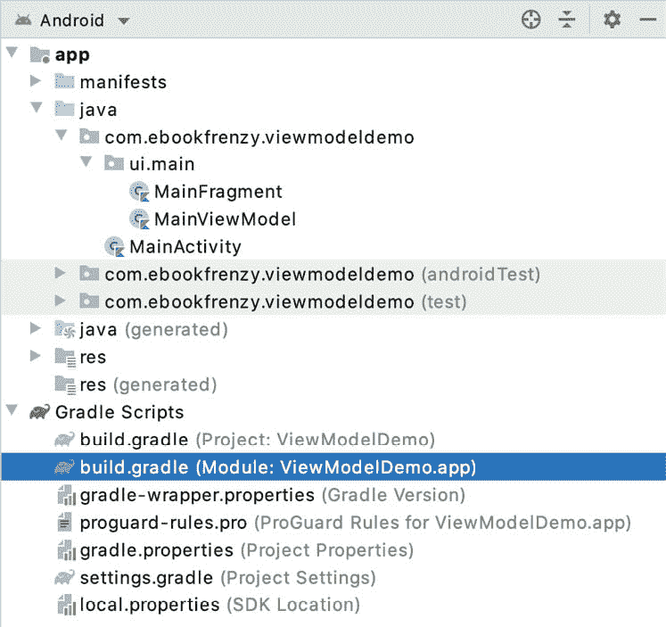
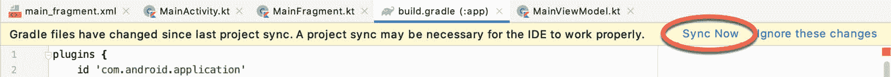
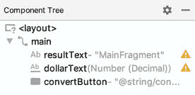

# 三十六、安卓Jetpack数据绑定教程

到目前为止，在本书中，我们已经介绍了现代安卓应用架构的基本概念，并更详细地研究了视图模型和实时数据组件。数据绑定的概念也在上一章中介绍过，现在将在本章中用于进一步修改 ViewModelDemo 应用。

36.1 删除冗余代码

如果您还没有这样做，请复制视图模型演示项目文件夹，并将其保存为视图模型演示 _ 实时数据，以便在下一章中再次使用。复制完成后，打开原始的视图模型演示项目，准备实现数据绑定。

在 ViewModelDemo 应用中实现数据绑定之前，将通过删除项目中本章结束时不再需要的所有代码来展示数据绑定的威力。

启动AndroidStudio，打开视图模型演示项目，编辑 MainFragment.java 文件，修改代码如下:

```java
package com.ebookfrenzy.viewmodeldemo.ui.main;

import android.arch.lifecycle.Observer;
import androidx.lifecycle.ViewModelProvider;

import android.os.Bundle;

import android.support.annotation.NonNull;
import android.support.annotation.Nullable;
import android.support.v4.app.Fragment;

import android.view.LayoutInflater;
import android.view.View;
import android.view.ViewGroup;
import android.widget.Button;
import android.widget.EditText;
import android.widget.TextView;

import com.ebookfrenzy.viewmodeldemo.R;

public class MainFragment extends Fragment {

    private MainViewModel mViewModel;
    private EditText dollarText;
    private TextView resultText;
    private Button convertButton;
.
.
    @Override
    public void onActivityCreated(@Nullable Bundle savedInstanceState) {
        super.onActivityCreated(savedInstanceState);
        mViewModel = new ViewModelProvider(this).get(MainViewModel.class);

        dollarText = getView().findViewById(R.id.dollarText);
        resultText = getView().findViewById(R.id.resultText);
        convertButton = getView().findViewById(R.id.convertButton);

        final Observer<Float> resultObserver = new Observer<Float>() {
            @Override
            public void onChanged(@Nullable final Float result) {
                resultText.setText(result.toString());
            }
        };

        mViewModel.getResult().observe(this, resultObserver);

        convertButton.setOnClickListener(new View.OnClickListener()
        {
            @Override
            public void onClick(View v) {

                if (!dollarText.getText().toString().equals("")) {
                    mViewModel.setAmount(dollarText.getText().toString());
                } else {
                    resultText.setText("No Value");
                }
            }
        });
    }
}
```

接下来，编辑 MainViewModel.java 文件并继续删除代码，如下所示(还要注意 dollarText 变量到 LiveData 的转换):

```java
package com.ebookfrenzy.viewmodeldemo.ui.main;

import android.arch.lifecycle.MutableLiveData;
import android.arch.lifecycle.ViewModel;

public class  MainViewModel extends ViewModel {

    private static final Float usd_to_eu_rate = 0.74F;
    public MutableLiveData<String> dollarValue = new MutableLiveData<>();
    private String dollarText = "";
    private public MutableLiveData<Float> result = new MutableLiveData<>();

    public void setAmount(String value) {
        this.dollarText = value;
        result.setValue(Float.valueOf(dollarText)*usd_to_eu_rate);
    }

    public MutableLiveData<Float> getResult()
    {
        return result;
    }
}
```

虽然我们将在实现数据绑定的过程中添加一些额外的代码行，但是数据绑定显然已经大大减少了需要编写的代码量。

36.2 启用数据绑定

使用数据绑定的第一步是在AndroidStudio项目中启用它。这涉及到在模块级 build.gradle 文件中添加一个新的属性，所以打开这个文件(app-> Gradle Scripts-> build . Gradle(Module:viewmodeldemo . app))如[图 36-1](#_idTextAnchor755) 所示:



图 36-1

在 build.gradle 文件中，添加如下所示的元素，以便在项目中启用数据绑定:

```java
plugins {
    id 'com.android.application'
}

android {

    buildFeatures {
        dataBinding = true
    }
    compileSdkVersion 29
.
.
}
```

添加条目后，编辑器屏幕顶部会出现一个黄色条，其中包含“立即同步”链接。单击此处可将项目与新的生成配置设置重新同步:



图 36-2

36.3 添加布局元素

如[“安卓 Jetpack 数据绑定概述”](35.html#_idTextAnchor737)所述，为了能够使用数据绑定，布局层次结构必须有一个布局组件作为根视图。这要求对 main_fragment.xml 布局文件(app->RES->layout->main _ fragment . XML)进行以下更改。在布局编辑器工具中打开此文件，切换到代码模式并进行以下更改:

```java
<?xml version="1.0" encoding="utf-8"?>

<layout xmlns:app="http://schemas.android.com/apk/res-auto"
    xmlns:tools="http://schemas.android.com/tools"
    xmlns:android="http://schemas.android.com/apk/res/android">

        <androidx.constraintlayout.widget.ConstraintLayout 
            xmlns:android="http://schemas.android.com/apk/res/android"
            xmlns:app="http://schemas.android.com/apk/res-auto"
            xmlns:tools="http://schemas.android.com/tools"
            android:id="@+id/main"
            android:layout_width="match_parent"
            android:layout_height="match_parent"
            tools:context=".ui.main.MainFragment">
.
.
        </androidx.constraintlayout.widget.ConstraintLayout>
</layout>
```

完成这些更改后，切换回设计模式，注意新的根视图虽然在布局画布中不可见，但现在已在组件树中列出，如图 36-3 所示:



图 36-3

构建并运行应用，以验证布局元素的添加没有以任何方式改变用户界面外观。

36.4 将数据元素添加到布局文件

将布局文件转换为数据绑定布局文件的下一步是添加数据元素。对于本例，布局将绑定到 MainViewModel，因此编辑 main_fragment.xml 文件以添加数据元素，如下所示:

```java
<?xml version="1.0" encoding="utf-8"?>

<layout xmlns:app="http://schemas.android.com/apk/res-auto"
    xmlns:tools="http://schemas.android.com/tools"
    xmlns:android="http://schemas.android.com/apk/res/android">

    <data>
        <variable
            name="myViewModel"
            type="com.ebookfrenzy.viewmodeldemo.ui.main.MainViewModel" />
    </data>

    <androidx.constraintlayout.widget.ConstraintLayout
        android:id="@+id/main"
        android:layout_width="match_parent"
        android:layout_height="match_parent"
        tools:context=".ui.main.MainFragment">
.
.
</layout>
```

再次构建并运行该应用，以确保这些更改生效。

36.5 使用绑定类

下一步是修改 MainFragment.java 文件中的代码，以获得对绑定类实例的引用。这最好通过重写 onCreateView()方法来实现:

```java
.
.
import androidx.databinding.DataBindingUtil;
import com.ebookfrenzy.viewmodeldemo.databinding.MainFragmentBinding;
.
public class MainFragment extends Fragment {

    private MainViewModel mViewModel;

    public MainFragmentBinding binding;
.
.
    @Nullable
    @Override
    public View onCreateView(@NonNull LayoutInflater inflater, 
                             @Nullable ViewGroup container,
                             @Nullable Bundle savedInstanceState) {

        binding = DataBindingUtil.inflate(
                inflater, R.layout.main_fragment, container, false);

        binding.setLifecycleOwner(this);

        return binding.getRoot();
        return inflater.inflate(R.layout.main_fragment, container, false);
    }
.
.
}
```

旧代码只是膨胀了 main_fragment.xml 布局文件(换句话说，创建了包含所有视图对象的布局)，并返回了对根视图(顶层布局容器)的引用。数据绑定库包含一个实用程序类，该类提供了一种特殊的膨胀方法，除了构建用户界面之外，还初始化并返回布局数据绑定类的实例。新代码调用此方法，并将对绑定类实例的引用存储在变量中:

```java
binding = DataBindingUtil.inflate(
                inflater, R.layout.main_fragment, container, false);
```

只要片段存在，绑定对象就只需要保留在内存中。为了确保片段消失时实例被销毁，当前片段被声明为绑定对象的生命周期所有者。

```java
binding.setLifecycleOwner(this);
```

虽然 onCreateView()方法的代码已经重写，但它返回布局的根视图的基本要求没有改变。幸运的是，这可以通过调用绑定对象的 getRoot()方法来获得:

```java
return binding.getRoot();
```

36.6 将视图模型实例分配给数据绑定变量

此时，数据绑定知道它将绑定到 MainViewModel 类型的类的实例，但是还没有连接到实际的 MainViewModel 对象。这需要额外的步骤，将应用中使用的 MainViewModel 实例分配给布局文件中声明的 ViewModel 变量。由于对视图模型的引用是在 onActivityCreated()方法中获得的，因此在那里进行赋值是有意义的:

```java
.
.
import static com.ebookfrenzy.viewmodeldemo.BR.myViewModel;
.
.
@Override
public void onActivityCreated(@Nullable Bundle savedInstanceState) {
    super.onActivityCreated(savedInstanceState);

    mViewModel = new ViewModelProvider(this).get(MainViewModel.class);
    binding.setVariable(myViewModel, mViewModel);
}
```

如果AndroidStudio报告我的视图模型未定义，使用构建->创建项目菜单选项重建项目，以强制生成类。做出这些更改后，下一步是开始将一些绑定表达式插入数据绑定布局文件的视图元素中。

36.7 添加绑定表达式

第一个绑定表达式将结果文本文本视图绑定到模型视图中的结果值。编辑 main_fragment.xml 文件，找到 resultText 元素并修改 Text 属性，使该元素如下所示:

```java
<TextView
    android:id="@+id/resultText"
    android:layout_width="wrap_content"
    android:layout_height="wrap_content"
    android:text="MainFragment"
    android:text='@{safeUnbox(myViewModel.result) == 0.0 ? "Enter value" : String.valueOf(safeUnbox(myViewModel.result)) + " euros"}'
    app:layout_constraintBottom_toBottomOf="parent"
    app:layout_constraintEnd_toEndOf="parent"
    app:layout_constraintStart_toStartOf="parent"
    app:layout_constraintTop_toTopOf="parent" />
```

表达式首先检查结果值当前是否为零，如果为零，则显示一条消息，指示用户输入一个值。但是，如果结果不为零，该值将被转换为字符串，并在显示给用户之前与单词“euros”连接。

结果值只需要单向绑定，因为布局永远不需要更新存储在视图模型中的值。另一方面，dollarValue EditText 视图需要使用双向绑定，以便可以使用用户输入的最新值更新数据模型，并允许在生命周期事件(如设备旋转触发的事件)发生时在视图中重新显示当前值。dollarText 元素现在应该声明如下:

```java
<EditText
    android:id="@+id/dollarText"
    android:layout_width="wrap_content"
    android:layout_height="wrap_content"
    android:layout_marginTop="96dp"
    android:ems="10"
    android:importantForAutofill="no"
    android:inputType="numberDecimal"
    android:text="@={myViewModel.dollarValue}"
    app:layout_constraintEnd_toEndOf="parent"
    app:layout_constraintHorizontal_bias="0.502"
    app:layout_constraintStart_toStartOf="parent"
    app:layout_constraintTop_toTopOf="parent" />
```

现在已经添加了这些初始绑定表达式，现在需要编写一个方法来在用户单击 Button 小部件时执行转换。

36.8 添加转换方法

当单击转换按钮时，它将调用视图模型上的一个方法来执行转换计算，并将欧元值放入结果 LiveData 变量中。现在将此方法添加到 MainViewModel.java 文件中:

```java
.
.
public class  MainViewModel extends ViewModel {

    private static final Float usd_to_eu_rate = 0.74F;
    public MutableLiveData<String> dollarValue = new MutableLiveData<>();
    public MutableLiveData<Float> result = new MutableLiveData<>();

    public void convertValue() {
        if ((dollarValue.getValue() != null) && 
                           (!dollarValue.getValue().equals(""))) {
            result.setValue(Float.parseFloat(dollarValue.getValue())) 
                                                 * usd_to_eu_rate);
        } else {
            result.setValue(0F);
        }
    }
}
```

请注意，在没有有效美元值的情况下，会将零值分配给结果 LiveData 变量。这确保了如果用户没有输入值，分配给结果文本文本视图的绑定表达式将显示“输入值”消息。

36.9 添加监听器绑定

测试项目之前的最后一步是向布局文件中的 Button 元素添加一个侦听器绑定表达式，以便在单击按钮时调用 convertValue()方法。再次在代码模式下编辑 main_fragment.xml 文件，找到 convertButton 元素并添加一个 onClick 条目，如下所示:

```java
<Button
    android:id="@+id/convertButton"
    android:layout_width="wrap_content"
    android:layout_height="wrap_content"
    android:layout_marginTop="77dp"
    android:onClick="@{() -> myViewModel.convertValue()}"
    android:text="Convert"
    app:layout_constraintEnd_toEndOf="parent"
    app:layout_constraintStart_toStartOf="parent"
    app:layout_constraintTop_toBottomOf="@+id/resultText" />
```

36.10 测试应用

编译并运行该应用，并测试在美元字段中输入一个值并单击转换按钮会在文本视图上显示正确的结果(以及“欧元”后缀)，如果在美元字段为空的情况下尝试转换，则会出现“输入值”提示。此外，验证用户界面中显示的信息是否通过设备旋转得以保留。

36.11 总结

本章的主要目标是完成设置使用数据绑定的项目所涉及的步骤，并演示单向、双向和侦听器绑定表达式的使用。本章还提供了一个实际例子，说明通过使用数据绑定和 LiveData 将用户界面视图与应用的后端数据和逻辑连接起来，可以节省多少代码编写时间。事实上，在使用数据绑定时，原始应用中的 36 行代码仅被 12 行代码替换。