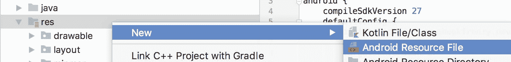
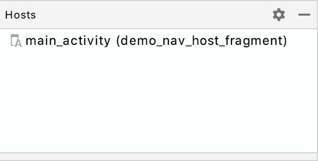
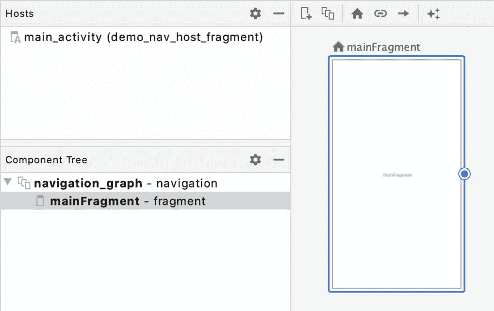
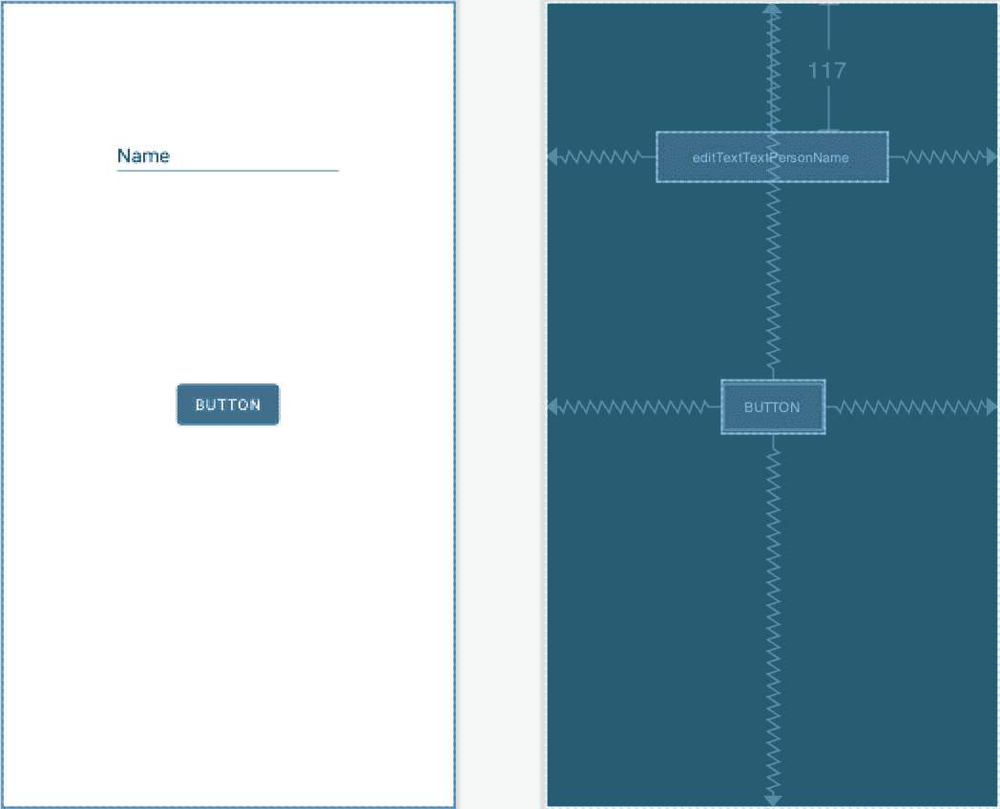
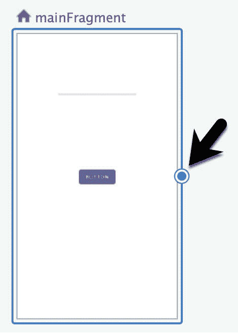
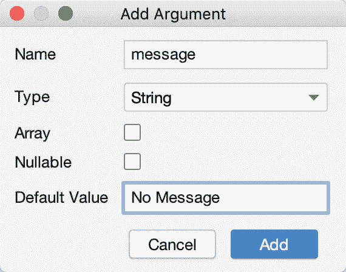

# 四十一、安卓Jetpack 导航组件教程

前一章描述了安卓 Jetpack 导航组件，以及它如何与AndroidStudio的导航图形功能相集成，以提供一种在安卓应用的屏幕之间实现导航的简单方法。在本章中，将创建一个新的AndroidStudio项目，利用这些导航功能来实现一个包含多个屏幕的示例应用。除了演示AndroidStudio导航图编辑器的使用，该示例项目还将使用类型安全参数实现源屏幕和目标屏幕之间的数据传递。

41.1 创建导航演示项目

从欢迎屏幕中选择创建新项目快速启动选项，并在生成的新项目对话框中选择片段+视图模型模板，然后单击下一步按钮。

在“名称”字段中输入 NavigationDemo，并将 com . ebookwidue . NavigationDemo 指定为包名。在单击完成按钮之前，将最低应用编程接口级别设置更改为应用编程接口 26:安卓 8.0(奥利奥)，并将语言菜单更改为 Java。

41.2 向构建配置添加导航

默认情况下，新的AndroidStudio项目在构建配置文件中不包括导航组件库。因此，在执行任何其他任务之前，第一步是修改 app 级别的 build.gradle 文件。在项目工具窗口中找到该文件(Gradle Scripts-> build . Gradle(Module:navigationdemo . app))，双击该文件将其加载到代码编辑器中，并修改依赖项部分以添加导航库:

```java
.
.
dependencies {
    implementation 'androidx.navigation:navigation-fragment:2.3.0'
    implementation 'androidx.navigation:navigation-ui:2.3.0'
.
.
}
```

请注意，自本书出版以来，这些库的较新版本可能已经发布。要识别和使用较新版本的库，请将上述行添加到构建文件中，然后打开“项目结构”对话框(文件->项目结构...).在“项目结构”对话框中，选择“建议”选项以显示可用的更新。如果有新的库版本可用，请在单击“应用”按钮之前，单击“更新”按钮以确保这些最新版本在 build.gradle 文件中使用:


图 41-1

将导航依赖项添加到文件后，单击“立即同步”链接以重新同步项目的生成配置。

41.3 创建 导航图资源文件

随着导航库被添加到构建配置中，导航图资源文件现在可以被添加到项目中。如[“导航架构组件概述”](40.html#_idTextAnchor792)中所述，这是一个包含片段和活动的 XML 文件，用户将能够通过这些片段和活动进行导航，以及执行转换的操作和在目的地之间传递的任何数据。

在项目工具窗口中，找到资源文件夹(应用->资源)，右键单击它并选择新建->安卓资源文件菜单选项:



图 41-2

选择菜单项后，将出现“新建资源文件”对话框。在此对话框中，命名文件 navigation_graph，并将资源类型菜单更改为导航，如图 41-3 所示，然后单击确定按钮创建文件。


图 41-3

将导航图资源文件添加到项目后，它将出现在主面板中，为添加新目标做好准备。将编辑器切换到代码模式，并在添加任何目标之前查看图形的 XML:

```java
<?xml version="1.0" encoding="utf-8"?>
<navigation xmlns:android="http://schemas.android.com/apk/res/android"
    xmlns:app="http://schemas.android.com/apk/res-auto" 
    android:id="@+id/navigation_graph">

</navigation>
```

在编辑器中切换回设计模式，注意“目标”面板的“主机”部分指示在项目中未检测到导航主机片段:


图 41-4

在向导航图添加任何目的地之前，下一步是向项目添加导航宿主片段。

41.4 声明导航主机

对于这个项目，导航主机片段将包含在主活动的用户界面布局中。这意味着导航图中的目标片段将出现在 main_fragment.xml 布局当前占据的主活动的内容区域中。在项目工具窗口(app-> RES-> layout-> main _ activity . XML)中找到主活动布局文件，并将其加载到布局编辑器工具中。

布局编辑器处于设计模式时，从调色板的容器部分拖动一个 NavHostFragment 元素，并将其放到活动布局的容器区域，如图 41-5 中的箭头所示:


图 41-5

从生成的“导航图形”对话框中，选择上一节中创建的 navigation_graph.xml 文件，然后单击“确定”按钮。

在布局中选择新添加的导航主机片段实例后，使用属性工具窗口将元素的标识更改为演示导航主机片段。

将布局编辑器切换到代码模式，并查看 XML 文件。请注意，编辑器已正确配置了导航图属性以引用 navigation_graph.xml 文件，并且 defaultNavHost 属性已设置为 true:

```java
<?xml version="1.0" encoding="utf-8"?>
<FrameLayout xmlns:android="http://schemas.android.com/apk/res/android"
    xmlns:app="http://schemas.android.com/apk/res-auto"
    xmlns:tools="http://schemas.android.com/tools"
    android:id="@+id/container"
    android:layout_width="match_parent"
    android:layout_height="match_parent"
    tools:context=".MainActivity" >

    <fragment
        android:id="@+id/demo_nav_host_fragment"
        android:name="androidx.navigation.fragment.NavHostFragment"
        android:layout_width="match_parent"
        android:layout_height="match_parent"
        app:defaultNavHost="true"
        app:navGraph="@navigation/navigation_graph" />
</FrameLayout>
```

在主活动布局文件中配置了 NavHostFragment 后，需要从 MainActivity.java 类文件中删除一些代码，以防止活动在运行时加载 main_fragment.xml 文件。将此文件加载到代码编辑器中，找到 onCreate()方法并删除负责显示主片段的代码:

```java
@Override
protected void onCreate(Bundle savedInstanceState) {
    super.onCreate(savedInstanceState);
    setContentView(R.layout.main_activity);
    if (savedInstanceState == null) {
        getSupportFragmentManager().beginTransaction()
                .replace(R.id.container, MainFragment.newInstance())
                .commitNow();
    }
}
```

返回 navigation_graph.xml 文件，并确认已检测到 NavHostFragment 实例(可能需要在更改出现之前关闭并重新打开该文件):



图 41-6

41.5 添加导航目的地

在导航图中，现在是时候添加第一个目的地了。由于项目已经有了第一个屏幕的片段(main_fragment.xml)，这将是添加到图中的第一个目标。点击[图 41-7](#_idTextAnchor817) 所示的新建目的地按钮，选择或创建目的地:


图 41-7

选择 main_fragment 作为目标，以便它出现在导航图中:



图 41-8

位于目标节点上方的主图标表示这是起始目标。这意味着当创建包含 NavHostFragment 的活动时，目标将是第一个显示的。要将起始目的地更改为另一个目的地，请在图形中选择该节点，然后单击工具栏中的主页按钮。

通过将编辑器切换到代码模式来查看导航图的 XML 内容:

```java
<?xml version="1.0" encoding="utf-8"?>
<navigation xmlns:android="http://schemas.android.com/apk/res/android"
    xmlns:app="http://schemas.android.com/apk/res-auto"
    xmlns:tools="http://schemas.android.com/tools"
    android:id="@+id/navigation_graph"
    app:startDestination="@id/mainFragment">

    <fragment
        android:id="@+id/mainFragment"
        android:name="com.ebookfrenzy.navigationdemo.ui.main.MainFragment"
        android:label="main_fragment"
        tools:layout="@layout/main_fragment" />
</navigation>
```

在进行任何导航之前，图表至少还需要一个目的地。这一次，导航图编辑器将用于创建一个新的空白目的地。切换回设计模式，再次单击“新建目标”按钮，这次是从菜单中选择“创建新目标”选项。在生成的对话框中，选择片段(空白)模板，命名新片段秒片段和布局片段秒，然后单击完成按钮。在项目重建过程中经过短暂延迟后，新片段将作为另一个目的地出现在图中，如图[图 41-9](#_idTextAnchor818) :


图 41-9

41.6 设计目标片段布局

在添加操作以在目的地之间导航之前，现在是向图中的两个目的地片段添加一些用户界面组件的好时机。首先双击 mainFragment 目标，以便 main_fragment.xml 文件加载到布局编辑器中。选择并删除当前文本视图小部件，然后将按钮和纯文本编辑文本小部件拖放到布局上，使其类似于下面的[图 41-10](#_idTextAnchor820) 所示:



图 41-10

正确定位视图后，单击工具栏中的“推断约束”按钮，将任何缺失的约束添加到布局中。选择编辑文本视图，并使用属性工具窗口删除默认的“名称”文本，并将小部件的标识更改为用户文本。

返回到 navigation_graph.xml 文件，双击 secondFragment 目标，将 fragment_second.xml 文件加载到布局编辑器中，然后选择并删除默认的 TextView 实例。在组件树面板中，右键单击框架布局条目，并选择从框架布局转换为约束布局...菜单选项，接受生成的转换对话框中的默认设置:


图 41-11

使用属性工具窗口，将约束布局的标识更改为约束布局。随着片段的父布局管理器现在转换为更灵活的约束布局，拖放一个新的文本视图小部件，使其位于布局的中心，并单击推断约束按钮添加任何缺失的约束。选择新文本视图后，使用属性面板将标识更改为参数文本。

41.7 向导航图添加动作

现在，两个目的地已经被添加到图中，并且设计了相应的用户界面布局，项目现在需要一种方法让用户从主片段导航到第二个片段。这将通过向图中添加一个动作来实现，然后可以从应用代码中引用该动作。

要建立以主片段为起点、第二个片段为目的地的动作连接，请打开导航图，将鼠标指针悬停在主片段目的地右侧边缘的垂直中心上，以便出现一个圆圈，如图 41-12 中突出显示的那样:



图 41-12

在圆圈内单击，并将结果行拖动到第二个片段目标:


图 41-13

松开线，建立起点和终点之间的动作连接，此时线将变为箭头，如图[图 41-14](#_idTextAnchor823) :


图 41-14

通过选择动作连接并按下键盘上的删除键，可以随时删除该动作连接。选择箭头后，查看属性工具窗口中的可用属性，并将标识更改为“主至次”。这是代码中引用操作的标识。将编辑器切换到代码模式，注意操作现在包含在 XML 中:

```java
<?xml version="1.0" encoding="utf-8"?>
<navigation xmlns:android="http://schemas.android.com/apk/res/android"
    xmlns:app="http://schemas.android.com/apk/res-auto"
    xmlns:tools="http://schemas.android.com/tools"
    android:id="@+id/navigation_graph"
    app:startDestination="@id/mainFragment">

    <fragment
        android:id="@+id/mainFragment"
        android:name="com.ebookfrenzy.navigationdemo.ui.main.MainFragment"
        android:label="main_fragment"
        tools:layout="@layout/main_fragment" >
        <action
            android:id="@+id/mainToSecond"
            app:destination="@id/secondFragment" />
    </fragment>
    <fragment
        android:id="@+id/secondFragment"
        android:name="com.ebookfrenzy.navigationdemo.SecondFragment"
        android:label="fragment_second"
        tools:layout="@layout/fragment_second" />
```

41.8 实现在垃圾邮件交互监听器上

在添加代码来触发操作之前，需要修改 MainActivity 类来实现 OnFragmentInteractionListener 接口。这是在导航图编辑器中创建空白片段时在 SecondFragment 类中生成的接口。为了符合接口，活动需要实现一个名为 onFragmentInteraction()的方法，用于实现片段和活动之间的通信。

编辑 MainActivity.java 文件并对其进行修改，使其如下所示:

```java
.
.
import android.net.Uri;
.
.
public class MainActivity extends AppCompatActivity implements SecondFragment.OnFragmentInteractionListener {

    @Override
    protected void onCreate(Bundle savedInstanceState) {
        super.onCreate(savedInstanceState);
        setContentView(R.layout.main_activity);
    }

    @Override
    public void onFragmentInteraction(Uri uri) {
    }
}
```

如果 Android Studio 报告 OnFragmentInteractionListener 未定义(某些版本的 Android Studio 会自动添加，而其他版本则不会)，请编辑 SecondFragment.java 文件，并按如下方式添加:

```java
.
.
import android.net.Uri;
.
.
   public interface OnFragmentInteractionListener {
        // TODO: Update argument type and name
        void onFragmentInteraction(Uri uri);
    }
.
.
```

41.9 触发动作

现在该动作已经添加到导航图中，下一步是在主片段中添加一些代码，以便在单击 Button 小部件时触发该动作。找到 MainFragment.java 文件，将其加载到代码编辑器中，并修改 onActivityCreated()方法，以获取对按钮实例的引用，并配置一个 onClickListener 实例，以便在用户单击按钮时调用:

```java
.
.
import android.widget.Button;
import androidx.navigation.Navigation;
.
.
public class MainFragment extends Fragment  {
.
.
    @Override
    public void onActivityCreated(@Nullable Bundle savedInstanceState) {
        super.onActivityCreated(savedInstanceState);
        mViewModel = new ViewModelProvider(this).get(MainViewModel.class);

        Button button = getView().findViewById(R.id.button);

        button.setOnClickListener(new View.OnClickListener() {
            @Override
            public void onClick(View view) {
                Navigation.findNavController(view).navigate(
                                     R.id.mainToSecond);
            }
        });
    }
}
```

上面的代码获取对导航控制器的引用，并在该实例上调用 navigate()方法，将导航操作的资源标识作为参数传递。

编译并运行应用，并验证单击主片段中的按钮是否会过渡到第二个片段。

作为设置侦听器的这种方法的替代方法，Navigation 类还包括一个名为 createNavigateOnClickListener()的方法，它提供了一种更有效的设置侦听器和导航到目标的方法。因此，使用下面的一行代码来启动转换也可以获得相同的结果:

```java
button.setOnClickListener(Navigation.createNavigateOnClickListener(
                                    R.id.mainToSecond, null));
```

41.10 使用 安全参数传递数据

本教程的下一个目标是将输入到主片段的编辑文本视图中的文本传递到第二个片段，在那里它将显示在文本视图小部件上。如前一章所述，安卓导航组件支持两种传递数据的方法。本章将使用类型安全的参数传递。

使用 safeargs 的第一步是将 safeargs 插件添加到 Gradle 构建配置中。使用项目工具窗口，找到并编辑项目级 build.gradle 文件(Gradle Scripts -> build.gradle(项目:NavigationDemo))，将插件添加到依赖项中，如下所示(再次记住，现在可能有更新的版本):

```java
buildscript {

    repositories {
        google()
        jcenter()
    }
    dependencies {
        classpath 'com.android.tools.build:gradle:4.1.0-rc03'
        classpath "androidx.navigation:navigation-safe-args-gradle-plugin:2.3.0"
.
.
```

接下来，编辑应用级 build.gradle 文件(Gradle Scripts-> build . Gradle(Module:App))以如下方式应用插件，并在出现提示时重新同步项目。

```java
plugins {
    id 'com.android.application'
    id 'androidx.navigation.safeargs'
.
.
android {
.
.
```

下一步是定义将由目的地接收的任何参数，在本例中，目的地是第二个片段。编辑导航图，选择第二个片段目标，并在属性工具窗口中找到参数部分。点击+按钮(在[图 41-15](#_idTextAnchor828) 中突出显示)向目的地添加新参数:


图 41-15

单击+按钮后，将出现一个对话框，需要在其中输入参数名称、类型和默认值。命名参数消息，将类型设置为字符串，并在默认值字段中输入无消息:



图 41-16

新配置的参数将出现在 navigation_graph.xml 文件的 secondFragment 元素中，如下所示:

```java
<fragment
    android:id="@+id/secondFragment"
    android:name="com.ebookfrenzy.navigationdemo.SecondFragment"
    android:label="fragment_second"
    tools:layout="@layout/fragment_second" >
    <argument
        android:name="message"
        app:argType="string" />
        android:defaultValue="No Message"
</fragment>
```

下一步是向 Mainfragment.java 文件添加代码，从编辑文本视图中提取文本，并在导航操作期间将其传递给第二个片段。这将涉及到使用一些由 safeargs 插件自动生成的特殊导航类。目前，导航包括 MainFragment 类、SecondFragment 类、一个名为 mainToSecond 的导航操作和一个名为 message 的参数。

构建项目时，safeargs 插件将生成以下附加类，这些类可用于在导航过程中传递和接收参数。

MainFragmentDirections -该类表示导航动作的原点(使用导航原点的类名命名，并在末尾附加“Directions”)，并提供对动作对象的访问。

actionmaintossecond-表示用于执行转换的操作的类(根据导航图文件中以“action”为前缀的分配给该操作的 ID 来命名)。此类包含目标上配置的每个参数的 setter 方法。例如，由于第二个片段目标包含一个名为 message 的参数，因此该类包含一个名为 setMessage()的方法。配置完成后，该类的实例将被传递给导航控制器的 navigate()方法，以导航到目标。

SecondFragmentArgs -目标片段中用于访问从原点传递的参数的类(使用导航目标的类名命名，末尾附加“Args”)。这个类包含一个 getter 方法，用于传递给目标的每个参数(即 getMessage())

使用这些类，可以如下修改 MainFragment.java 文件的 onActivityCreated()方法中的 onClickListener 代码，以从 EditText 小部件中提取当前文本，将其应用于操作并启动到第二个片段的转换:

```java
.
.
import android.widget.EditText;
.
.
button.setOnClickListener(new View.OnClickListener() {
    @Override
    public void onClick(View view) {
        Navigation.findNavController(view).navigate(
                        R.id.mainToSecond);
        EditText userText = getView().findViewById(R.id.userText);

        MainFragmentDirections.MainToSecond action = 
                                MainFragmentDirections.mainToSecond();

        action.setMessage(userText.getText().toString());
        Navigation.findNavController(view).navigate(action);
    }
});
```

上面的代码获取对操作对象的引用，使用 setMessage()方法设置消息参数字符串，然后通过操作对象调用导航控制器的 navigate()方法。如果AndroidStudio报告 MainFragmentDirections 未定义，请使用“构建”->“制作项目”菜单选项重新构建项目以生成类。

剩下的就是在导航完成后修改 SecondFragment.java 类文件来接收参数，并将其显示在文本视图小部件上。对于本例，实现这些任务的代码将使用 onStart()生命周期方法添加。编辑 SecondFragment.java 文件并添加此方法，使其如下所示:

```java
.
.
import android.widget.TextView;
.
.
@Override
public void onStart() {
    super.onStart();

    TextView argText = getView().findViewById(R.id.argText);
    SecondFragmentArgs args = SecondFragmentArgs.fromBundle(getArguments());
    String message = args.getMessage();
    argText.setText(message);
}
```

上述方法中的代码从获取对 TextView 小部件的引用开始。接下来，调用 SecondFragmentArgs 类的 fromBundle()方法来提取从原点接收的 SecondFragmentArgs 对象。由于此示例中的参数在 navigation_graph.xml 文件中被命名为 message，因此在 args 对象上调用相应的 getMessage()方法来获取字符串值。该字符串随后显示在文本视图小部件上。

编译并运行应用，并在点击按钮部件之前输入一些文本。当第二个片段目的地出现时，文本视图现在应该显示在主片段中输入的文本，指示数据在导航目的地之间成功传递。

41.11 总结

本章提供了一个如何使用导航架构组件和AndroidStudio导航图编辑器实现安卓应用导航的实际例子。涵盖的主题包括创建包含现有和新目的地片段的导航图，在活动布局中嵌入导航主机片段，编写代码以触发导航事件，以及使用 Gradle safeargs 插件在目的地之间传递参数。