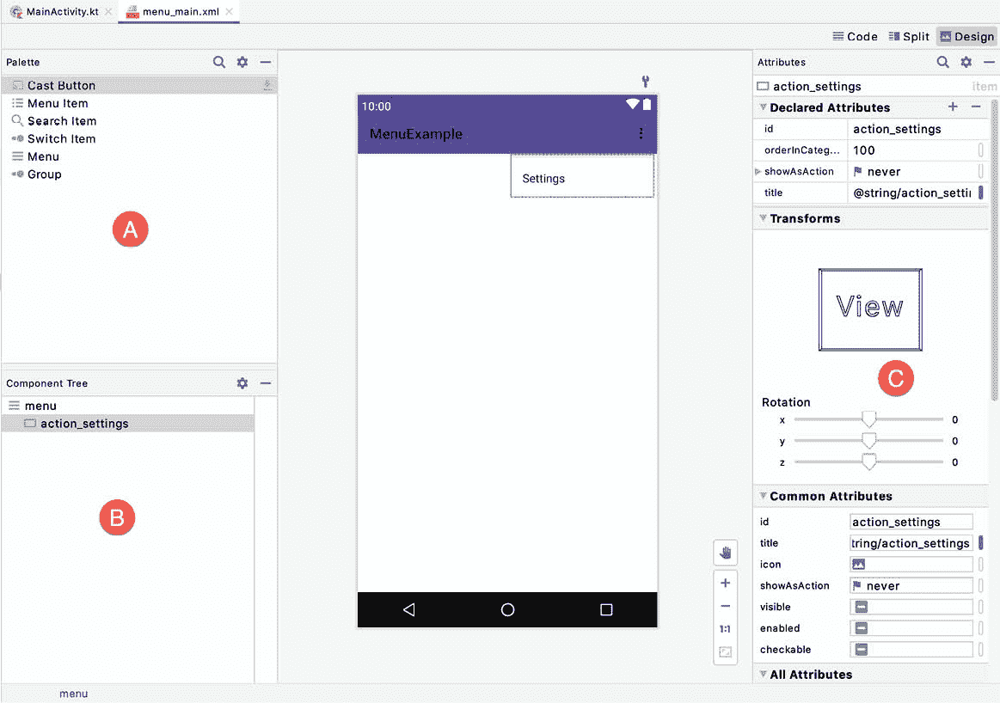
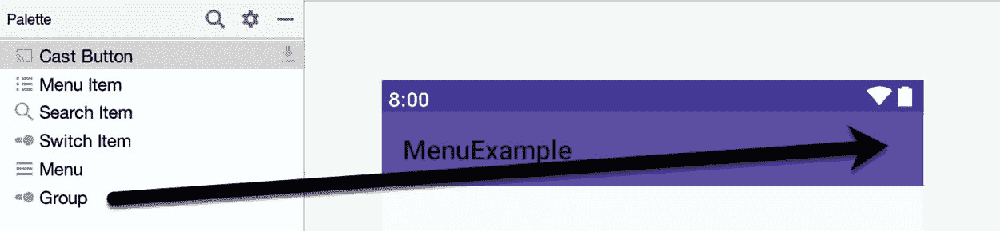
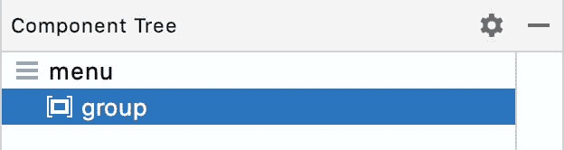
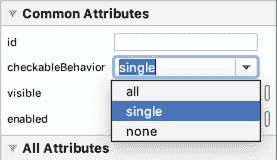
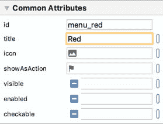
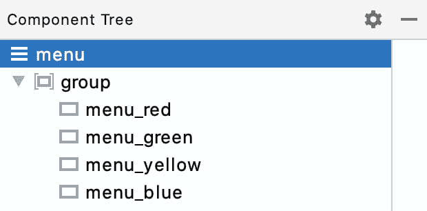
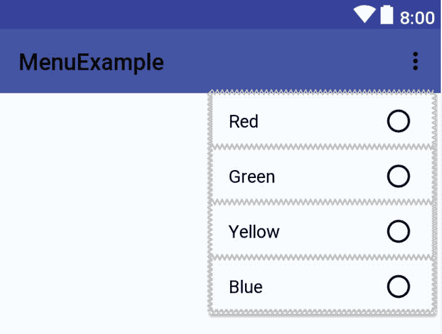
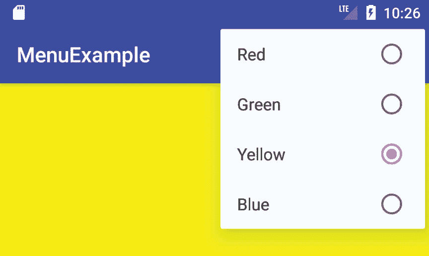

# 四十二、在安卓系统上创建和管理溢出菜单

本书还没有涉及的一个用户界面设计领域与安卓应用中的菜单概念有关。菜单提供了一种机制，用于向用户提供除了用户界面布局中存在的视图组件之外的其他选择。虽然安卓应用开发人员可以使用许多不同的菜单系统，但本章将重点介绍更常用的溢出菜单。本章将涵盖通过 XML 手动创建菜单和使用 AndroidStudio 布局编辑器工具可视化创建菜单。

42.1 溢出菜单

溢出菜单(也称为选项菜单)是用户可从设备显示器访问的菜单，并且允许开发者包括除了包括在应用的用户界面中的应用选项之外的其他应用选项。溢出菜单的位置取决于设备上运行的安卓版本。在安卓 4.0 及更高版本中，溢出菜单按钮位于由三个方块组成的堆栈表示的动作工具栏的右上角([图 42-1](#_idTextAnchor834) ):


图 42-1

42.2 创建溢出菜单

菜单中的项目可以在一个 XML 文件中声明，然后该文件被膨胀并根据需要显示给用户。这涉及到

<menu>元素的使用，每个菜单项包含一个<项>子元素。例如，下面的 XML 定义了一个由两个与颜色选择相关的菜单项组成的菜单:</menu>

```java
<menu xmlns:android="http://schemas.android.com/apk/res/android"
    xmlns:app="http://schemas.android.com/apk/res-auto"
    xmlns:tools="http://schemas.android.com/tools"
    tools:context=".MainActivity" >
    <item
        android:id="@+id/menu_red"
        android:orderInCategory="1"
        app:showAsAction="never"
        android:title="@string/red_string"/>

        <item
            android:id="@+id/menu_green"
            android:orderInCategory="2"
            app:showAsAction="never"
            android:title="@string/green_string"/>
</menu>
```

在上面的 XML 中，Android:orderinacionary 属性规定了菜单项在菜单中显示时的显示顺序。另一方面，app:showasaaction 属性控制相应项目在动作栏中显示为项目的条件。例如，如果设置为“如果房间”，则如果有足够的空间，该项目将出现在动作栏中。[图 42-2](#_idTextAnchor837) 显示了将此属性设置为 ifRoom 对于两个菜单 ite ms 的效果:


图 42-2

应该谨慎使用该属性，以避免操作栏过于混乱。

默认情况下，当创建新的安卓应用项目时，AndroidStudio 会创建一个菜单 XML 文件。该文件位于 app -> res ->菜单项目文件夹中，包含一个名为“设置”的菜单项:

```java
<menu xmlns:android="http://schemas.android.com/apk/res/android"
    xmlns:app="http://schemas.android.com/apk/res-auto"
    xmlns:tools="http://schemas.android.com/tools" 
    tools:context=".MainActivity">
       <item android:id="@+id/action_settings" 
            android:title="@string/action_settings"
            android:orderInCategory="100" 
            app:showAsAction="never" />
</menu>
```

该菜单已经配置为在应用运行时用户选择用户界面上的溢出菜单时显示，因此只需修改该菜单即可满足您的需求。

42.3 显示溢出菜单

通过覆盖相应活动的 onCreateOptionsMenu()方法，然后膨胀菜单的 XML 文件，创建一个溢出菜单。例如，以下代码创建包含在名为 menu_main 的菜单 XML 文件中的菜单:

```java
@Override
public boolean onCreateOptionsMenu(Menu menu) {
       getMenuInflater().inflate(R.menu.menu_main, menu);
       return true;
}
```

与菜单 XML 文件一样，AndroidStudio 已经在新创建的安卓应用项目的主要活动中覆盖了这个方法。如果您的活动中不需要溢出菜单，请删除或注释掉此方法。

42.4 响应菜单项选择

一旦实现了菜单，当用户选择菜单项时，应用如何接收通知的问题就出现了。一个活动接收菜单选择通知所需要做的就是覆盖 onOptionsItemSelected()方法。作为参数传递给此方法的是对选定菜单项的引用。然后可以对该项目调用 getItemId()方法来获得该 Id，该 ID 又可以用于识别选择了哪个项目。例如:

```java
@Override
public boolean onOptionsItemSelected(MenuItem item) {

       switch (item.getItemId()) {
        case R.id.menu_red:
            // Red item was selected
            return true;
        case R.id.menu_green:
            // Green item was selected
            return true;
        default:
            return super.onOptionsItemSelected(item);
       }
}
```

42.5 创建可检查项目组

除了配置独立的菜单项，还可以创建菜单项组。这在创建可检查的菜单项时特别有用，在这种情况下，一次只能选择多个选项中的一个。菜单项可以通过包装在<group>标签中分配到一个组。使用 android:checkableBehavior 属性将该组声明为可检查的，将该值设置为单个、全部或无。下面的 XML 声明两个菜单项组成一个组，其中在任何给定时间只能选择一个菜单项:</group>

```java
<menu xmlns:android="http://schemas.android.com/apk/res/android"
    xmlns:app="http://schemas.android.com/apk/res-auto">
    <group android:checkableBehavior="single">
        <item
            android:id="@+id/menu_red"
            android:title="@string/red_string"/>
        <item
            android:id="@+id/menu_green"
            android:title="@string/green_string"/>
    </group>
</menu>
```

当菜单组被配置为可检查时，菜单中的项目旁边会出现一个小圆圈，如图[图 42-3](#_idTextAnchor842) 所示。需要注意的是，该指示器的设置和取消不会自动进行。因此，应用有责任检查和取消检查“我”怒项。


图 42-3

继续本章前面使用的颜色示例，这将按如下方式实现:

```java
@Override
public boolean onOptionsItemSelected(MenuItem item) {

        switch (item.getItemId()) {
            case R.id.menu_red:
                if (item.isChecked()) item.setChecked(false);
                else item.setChecked(true);
                return true;
            case R.id.menu_green:
                if (item.isChecked()) item.setChecked(false);
                else item.setChecked(true);
                return true;
            default:
                return super.onOptionsItemSelected(item);
        }
}
```

42.6 菜单和 AndroidStudio 菜单编辑器

AndroidStudio 只需将菜单资源文件加载到菜单编辑器工具中，从调色板中拖放菜单元素并设置属性，就可以直观地设计菜单。这极大地简化了菜单设计过程，不过需要注意的是，仍然需要在 onOptionsItemSelected()方法中编写代码来实现菜单行为。

要可视化地设计菜单，请找到菜单资源文件并双击它，将其加载到菜单编辑器工具中。[例如，图 42-4](#_idTextAnchor845) 显示了在设计模式下加载到 Me nu 编辑器中的基本活动的默认菜单资源文件:



图 42-4

调色板(A)包含可以添加到设计区域(C)中包含的菜单中的项目。组件树是识别菜单层次结构的有用工具。属性面板(D)包含当前选定项目的公共属性子集。

通过将对象拖放到布局画布或组件树中，可以将新元素添加到菜单中。在布局编辑器工具中使用菜单时，有时将项目放到组件树中会更容易，因为这样可以更好地控制项目在树中的位置。例如，当向组中添加项目时，这尤其有用。

虽然菜单编辑器提供了构建菜单的可视化方法，但是底层菜单仍然以 XML 格式存储，可以通过使用上图中标记为 F 的选项卡从设计模式切换到代码模式来手动查看和编辑。

42.7 创建示例项目

要查看溢出菜单的运行情况，请从欢迎屏幕中选择创建新项目快速启动选项，并在生成的新项目对话框中选择基本活动模板，然后单击下一步按钮。

在名称字段中输入 MenuExample，并指定 com . ebookwidge . menueexample 作为包名。在单击完成按钮之前，将最低 API 级别设置更改为 API 26:安卓 8.0(奥利奥)，并将语言菜单更改为 Java。

项目创建完成后，在项目工具窗口中导航到 app -> res -> layout 文件夹，双击 content_main.xml 文件将其加载到 Android Studio 菜单编辑器工具中。将工具切换到设计模式，从组件树面板中选择约束布局，并在属性面板的标识字段中输入布局视图。

42.8 设计菜单

在项目工具窗口中，找到项目的应用->资源->菜单-> menu_main.xml 文件，双击它将其加载到布局编辑器工具中。如有必要，切换到设计模式，选择并删除 AndroidStudio 添加的默认设置菜单项，使菜单当前没有项目。

从调色板中，单击菜单组对象并将其拖动到布局画布的标题栏上，如图 42-5 中的[所示:](#_idTextAnchor848)



图 42-5

虽然已经添加了组项目，但它在布局中不可见。要验证元素的存在，请参考“组件树”面板，其中该组将作为菜单的子级列出:



图 42-6

在“组件树”中选择组条目，并参考“属性”面板，将“可检查行为”属性设置为“单个”，以便在任何时候只能选择一个组菜单项:



图 42-7

接下来，将四个菜单项元素从调色板中拖放到组件树中的组元素上。选择第一个项目，并使用属性面板将标题更改为“红色”，将标识更改为菜单红色:



图 42-8

对其余三个菜单项重复这些步骤，将标题设置为“绿色”、“黄色”和“蓝色”，匹配的标识为菜单 _ 绿色、菜单 _ 黄色和菜单 _ 蓝色。使用“组件树”面板中菜单项右侧的警告按钮将字符串提取到资源中:



图 42-9

完成这些步骤后，菜单布局应与[图 42-10](#_idTextAnchor850) 所示的相匹配，为低:



图 42-10

将布局编辑器工具切换到代码模式，并查看菜单的 XML 表示形式，它应该与下面的列表相匹配:

```java
<menu xmlns:android="http://schemas.android.com/apk/res/android"
    xmlns:app="http://schemas.android.com/apk/res-auto"
    xmlns:tools="http://schemas.android.com/tools"
    tools:context="com.ebookfrenzy.menuexample.MainActivity">

    <group android:checkableBehavior="single">
        <item android:title="@string/red_string"
            android:id="@+id/menu_red" />
        <item android:title="@string/green_string"
            android:id="@+id/menu_green" />
        <item android:title="@string/yellow_string"
            android:id="@+id/menu_yellow" />
        <item android:title="@string/blue_string"
            android:id="@+id/menu_blue" />
    </group>
</menu>
```

42.9 修改 onOptionsItemSelected()方法

当从菜单中选择项目时，将调用应用活动的覆盖的 onOptionsItemsSelected()方法。此方法的作用是识别选择了哪个项目，并将布局视图的背景颜色更改为相应的颜色。找到并双击 app->Java->com . ebookwidge . menueexample->main activity 文件，修改方法如下:

```java
package com.ebookfrenzy.menuexample;

import com.google.android.material.floatingactionbutton.FloatingActionButton;
import com.google.android.material.snackbar.Snackbar;
import androidx.appcompat.app.AppCompatActivity;
import androidx.appcompat.widget.Toolbar;
import androidx.constraintlayout.widget.ConstraintLayout;

import android.view.View;
import android.view.Menu;
import android.view.MenuItem;

public class MainActivity extends AppCompatActivity {
.
.
   @Override
    public boolean onOptionsItemSelected(MenuItem item) {

        ConstraintLayout mainLayout =
                findViewById(R.id.layoutView);

        switch (item.getItemId()) {
            case R.id.menu_red:
                if (item.isChecked()) item.setChecked(false);
                else item.setChecked(true);
                mainLayout.setBackgroundColor(android.graphics.Color.RED);
                return true;
            case R.id.menu_green:
                if (item.isChecked()) item.setChecked(false);
                else item.setChecked(true);
                mainLayout.setBackgroundColor(android.graphics.Color.GREEN);
                return true;
            case R.id.menu_yellow:
                if (item.isChecked()) item.setChecked(false);
                else item.setChecked(true);
                mainLayout.setBackgroundColor(android.graphics.Color.YELLOW);
                return true;
            case R.id.menu_blue:
                if (item.isChecked()) item.setChecked(false);
                else item.setChecked(true);
                mainLayout.setBackgroundColor(android.graphics.Color.BLUE);
                return true;
            default:
                return super.onOptionsItemSelected(item); 
        }
    }
.
.
}
```

42.10 测试应用

在模拟器或物理安卓设备上构建和运行应用。使用溢出菜单，选择菜单项，并验证布局背景颜色是否适当更改。请注意，当前选定的颜色在菜单中显示为选中项。



图 42-11

42.11 总结

安卓溢出菜单可从运行中的应用显示屏顶部的操作工具栏的最右侧访问。该菜单为应用提供了向用户提供附加选项的位置。

菜单的结构最容易在 XML 文件中定义，应用活动通过重写和实现 onOptionsItemSelected()方法来接收菜单项选择的通知。