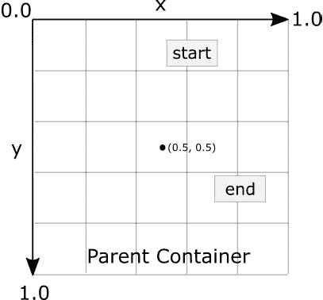
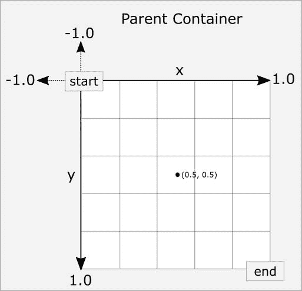
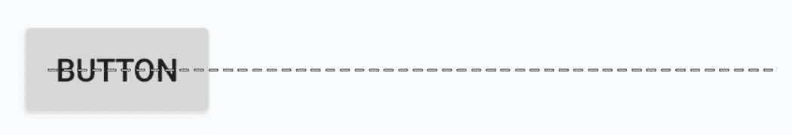
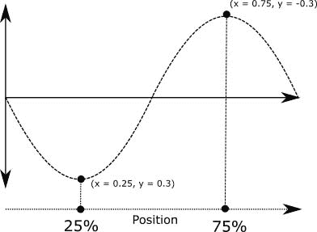

# 四十三、运动布局介绍

MotionLayout 类提供了一种简单的方法，可以将动画效果添加到用户界面布局的视图中。本章将首先概述运动布局，并介绍运动场景、过渡和关键帧的概念。一旦涵盖了这些基础知识，接下来的两章(标题为[“安卓运动布局编辑器教程”](44.html#_idTextAnchor876)和[“运动布局关键周期教程”](45.html#_idTextAnchor925))将通过创建示例项目来提供运动布局动画的更多细节和示例。

43.1 概述运动布局

MotionLayout 是一个布局容器，其主要目的是为布局内视图从一种状态到另一种状态的转换制作动画。例如，运动布局可以在指定的时间段内将 ImageView 实例的运动从屏幕左上角动画化到右下角。除了视图的位置之外，其他属性的更改也可能是动画的，例如颜色、大小或旋转角度。这些状态变化也可以进行插值(例如，视图在整个动画中移动、旋转和改变大小)。

使用运动布局的视图运动可以在两点之间的直线上执行，或者实现为沿着包括位于起点和终点之间不同位置的中间点的路径。MotionLayout 还支持使用触摸和滑动来启动和控制动画。

MotionLayout 动画完全用 XML 声明，通常不需要编写任何代码。这些 XML 声明可以在 Android Studio 代码编辑器中手动实现，也可以使用 MotionLayout 编辑器可视化实现，或者使用两种方法的组合。

43.2 运动布局

在实现动画时，通常在用户界面中使用的约束布局容器必须首先转换为运动布局实例(这一任务可以通过在布局编辑器中右键单击约束布局并选择转换为运动布局菜单选项来实现)。MotionLayout 还需要至少 2.0.0 版的 ConstraintLayout 库。

不出所料，因为它是约束布局的子类，所以运动布局支持约束布局的所有布局特性。因此，当对任何不需要动画的视图使用运动布局时，用户界面布局可以以完全相同的方式设计。

对于要设置动画的视图，声明了两个约束集，用于定义动画开始和结束时视图的外观和位置。过渡声明定义了关键帧，以在这些开始和结束状态之间对目标视图应用附加效果，以及用于开始和控制动画的点击和滑动处理程序。

开始和结束约束集以及转换都在运动场景 XML 文件中声明。

43.3 运动场景

正如我们在前面几章中看到的，一个 XML 布局文件包含了配置呈现给用户的静态视图的外观和布局行为所必需的信息，当使用 MotionLayout 时，情况仍然如此。对于非静态视图(换句话说，将被动画化的视图)，这些视图仍然在布局文件中声明，但是与这些视图相关的开始、结束和转换声明存储在一个单独的称为运动场景文件的 XML 文件中(之所以这样称呼是因为所有的声明都是在运动场景元素中定义的)。该文件导入布局 XML 文件，包含开始和结束约束集和过渡声明(单个文件可以包含多个 约束集对和过渡声明，允许不同的动画针对用户界面布局中的特定视图)。

下面的列表显示了一个运动场景文件的模板:

```java
<?xml version="1.0" encoding="utf-8"?>
<MotionScene 
    xmlns:android="http://schemas.android.com/apk/res/android"
    xmlns:motion="http://schemas.android.com/apk/res-auto">
    <Transition
        motion:constraintSetEnd="@+id/end"
        motion:constraintSetStart="@id/start"
        motion:duration="1000">
       <KeyFrameSet>
       </KeyFrameSet>
    </Transition>
    <ConstraintSet android:id="@+id/start">
    </ConstraintSet>
    <ConstraintSet android:id="@+id/end">
    </ConstraintSet>
</MotionScene>
```

在上面的 XML 中，已经声明了名为 start 和 end(尽管可以使用任何名称)的约束集，此时它们还没有包含任何约束元素。Transition 元素定义这些约束集代表动画的开始和结束点，并包含一个空的关键帧集元素，准备用附加的动画关键帧条目填充。Transition 元素还包括一个毫秒持续时间属性，用于控制动画的运行时间。

约束集不一定意味着视图的运动。例如，可以让开始集和结束集在屏幕上声明相同的位置，然后使用过渡来制作其他属性更改的动画，如缩放和旋转角度。

43.4 配置 约束集

运动场景文件中的约束集允许在定位、大小以及与父视图和其他视图的关系方面将全套约束布局设置应用于视图。此外，以下属性也可以包含在约束集声明中:

阿尔法

可见性

仰角

旋转

旋转 x

旋转

翻译

翻译

翻译

scaleX

scaleY

例如，要在动画期间将视图旋转 180°，可以在开始和结束约束中声明以下内容:

```java
<ConstraintSet android:id="@+id/start">
    <Constraint
.
.
        motion:layout_constraintStart_toStartOf="parent"
        android:rotation="0">
    </Constraint>
</ConstraintSet>
<ConstraintSet android:id="@+id/end">
    <Constraint
.
.
        motion:layout_constraintBottom_toBottomOf="parent"
        android:rotation="180">
    </Constraint>
</ConstraintSet>
```

上述更改告诉 MotionLayout，视图将从 0 开始，然后在动画期间，旋转 180 度，然后上下颠倒。

43.5 自定义属性

除了上面列出的标准属性之外，还可以指定一系列自定义属性(使用 CustomAttribute 声明)。事实上，几乎任何视图类型上可用的属性都可以被指定为动画中包含的自定义属性。要识别属性的名称，请从目标视图类的文档中找到 getter/setter 名称，删除 get/set 前缀并降低第一个剩余字符的大小写。例如，要在代码中更改按钮视图的背景色，我们可以调用 setBackgroundColor() setter 方法，如下所示:

```java
myButton.setBackgroundColor(Color.RED)
```

在约束集或关键帧中设置该属性时，属性名称将为 backgroundColor。除了属性名，还必须使用以下选项列表中的适当类型声明该值:

运动:自定义布尔-布尔属性值。

运动:自定义颜色值-颜色属性值。

运动:自定义尺寸-尺寸属性值。

运动:自定义浮点值-浮点属性值。

运动:自定义整数值-整数属性值。

运动:自定义字符串值-字符串属性值

例如，需要使用自定义颜色值类型分配颜色设置:

```java
<CustomAttribute
    motion:attributeName="backgroundColor"
    motion:customColorValue="#43CC76" />
```

例如，除了将背景颜色从绿色更改为红色之外，以下节选自 MotionScene 文件的内容还声明了视图的开始和结束约束:

```java
.
.
   <ConstraintSet android:id="@+id/start">
        <Constraint
            android:layout_width="wrap_content"
            android:layout_height="wrap_content"
            motion:layout_editor_absoluteX="21dp"
            android:id="@+id/button"
            motion:layout_constraintTop_toTopOf="parent"
            motion:layout_constraintStart_toStartOf="parent" >
            <CustomAttribute
                motion:attributeName="backgroundColor"
                motion:customColorValue="#33CC33" />
        </Constraint>
    </ConstraintSet>
    <ConstraintSet android:id="@+id/end">
        <Constraint
            android:layout_width="wrap_content"
            android:layout_height="wrap_content"
            motion:layout_editor_absoluteY="21dp"
            android:id="@+id/button"
            motion:layout_constraintEnd_toEndOf="parent"
            motion:layout_constraintBottom_toBottomOf="parent" >
            <CustomAttribute
                motion:attributeName="backgroundColor"
                motion:customColorValue="#F80A1F" />
        </Constraint>
    </ConstraintSet>
.
.
```

43.6 触发动画

如果没有某种形式的事件告诉 MotionLayout 开始动画，则 MotionScene 文件中的任何设置都不会对布局产生任何影响(除了视图将基于 start ConstraintSet 中的设置进行定位)。

动画可以配置为响应屏幕点击(【OnClick】)或滑动动作(OnSwipe)手势开始。OnClick 处理程序使动画开始并运行，直到完成，而 OnSwipe 将同步动画，使其沿着时间线来回移动，以匹配触摸动作。OnSwipe 处理程序还会对屏幕上的“投掷”动作做出响应。OnSwipe 处理程序还提供了一些选项，用于配置动画对不同方向的拖动以及滑动将锚定到的目标视图一侧的反应。例如，这允许向左拖动运动在相应的方向上移动视图，同时防止向上运动导致视图侧向移动(当然，除非这是必需的行为)。

OnSwipe 和 OnClick 声明包含在运动场景文件的 Transition 元素中。在这两种情况下，都必须指定视图 id。例如，要实现一个 OnSwipe 处理程序来响应锚定到名为 button 的视图底部边缘的向下拖动运动，可以在 Transition 元素中放置以下 XML:

```java
.
.
<Transition
    motion:constraintSetEnd="@+id/end"
    motion:constraintSetStart="@id/start"
    motion:duration="1000">
   <KeyFrameSet>
   </KeyFrameSet>
    <OnSwipe
        motion:touchAnchorId="@+id/button"
        motion:dragDirection="dragDown"
        motion:touchAnchorSide="bottom" />
</Transition>
.
.
```

或者，向同一个按钮添加 OnClick 处理程序:

```java
<OnClick motion:targetId="@id/button"
    motion:clickAction="toggle" />
```

在上面的例子中，动作被设置为切换模式。该模式和其他可用选项可以总结如下:

切换-动画到相反的状态。例如，如果视图当前位于过渡起点，它将过渡到终点，反之亦然。

跳转开始-立即切换到开始状态，不显示动画。

跳转结束-立即切换到结束状态，不显示动画。

过渡状态-动画过渡到开始状态。

过渡-从动画过渡到结束状态。

43.7 弧线运动

默认情况下，视图位置的移动将在起点和终点之间沿直线移动。要将运动更改为圆弧路径，只需在起始约束中使用如下的“路径运动圆弧”属性，该属性使用“起始水平”或“起始垂直”设置来定义圆弧是凹还是凸:

```java
<ConstraintSet android:id="@+id/start">
    <Constraint
        android:layout_width="wrap_content"
        android:layout_height="wrap_content"
        motion:layout_editor_absoluteX="21dp"
        android:id="@+id/button"
        motion:layout_constraintTop_toTopOf="parent"
        motion:layout_constraintStart_toStartOf="parent"
        motion:pathMotionArc="startVertical" >
```

[图 43-1](#_idTextAnchor862) 显示了与默认直线运动相比的开始垂直和开始水平弧:


图 43-1

43.8t1关键帧

迄今为止概述的所有约束集属性仅适用于动画的起点和终点。换句话说，如果在端点上将旋转属性设置为 180°，则动画开始时旋转将开始，到达端点时旋转将完成。因此，不可能将旋转配置为在动画全程的 50%处达到完整的 180°，然后在动画结束时旋转回原始方向。幸运的是，这种类型的效果可以使用关键帧来实现。

关键帧用于定义动画期间发生状态变化的中间点。例如，可以声明关键帧，使得视图的背景颜色在动画过程中的 50%处转换为蓝色，在 75%处转换为绿色，然后在动画结束时转换回原始颜色。关键帧在嵌入关键帧集元素的运动场景文件的过渡元素中实现。

运动布局支持几种类型的关键帧，可以总结如下:

43.8.1 属性关键帧

属性关键帧(使用“关键帧属性”声明)允许在动画时间线的中间点更改视图属性。KeyAttribute 支持上面为约束集列出的相同属性集，并能够指定动画时间线中更改生效的位置。例如，下面的“关键帧”声明将使按钮视图在水平方向(scaleX)和垂直方向(scaleY)上逐渐放大一倍，在时间线的 50%处达到最大尺寸。对于时间线的其余部分，视图的大小将减小到其原始尺寸:

```java
<Transition
    motion:constraintSetEnd="@+id/end"
    motion:constraintSetStart="@id/start"
    motion:duration="1000">
   <KeyFrameSet>
       <KeyAttribute
           motion:motionTarget="@+id/button"
           motion:framePosition="50"
           android:scaleX="2.0" />
       <KeyAttribute
           motion:motionTarget="@+id/button"
           motion:framePosition="50"
           android:scaleY="2.0" />
   </KeyFrameSet>
```

43 . 8 . 2t1T3位置关键帧

位置关键帧( 【关键位置】)用于修改视图在开始和结束位置之间移动时遵循的路径。通过在时间轴上的不同点上放置关键位置，可以将任何复杂程度的路径应用到动画中。使用 x 和 y 坐标结合过渡时间线中的相应点来声明位置。这些坐标必须相对于以下坐标系之一进行声明:

父相对-x 和 y 坐标是相对于父容器的，其中坐标被指定为百分比(表示为 0.0 到 1.0 之间的值):



图 43-2

【增量相对】-x 和 y 坐标不是相对于父坐标，而是相对于开始和结束位置。例如，起点是(0，0)终点是(1，1)。请记住，x 和 y 坐标可以是负值):



图 43-3

路径相对-X 和 y 坐标相对于路径，其中起点和终点之间的直线作为图形的 X 轴。同样，坐标以百分比(0.0 至 1.0)表示。这类似于增量相对坐标空间，但考虑了路径的角度。同样，坐标可能是负的:


图 43-4

例如，以下约束集声明了设备屏幕两侧的起点和终点。默认情况下，使用这些点的视图转换将在屏幕上沿直线移动，如图 43-5 所示:



图 43-5

然而，假设视图需要遵循类似于下面[图 43-6](#_idTextAnchor867) 所示的路径:


图 43-6

为此，关键帧位置点可以在转换中声明如下:

```java
<KeyPosition
   motion:motionTarget="@+id/button"
   motion:framePosition="25"
   motion:keyPositionType="pathRelative"
   motion:percentY="0.3"
   motion:percentX="0.25"/>
<KeyPosition
   motion:motionTarget="@+id/button"
   motion:framePosition="75"
   motion:keyPositionType="pathRelative"
   motion:percentY="-0.3"
   motion:percentX="0.75"/>
```

上述元素使用路径相对坐标系通过路径创建关键帧位置点 25%和 75%。第一个位置位于坐标(0.25，0.3)处，第二个位置位于坐标(0.75，-0.3)处。这些位置关键帧可以可视化，如下图[43-7](#_idTextAnchor868)所示:



图 43-7

43.9 时间线性

在没有任何附加设置的情况下，上述动画将以恒定速度执行。要改变动画的速度(例如，使其加速和减速)，可以在“约束集”或“关键帧”中使用“缓和过渡”属性。

对于复杂的缓和要求，可以通过在三次贝塞尔曲线上绘制点来定义线性，例如:

```java
.
.
            motion:layout_constraintBottom_toBottomOf="parent"
            motion:transitionEasing="cubic(0.2, 0.7, 0.3, 1)"
            android:rotation="360">
.
.
```

如果您不熟悉贝塞尔曲线，请考虑在线使用曲线生成器，网址如下:

[https://cubic-bezier.com/](https://cubic-bezier.com/)

但是，对于大多数要求，可以使用内置的标准加速和减速值来指定放松:

```java
.
.
            motion:layout_constraintBottom_toBottomOf="parent"
            motion:transitionEasing="decelerate"
            android:rotation="360">
.
.
```

43.10 按键触发

触发器关键帧(KeyTrigger)允许在动画到达动画时间线内的指定帧位置时调用视图上的方法。这也考虑了动画的方向。例如，根据动画是向前运行还是向后运行，可以调用不同的方法。考虑一个按钮，当动画移动超过时间线的 20%时，该按钮将变得可见。KeyTrigger 将在 Transition 元素的 KeyFrameSet 中实现，如下所示，使用 onPositiveCross 属性:

```java
.
.
    <KeyFrameSet>
           <KeyTrigger
               motion:framePosition="20"
               motion:onPositiveCross="show"
               motion:motionTarget="@id/button"/>
.
.
```

同样，如果在动画反转并降到 10%以下时隐藏同一个按钮，则可以使用 onNegativeCross 属性添加第二个关键触发器:

```java
<KeyTrigger
     motion:framePosition="20"
     motion:onNegativeCross="show"
     motion:motionTarget="@id/button2"/>
```

如果动画使用切换动作，只需使用 onCross 属性:

```java
<KeyTrigger
     motion:framePosition="20"
     motion:onCross="show"
     motion:motionTarget="@id/button2"/>
```

43.11 循环和时间循环关键帧

虽然位置关键帧可用于将中间状态变化添加到动画中，但如果需要实现大量重复的位置和变化，这将很快变得麻烦。对于需要以可预测的变化重复执行状态变化的情况，运动布局包括 周期和时间周期关键帧，这一主题将在标题为[“运动布局关键周期教程”](45.html#_idTextAnchor925)的章节中详细介绍。

43.12 从代码开始动画

到目前为止，在本章中，我们只看到了使用 OnSwipe 和 OnClick 处理程序控制动画。也可以通过调用 MotionLayout 实例上的方法从代码中启动动画。例如，对于名为 motionLayout 的布局，下面的代码以 2000 毫秒的持续时间从开始到结束运行转换:

```java
motionLayout.setTransitionDuration(2000);
motionLayout.transitionToEnd();
```

在没有添加设置的情况下，动画使用的开始和结束状态将是在运动场景文件的过渡声明中声明的状态。要使用特定的开始和结束约束集，只需在调用 MotionLayout 实例的 setTransition()方法时通过 id 引用它们:

```java
motionLayout.setTransitionDuration(2000);
motionLayout.transitionToEnd();
```

要监视动画运行时的状态，请按如下方式向 MotionLayout 实例添加一个转换侦听器:

```java
motionLayout.setTransitionListener(transitionListener);

MotionLayout.TransitionListener transitionListener = 
                        new MotionLayout.TransitionListener() {
    @Override
    public void onTransitionStarted(MotionLayout motionLayout, 
                                      int startId, int endId) {
		// Called when the transition starts
    }

    @Override
    public void onTransitionChange(MotionLayout motionLayout, int startId, 
                                      int endId, float progress) {
		// Called each time a preoperty changes. Track progress value to find 
		// current position
    }

    @Override
    public void onTransitionCompleted(MotionLayout motionLayout, int currentId) {
             // Called when the transition is complete 
    }

    @Override
    public void onTransitionTrigger(MotionLayout motionLayout, int triggerId, 
                                     boolean positive, float progress) {
		// Called when a trigger keyframe threshold is crossed
    }
};
Summary
```

MotionLayout 是 ConstraintLayout 的一个子类，专门为用户界面布局中的视图添加动画效果而设计。MotionLayout 的工作原理是通过动画显示视图在开始和结束约束集定义的两种状态之间的转换。通过使用关键帧，可以在这些起点和终点之间添加额外的动画效果。

动画可以通过 OnClick 或 OnSwipe 处理程序触发，也可以通过 MotionLayout 实例上的方法调用以编程方式触发。