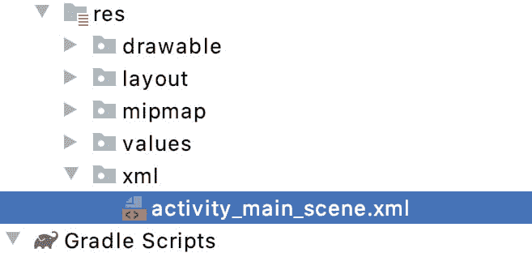
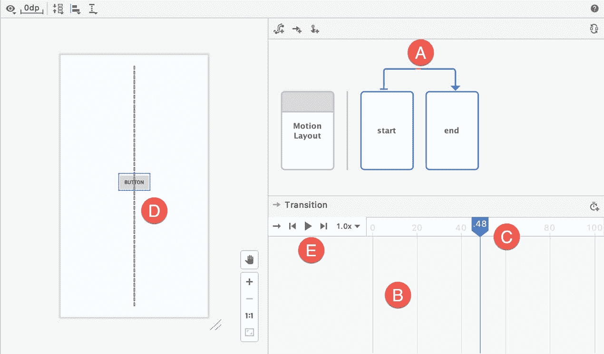
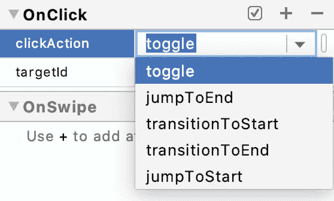
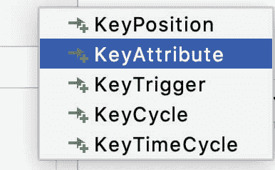
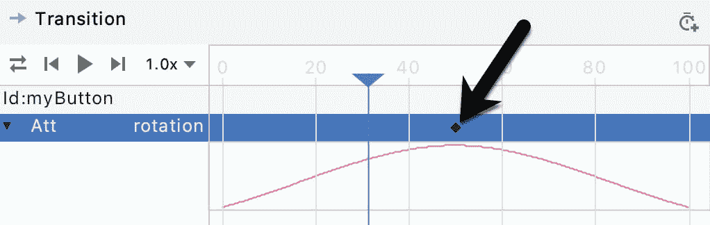
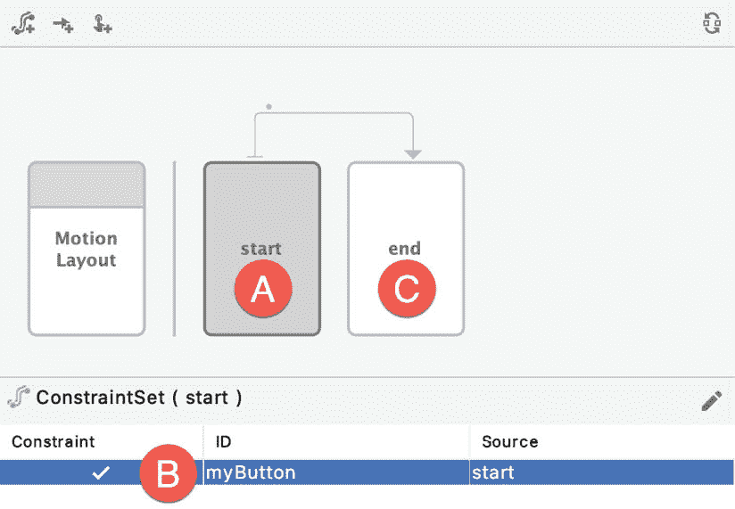
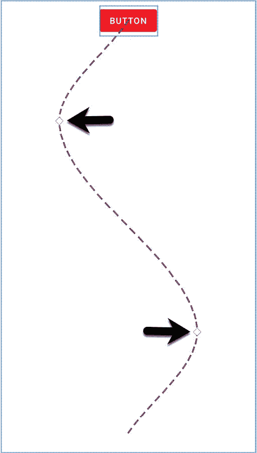
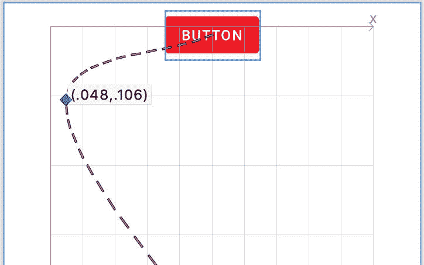

# 四十四、安卓运动布局编辑器教程

既然已经介绍了 MotionLayout 的基础知识，本章将提供一个在示例项目中尝试 MotionLayout 的机会。除了继续探索 MotionLayout 的主要特性之外，本章还将介绍 MotionLayout 编辑器，并探讨如何使用它来可视化地构建和修改 MotionLayout 动画。

本章中创建的项目将使用开始和结束约束集、手势处理程序以及属性和位置关键帧。

44.1 创建运动布局项目

从欢迎屏幕中选择创建新项目快速启动选项，并在生成的新项目对话框中选择空活动模板，然后单击下一步按钮。

在“名称”字段中输入 MotionLayoutDemo，并将 com . ebookwidge . motionlayoutemo 指定为包名。在单击完成按钮之前，将最低 API 级别设置更改为 API 26:安卓 8.0(奥利奥)，并将语言菜单更改为 Java。

44.2 约束布局到运动布局的转换

像往常一样，AndroidStudio 将在 activity_main.xml 布局文件中放置一个 ConstraintLayout 容器作为父视图。下一步是将这个容器转换成一个 MotionLayout 实例。在组件树中，右键单击约束布局条目，并选择转换为运动布局菜单选项:


图 44-1

做出选择后，单击确认对话框中的转换按钮。一旦转换完成，运动布局编辑器将出现在主 AndroidStudio 窗口中，如图[图 44-2](#_idTextAnchor880) :


图 44-2

作为转换过程的一部分，AndroidStudio 还将创建一个名为 res -> xml 的新文件夹，并在其中放置一个名为 activity_main_scene.xml 的 MotionLayout 场景文件:



图 44-3

该文件由顶层运动场景元素组成，该元素包含约束集和过渡条目，这些条目将定义要在主布局中执行的动画。默认情况下，文件将包含起始和结束约束集的空元素以及初始过渡:

```java
<?xml version="1.0" encoding="utf-8"?>
<MotionScene 
    xmlns:android="http://schemas.android.com/apk/res/android"
    xmlns:motion="http://schemas.android.com/apk/res-auto">
    <Transition
        motion:constraintSetEnd="@+id/end"
        motion:constraintSetStart="@id/start"
        motion:duration="1000">
       <KeyFrameSet>
       </KeyFrameSet>
    </Transition>
    <ConstraintSet android:id="@+id/start">
    </ConstraintSet>
    <ConstraintSet android:id="@+id/end">
    </ConstraintSet>
</MotionScene>
```

在运动布局编辑器中所做的任何更改都将存储在该文件中。同样，可以直接编辑该文件，以便在运动布局编辑器之外实现和修改动画设置。在本教程中，动画将主要使用运动布局编辑器界面来实现。然而，在每个阶段，我们将花时间回顾这些变化是如何反映在底层的运动场景文件中的。随着本章的深入，我们将会清楚地看到，MotionScene XML 语法实际上非常简单且易于学习。

本教程的第一阶段将演示如何使用运动布局来制作按钮对象的动画，包括运动(包括遵循路径)、旋转和大小缩放。

44.3 配置开始和结束约束

将 activity_main.xml 文件加载到 MotionLayout 编辑器中，确保选择了 Motion Layout 框(在下面的[图 44-5](#_idTextAnchor883) 中标记为 E)，然后在将按钮视图从调色板拖放到布局画布的左上角之前删除默认的 TextView，如图[图 44-4](#_idTextAnchor882) :


图 44-4

选择按钮后，使用属性工具窗口将 id 更改为我的按钮。

如前一章所述，运动布局动画主要是指定视图如何在两种状态之间转换。因此，实现动画的第一步是指定定义这些状态的约束。对于本例，起点将是布局视图的左上角。要配置这些约束，请在编辑器窗口中选择起始约束集条目(在[图 44-5](#_idTextAnchor883) 中标记为 A):


图 44-5

选择“起点”框后，将对起点约束集进行所有约束和布局更改。要返回到整个布局的标准约束和属性，请单击运动布局框(E)。

接下来，在约束集列表中选择我的按钮条目。请注意，“源”列显示按钮基于布局文件中的约束进行定位。相反，我们希望基于开始约束集来定位按钮。在“我的按钮”条目仍处于选中状态的情况下，单击“编辑”按钮(C)并从菜单中选择“创建约束”，之后按钮条目将指示视图将基于开始约束集进行定位:


图 44-6

开始约束集需要将按钮放置在布局顶部，偏移 8dp 并水平居中。在仍然选择“我的按钮”的情况下，使用“属性”工具窗口在视图的顶部、左侧和右侧设置约束，如下所示:


图 44-7

选择结束约束集条目(在上面的[图 44-5](#_idTextAnchor883) 中标记为 D)，并重复步骤创建新的约束，这次将按钮放在布局的水平中心，但与布局的底边有 8p 的偏移:


图 44-8

配置了开始和结束约束后，打开 activity_main_scene.xml 文件，注意约束已经添加到文件中:

```java
<?xml version="1.0" encoding="utf-8"?>
<MotionScene 
    xmlns:android="http://schemas.android.com/apk/res/android"
    xmlns:motion="http://schemas.android.com/apk/res-auto">
.
.
    <ConstraintSet android:id="@+id/start">
        <Constraint
            android:id="@+id/myButton"
            android:layout_width="wrap_content"
            android:layout_height="wrap_content"
            motion:layout_constraintTop_toTopOf="parent"
            android:layout_marginTop="8dp"
            motion:layout_constraintStart_toStartOf="parent"
            motion:layout_constraintEnd_toEndOf="parent" />
    </ConstraintSet>
    <ConstraintSet android:id="@+id/end">
        <Constraint
            android:id="@+id/myButton"
            android:layout_width="wrap_content"
            android:layout_height="wrap_content"
            motion:layout_editor_absoluteY="6dp"
            motion:layout_constraintStart_toStartOf="parent"
            motion:layout_constraintEnd_toEndOf="parent"
            motion:layout_constraintBottom_toBottomOf="parent"
            android:layout_marginBottom="8dp" />
    </ConstraintSet>
</MotionScene>
```

还要注意的是，Transition 元素已经被预先配置为在 1000 毫秒的时间段内动画化起点和终点之间的过渡。虽然我们还没有添加一个动作来启动过渡，但是仍然可以在运动布局编辑器中预览动画。

44.4 预览运动布局动画

要预览动画而不必构建和运行应用，请选择下面图 44-9 中标记为 A 的运动布局编辑器中的过渡箭头。这将显示动画时间线面板(标记为 B):



图 44-9

要测试动画，请单击滑块(C)并沿时间线拖动它。当滑块移动时，布局画布中的按钮将沿着虚线移动。使用工具栏按钮(E)执行完整的动画，以不同的速度连续重复动画(向前、向后或来回切换)。

44.5 添加点击手势

虽然已经创建了一个简单的 MotionLayout 动画过渡，但我们仍然需要一种从运行的应用中启动动画的方法。这可以通过分配点击或滑动处理程序来实现。对于本例，我们将配置动画在用户单击按钮时开始。在 MotionLayout 编辑器中，如果时间线动画当前正在循环设置中运行，首先暂停时间线动画。接下来，选择过渡箭头(在上面的[图 44-9](#_idTextAnchor885) 中标记为 A)，在属性工具窗口中找到 OnClick 属性部分，然后点击下面的[图 44-10](#_idTextAnchor887) 中箭头所指的+按钮:


图 44-10

第一个属性的 OnClick 面板中将出现一个空行。对于属性名，输入 targetId，对于值字段，输入按钮的 id(@ id/MyButton)。再次单击+按钮，这一次是在属性名称字段中输入 clickAction。在值字段中，单击向下箭头以显示有效选项的菜单:



图 44-11

对于此示例，请选择切换操作。这将导致视图在单击时动画显示到相反的位置。一旦输入这些设置，它们应该与图 44-12 中所示的相匹配:


图 44-12

再次打开 activity_main_scene.xml 文件，查看在 Transition 条目中定义的 OnClick 属性:

```java
.
.
   <Transition
        motion:constraintSetEnd="@+id/end"
        motion:constraintSetStart="@id/start"
        motion:duration="1000">
       <KeyFrameSet>
       </KeyFrameSet>
        <OnClick motion:targetId="@id/myButton"
            motion:clickAction="toggle" />
    </Transition>
.
.
```

在设备或模拟器上编译并运行应用，并确认单击按钮会使其在运动场景文件中定义的起点和终点之间来回转换。

44.6 向过渡添加属性关键帧

到目前为止，示例项目只是将按钮视图从屏幕上的一个位置移动到另一个位置。属性关键帧(关键帧属性)提供了一种方法来指定转场时间线内其他属性更改生效的点。例如，可以定义一个关键点属性，使得当视图在时间线中移动 30%时，视图的大小必须增加 50%。对于这个例子，我们将在动画的中点添加一个旋转效果。

首先在 MotionLayout 编辑器中打开 activity_main.xml 文件，选择过渡连接线箭头显示时间轴，然后点击[图 44-13](#_idTextAnchor891) 中高亮显示的按钮:


图 44-13

从菜单中，选择“关键点属性”选项:



图 44-14

一旦选择，将出现如图 44-15 所示的对话框。在对话框中，确保选择了标识选项并且引用了我的按钮。在位置字段中，输入 50(指定为百分比，其中 0 为起点，100 为终点)。最后，在单击添加按钮之前，从属性下拉菜单中选择旋转条目:


图 44-15

添加关键帧属性后，属性的时间线内将出现一行。单击该行将其高亮显示，然后单击该行最左边的显示箭头以展开属性转换图。请注意，时间线中会出现一个小菱形标记(如下图[图 44-16](#_idTextAnchor894) 所示)，指示按键的位置。该图显示了效果的线性。在这种情况下，按钮将稳定地旋转到指定的度数，在关键帧的位置达到最大旋转。当按钮到达终点时，它将旋转回 0 度:



图 44-16

要更改关键帧属性的属性，请在时间线中选择它，然后参考属性工具窗口。在“关键点属性”面板中，将“旋转”属性更改为 360 度:


图 44-17

通过前后移动滑块并观察按钮在布局画布中穿过动画路径时的旋转，检查属性是否有效。参考 activity_main_scene.xml 文件，现在应该如下所示:

```java
.
.
   <Transition
        motion:constraintSetEnd="@+id/end"
        motion:constraintSetStart="@id/start"
        motion:duration="1000">
       <KeyFrameSet>
           <KeyAttribute
               motion:motionTarget="@+id/myButton"
               motion:framePosition="50"
               android:rotation="360" />
       </KeyFrameSet>
        <OnClick motion:targetId="@id/myButton"
            motion:clickAction="toggle" />
    </Transition>
.
.
```

测试动画，或者使用过渡滑块，或者编译并运行应用，并验证按钮现在在动画期间旋转。

44.7 向过渡添加自定义属性

KeyAttribute 属性仅限于内置效果，如调整大小和旋转。通过声明 CustomAttributes，还可以进行其他更改。与存储在过渡元素中的关键点属性不同，自定义属性位于开始和结束约束集中。因此，这些属性只能声明为在起点和终点生效(换句话说，您不能在过渡时间线中途的某个位置指定属性关键帧)。

对于本例，我们将配置按钮，使其颜色从红色逐渐变为绿色。首先选择图 44-18 中标记为 A 的开始框，然后选择我的按钮视图约束集(B):



图 44-18

参考属性工具窗口，点击自定义属性部分的+按钮，如下图所示:


图 44-19

在结果对话框中([图 44-20](#_idTextAnchor899) )将属性类型更改为颜色，并在属性名称字段中输入背景颜色。最后，将该值设置为#F80A1F:


图 44-20

单击确定提交更改，然后选择结束约束集(在上面的[图 44-18](#_idTextAnchor897) 中标记为 C)，并重复步骤添加自定义属性，这次指定#33CC33 作为颜色的 RGB 值。

使用时间线滑块或运行应用，确保按钮在动画过程中改变颜色。

这些自定义属性的添加将反映在 activity_main_scene.xml 文件中，如下所示:

```java
.
.
   <ConstraintSet android:id="@+id/start">
        <Constraint
.
.
            <CustomAttribute
                motion:attributeName="backgroundColor"
                motion:customColorValue="#F80A1F" />
        </Constraint>
    </ConstraintSet>
    <ConstraintSet android:id="@+id/end">
        <Constraint
.
.
            <CustomAttribute
                motion:attributeName="backgroundColor"
                motion:customColorValue="#33CC33" />
        </Constraint>
    </ConstraintSet>
.
.
```

44.8 添加位置关键帧

本教程的最后一个任务是向动画路径添加两个位置关键帧(关键位置)，以便在动画中引入一些横向移动。在运动布局编辑器中过渡时间线可见的情况下，点击按钮创建一个关键帧，如上面的[图 44-13](#_idTextAnchor891) 所示，并从菜单中选择关键位置选项，如下图[图 44-21](#_idTextAnchor901) 所示:


图 44-21

在生成的对话框中，设置属性，如图 44-22 所示:


图 44-22

单击添加按钮提交更改，然后重复上述步骤添加第二个位置关键帧，配置如下:

位置:75

类型:相关

百分比:0.85

百分比:0.75

完成这些更改后，以下关键帧条目将被添加到 activity_main_scene.xml 文件的过渡元素中:

```java
<KeyFrameSet>
.
.
   <KeyPosition
       motion:motionTarget="@+id/myButton"
       motion:framePosition="25"
       motion:keyPositionType="parentRelative"
       motion:percentX="0.15"
       motion:percentY="0.25" />
   <KeyPosition
       motion:motionTarget="@+id/myButton"
       motion:framePosition="75"
       motion:keyPositionType="parentRelative"
       motion:percentX="0.85"
       motion:percentY="0.75" />
</KeyFrameSet>
.
.
```

最后测试应用一次，并验证按钮现在是否遵循下面显示的路径，同时仍然旋转和改变颜色:


图 44-23

位置关键帧由代表预览画布内运动路径的虚线上的菱形标记表示，如图 44-24 所示(如果标记不可见，请确保在预览中选择了按钮视图):



图 44-24

要在视觉上调整关键帧的位置，只需单击标记并将其拖到新位置。随着标记的移动，运动布局编辑器将显示一个网格以及当前的 x 和 y 坐标:



图 44-25

44.9 总结

本章介绍了 AndroidStudio 内置的运动布局编辑器，并探讨了如何使用它向安卓应用的用户界面添加动画，而无需手动编写 XML 声明。本章涉及的示例包括将约束布局容器转换为运动布局，在运动场景文件中创建开始和结束约束集和转换，以及添加 OnClick 处理程序。动画预览器的使用，自定义属性和关键帧的位置也包括在内。