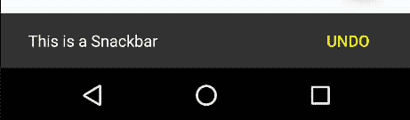
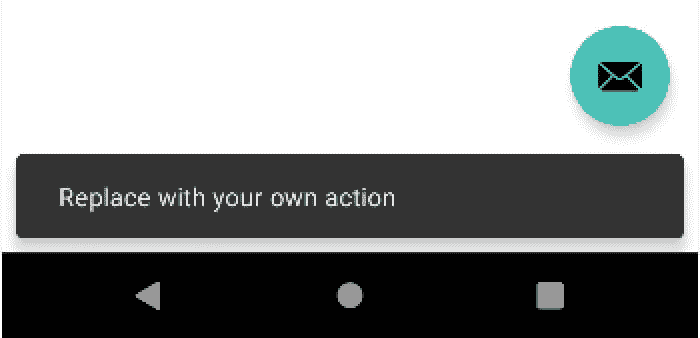
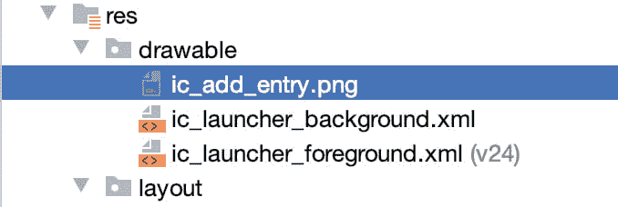
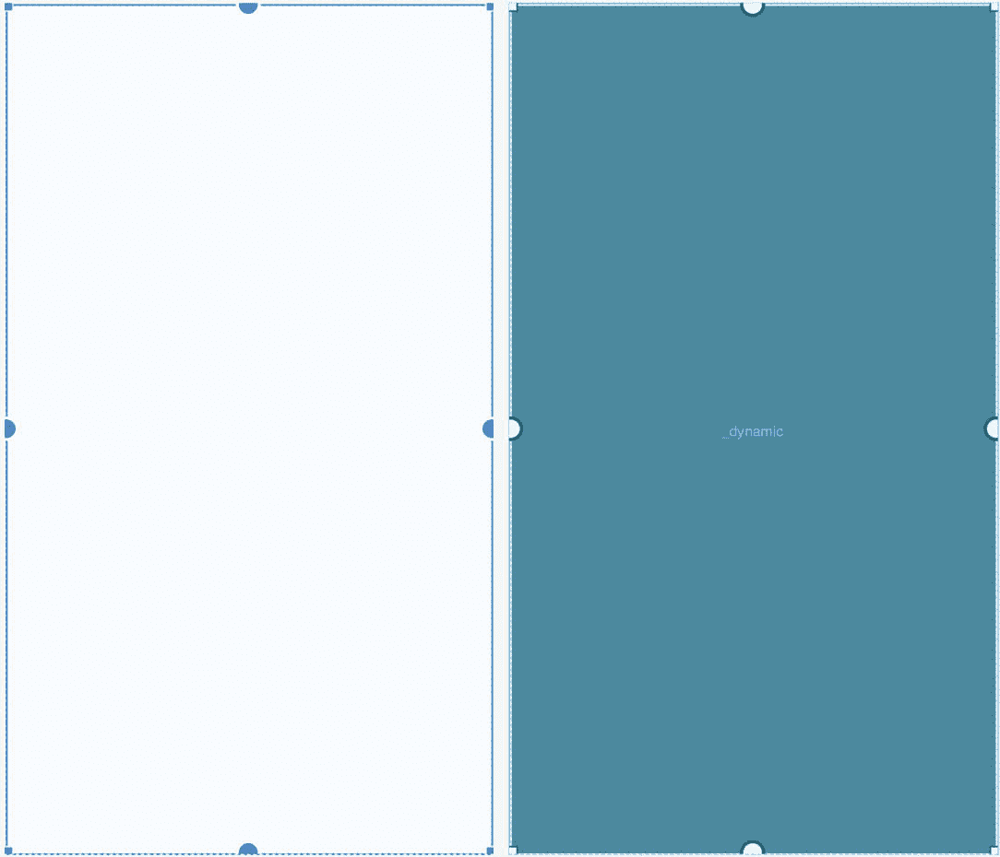
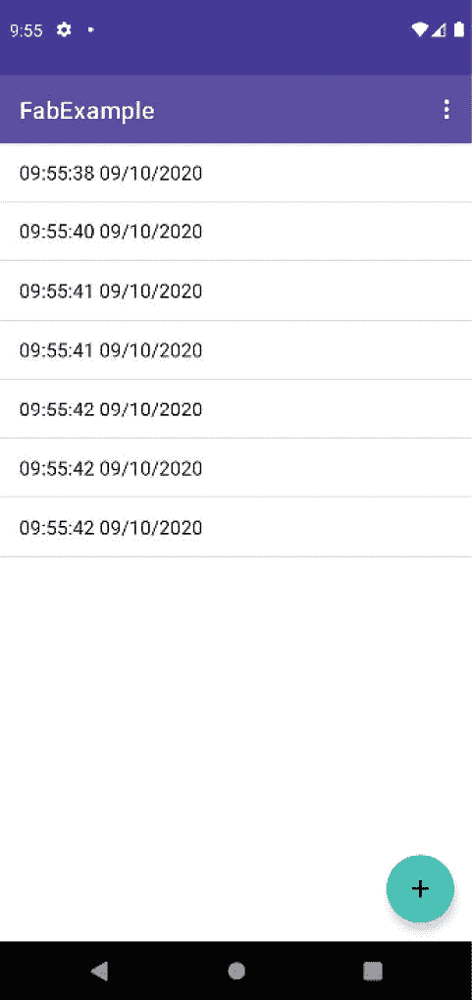
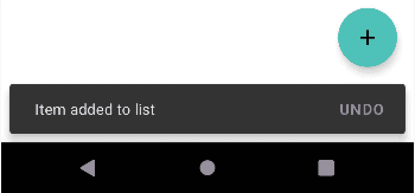

46\. 使用浮动动作按钮和 Snackbar

本章的目标之一是概述材料设计的概念。最初是作为安卓 5.0 的一部分引入的，材质设计是一套设计准则，规定了安卓用户界面以及运行在安卓上的应用程序的外观和行为。

作为材料设计概念实施的一部分，谷歌还推出了安卓设计支持库。该库包含许多不同的组件，允许将材料设计的许多关键特性内置到安卓应用程序中。其中两个组件，浮动动作按钮和 Snackbar ，也将在本章中介绍，然后在后续章节中介绍许多其他组件。

46.1 材料设计

安卓环境的整体外观由材质设计原则定义。材质设计由谷歌的安卓团队创建，规定构成安卓用户界面的元素以及运行在其上的应用程序在行为、阴影、动画和风格方面以某种方式出现和表现。材料设计的原则之一是，用户界面的元素看起来有物理深度，并且感觉项目是用物理材料层构建的。例如，通过使用阴影效果，一个按钮看起来被提升到它所在布局的表面之上。按下按钮会导致按钮弯曲和抬起，就像由一种薄材料制成，释放时会产生波纹。

材料设计还规定了许多标准用户界面元素的布局和行为。一个关键的例子是位于屏幕顶部的应用程序栏的显示方式，以及它在活动的主要内容中滚动活动时的行为方式。

事实上，材质设计涵盖了广泛的领域，从推荐的颜色样式到对象的动画制作方式。材料设计概念和指南的完整描述可在以下链接在线找到，建议所有安卓开发者阅读:

[https://www . Google . com/design/spec/material-design/introduction . html](https://www.google.com/design/spec/material-design/introduction.html)

46.2 设计库

实现采用材料设计原则的安卓应用程序所需的许多构件都包含在安卓设计支持库中。该库包含一组用户界面组件，可以包含在安卓应用程序中，以实现材料设计的大部分外观、感觉和行为。本章将介绍这个库中的两个组件，浮动操作按钮和 Snackbar，其他组件将在后面的章节中介绍。

46.3 浮动动作按钮(FAB)

浮动动作按钮是一个看起来浮动在应用程序用户界面表面上方的按钮，通常用于促进用户界面屏幕内最常见的动作。例如，可以在屏幕上放置一个浮动操作按钮，允许用户在联系人列表中添加条目或从应用程序中发送电子邮件。[例如，图 46-1](#_idTextAnchor932) 突出显示了浮动动作按钮，该按钮允许用户在标准安卓联系人 ap p 中添加新联系人:


图 46-1

为了符合材料设计准则，在使用浮动动作按钮时应遵循许多规则。浮动动作按钮 必须是圆形的，大小可以是 56 x 56dp(默认)或 40 x 40dp(迷你)。在手机上，该按钮应位于离屏幕边缘至少 16dp 的位置，在台式机和平板设备上应为 24dp。无论大小如何，按钮必须包含一个 24x24dp 大小的内部图标，建议每个用户界面屏幕只有一个浮动操作按钮。

浮动动作按钮可以是动画的，也可以设计成在触摸时变形为其他项目。例如，浮动动作按钮可以在轻击时旋转，或者变形为另一个元素，例如列出相关动作的工具栏或面板。

46.4 蛇形杆

Snackbar 组件提供了一种以面板形式向用户呈现信息的方式，该面板出现在屏幕底部，如图 46-2 所示。Snackbar 实例包含一条简短的文本消息和一个可选的操作按钮，当用户点击该按钮时，该按钮将执行一项任务。一旦显示，Snackbar 将自动超时，或者可以由用户通过滑动操作手动移除。在 Snackbar 出现期间，应用程序将继续运行，并以正常的 ma 模式响应用户交互。



图 46-2

在本章的剩余部分，将创建一个示例应用程序，该应用程序利用浮动操作按钮和 Snackbar 的基本功能向项目列表添加条目。

46.5 创建示例项目

从欢迎屏幕中选择创建新项目快速启动选项，并在生成的新项目对话框中选择基本活动模板，然后单击下一步按钮。

在“名称”字段中输入 FabExample，并将 com . ebookwidge . fab example 指定为包名。在单击完成按钮之前，将最低应用编程接口级别设置更改为应用编程接口 26:安卓 8.0(奥利奥)，并将语言菜单更改为 Java。

46.6 项目评审

由于选择了基本活动模板，该活动包含四个布局文件。activity_main.xml 文件包含一个 CoordinatorLayout 管理器，其中包含应用程序栏、工具栏和浮动操作按钮的条目。

content_main.xml 文件表示活动内容区域的布局，并包含一个 NavHostFragment 实例。该文件通过以下 include 指令嵌入到 activity_main.xml 文件中:

```java
<include layout="@layout/content_main" />
```

activity_main.xml 文件中的浮动操作按钮元素如下所示:

```java
<com.google.android.material.floatingactionbutton.FloatingActionButton
    android:id="@+id/fab"
    android:layout_width="wrap_content"
    android:layout_height="wrap_content"
    android:layout_gravity="bottom|end"
    android:layout_margin="@dimen/fab_margin"
    app:srcCompat="@android:drawable/ic_dialog_email" />
```

这表明该按钮将出现在屏幕的右下角，其边距由 values/dimens.xml 文件中的 fab_margin 标识符表示(在本例中该标识符设置为 16dp)。XML 进一步声明按钮的内部图标采用标准的可绘制内置电子邮件图标的形式。

空白模板还配置了浮动操作按钮，以便在用户点击时显示 Snackbar 实例。实现这一点的代码可以在 MainActivity.java 文件的 onCreate()方法中找到，内容如下:

```java
FloatingActionButton fab = 
              findViewById(R.id.fab);

fab.setOnClickListener(new View.OnClickListener() {
    @Override
    public void onClick(View view) {
        Snackbar.make(view, "Replace with your own action", 
              Snackbar.LENGTH_LONG)
                .setAction("Action", null).show();
    }
});
```

代码通过按钮的标识获取对浮动操作按钮的引用，并向其中添加一个 onClickListener 处理程序，当点击按钮时将调用该处理程序。这个方法只是显示一个配置了消息但没有操作的 Snackbar 实例。

项目编译运行后，屏幕底部会出现浮动动作按钮，如图[图 46-3](#_idTextAnchor939) :


图 46-3

轻按浮动操作按钮将触发 onClickListener 处理程序方法，使 Snackbar 出现在 sc 屏幕的底部:



图 46-4

当挡水条出现在较窄的设备上时(如上图 46-4 中的情况)，注意浮动动作按钮向上移动，为挡水条的出现留出空间。这由 activity_main.xml 布局资源文件中的 CoordinatorLayout 容器自动为我们处理。

46.7 移除导航功能

如[“安卓工作室布局编辑器工具指南”](17.html#_idTextAnchor332)所述，基本活动模板包含多个片段和按钮，用于从一个片段导航到另一个片段。就本教程而言，这些功能是不必要的，如果不删除，将在以后引起问题。在继续学习教程之前，请按如下方式修改项目:

1.在项目工具窗口中，导航并双击 app-> RES-> navigation-> nav _ graph . XML 文件，将其加载到导航编辑器中。

2.在编辑器中，选择“组件树”面板中的第二个片段条目，并点击键盘上的删除键将其从图表中删除。

3.找到并删除 SecondFragment.java(app-> Java->第二片段)和片段 _ 秒. xml (app -> res ->布局->片段 _ 秒. xml)文件。

4.找到 FirstFragment.java 文件，双击它将其加载到编辑器中，并从 onViewCreated()方法中删除代码，使其如下所示:

```java
public void onViewCreated(@NonNull View view, Bundle savedInstanceState) {
    super.onViewCreated(view, savedInstanceState);

    view.findViewById(R.id.button_first).setOnClickListener(new View.OnClickListener() {
        @Override
        public void onClick(View view) {
            NavHostFragment.findNavController(FirstFragment.this)
                    .navigate(R.id.action_FirstFragment_to_SecondFragment);
        }
    });
}
```

46.8 改变浮动动作按钮

由于此示例的目的是配置浮动操作按钮以向列表添加条目，因此需要将按钮上当前显示的电子邮件图标更改为更能指示正在执行的操作的内容。将用于按钮的图标名为 ic_add_entry.png，可在示例代码下载的 project_icons 文件夹中找到，该文件夹可从以下网址获得:

[https://www . ebookwidge . com/retail/androidstudio 41/index . PHP](https://www.ebookfrenzy.com/retail/androidstudio41/index.php)

在操作系统的文件系统导航器中找到该映像，并复制该映像文件。右键单击项目工具窗口中的应用程序->资源->可绘制条目，并从菜单中选择粘贴以将文件添加到文件夹:



图 46-5

接下来，编辑 activity_main.xml 文件，并将图标的图像来源从@ Android:draw able/IC _ dialog _ email 更改为@drawable/ic_add_entry，如下所示:

```java
<com.google.android.material.floatingactionbutton.FloatingActionButton
    android:id="@+id/fab"
    android:layout_width="wrap_content"
    android:layout_height="wrap_content"
    android:layout_gravity="bottom|end"
    android:layout_margin="@dimen/fab_margin"
    app:srcCompat="@drawable/ic_add_entry" />
```

在布局预览中，按钮的内部图标将变为加号。

46.9 将列表视图添加到内容布局

本教程的下一步是将 ListView 实例添加到 fragment_first.xml 文件中。ListView 类提供了一种以列表格式显示项目的方法，可以在布局编辑器工具选项板的“遗留”部分找到。

将 fragment_first.xml 文件加载到布局编辑器工具中，如有必要，选择设计模式，并选择和删除默认的文本视图和按钮对象。在调色板的“遗留”类别中找到列表视图对象，并在启用自动连接模式的情况下，将其拖放到布局画布的中心。选择列表视图对象，并在属性工具窗口中将标识更改为列表视图。布局编辑器应该调整列表视图的大小以填充整个容器，但可能没有应用任何约束。点击“推断约束”按钮，添加缺少的约束，此时布局将出现，如图 46-6 所示:



图 46-6

选择列表视图对象后，使用属性工具窗口将布局宽度和布局高度属性设置为 0dp(匹配约束)。

46.10 向列表视图添加项目

每次用户点击浮动操作按钮时，一个新项目将以当前时间和日期的形式添加到列表视图中。为此，需要对 MainActivity.java 文件进行一些更改。

首先实现 onStart()方法，获取对 ListView 实例的引用，并初始化一个适配器实例，以允许我们以数组的形式向列表中添加项目:

```java
import android.os.Bundle;
import com.google.android.material.floatingactionbutton.FloatingActionButton;
import com.google.android.material.snackbar.Snackbar;
import androidx.appcompat.app.AppCompatActivity;
import androidx.appcompat.widget.Toolbar;
import android.view.View;
import android.view.Menu;
import android.view.MenuItem;
import android.widget.ArrayAdapter;
import android.widget.ListView;

import java.util.ArrayList;

public class MainActivity extends AppCompatActivity {

    ArrayList<String> listItems = new ArrayList<String>();
    ArrayAdapter<String> adapter;
    private ListView myListView;
.
.
    @Override
    protected void onStart() {
        super.onStart();
        myListView = findViewById(R.id.listView);

        adapter = new ArrayAdapter<String>(this,
                android.R.layout.simple_list_item_1,
                listItems);
        myListView.setAdapter(adapter);
    }
.
.
}
```

请注意，这里使用的是 onStart()生命周期方法，而不是通常的 onCreate()方法。这是因为包含 ListView 对象的片段在调用 onCreate()方法时不会被初始化，导致应用程序崩溃。

ListView 需要一个要显示的项目数组，一个管理该数组中项目的适配器，以及一个布局定义来规定如何向用户显示项目。

在上面的代码更改中，这些项存储在分配给采用 ArrayAdapter 形式的适配器的 ArrayList 实例中。添加到列表中的项目将使用 simple_list_item_1 布局显示在列表视图中，这是安卓提供的内置布局，用于在列表视图实例中显示基于简单字符串的项目。

接下来，编辑浮动操作按钮的 onClickListener 代码，以在 Snackbar 中显示不同的消息，并调用一个方法向列表中添加一个项目:

```java
FloatingActionButton fab = findViewById(R.id.fab);

fab.setOnClickListener(new View.OnClickListener() {
    @Override
    public void onClick(View view) {
        addListItem();
        Snackbar.make(view, "Item added to list", 
              Snackbar.LENGTH_LONG)
                .setAction("Action", null).show();

    }
});
```

保留在 MainActivity.java 文件中，添加 addListItem()方法，如下所示:

```java
package com.ebookfrenzy.fabexample;
.
.
import java.text.SimpleDateFormat;
import java.util.Date;
import java.util.Locale;

public class MainActivity extends AppCompatActivity {
.
.
    private void addListItem() {
        SimpleDateFormat dateformat =
                new SimpleDateFormat("HH:mm:ss MM/dd/yyyy",
                        Locale.US);
        listItems.add(dateformat.format(new Date()));
        adapter.notifyDataSetChanged();
    }
.
.
}
```

addListItem()方法中的代码标识并格式化当前日期和时间，并将其添加到列表项数组中。然后，分配给列表视图的数组适配器被通知列表数据已经改变，导致列表视图更新以显示最新的列表项目。

编译并运行该应用程序，并测试点击浮动动作按钮会在列表视图中添加新的时间和日期条目，每次显示 Snackbar，如图[图 46-7](#_idTextAnchor947) :



图 46-7

46.11 向 Snackbar 添加动作

这个项目的最后一个任务是向 Snackbar 添加一个动作，允许用户撤销列表中最近的添加。编辑 MainActivity.java 文件并修改 Snackbar 创建代码，以添加一个名为“撤消”的操作，该操作使用名为“撤消”的 onClickListener 进行配置:

```java
fab.setOnClickListener(new View.OnClickListener() {
    @Override
    public void onClick(View view) {
        addListItem();
        Snackbar.make(view, "Item added to list", 
              Snackbar.LENGTH_LONG)
                .setAction("Undo", undoOnClickListener).show();

    }
});
```

在 MainActivity.java 文件中添加监听器处理程序:

```java
View.OnClickListener undoOnClickListener = new View.OnClickListener() {
    @Override
    public void onClick(View view) {
        listItems.remove(listItems.size() -1);
        adapter.notifyDataSetChanged();
        Snackbar.make(view, "Item removed", Snackbar.LENGTH_LONG)
                .setAction("Action", null).show();
    }
};
```

onClick 方法中的代码标识列表数组中最后一项的位置，并在触发列表视图执行更新之前将其从列表中移除。然后会显示一个新的 Snackbar，指示最后一个项目已从列表中删除。

再次运行该应用程序，并向列表中添加一些项目。最后添加时，点击 Snackbar 中的撤销按钮([图 46-8](#_idTextAnchor950) )从列表中移除最后一项:



图 46-8

还值得注意的是，“撤消”按钮使用本章前面通过主题编辑器分配给“强调颜色”属性的相同颜色显示。

46.12 总结

本章提供了材料设计、浮动动作按钮和 Snackbar 的一般概述，然后介绍了一个使用这些功能的示例项目。

浮动动作按钮和 Snackbar 都是安卓用户界面实现的素材设计方法的一部分。浮动操作按钮提供了一种在安卓应用程序的特定屏幕内提升最常见操作的方式。Snackbar 为应用程序提供了一种既向用户呈现信息又允许用户对其采取行动的方式。