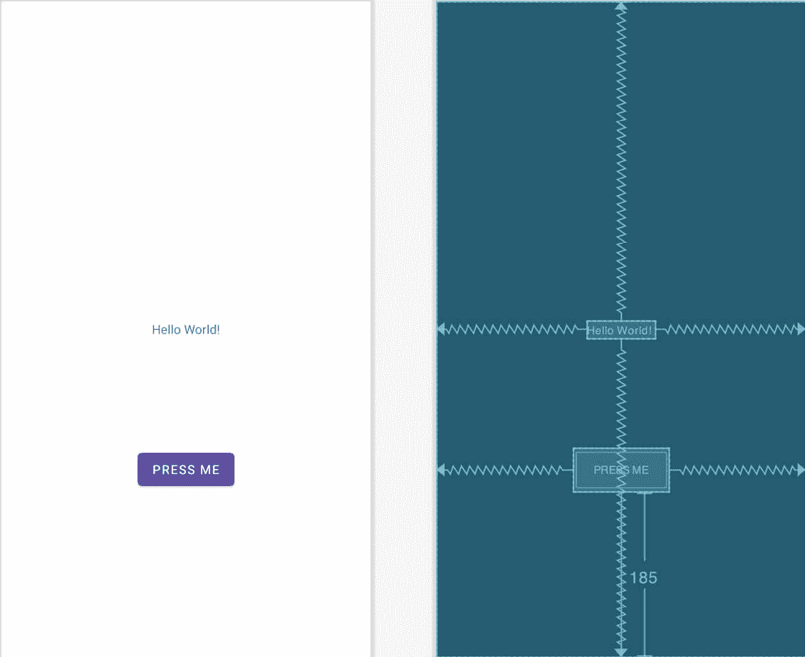
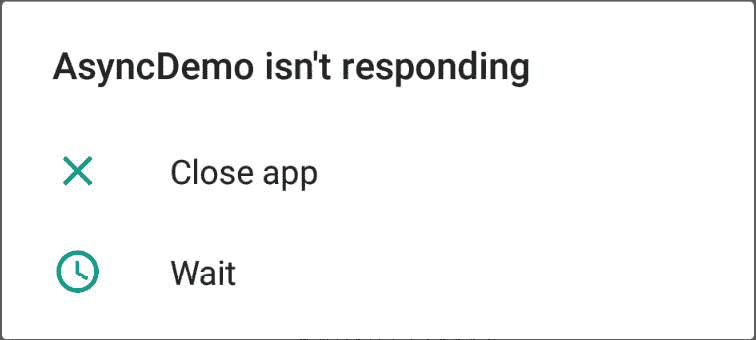

# 五十七、线程和异步任务的基本概述

下一章将是旨在介绍在后台使用安卓服务执行应用任务的一系列章节中的第一章。然而，如果不首先对安卓应用中的线程概念有一个基本的了解，就不可能理解实现服务所涉及的步骤。因此，线程和异步任务类是本章的主题。

57.1 螺纹概述

线程是任何多任务操作系统的基石，可以被认为是在主进程中运行的小进程，其目的是使应用中至少出现并行执行路径。

57.2 应用主螺纹

当安卓应用首次启动时，运行时系统会创建一个线程，默认情况下，所有应用组件都将在该线程中运行。这个线程通常被称为主线程。主线程的主要作用是根据事件处理和与用户界面中视图的交互来处理用户界面。默认情况下，应用中启动的任何附加组件也将在主线程上运行。

应用中使用主线程执行耗时任务的任何组件都会导致整个应用看起来锁定，直到任务完成。这通常会导致操作系统向用户显示“应用没有响应”警告。显然，这远不是任何应用所期望的行为。这可以简单地通过在单独的线程中启动要执行的任务来避免，允许主线程不受阻碍地继续执行其他任务。

57.3 螺纹处理器

显然，安卓开发的一个关键规则是永远不要在应用的主线程上执行耗时的操作。第二个同样重要的规则是，在任何情况下，独立线程中的代码都不能直接更新用户界面的任何方面。对用户界面的任何更改必须始终在主线程中执行。原因是安卓 UI 工具包不是线程安全的。试图在多个线程中使用非线程安全代码通常会导致间歇性问题和不可预测的应用行为。

如果一个耗时的任务需要在后台线程中运行并更新用户界面，最好的方法是通过子类化 AsyncTask 类来实现一个异步任务。

57.4 一个基本异步任务示例

本章的剩余部分将通过一些例子来介绍线程和 AsyncTask 类的使用。第一步是强调在独立于主线程的线程中执行耗时任务的重要性。

从欢迎屏幕中选择创建新项目快速启动选项，并在生成的新项目对话框中选择空活动模板，然后单击下一步按钮。

在名称字段中输入 AsyncDemo，并指定 com . ebookwidge . async demo 作为包名。在单击完成按钮之前，将最低应用编程接口级别设置更改为应用编程接口 26:安卓 8.0(奥利奥)，并将语言菜单更改为 Java。

将项目的 activity_main.xml 文件加载到布局编辑器工具中。选择默认的文本视图组件，并在属性工具窗口中将视图的标识更改为我的文本视图。

向用户界面添加一个按钮视图，位于现有文本视图对象的正下方，如图 57-1 所示。添加按钮后，单击工具栏中的“推断约束”按钮添加任何缺失的约束。

将文本更改为“按我”，并将字符串提取到名为“按我”的资源中。在布局中仍然选择按钮视图的情况下，找到 onClick 属性，并输入 buttonClick 作为方法 na me。



图 57-1

接下来，将 MainActivity.java 文件加载到编辑面板中，并添加代码来实现 buttonClick()方法，当用户触摸 Button 视图时，将调用该方法。因为这里的目标是演示在主线程上执行冗长任务的问题，所以代码将简单地暂停 20 秒，然后在 TextView 对象上显示不同的文本:

```java
package com.ebookfrenzy.asyncdemo;

import androidx.appcompat.app.AppCompatActivity;
import android.os.Bundle;
import android.view.View;
import android.widget.TextView;

public class MainActivity extends AppCompatActivity {

    private TextView myTextView;

    @Override
    protected void onCreate(Bundle savedInstanceState) {
        super.onCreate(savedInstanceState);
        setContentView(R.layout.activity_main);

        myTextView = findViewById(R.id.myTextView);
    }

    public void buttonClick(View view)
    {
        int i = 0;
        while (i <= 20) {
            try {
                Thread.sleep(1000);
                i++;
            }
            catch (Exception e) {
            }
        }
        myTextView.setText("Button Pressed");
    }
}
```

代码更改完成后，在物理设备或模拟器上运行应用。应用运行后，轻触按钮，此时应用会冻结。例如，第二次触摸按钮是不可能的，在某些情况下，操作系统会报告应用没有响应，如图 57-2 所示 ve:



图 57-2

显然，在 buttonClick()方法中需要花费时间来完成的任何事情都需要在单独的线程中执行。

57.5 亚类 AsyncTask

为了创建一个新的线程，要在该线程中执行的代码需要在一个异步任务实例中执行。第一步是在 MainActivity.java 文件中将 AsyncTask 子类化，如下所示:

```java
.
.
import android.os.AsyncTask;
.
.
public class MainActivity extends AppCompatActivity {
.
.
    private class MyTask extends AsyncTask<String, Void, String> {

        @Override
        protected void onPreExecute() {
        }

        @Override
        protected String doInBackground(String... params) {
        }

        @Override
        protected void onProgressUpdate(Void... values) {
        }

        @Override
        protected void onPostExecute(String result) {
        }
    }
.
.
}
```

AsyncTask 类使用三种不同的类型，它们在类签名行中声明如下:

```java
private class MyTask extends AsyncTask<Type 1, Type 2, Type 3> {
.
.
```

这三种类型分别对应于 doInBackground()、onProgressUpdate()和 onPostExecute()方法的参数类型。如果一个方法不需要参数，那么就使用 Void，就像上面代码中的 onProgressUpdate()一样。若要更改方法的参数类型，请更改类声明和方法签名中的类型声明。在本例中，onProgressUpdate()方法将被传递一个整数，因此按如下方式修改类声明:

```java
private class MyTask extends AsyncTask<String, Integer, String> {
.
.
        @Override
        protected void onProgressUpdate(Integer... values) {
        }
.
.
}
```

onPreExecute()方法在启动后台任务之前调用，可用于执行初始化步骤。这个方法在主线程上运行，因此可以用来更新用户界面。

要在后台与主线程不同的线程上执行的代码驻留在 doInBackground()方法中。此方法没有访问主线程的权限，因此无法更改用户界面。但是，每次从 doInBackground()方法中调用 publishProgress()方法时，都会调用 onProgressUpdate()方法，该方法可用于使用进度信息更新用户界面。

当 doInBackground()方法中执行的任务完成时，调用 onPostExecute()方法。这个方法被传递由 doInBackground()方法返回的值，并在主线程中运行，允许进行用户界面更新。

修改代码，将计时器代码从 buttonClick()方法移到 doInBackground()方法，如下所示:

```java
@Override
protected String doInBackground(String... params) {

    int i = 0;
    while (i <= 20) {
        try {
            Thread.sleep(1000);
            i++;
        }
        catch (Exception e) {
            return(e.getLocalizedMessage());
        }
    }
    return "Button Pressed";
}
```

接下来，将 TextView 更新代码移动到 onPostExecute()方法，它将显示 doInBackground()方法返回的文本:

```java
@Override
protected void onPostExecute(String result) {
    myTextView.setText(result);
}
```

若要通过 doInBackground()方法提供定期更新，请修改类，以在计时器循环代码中添加对 publishProgress()方法的调用(通过当前循环计数器)，并在 onProgressUpdate()方法中显示当前计数值:

```java
@Override
protected String doInBackground(String... params) {
    int i = 0;
    while (i <= 20) {
        publishProgress(i);
        try {
            Thread.sleep(1000);
            i++;
        }
        catch (Exception e) {
            return(e.getLocalizedMessage());
        }
    }
    return "Button Pressed";
}
@Override
protected void onProgressUpdate(Integer... values) {
    myTextView.setText("Counter = " + values[0]);
}
```

最后，修改 buttonClicked()方法以开始异步任务执行:

```java
public void buttonClick(View view)
{
    AsyncTask task = new MyTask().execute();
}
```

默认情况下，异步任务是串行执行的。换句话说，如果一个应用执行多个任务，只有第一个任务开始执行。剩余的任务被放在队列中，并在每个任务完成时按顺序执行。要并行执行异步任务，必须使用异步任务线程池执行器执行这些任务，如下所示:

```java
AsyncTask task = new 
        MyTask().executeOnExecutor(AsyncTask.THREAD_POOL_EXECUTOR);
```

使用这种方法可以并行执行的任务数量受到设备上内核池大小的限制，而内核池大小又受到可用 CPU 内核数量的限制。可以使用以下代码从应用中识别设备上可用的 CPU 内核数量:

```java
int cpu_cores = Runtime.getRuntime().availableProcessors();
```

Android 使用一种算法来计算池线程的默认数量。最小线程数为 2，而最大默认值等于 4 或 CPU 内核数减 1(以最小者为准)。任何设备上池可用的最大可能线程数是通过将 CPU 内核数增加一倍并再增加一个来计算的。

57.6 测试应用

当应用正在运行时，触摸按钮会导致在新线程中执行延迟，从而离开主线程继续处理用户界面，包括响应额外的按钮按压。在延迟期间，用户界面将每秒更新一次，显示计数器值。超时完成后，文本视图将显示“按钮已按下”消息。

57.7 取消任务

可以通过调用任务对象的 cancel()方法来取消正在运行的任务，方法是传递一个布尔值，该值指示在正在进行的任务完成之前是否可以中断该任务:

```java
AsyncTask task = new MyTask().execute();
task.cancel(true);
```

57.8 总结

本章概述了安卓应用中的线程。当应用在进程中首次启动时，运行时系统会创建一个主线程，默认情况下，所有随后启动的应用组件都会在该主线程中运行。主线程的主要作用是处理用户界面，因此在该线程中执行的任何耗时的任务都会给人一种应用已经锁定的感觉。因此，在单独的线程中启动可能需要花费时间才能完成的任务是至关重要的。

因为安卓用户界面工具包不是线程安全的，所以对用户界面的更改不应该在主线程之外的任何线程中进行。后台任务可以在单独的线程中执行，方法是子类化 AsyncTask 类，并实现类方法来执行任务和更新用户界面。