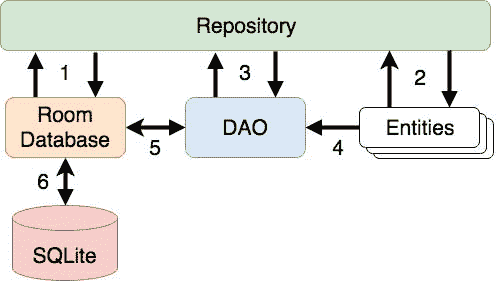
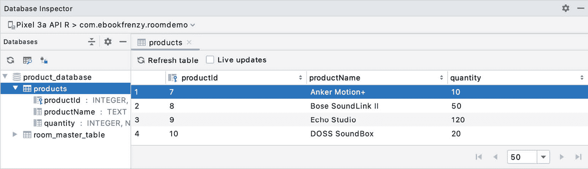

# 六十六、安卓 Room 持久化库

Room持久化库包含在安卓架构组件中，旨在以符合安卓架构指南的方式更容易地为安卓应用添加数据库存储支持。通过上一章中介绍的 SQLite 数据库的基础知识，本章将探讨基于 Room 的数据库管理背后的基本概念、在 Android 应用中共同实现 Room 支持的关键元素，以及如何在架构和编码方面实现这些概念。涵盖了这些主题后，接下来的两章将以示例 Room 数据库项目的形式将这一理论付诸实践。

66.1 重温现代应用架构

标题为[“使用 Jetpack 的现代安卓应用架构”](32.html#_idTextAnchor696)的章节介绍了现代应用架构的概念，并强调了在一个应用内分离不同责任领域的重要性。[图 66-1](#_idTextAnchor1244) 中的图表概述了典型安卓应用的推荐架构:


图 66-1

本书前面几章已经详细介绍了这个体系结构的前三个层次，现在是时候在 Room 持久化库的上下文中开始探索存储库和数据库体系结构层次了。

66.2 Room数据库持久化的关键要素

在本章后面更详细地介绍之前，首先值得总结一下使用 Room 持久化库使用 SQLite 数据库时涉及的关键元素:

66.2.1 储存库

如前所述，存储库模块包含直接处理应用使用的所有数据源所需的所有代码。这避免了用户界面控制器和视图模型包含直接访问数据库或网络服务等源的代码的需要。

66.2.2 Room数据库

Room数据库对象提供了到底层 SQLite 数据库的接口。它还为存储库提供了对数据访问对象(DAO)的访问。一个应用应该只有一个Room数据库实例，然后可以用来访问多个数据库表。

66.2.3 数据访问对象(DAO)

DAO 包含存储库在 SQLite 数据库中插入、检索和删除数据所需的 SQL 语句。这些 SQL 语句被映射到方法，然后从存储库中调用这些方法来执行相应的查询。

66.2.4 实体

实体是一个类，它为数据库中的表定义模式，定义表名、列名和数据类型，并标识哪个列是主键。除了声明表模式，实体类还包含提供对这些数据字段的访问的 getter 和 setter 方法。响应于 SQL 查询方法调用，DAO 返回到存储库的数据将采用这些实体类的实例的形式。然后将调用 getter 方法从实体对象中提取数据。类似地，当存储库需要向数据库中写入新记录时，它将创建一个实体实例，通过 setter 调用在对象上配置值，然后调用 DAO 中声明的 insert 方法，传递要保存的实体实例。

66.2.5 SQLite 数据库

实际的 SQLite 数据库，负责存储和提供对数据的访问。应用代码，包括存储库，永远不应该直接访问这个底层数据库。所有数据库操作都是使用Room数据库、Dao 和实体的组合来执行的。

[图 66-2](#_idTextAnchor1251) 中的架构图说明了这些不同元素交互的方式，以在安卓应用中提供基于Room的数据库存储:



图 66-2

上述体系结构图中的编号连接可以总结如下:

1.存储库与Room数据库交互以获得一个数据库实例，该数据库实例又用于获取对 DAO 实例的引用。

2.存储库创建实体实例，并在将它们传递给 DAO 用于搜索和插入操作之前用数据对它们进行配置。

3.存储库调用 DAO 上的方法，传递要插入数据库的实体，并接收实体实例以响应搜索查询。

4.当一个 DAO 有结果要返回到存储库时，它会将这些结果打包到实体对象中。

5.DAO 与Room数据库交互，启动数据库操作并处理结果。

6.Room数据库处理与底层 SQLite 数据库的所有低级交互，提交查询和接收结果。

有了使用 room 持久库访问数据库的关键元素的基本概要，现在是时候更详细地探索实体、Dao、Room 数据库和存储库了。

66.3 理解实体

每个数据库表都有一个与之关联的实体类。这个类定义了表的模式，并采用标准 Java 类的形式，中间穿插一些特殊的 Room 注释。声明要存储在数据库表中的数据的示例 Java 类可能如下所示:

```java
public class Customer {

    private int id;
    private String name;
    private string address;

    public Customer(String name, String address) {
        this.id = id;
        this.name = name;
        this.address = address;
    }

    public int getId() {
        return this.id;
    }
    public String getName() {
        return this.name;
    }

    public int getAddress() {
        return this.address;
    }

    public void setId(int id) {
        this.id = id;
    }

    public void setName(String name) {
        this.name = name;
    }

    public void setAddress(int quantity) {
        this.address = address;
    }
}
```

正如当前实现的那样，上面的代码声明了一个基本的 Java 类，该类包含许多表示数据库表字段的变量以及 getter 和 setter 方法的集合。然而，这个类还不是一个实体。为了使这个类成为一个实体，并使它可以在 SQL 语句中访问，需要添加一些Room注释，如下所示:

```java
@Entity(tableName = "customers")
public class Customer {

    @PrimaryKey(autoGenerate = true)
    @NonNull
    @ColumnInfo(name = "customerId")
    private int id;

    @ColumnInfo(name = "customerName")
    private String name;

    private string address;

    public Customer(String name, String address) {
        this.id = id;
        this.name = name;
        this.address = address;
    }

    public int getId() {
        return this.id;
    }

    public String getName() {
        return this.name;
    }

    public int getAddress() {
        return this.address;
    }

    public void setId(@NonNull int id) {
        this.id = id;
    }

    public void setName(String name) {
        this.name = name;
    }

    public void setAddress(int quantity) {
        this.address = address;
    }
}
```

上面的注释首先声明类代表一个实体，并分配一个名为“customers”的表名。这是表在 DAO SQL 语句中引用的名称:

```java
@Entity(tableName = "customers")
```

每个数据库表都需要一列作为主键。在这种情况下，客户 id 被声明为主键。还添加了注释来指定要在 SQL 查询中引用的列名，并指示该字段不能用于存储空值。最后，id 值被配置为自动生成。这意味着分配给新记录的 id 将由系统自动生成，以避免重复的密钥。

```java
@PrimaryKey(autoGenerate = true)
@NonNull
@ColumnInfo(name = "customerId")
private int id;
```

列名也被分配给客户名称字段。但是，请注意，没有为地址字段分配列名。这意味着地址数据仍将存储在数据库中，但不需要在 SQL 语句中引用。如果实体中的字段不需要存储在数据库中，只需使用@Ignore 注释:

```java
@Ignore
private String myString;
```

最后，修改 id 变量的 setter 方法，以防止分配空值的尝试:

```java
public void setId(@NonNull int id) {
    this.id = id;
}
```

注释也可以包含在实体类中，以使用称为外键的关系数据库概念与其他实体建立关系。外键允许一个表引用另一个表中的主键。例如，可以在名为“采购”的实体和我们现有的客户实体之间建立关系，如下所示:

```java
@Entity(ForeignKeys = @ForeignKey(entity = Customer.class, 
                   parentColumns = "id",  childColumns = "purchaseId"))

public class Purchase {

    @PrimaryKey(autoGenerate = true)
    @NonNull
    @ColumnInfo(name = "purchaseId")
    private int id;

    @ColumnInfo(name = "productName")
    private String name;
.
.
}
```

66.4 数据访问对象

数据访问对象提供了一种访问存储在 SQLite 数据库中的数据的方法。DAO 被声明为标准的 Java 接口，带有一些附加的注释，这些注释将特定的 SQL 语句映射到存储库可以调用的方法。

第一步是创建接口，并使用@Dao 注释将其声明为 DAO:

```java
@Dao
public interface CustomerDao {
}
```

接下来，添加由 SQL 语句和相应的方法名组成的条目。例如，下面的声明允许通过调用名为 getAllCustomers()的方法来检索 customers 表中的所有行:

```java
@Dao
public interface CustomerDao {
    @Query("SELECT * FROM customers")
    LiveData<List<Customer>> getAllCustomers();
}
```

请注意，getAllCustomers()方法为从数据库表中检索的每条记录返回一个包含客户实体对象的列表对象。DAO 还利用了实时数据，这样存储库就可以观察到数据库的变化。

参数也可以传递到方法中，并在相应的 SQL 语句中引用。考虑下面的 DAO 声明，它搜索与客户名称匹配的数据库记录(注意，WHERE 条件中引用的列名是分配给实体类中的列的名称):

```java
@Query("SELECT * FROM customers WHERE name = :customerName")
List<Customer> findCustomer(String customerName);
```

在本例中，方法被传递了一个字符串值，该字符串值通过在变量名前面加上冒号(:)而包含在 SQL 语句中。

一个基本的插入操作可以用@Insert 便利注释声明如下:

```java
@Insert
void addCustomer(Customer customer);
```

这被称为方便注释，因为 Room 持久化库可以推断传递给 addCustomer()方法的 Customer 实体将被插入到数据库中，而不需要提供 SQL insert 语句。多个数据库记录也可以插入到单个事务中，如下所示:

```java
@Insert
public void insertCustomers(Customer... customers);
```

以下 DAO 声明删除所有与提供的客户名称匹配的记录:

```java
@Query("DELETE FROM customers WHERE name = :name")
void deleteCustomer(String name);
```

作为使用@Query 注释执行删除的替代方法，也可以使用@Delete 便利注释。在以下示例中，与传递给 deleteCustomers()方法的实体集匹配的所有客户记录都将从数据库中删除:

```java
@Delete
public void deleteCustomers(Customer... customers);
```

@Update 便利注释在更新记录时提供了类似的行为:

```java
@Update
public void updateCustomers(Customer... customers);
```

这些类型的数据库操作的 DAO 方法也可以声明为返回一个指示受事务影响的行数的 int 值，例如:

```java
@Delete
public int deleteCustomers(Customer... customers);
```

66.5 Room数据库

Room 数据库类是通过扩展 Room database 类创建的，它充当嵌入安卓操作系统的实际 SQLite 数据库之上的一层。该类负责创建和返回一个新的Room数据库实例，并提供对与该数据库相关联的 DAO 实例的访问。

Room持久化库提供了用于创建数据库实例的数据库生成器。每个安卓应用应该只有一个Room数据库实例，所以最好在类内实现防御代码，以防止创建多个实例。

下面的代码清单列出了一个用于示例客户表的示例Room数据库实现:

```java
import android.content.Context;
import android.arch.persistence.room.Database;
import android.arch.persistence.room.Room;
import android.arch.persistence.room.RoomDatabase;

@Database(entities = {Customer.class}, version = 1)
public class CustomerRoomDatabase extends RoomDatabase {

    public abstract CustomerDao customerDao();

    private static CustomerRoomDatabase INSTANCE;

    static CustomerRoomDatabase getDatabase(final Context context) {
        if (INSTANCE == null) {
            synchronized (CustomerRoomDatabase.class) {
                if (INSTANCE == null) {
                    INSTANCE = Room.databaseBuilder(
                          context.getApplicationContext(),
                            CustomerRoomDatabase.class, "customer_database")
                            .build();
                }
            }
        }
        return INSTANCE;
    }
}
```

在上面的例子中需要注意的重要方面是类声明上面的注释，声明数据库要使用的实体，检查类实例是否已经创建的代码，以及给实例分配名称“customer_database”。

66.6 储存库

存储库负责获取一个Room数据库实例，使用该实例访问相关的 DAO，然后调用 DAO 方法来执行数据库操作。设计用于Room数据库的存储库的典型构造函数可能如下所示:

```java
public class CustomerRepository {

    private CustomerDao customerDao;
    private CustomerRoomDatabase db;

    public CustomerRepository(Application application) {
        db = CustomerRoomDatabase.getDatabase(application);
        customerDao = db.customerDao();
    }
.
.
}
```

一旦存储库可以访问 DAO，它就可以调用数据访问方法。例如，下面的代码调用 getAllCustomers() DAO 方法:

```java
private LiveData<List<Customer>> allCustomers;
allCustomers = customerDao.getAllCustomers();
```

在调用 DAO 方法时，需要注意的是，除非该方法返回一个 LiveData 实例(它会在一个单独的线程上自动运行查询)，否则无法在应用的主线程上执行该操作。事实上，尝试这样做将导致应用崩溃，并出现以下诊断输出:

```java
Cannot access database on the main thread since it may potentially lock the UI for a long period of time
```

由于某些数据库事务可能需要更长的时间才能完成，因此在单独的线程上运行操作可以避免应用出现锁定。正如将在标题为[“安卓Room数据库和存储库教程”](68.html#_idTextAnchor1283)的章节中所演示的，这个问题可以通过使用 AsyncTask 类来轻松解决(有关如何使用 AsyncTask 的更多信息或提醒，请参考标题为[“线程和 AsyncTask 的基本概述”](57.html#_idTextAnchor1108)的章节)。

66.7 内存数据库

本章中概述的示例涉及使用一个 SQLite 数据库，该数据库作为数据库文件存在于安卓设备的持久存储中。这确保了即使在应用进程终止后数据仍然存在。

Room 数据库持久化库还支持内存数据库。这些数据库完全驻留在内存中，在应用终止时会丢失。使用内存数据库的唯一必要更改是调用 Room 数据库类的 Room.inMemoryDatabaseBuilder()方法，而不是 Room.databaseBuilder()。下面的代码显示了方法调用之间的区别(请注意，内存数据库不需要数据库名称):

```java
// Create a file storage based database
INSTANCE = Room.databaseBuilder(context.getApplicationContext(),
                            CustomerRoomDatabase.class, "customer_database")
                            .build();

// Create an in-memory database
INSTANCE = Room.inMemoryDatabaseBuilder(context.getApplicationContext(),
                            CustomerRoomDatabase.class)
                            .build();
```

66.8 数据库检查器

AndroidStudio包括一个数据库检查器工具窗口，允许查看、搜索和修改与运行应用相关的Room数据库，如图[图 66-3](#_idTextAnchor1258) :



图 66-3

数据库检查器的使用将在标题为[“安卓Room数据库和存储库教程”](68.html#_idTextAnchor1283)的章节中介绍。

66.9 总结

安卓Room持久化库与安卓架构组件捆绑在一起，并作为较低级别 SQLite 数据库之上的抽象层。该库旨在使使用数据库更容易，同时符合安卓架构指南。本章介绍了在安卓应用项目中构建基于Room的数据库存储的不同交互元素，包括实体、存储库、数据访问对象、注释和Room数据库实例。

了解了 SQLite 和 Room 架构组件的基础知识后，下一步是创建一个将这一理论付诸实践的示例应用。由于示例应用的用户界面需要基于表单的布局，下一章名为[“安卓 TableLayout 和 TableRow 教程”](67.html#_idTextAnchor1260)，将通过介绍 TableLayout 和 TableRow 视图的基础知识，稍微偏离核心主题。