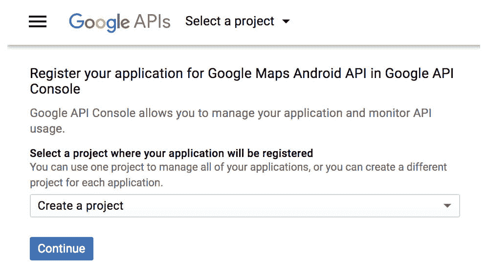
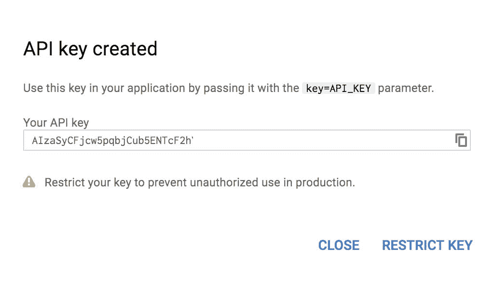
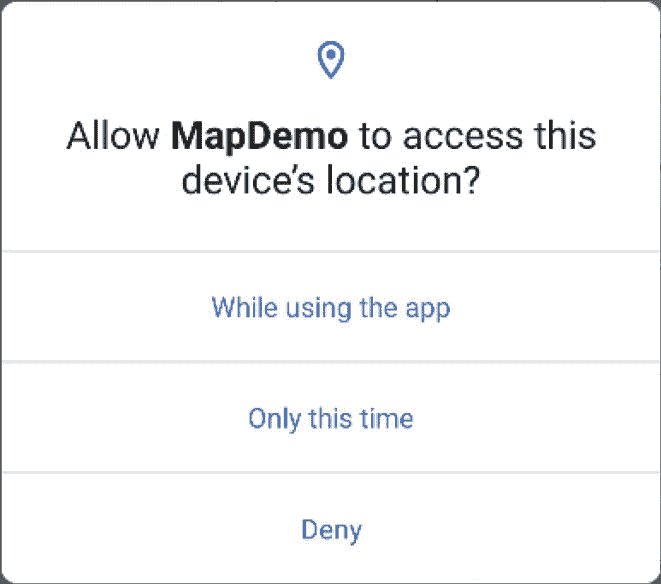
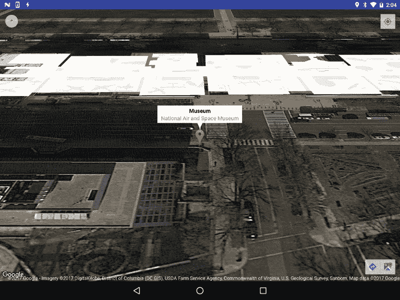

76.在AndroidStudio 使用谷歌地图安卓应用编程接口

多年前，当谷歌决定推出地图服务时，很难说他们是否曾预期有一个版本可以集成到移动应用中。当 2005 年第一个基于网络的最终被称为谷歌地图的版本推出时，iPhone 尚未点燃智能手机革命，开发安卓操作系统的公司将在未来六个月内不会被谷歌收购。无论谷歌对谷歌地图的未来有什么样的期望，值得注意的是，谷歌地图的所有功能现在都可以通过使用谷歌地图安卓应用编程接口的安卓应用直接访问。

本章旨在概述谷歌地图系统和谷歌地图安卓应用编程接口。本章将概述组成该应用编程接口的不同元素，详细说明配置开发环境以使用谷歌地图所需的步骤，然后通过一些代码示例演示谷歌地图安卓集成的一些基础知识。

76.1 谷歌地图安卓 API 的元素

谷歌地图安卓应用编程接口由一组核心类组成，这些类结合起来在安卓应用中提供映射功能。地图的关键要素如下:

谷歌地图–谷歌地图安卓应用编程接口的主要类别。此类负责下载和显示地图切片，以及显示和响应地图控件。谷歌地图对象不是由应用直接创建的，而是在创建地图视图或地图片段实例时创建的。通过调用地图视图、地图片段或支持地图片段实例的 getMap()方法，可以在应用代码中获得对谷歌地图对象的引用。

地图视图 -视图类的子类，该类提供了谷歌地图对象在其上绘制地图的视图画布，允许将地图放置在活动的用户界面布局中。

SupportMapFragment–Fragment 类的一个子类，这个类允许在 Android 布局中的一个 Fragment 中放置一个地图。

标记–标记类的目的是允许在地图上标记位置。通过获取对与地图相关联的谷歌地图对象的引用，然后调用该对象实例的 addMarker()方法，可以将标记添加到地图中。标记的位置通过经度和纬度来定义。可以通过多种方式配置标记，包括指定标题、文本和图标。标记也可以被制成“可拖动的”，允许用户将标记移动到地图上的不同位置。

形状–通过使用折线、多边形和圆形类，可以在地图上绘制线条和形状。

ui settings–ui settings 类从应用内部提供一个控制级别，用户界面控件出现在地图上。例如，使用这个类，应用可以控制缩放、当前位置和指南针控件是否出现在地图上。该类还可用于配置地图识别哪些触摸屏手势。

我的位置图层–启用时，我的位置图层会在地图上显示一个按钮，当用户选择该按钮时，地图会以用户当前的地理位置为中心。如果用户是静止的，则该位置在地图上由蓝色标记表示。如果用户正在运动，则该位置由指示用户行进方向的人字形表示。

熟悉谷歌地图安卓应用编程接口的最好方法是通过一个例子。本章的剩余部分将创建一个基于谷歌地图的应用，同时强调应用编程接口的关键领域。

76.2 创建谷歌地图项目

从欢迎屏幕中选择创建新项目快速启动选项，并在生成的新项目对话框中选择谷歌地图活动模板，然后单击下一步按钮。

在“名称”字段中输入 MapDemo，并将 com . ebookwidue . MapDemo 指定为包名。在单击完成按钮之前，将最低应用编程接口级别设置更改为应用编程接口 26:安卓 8.0(奥利奥)，并将语言菜单更改为 Java。

76.3 获取您的开发者签名

在应用可以使用谷歌地图安卓应用接口之前，它必须首先在谷歌应用接口控制台中注册。但是，在注册应用之前，必须识别与您的开发环境相关联的开发人员签名(也称为 SHA-1 指纹)。这包含在位于。您主目录的 android 子目录，可以使用作为 Java SDK 的一部分提供的 keytool 实用程序获得。然而，为了使这个过程更容易，当在项目创建过程中选择了谷歌地图活动选项时，AndroidStudio会向项目添加一些额外的文件。其中一个文件名为 google_maps_api.xml，位于项目的 app - > res - > values 文件夹中。

包含在 google_maps_api.xml 文件中的是一个指向 google 开发者控制台的链接。将此链接复制并粘贴到浏览器窗口中。加载后，将出现类似以下内容的页面:



图 76-1

在单击“继续”按钮之前，请确认菜单设置为“创建新项目”。启用应用编程接口后，单击创建应用编程接口密钥按钮。短暂延迟后，将创建新项目，并出现一个面板([图 76-2](#_idTextAnchor1413) )，为应用应用提供 API 密钥。



图 76-2

复制此密钥，返回AndroidStudio，并将应用编程接口密钥粘贴到文件的“您的密钥”部分:

```java
<string name="google_maps_key" 
templateMergeStrategy="preserve" translatable="false">YOUR_KEY_HERE</string> 
```

76.4 添加 Apache HTTP 遗留库需求

由于该示例项目将被构建为与Android 9.0 或更高版本一起使用，因此需要在 AndroidManifest.xml 文件的<应用>部分中添加以下声明，如下所示:

```java
.
.
   <application
            android:allowBackup="true"
            android:icon="@mipmap/ic_launcher"
            android:label="@string/app_name"
            android:roundIcon="@mipmap/ic_launcher_round"
            android:supportsRtl="true"
            android:theme="@style/Theme.MapDemo">

        <uses-library
                android:name="org.apache.http.legacy"
                android:required="false" />
.
.
```

76.5 测试应用

执行应用的测试运行，以验证是否正确配置了应用编程接口密钥。假设配置正确，应用将运行并在屏幕上显示地图。

如果地图未显示，请检查以下区域:

如果应用在模拟器上运行，请确保模拟器运行的是包含谷歌应用接口的安卓版本。通过选择工具->安卓-> AVD 管理器菜单选项，点击 AVD 操作栏中的铅笔图标，然后点击当前安卓版本旁边的更改…按钮，可以更改当前操作系统的 AVD 配置。在系统映像对话框中，选择一个包含谷歌应用编程接口的目标。

检查日志文件输出中与谷歌地图应用编程接口相关的任何认证问题。这通常意味着 API 密钥输入不正确，或者应用包名称与生成 API 密钥时指定的名称不匹配。

在谷歌应用编程接口控制台中验证“服务”面板中的谷歌地图安卓应用编程接口是否已启用。

76.6 理解地理编码和反向地理编码

如果不首先涉及地理编码的主题，就不可能谈论地图和地理位置。地理编码最好描述为将基于文本的地理位置(如街道地址)转换为以经度和纬度表示的地理坐标的过程。

地理编码可以使用安卓地理编码器类来实现。例如，地理编码器类的一个实例可以被传递一个表示位置的字符串，如城市名称、街道地址或机场代码。地理编码器将尝试查找该位置的匹配项，并返回可能与该位置字符串匹配的地址对象列表，按照列表中位置 0 处最匹配项的顺序排列。然后可以从地址对象中提取各种信息，包括潜在匹配的经度和纬度。

例如，以下代码请求位于华盛顿特区的国家航空航天博物馆的位置:

```java
import java.io.IOException;
import java.util.List;

import android.location.Address;
import android.location.Geocoder;
.
.
double latitude;
double longitude;

List<Address> geocodeMatches = null;

try {
       geocodeMatches = 
          new Geocoder(this).getFromLocationName(
               "600 Independence Ave SW, Washington, DC 20560", 1);
    } catch (IOException e) {
       // TODO Auto-generated catch block
       e.printStackTrace();
}

if (!geocodeMatches.isEmpty())
{
       latitude = geocodeMatches.get(0).getLatitude(); 
       longitude = geocodeMatches.get(0).getLongitude();
}
```

请注意，值 1 作为第二个参数传递给 getFromLocationName()方法。这只是告诉地理编码器在数组中只返回一个结果。鉴于所提供地址的特定性质，应该只有一个潜在匹配。然而，对于更模糊的位置名称，可能有必要请求更多潜在的匹配，并允许用户选择正确的名称。

上面的代码是正向地理编码的一个例子，因为坐标是基于文本位置描述计算的。顾名思义，反向地理编码包括将地理坐标转换为人类可读的地址字符串。例如，考虑以下代码:

```java
import java.io.IOException;
import java.util.List;

import android.location.Address;
import android.location.Geocoder;
.
.
List<Address> geocodeMatches = null;
String Address1;
String Address2;
String State;
String Zipcode;
String Country;

try {
       geocodeMatches = 
         new Geocoder(this).getFromLocation(38.8874245, -77.0200729, 1);
} catch (IOException e) {
       // TODO Auto-generated catch block
       e.printStackTrace();
}

if (!geocodeMatches.isEmpty())
{
       Address1 = geocodeMatches.get(0).getAddressLine(0);
       Address2 = geocodeMatches.get(0).getAddressLine(1);
       State = geocodeMatches.get(0).getAdminArea();
       Zipcode = geocodeMatches.get(0).getPostalCode();
       Country = geocodeMatches.get(0).getCountryName();
}
```

在这种情况下，地理编码器对象通过 getFromLocation()方法用纬度和经度值初始化。同样，只请求一个匹配结果。然后从结果地址对象中提取基于文本的地址信息。

应该注意的是，地理编码实际上不是在安卓设备上执行的，而是在需要翻译时在设备连接的服务器上执行的，翻译完成后会返回结果。因此，地理编码只能在设备有活动的互联网连接时进行。

76.7 向应用添加地图

向应用添加映射的最简单方法是在活动的用户界面布局 XML 文件中指定它。以下示例布局文件显示了添加到由 Android Studio 创建的 activity_maps.xml 文件中的 SupportMapFragment 实例:

```java
<fragment xmlns:android="http://schemas.android.com/apk/res/android"
    xmlns:tools="http://schemas.android.com/tools"
    android:layout_width="match_parent"
    android:layout_height="match_parent"
    android:id="@+id/map"
    tools:context=".MapsActivity"
    android:name="com.google.android.gms.maps.SupportMapFragment"/> 
```

76.8 请求当前位置许可

正如标题为[“在 Android 中发出运行时权限请求”](74.html#_idTextAnchor1375)一章中所概述的，某些权限被归类为危险的，需要对 Android 6.0 或更高版本进行特殊处理。一个这样的许可赋予应用识别用户当前位置的能力。默认情况下，AndroidStudio在 AndroidManifest.xml 文件中放置了一个位置权限请求。在项目工具窗口中找到位于 app - >清单下的文件，并找到以下权限行:

```java
<uses-permission   
          android:name="android.permission.ACCESS_FINE_LOCATION" /> 
```

这将确保该应用有机会在该应用安装在较旧版本的安卓系统上时，为该应用提供获取位置信息的权限，但为了完全支持安卓 6.0 或更高版本，该应用还必须在运行时专门请求该权限。为此，需要将一些代码添加到 MapsActivity.java 文件中。

首先添加一些导入指令和一个常量作为权限请求代码:

```java
package com.ebookfrenzy.mapdemo;
.
.
import androidx.core.content.ContextCompat;
import androidx.core.app.ActivityCompat;
import android.Manifest;
import android.widget.Toast;
import android.content.pm.PackageManager;
.
.
public class MapsActivity extends FragmentActivity implements OnMapReadyCallback { 
    private static final int LOCATION_REQUEST_CODE = 101;
    private GoogleMap mMap;
.
.
}
```

接下来，需要向类中添加一个方法，以便向用户请求指定的权限。保留在 MapsActivity.java 类文件中，按如下方式实现此方法:

```java
protected void requestPermission(String permissionType,
                                 int requestCode) {

    ActivityCompat.requestPermissions(this,
            new String[]{permissionType}, requestCode
    ); 
}
```

当用户对权限请求做出响应后，将对该活动调用 onRequestPermissionsResult()方法。保留在 MapsActivity.java 文件中，现在实现此方法，使其如下所示:

```java
@Override
public void onRequestPermissionsResult(int requestCode,
                  String permissions[], int[] grantResults) {

    switch (requestCode) {
        case LOCATION_REQUEST_CODE: {

            if (grantResults.length == 0
                    || grantResults[0] != 
                     PackageManager.PERMISSION_GRANTED) {
                Toast.makeText(this, 
                  "Unable to show location - permission required", 
                            Toast.LENGTH_LONG).show();
            } else {

                SupportMapFragment mapFragment = 
                  (SupportMapFragment) getSupportFragmentManager()
                        .findFragmentById(R.id.map);
                mapFragment.getMapAsync(this);
            }
        }
    }
}
```

如果用户未授予权限，应用将显示一条消息，指示无法显示当前位置。另一方面，如果许可被授予，则地图被刷新以提供显示位置标记的机会。

76.9 显示用户当前位置

一旦授予了适当的权限，用户的当前位置就可以显示在地图上，方法是获取对与显示的地图相关联的谷歌地图对象的引用，并调用该实例的 setMyLocationEnabled()方法，传递值 true。

当地图准备好显示时，将调用活动的 onMapReady()方法。当在上面的 onRequestPermissionsResult()方法中刷新映射时，也会调用此方法。默认情况下，AndroidStudio已经实现了这种方法，并添加了一些代码来确定澳大利亚地图的方向，并在悉尼市上方放置了一个标记。在 MapsActivity.java 文件中找到并编辑 onMapReady()方法，删除该模板代码并添加代码，以检查在启用用户当前位置显示之前是否已授予位置权限。如果尚未授予权限，则通过调用之前添加的 requestPermission()方法向用户发出请求:

```java
@Override
public void onMapReady(GoogleMap googleMap) {
    mMap = googleMap;

    // Add a marker in Sydney and move the camera
    LatLng sydney = new LatLng(-34, 151);
    mMap.addMarker(new MarkerOptions().position(sydney).title("Marker in Sydney"));
    mMap.moveCamera(CameraUpdateFactory.newLatLng(sydney));

    if (mMap != null) {
        int permission = ContextCompat.checkSelfPermission(this, 
              Manifest.permission.ACCESS_FINE_LOCATION);

        if (permission == PackageManager.PERMISSION_GRANTED) {
            mMap.setMyLocationEnabled(true);
        } else {
                requestPermission(
                  Manifest.permission.ACCESS_FINE_LOCATION,
                        LOCATION_REQUEST_CODE);
        } 
     } 
}
```

当应用正在运行时，将出现如图 76-3 所示的对话框，请求位置许可。如果获得许可，地图上将出现一个蓝点，指示设备的当前位置。



图 76-3

76.10 更改地图类型

通过调用相应谷歌地图对象的 setMapType()方法，传递以下值之一，可以动态修改显示的地图类型:

谷歌地图。地图 _ 类型 _ 无–一个没有显示地图图块的空网格。

谷歌地图。MAP _ TYPE _ NORMAL–由经典路线图组成的标准视图。

谷歌地图。地图类型卫星–显示地图区域的卫星图像。

谷歌地图。地图类型混合–显示叠加了路线图的卫星图像。

谷歌地图。地图 _ 类型 _ 地形–显示等高线和颜色等地形信息。

例如，以下代码更改了 onMapReady()方法，将地图切换到卫星模式:

```java
.
.
if (mMap != null) {
    int permission = ContextCompat.checkSelfPermission(
              this, Manifest.permission.ACCESS_FINE_LOCATION);

    if (permission == PackageManager.PERMISSION_GRANTED) {
        mMap.setMyLocationEnabled(true);
    } else {
        requestPermission(Manifest.permission.ACCESS_FINE_LOCATION,
                LOCATION_REQUEST_CODE);
    }
    mMap.setMapType(GoogleMap.MAP_TYPE_SATELLITE);
}
.
.
```

或者，可以在 XML 布局文件中指定地图类型，其中使用“地图:地图类型”属性以及“无”、“正常”、“混合”、“卫星”或“地形”值嵌入地图。例如:

```java
<?xml version="1.0" encoding="utf-8"?>
<fragment xmlns:android="http://schemas.android.com/apk/res/android"
          xmlns:map="http://schemas.android.com/apk/res-auto"
          android:id="@+id/map"
          android:layout_width="match_parent"
          android:layout_height="match_parent"
          map:mapType="hybrid"
          android:name="com.google.android.gms.maps.SupportMapFragment"/>
```

76.11 向用户显示地图控件

谷歌地图安卓应用编程接口提供了许多控件，可以选择性地向用户显示，包括放大和缩小按钮、“我的位置”按钮和指南针。

缩放和指南针控件是否显示可以通过编程方式控制，也可以在 XML 布局资源的地图元素中控制。为了以编程方式配置控件，必须获取对与谷歌地图对象关联的用户设置对象的引用:

```java
import com.google.android.gms.maps.UiSettings;
.
.
UiSettings mapSettings;
mapSettings = mMap.getUiSettings();
```

通过调用 UiSettings 对象的 setZoomControlsEnabled()方法，可以启用和禁用缩放控件。例如:

```java
mapSettings.setZoomControlsEnabled(true);
```

或者，映射:uiZoomControls 属性可以在 XML 资源文件的映射元素中设置:

```java
map:uiZoomControls="false"
```

指南针可以通过调用 UiSettings 实例的 setCompassEnabled()方法来显示，也可以通过使用 map:uiCompass 属性的 XML 资源来显示。请注意，指南针图标仅在地图相机倾斜或旋转远离默认方向时出现。

“我的位置”按钮只有在启用“我的位置”模式时才会出现，如本章前面所述。通过调用 UiSettings 实例的 setMyLocationButtonEnabled()方法，即使在此模式下，也可能会阻止按钮出现。

76.12 处理地图手势交互

谷歌地图安卓应用编程接口能够响应许多不同的用户交互。这些交互可用于改变地图的显示区域、缩放级别甚至视角(从而为某些城市显示地图区域的 3D 表示)。

76.12.1 地图缩放手势

可以使用与谷歌地图实例相关联的 UiSettings 对象的 setZoomGesturesEnabled()方法来启用或禁用对与放大和缩小地图相关的手势的支持。例如，以下代码禁用示例地图的缩放手势:

```java
UiSettings mapSettings;
mapSettings = map.getUiSettings();
mapSettings.setZoomGesturesEnabled(false);
```

通过将 map:uiZoomGestures 属性设置为 true 或 false，可以在 XML 资源文件中获得相同的结果。

启用后，当用户在屏幕上做捏手手势时，缩放将发生。类似地，双击将放大，而两个手指轻击将缩小。另一方面，一个手指缩放手势是通过轻敲两次但不释放第二次轻敲，然后在屏幕上上下滑动手指来分别放大和缩小来执行的。

76.12.2 地图滚动/平移手势

滚动或平移手势允许用户通过用单个手指运动在屏幕上拖动地图来在地图上移动。滚动手势可以通过调用 UiSettings 实例的 setScrollGesturesEnabled()方法在代码中启用:

```java
UiSettings mapSettings;
mapSettings = mMap.getUiSettings();
mapSettings.setScrollGesturesEnabled(true);
```

或者，可以在 XML 资源布局文件中使用 map:uiscrollb 姿态属性启用地图实例上的滚动。

76.12.3 地图倾斜手势

倾斜手势允许用户通过将两个手指放在屏幕上并上下移动来调整倾斜角度，从而倾斜地图的投影角度。可以通过调用 UiSettings 实例的 setTiltGesturesEnabled()方法来启用或禁用倾斜手势，例如:

```java
UiSettings mapSettings;
mapSettings = mMap.getUiSettings();
mapSettings.setTiltGesturesEnabled(true);
```

倾斜手势也可以使用 XML 布局资源文件中的 map:uitiltpings 属性来启用和禁用。

76.12.4 地图旋转手势

通过将两个手指放在屏幕上并以圆周运动旋转它们，当地图旋转手势被启用时，用户可以旋转地图的方向。通过调用 UiSettings 实例的 setRotateGesturesEnabled()方法，可以在代码中启用和禁用这种手势支持，例如:

```java
UiSettings mapSettings;
mapSettings = mMap.getUiSettings();
mapSettings.setRotateGesturesEnabled(true);
```

也可以使用 XML 布局资源文件中的 map:uiRotateGestures 属性来启用或禁用旋转手势。

76.13 创建地图标记

标记用于通知用户地图上的位置，并采用标准或自定义图标的形式。标记还可以包括标题和可选文本(称为片段)，并且可以被配置为使得它们可以被用户拖到地图上的不同位置。当用户点击时，将出现一个信息窗口，显示关于标记位置的附加信息。

标记由标记类的实例表示，并通过调用相应谷歌地图对象的添加标记()方法添加到地图中。作为此方法的参数传递的是一个标记选项类实例，包含标记所需的各种选项，如标题和代码段文本。标记的位置是通过指定纬度和经度值来定义的，这些值也包含在标记位置实例中。例如，以下代码将包括标题、片段和位置的标记添加到地图上的特定位置:

```java
import com.google.android.gms.maps.model.Marker;
import com.google.android.gms.maps.model.LatLng;
import com.google.android.gms.maps.model.MarkerOptions;
.
.
.
LatLng position = new LatLng(38.8874245, -77.0200729);
Marker museum = mMap.addMarker(new MarkerOptions()
                  .position(position)
                  .title("Museum")
                  .snippet("National Air and Space Museum"));
```

执行时，上述代码将标记指定的位置，点击该位置时，将显示包含标题和片段的信息窗口，如图 76-4 所示:



图 76-4

76.14 控制地图摄像头

因为安卓设备屏幕是平的，世界是一个球体，所以谷歌地图安卓应用编程接口使用墨卡托投影在平坦的表面上代表地球。地图的默认视图呈现给用户，就像通过悬挂在地图上方并直接指向地图的摄像机一样。谷歌地图安卓应用编程接口允许从应用中实时更改该相机的目标、缩放、方位和倾斜度:

目标–地图中心在设备显示屏上的位置，以经度和纬度表示。

变焦–以级别指定的摄像机变焦级别。将缩放级别增加 1.0 会使地图显示的宽度增加一倍。

倾斜–摄像机的视角，指定为从弧顶开始以度为单位测量的横跨可视地图区域中心的弧上的位置(这是摄像机直接指向地图的弧的最低点)。

方位——地图的方位，以度为单位，从北顺时针方向测量。

通过使用适当的设置创建 CameraUpdate 类的实例，可以对摄像机进行更改。CameraUpdate 实例是通过对 CameraUpdateFactory 类进行方法调用来创建的。一旦创建了一个 CameraUpdate 实例，它就通过调用谷歌地图实例的 moveCamera()方法应用于地图。为了在相机改变时获得平滑的动画效果，可以调用 animateCamera()方法来代替 moveCamera()。

摄像机数据工厂方法总结如下:

摄像机数据工厂。zoomIn()–提供放大一级的摄像机数据实例。

提供缩小一级的摄像机数据实例。

生成一个将缩放级别更改为指定值的摄像机数据实例。

CameraUpdateFactory.zoomBy(浮动)-提供缩放级别增加或减少指定数量的 CameraUpdate 实例。

创建一个将缩放级别增加或减少指定值的摄像机数据实例。

CameraUpdatefactory . new lating(lating)-创建一个 camera update 实例，用于更改相机的目标纬度和经度。

CameraUpdatefactory . newlatlngzoom(lating，float) -生成一个 camera update 实例，用于更改相机的纬度、经度和缩放。

摄像机位置-返回将摄像机移动到指定位置的摄像机位置实例。相机定位实例可以通过相机定位获得。Builder()。

例如，以下代码使用动画将摄像机放大一级:

```java
mMap.animateCamera(CameraUpdateFactory.zoomIn());
```

另一方面，以下代码将相机移动到新位置，并将缩放级别调整为 10，而不显示动画:

```java
private static final LatLng position =
       new LatLng(38.8874245, -77.0200729);

mMap.moveCamera(CameraUpdateFactory.newLatLngZoom(position, 10));
```

最后，下一个代码示例使用 CameraPosition。Builder()创建一个相机定位对象，改变目标，缩放，方位和倾斜。然后，使用动画将此更改应用于摄像机:

```java
import com.google.android.gms.maps.model.CameraPosition;
import com.google.android.gms.maps.CameraUpdateFactory;
.
.
CameraPosition cameraPosition = new CameraPosition.Builder()
    .target(position)
    .zoom(50)
    .bearing(70)
    .tilt(25)
    .build();
mMap.animateCamera(CameraUpdateFactory.newCameraPosition(
                            cameraPosition));
```

76.15 总结

本章概述了构成谷歌地图安卓应用编程接口的关键类和方法，并概述了准备开发环境和应用项目以使用该应用编程接口所涉及的步骤。