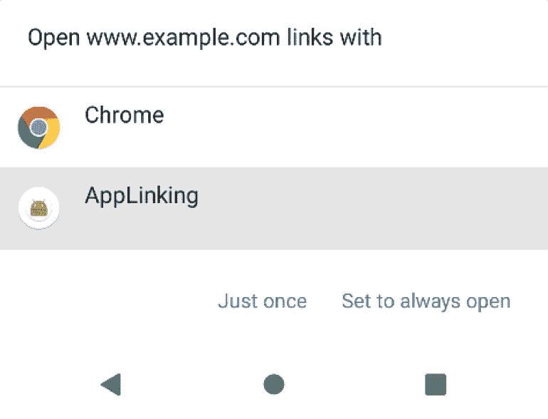

# 八十、安卓应用链接介绍

随着技术的发展，网络和移动内容之间的传统区别开始变得模糊。这一点尤其正确的一个领域是渐进式网络应用越来越受欢迎，网络应用的外观和行为非常像传统的移动应用。

另一个趋势是让移动应用中的内容可以在网络搜索中通过网址链接被发现。在安卓应用开发的背景下，应用链接功能旨在使用户更容易发现和访问存储在安卓应用中的内容，即使用户没有安装该应用。

80.1 安卓应用链接概览

应用链接是一个标准的 HTTP 网址，旨在作为一种简单的方式，从外部来源(如网站或应用)直接链接到应用中的特定位置。应用链接(也称为深度链接)主要用于鼓励用户参与应用，并允许用户共享应用内容。

应用链接实施是一个多步骤的过程，包括向项目清单添加意图过滤器、在相关应用活动中实施链接处理代码以及使用数字资产文件来关联应用和基于网络的内容。

这些步骤可以通过在项目中进行更改来手动执行，也可以使用AndroidStudio应用链接助手自动执行。

本章的剩余部分将根据项目需要进行的更改概述应用链接的实现。下一章([“一个AndroidStudio应用链接教程”](81.html#_idTextAnchor1500))将演示如何使用应用链接助手来达到同样的效果。

80.2 应用链接意图过滤器

应用链接网址需要映射到应用项目中的特定活动。这是通过向项目的 AndroidManifest.xml 文件添加意图过滤器来实现的，该文件旨在启动一个活动来响应 android.intent.action.VIEW 操作。意图过滤器在要启动的活动的元素中声明，并且必须包含概述应用链接 URL 的方案、主机和路径的数据。例如，以下清单片段声明了一个意图过滤器，用于在检测到与 http://www.example.com/welcome 匹配的应用链接时启动名为 MyActivity 的活动:

```java
 <activity android:name="com.ebookfrenzy.myapp.MyActivity">

    <intent-filter>
        <action android:name="android.intent.action.VIEW" />
        <category android:name="android.intent.category.DEFAULT" />
        <category android:name="android.intent.category.BROWSABLE" />

        <data
            android:scheme="http"
            android:host="www.example.com"
            android:pathPrefix="/welcome" />
    </intent-filter>
</activity>
```

可以使用意图过滤器标记的 order 属性指定处理模糊意图过滤器的顺序，如下所示:

```java
<application>
    <activity android:name=" com.ebookfrenzy.myapp.MyActivity">
        <intent-filter android:order="1">
.
.
```

意图过滤器将导致应用链接启动正确的活动，但是仍然需要在目标活动中实现代码来适当地处理意图。

80.3 处理应用链接意图

在大多数情况下，启动的活动将需要获得对应用链接网址的访问权限，并根据网址的结构采取具体行动。继续上面的示例，当通过包含/welcome/newuser 路径的 URL 启动时，活动很可能会显示不同于路径设置为/welcome/existinguser 的内容。

当链接启动活动时，它会被传递一个意图对象，该对象包含有关启动活动的操作的数据，包括一个包含应用链接 URL 的 Uri 对象。在活动的初始化阶段，可以添加代码来提取这些数据，如下所示:

```java
Intent appLinkIntent = getIntent();
String appLinkAction = appLinkIntent.getAction();
Uri appLinkData = appLinkIntent.getData();
```

获取了应用链接的 Uri 后，组成该 URL 路径的各种组件可以用来决定在活动中要执行的操作。在下面的代码示例中，URL 的最后一个组件用于标识应该为新用户还是现有用户显示内容:

```java
String userType = appLinkData.getLastPathSegment();

if (userType.equals("newuser")) {
    // display new user content
} else {
    // display existing user content
}
```

80.4 将应用与网站相关联

默认情况下，安卓将使用[图 80-1](#_idTextAnchor1498) 所示的面板为用户提供一系列处理应用链接的选项。这通常包括 Chrome 浏览器和目标应用。



图 80-1

为了防止这种情况发生，应用链接网址需要与应用链接所基于的网站相关联。这是通过创建一个名为 assetlink . JSON的数字资产链接文件 并将其安装在网站的。知名文件夹。请注意，数字资产链接仅适用于基于 https 的网站。

数字资产链接文件包括一个关系声明，授予使用网站链接 URL 启动目标应用的权限，以及一个目标声明，声明该项目的配套应用包名称和 SHA-256 证书指纹。例如，典型的资产链接文件可能如下所示:

```java
[{
    "relation": ["delegate_permission/common.handle_all_urls"],
    "target" : { "namespace": "android_app",
      "package_name": "<app package name here>",
                 "sha256_cert_fingerprints": ["<app certificate here>"] }
}]  
```

assetlinks.json 文件可以包含多个数字资产链接，有可能允许一个网站与多个配套应用相关联。

80.5 总结

安卓应用链接允许通过外部网站和其他应用的网址链接启动应用活动。应用链接使用项目清单文件中的意图过滤器和启动的活动中的意图处理代码的组合来实现。还可以通过使用数字资产链接文件，将应用链接中使用的域名与相应的网站相关联。一旦关联建立，当使用应用链接时，安卓不再需要要求用户选择目标应用。