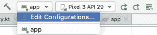
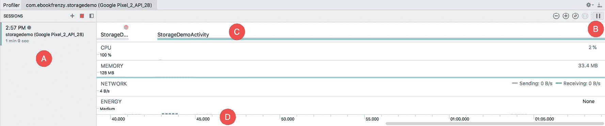
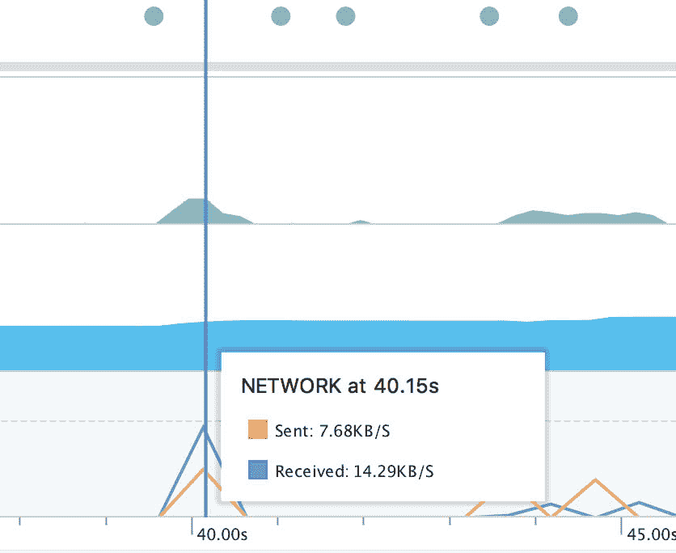
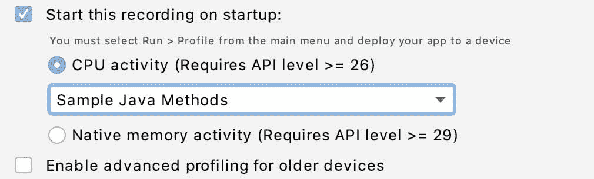
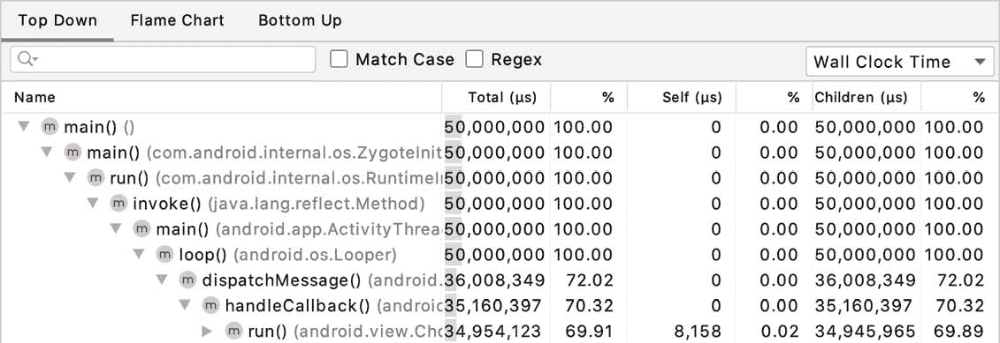
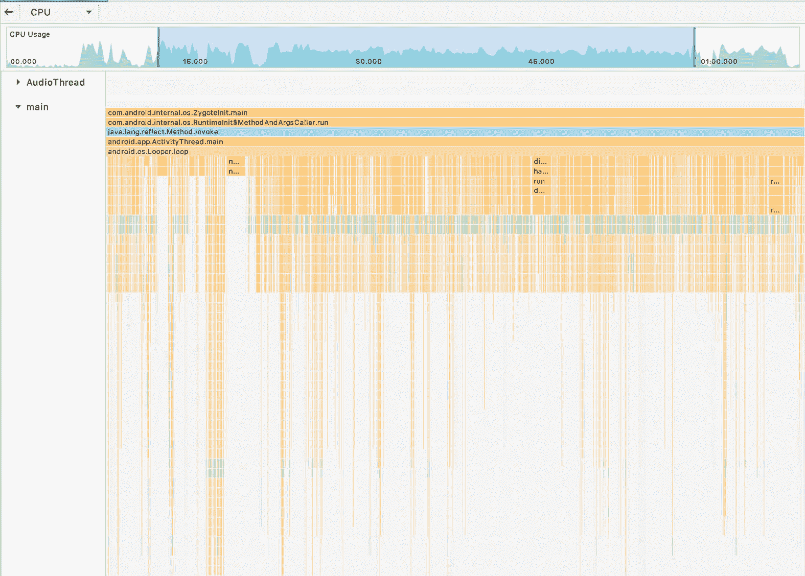

82.AndroidStudio评测器指南

在AndroidStudio 3.0 中推出的安卓评测器提供了一种在设备或仿真器上运行时实时监控应用的中央处理器、网络和内存指标的方法。这是执行任务的宝贵工具，例如识别应用中的性能瓶颈、检查应用是否适当使用内存资源以及确保应用不会使用过多的网络数据带宽。本章将提供 Android Profiler 的导游，以便您可以开始使用它来监控您自己的应用的行为和性能。

82.1 访问安卓概述

安卓探查器出现在一个工具窗口中，该窗口可以使用查看->工具窗口->安卓探查器菜单选项启动，也可以通过显示AndroidStudio工具窗口的任何常用工具栏选项启动。一旦显示，轮廓工具窗口将出现，如图 82-1[所示:](#_idTextAnchor1523)

图 82-1

在上图中，没有在任何连接的设备或当前运行的模拟器上检测到任何进程。要查看分析信息，需要启动一个应用。但是，在此之前，可能需要配置项目，以便能够收集高级分析信息。

82.2 启用高级配置

如果应用是使用早于 API 26 的 SDK 构建的，则有必要在编译期间插入一些额外的监控代码来构建应用，以便能够监控 Android Profiler 支持的所有指标。要启用高级分析，首先使用 Android Studio 工具栏中的菜单编辑构建目标的构建配置设置，如图 82-2 所示:

图 82-2

在运行/调试配置对话框中，选择分析选项卡并启用启用高级分析选项，然后单击应用和确定按钮。

82.3 安卓评测器工具窗口

在[图 82-3](#_idTextAnchor1529) 中显示了一个监控正在运行的应用的活动 Profiler 工具窗口。

图 82-3

会话面板(标记为 A)列出了当前的分析会话和自AndroidStudio上次启动以来执行的任何其他存储会话。“会话”面板右侧是实时分析窗口。除非使用“实时”按钮暂停，否则窗口将继续滚动，显示最新的指标。第二次点击按钮将跳转到当前时间并继续滚动。水平滚动可用于在录制的时间线内手动来回移动。

窗口的第一行(C)是事件时间线，显示应用活动状态的变化以及其他事件，如用户触摸屏幕、键入文本或更改设备方向。底部的时间线(D)显示了自应用启动以来经过的时间。

其余时间线显示了 CPU、内存、网络和能源使用的实时数据。将鼠标指针悬停在时间线上的任意点上(不点击)将显示类似于[图 82-4](#_idTextAnchor1530) 所示的附加信息。

图 82-4

单击中央处理器、内存、网络或能源时间线将显示相应的探查器窗口，本章的其余部分将对其中的每一个进行探讨。

82.4会话面板

当应用正在运行，并且显示“探查器”工具窗口时，探查器将自动附加到应用并开始进行探查。显示应用名称、运行该应用的设备或仿真器以及开始时间的条目将出现在会话面板中，如图 82-5 所示。时间旁边的绿色圆圈表示当前活动的分析会话。按红色停止按钮将结束当前会话，但数据和图形将保持可供浏览，直到AndroidStudio退出。通过单击+按钮并选择设备和应用，可以启动其他分析会话:

图 82-5

时间旁边的绿色圆圈表示当前活动的分析会话。按红色停止按钮将结束当前会话，但数据和图形将保持可供浏览，直到AndroidStudio退出。通过单击+按钮并选择设备和应用，可以启动其他分析会话:

图 82-6

从文件加载...菜单选项允许将以前从 CPU 探查器中保存的 CPU 跟踪加载到探查器中进行检查。

要在应用启动时自动启动分析(而不是在应用启动后手动启动分析会话)，首先打开运行/调试配置对话框，如上面的[图 82-2](#_idTextAnchor1526) 所示。

在对话框中，选择分析屏幕，并启用启动时开始此记录和 CPU 活动选项:

图 82-7

要使此设置生效，应用必须使用AndroidStudio运行->配置文件“应用”菜单选项启动。

82.5 中央处理器剖析器

显示时，将出现 CPU Profiler 窗口，如图[图 82-8](#_idTextAnchor1536) 所示。与主窗口一样，数据是实时显示的，包括事件时间线(A)和滚动图表，该图表实时显示当前应用的 CPU 使用情况(B)以及设备上所有其他进程的总和:

图 82-8

图表下方是与当前应用相关联的所有线程的列表。称为线程活动时间线，它也采用滚动时间线的形式，以彩色块的形式显示每个线程的状态(绿色表示活动，黄色表示活动但等待磁盘或网络 I/O 操作完成，灰色表示线程当前正在休眠)。

中央处理器分析器支持两种类型的方法跟踪(换句话说，在运行的应用中分析单个方法)。使用标记为 d 的菜单选择当前的跟踪类型，无论是采样的还是检测的。跟踪类型可以总结如下:

采样(Java)–以频繁的时间间隔捕获方法调用堆栈，为 Java 代码执行收集跟踪数据。虽然采样跟踪比检测跟踪的侵入性小，但如果方法调用发生在捕获间隔期间，采样跟踪可能会错过方法调用。通过选择类型选择菜单中的编辑配置…按钮并创建新的自定义跟踪类型，可以更改快照频率。

仪表化(Java)–跟踪在运行的应用中执行的所有 Java 方法调用的开始和结束。这样做的好处是在分析过程中不会遗漏任何方法调用，但由于跟踪所有方法调用的开销，可能会影响应用性能，从而导致误导性的性能数据。

采样(本机)-以频繁的间隔捕获方法调用堆栈，以收集应用中本机(例如 C 或 C++)代码执行的跟踪数据。

系统跟踪-描述应用运行时设备上的系统级 CPU 和线程活动(换句话说，CPU 活动发生在应用进程之外)。

方法跟踪直到单击记录按钮(E)才开始，并持续到记录停止。一旦记录完成，Profiler 工具窗口将以调用图格式显示方法跟踪，如图 82-12 所示，包括方法执行时间的信息。记录的跟踪也将出现在“会话”面板中。点击磁盘图标(如下图[82-9](#_idTextAnchor1537)所示)可将跟踪保存到文件中，以便在剖面仪中进行进一步检查，如本章前面所述:

图 82-9

可以在自上而下、自下而上、调用图和火焰图模式下查看跟踪结果，每种模式可总结如下:

自上而下–以分层格式显示跟踪期间调用的方法。选择一个方法将展开层次结构的下一层，并显示该方法调用的任何方法:

图 82-10

自下而上–显示跟踪期间调用的方法的倒层次列表。选择一个方法会显示调用所选方法的方法列表:

图 82-11

调用图–提供方法跟踪列表的图形表示，其中横轴表示方法调用的开始、结束和持续时间。在垂直轴中，每一行代表由上面的方法调用的方法。应用中包含的方法显示为绿色，API 方法显示为橙色，第三方方法显示为蓝色:

图 82-12

火焰图–提供一个倒置的图形表示方法跟踪列表，其中每个方法在水平轴上的大小基于该方法相对于其他方法的执行时间。图表中较宽的条目表示相对于其他方法使用最多执行时间的方法，这使得识别哪些方法花费最多时间来完成变得容易。请注意，具有匹配调用堆栈的方法调用(换句话说，方法作为前面方法调用的相同序列的结果被重复调用的情况)在此视图中被组合，以提供跟踪期间方法性能的整体表示:

图 82-13

右键单击上述任何视图中的方法条目，可以在代码编辑窗口中打开该方法的源代码。

82.6 记忆轮廓仪

当在安卓 profiler 工具主窗口中点击内存时间线时，内存 Profiler 显示出来，如图[图 82-14](#_idTextAnchor1542) 所示:

图 82-14

内存时间线显示相对于时间线右侧刻度的内存分配，用于由颜色键指示的一系列不同类别。虚线(A)表示相对于时间线图左侧的比例，为应用分配的对象数量。

垃圾桶图标(B)表示垃圾收集事件。当安卓运行时决定不再需要驻留在内存中的对象并自动移除它以释放内存时，就会发生垃圾收集事件。

除了通常的时间线之外，该窗口还包括强制垃圾收集事件和捕获堆转储的按钮(C)。

堆转储([图 82-15](#_idTextAnchor1544) )列出了执行转储时应用中使用内存的所有对象，显示了堆中对象的实例数量(分配计数)、对象所有实例的大小(浅大小)以及安卓运行时系统为这些对象保留的内存总量(保留大小 e)。

图 82-15

双击堆列表中的对象将显示实例视图面板(在[图 82-16](#_idTextAnchor1546) 中标记为 A)，显示该对象在应用中的实例列表。从列表中选择一个实例将显示“引用”面板(B)，列出对象被引用的位置。[例如，图 82-16](#_idTextAnchor1546) 显示一个字符串实例已被选中，并被一个名为 myString 的变量引用，该变量位于 a pp 的 MainActivity 类中:

图 82-16

右键单击引用将提供转到堆列表中的 MainActivity 类的选项，或者跳转到该类的源代码。

82.7 网络侧写T2】

网络分析器是安卓分析器提供的最简单的工具。选择后，网络工具窗口出现，如图 82-17[所示:](#_idTextAnchor1548)

图 82-17

与其他事件探查器窗口一样，“网络事件探查器”窗口包含一个事件时间线。收音机时间线(在[图 82-17](#_idTextAnchor1548) 中标记为 A)显示了收音机相对于无线连接的电源状态(如果有)。

时间线图(B)包括发送和接收的数据以及当前连接数的计数。在撰写本文时，网络分析器只能监视由于 Http 连接和基于 OkHttp 的连接而执行的网络活动。

要查看发送或接收的文件信息，请单击并拖动时间线以选择一段时间。完成选择后，将出现图 82-18 中标记为“A”的面板，列出文件。从列表中选择一个文件将显示详细面板(B)，从该面板中可以获得附加信息，包括响应、标题和调用堆栈信息:

图 82-18

82.8 能量剖面仪

能量分析器([图 82-19](#_idTextAnchor1552) )对当前运行的应用使用的能量进行实时分析，这些应用按照中央处理器、网络和位置跟踪活动进行分类。

图 82-19

能量分析器包括事件时间线(A)和指示当前能量使用的图表(B)。该图基于键(C)进行着色，键(C)还指示三个类别的当前能源使用水平。选择图表的一部分将列出导致过度能源使用的任何系统进程，例如警报和作业、位置请求或唤醒锁。

82.9 总结

安卓探查器实时监控应用的中央处理器、内存、网络和能源资源使用情况，提供一个可视化环境来定位内存泄漏、性能问题以及过度或低效的电池使用或网络连接上的数据传输。安卓配置文件由不同的配置文件视图组成，允许监控、记录和分析详细的指标。