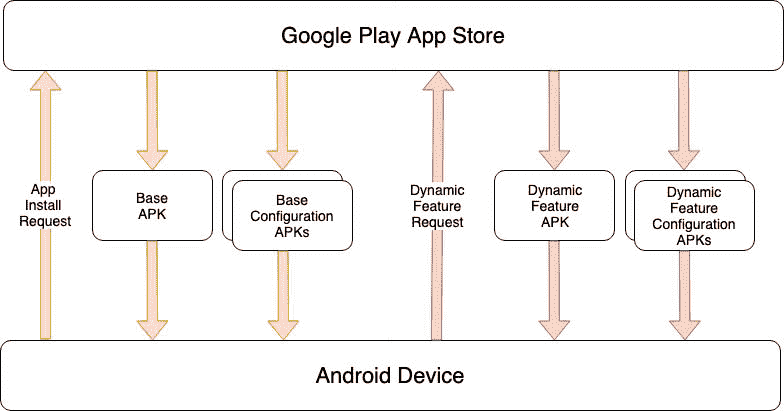
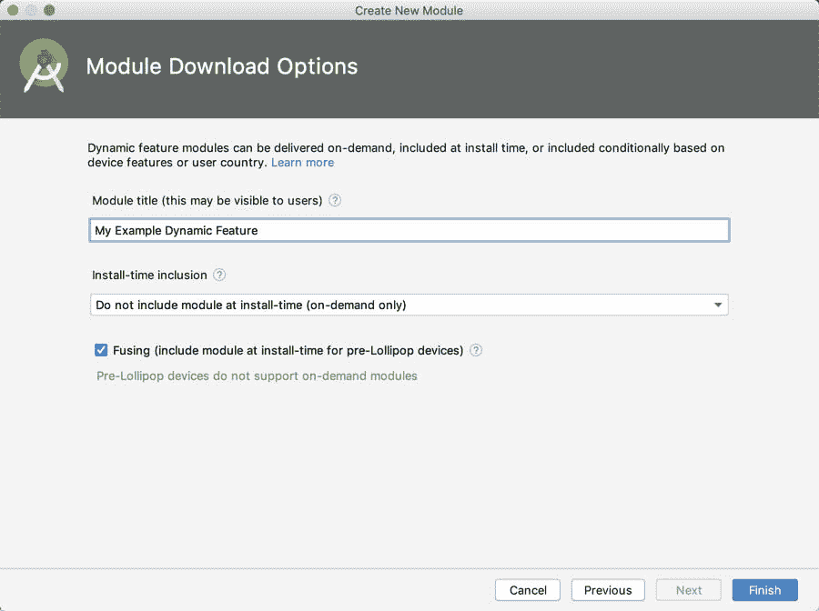
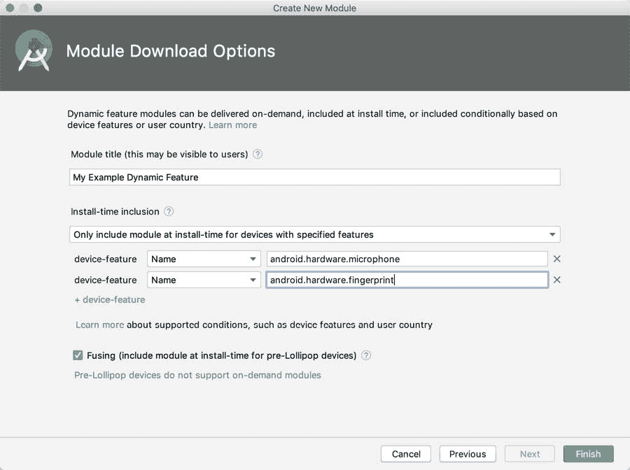
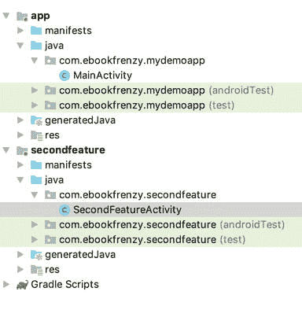

# 八十五、安卓动态功能模块概述

如前一章所述，应用捆绑包和动态交付的引入大大减少了用户在安卓设备上安装应用时需要下载的应用包文件的大小。虽然最初的目的是为每个可能的设备配置自动生成单独的包文件，但动态交付的另一个关键优势是能够将一个应用拆分为多个动态功能模块，这些模块可以按需安装。

在这一章中，我们将开始探索动态特性模块的基本概念，为下一章中的详细实例做准备。

85.1 动态特征模块概述

动态交付的主要目标是减少从应用商店安装应用所需的时间和带宽，同时确保应用安装后只占用最小的存储空间。

动态功能模块(也称为按需模块)允许将构成安卓应用的不同功能打包成单独的模块，这些模块只有在用户需要时才会下载并安装到设备上。例如，一个应用可能包含新闻和讨论功能。在这种情况下，默认情况下，应用可能只安装新闻功能，并将讨论功能分成动态功能模块。当用户试图访问讨论功能时，该应用将从谷歌游戏商店下载功能模块并启动它。如果用户从未访问该功能，则永远不会安装该模块，从而确保应用仅使用绝对最小的存储量。

利用动态功能模块的应用可以完全控制模块的安装方式和时间。事实上，该应用还可以监控用户访问特定功能的频率，并临时删除不常用的功能。

动态特征也可以被指定为“即时”模块。这取代了早期安卓版本的即时应用概念，允许在设备上运行动态功能模块，而无需安装应用。这使得该应用可以在谷歌游戏应用商店中显示“立即尝试”按钮，或者通过点击网页网址在设备上立即启动。

85.2 动态特征模块架构

从一开始，安卓的设计就考虑到了模块化，尤其是意图和活动的概念。动态特性通过允许应用在用户需要的时候只安装用户需要的东西，将这一理念带到了一个合乎逻辑的结论。考虑到这种能力的灵活性和能力，动态特性模块的实现相对简单。

基本而言，动态功能模块是使用分割的 APK 文件构建的，它允许将多个 APK 文件放在一起形成一个应用。

正如我们在[“创建、测试和上传安卓应用捆绑包”](84.html#_idTextAnchor1573)中了解到的，动态交付和应用捆绑包通过生成一个定制的 APK 文件来工作，该文件仅包含在特定设备配置上运行应用所需的字节码和资源。在这种情况下，应用仍然通过一个 APK 文件安装，尽管是为用户设备定制的。

相比之下，动态功能模块通过将一个应用拆分成多个 APK 文件(称为拆分 APK 文件)来工作。

当应用使用分割的 APK 文件时，首次下载应用时仅安装基本模块。基本模块通过一个可启动的活动充当应用的入口点，包含应用基本功能的字节码和资源，以及应用其余部分所需的配置和构建资源。例如，基本模块清单文件包含与应用捆绑的任何动态功能模块的清单文件的合并。此外，所有动态功能模块的版本号由基本模块的构建配置文件中的版本代码设置决定。

基本模块还包括应用捆绑包中包含的动态功能模块列表，所有动态功能模块都必须在其构建配置中将基本模块作为依赖项列出。

每个动态特性都来自一个模块，该模块包含字节码、清单、资源和构建配置，以及任何其他资产，例如特定特性的图像或数据文件。

当用户从应用商店请求安装应用时，商店将为模块生成基本 APK 文件，该文件包含所有设备配置共有的所有字节码和资源，以及一组专门为用户设备配置的配置 APK 文件。类似地，安装动态功能模块的请求将生成一个动态功能 APK 文件，以及相应的配置 APK 文件，如下图[图 85-1](#_idTextAnchor1609) 所示:



图 85-1

85.3 创建动态特征模块

可以通过添加全新的模块或迁移现有模块，将动态特性添加到项目中。要添加新模块，只需选择AndroidStudio文件->新建->新模块...菜单选项。根据您正在创建的动态特征类型，从结果对话框中选择动态特征模块或即时动态特征模块模板:


图 85-2

选择适当的动态功能选项后，单击“下一步”按钮，在配置屏幕中，命名模块并更改最小API设置，使其与为基本模块选择的API级别相匹配(如果这些版本不匹配，项目将无法构建)。

再次单击“下一步”按钮配置按需选项:



图 85-3

当启用融合选项时，该模块将与基本 APK 一起下载到运行早期版本安卓(安卓 4.4 API 20 或更早版本)的设备上，这些版本早于动态交付的引入。模块标题字符串最长可达 50 个字符，谷歌 Play 将在消息和通知中向用户描述该功能时使用。

安装时包含菜单提供选项来控制按需安装模块的条件，而不是包含在用户设备上应用的初始安装中。该菜单提供以下选项:

安装时不要包含模块(仅按需)-无论设备配置和用户国家如何，在应用请求之前，模块都不会安装。

安装时包含模块-禁用所有设备和用户国家的按需动态安装。该模块将在设备上安装应用的同时安装。

对于具有指定功能的设备，仅在安装时包含模块-对于满足指定标准的设备配置和用户国家，将在安装时包含模块。所有其他国家和设备配置将使用动态按需安装。选择此选项后，将出现允许输入设备功能的额外选项。例如在[图 85-4](#_idTextAnchor1611) 中，该模块将在安装时包含在带有麦克风和指纹读取器的设备上。在所有其他设备上，该模块将按需动态安装:



图 85-4

必须在项目清单(AndroidManifest.xml)文件中声明其他标准，如国家和 API 级别。例如，以下条目将禁用法国用户和运行早于 API 21 的安卓版本的设备的动态按需功能安装:

```java
<dist:conditions>
  <dist:user-countries dist:exclude="true">
     <dist:country dist:code="FR"/>
  </dist:user-countries>
  <dist:min-sdk dist:value="21"/>
</dist:conditions>
```

85.4 将现有模块转换为动态交付

如果一个应用包含一个现有的功能，是动态交付的良好候选，它可以通过一些基本步骤转换为动态功能。例如，考虑以下项目结构:



图 85-5

在这个项目中，应用模块将作为基础模块，而第二个功能模块是转换为动态功能模块的理想候选模块。

要将您的应用中的现有模块转换为动态功能模块，首先编辑模块级 build.gradle 文件(上面示例中的 Gradle Scripts-> build . Gradle(Module:second feature))，并将其修改为使用 com.android.dynamic-feature 而不是com . Android . application plugin，并更改依赖关系，使模块仅依赖于基础(应用)模块。例如:

```java
apply plugin: 'com.android.application'
apply plugin: 'com.android.dynamic-feature'
.
.
dependencies {
    implementation fileTree(dir: 'libs', include: ['*.jar'])
    api 'androidx.appcompat:appcompat:1.0.2'
    api 'androidx.constraintlayout:constraintlayout:1.1.3'
    testImplementation 'junit:junit:4.12'
    androidTestImplementation 'androidx.test.ext:junit:1.1.1'
    androidTestImplementation 'androidx.test.espresso:espresso-core:3.2.0'
    implementation project(':app')
}
```

接下来，编辑该模块的 AndroidManifest.xml 文件，并对其进行如下修改(注意，在本例中，这是一个按需模块，而不是即时模块):

```java
<?xml version="1.0" encoding="utf-8"?>
<manifest xmlns:android="http://schemas.android.com/apk/res/android"
    xmlns:dist="http://schemas.android.com/apk/distribution"
    package="com.ebookfrenzy.mymodule">

    <dist:module
        dist:instant="false"
        dist:onDemand="true"
        dist:title="@string/title_my_dynamic_feature">
        <dist:fusing dist:include="true" />
    </dist:module>

    <application
        android:allowBackup="true"
.
.
```

注意 title 属性引用了一个字符串资源，该资源也需要在 strings.xml 文件中声明。对于此属性，必须使用字符串资源，而不是硬编码字符串

接下来，需要修改基本模块(build.gradle (Module: app))的 build.gradle 文件，以引用动态功能模块并添加 Play Core Library 作为依赖项:

```java
apply plugin: 'com.android.application'

android {
    compileSdkVersion 29
.
.
    }
    dynamicFeatures = [":secondfeature"]
}
dependencies {
.
.
    api 'com.google.android.play:core:1.5.0'
.
.
}
```

最后，编辑基本模块的 AndroidManifest.xml 文件，将该模块声明为子类 SplitCompatApplication:

```java
<?xml version="1.0" encoding="utf-8"?>
<manifest xmlns:android="http://schemas.android.com/apk/res/android"
    package="com.ebookfrenzy.mydemoapp">

    <application
        android:name=
            "com.google.android.play.core.splitcompat.SplitCompatApplication"
        android:allowBackup="true"
.
.
```

85.5 使用动态特征模块

一旦应用项目添加了一个或多个动态功能模块，就需要编写代码来安装和管理这些模块。这将涉及执行任务，例如检查模块是否已经安装、安装模块、跟踪安装进度以及删除不再需要的已安装模块。所有这些任务都是使用 Play 核心库提供的API来执行的，并且这些API调用大部分都涉及到使用 SplitInstallManager 实例，该实例可以创建如下:

```java
private SplitInstallManager manager;
manager = SplitInstallManagerFactory.create(this);
```

通常，允许用户启动动态功能之前的第一步是检查相应的模块是否已经安装。例如，以下代码获取已安装模块的列表，并检查是否安装了特定模块:

```java
if (manager.getInstalledModules().contains("my_dynamic_feature")) {
    // Module is installed
}
```

可以通过构建一个 SplitInstallRequest 对象并将其传递给 SplitInstallManager 实例的 startInstall()方法来安装一个或多个模块:

```java
.
.
private int mySessionID = 0;
.
.
SplitInstallRequest request =
        SplitInstallRequest
                .newBuilder()
                .addModule(“my_dynamic_feature”)
                .addModule(“my_dynamic_feature2”)
                .build();

manager.startInstall(request)
        .addOnSuccessListener(new OnSuccessListener<Integer>() {
            @Override
            public void onSuccess(Integer sessionId) {
                mySessionID = sessionId
            }
        })
        .addOnFailureListener(new OnFailureListener() {
            @Override
            public void onFailure(Exception exception) {
            }
        });
```

执行上述代码后，模块安装将立即开始。或者，可以通过将功能模块名称数组传递给 deferredInstall()方法来执行延迟安装，如下所示:

```java
manager.deferredInstall(Arrays.asList(“my_dynamic_feature”, 
                                          “my_dynamic_feature2”));
```

延迟下载由操作系统决定在后台执行。

虽然无法跟踪延迟安装的状态，但可以通过向管理器添加侦听器来跟踪非延迟安装:

```java
SplitInstallStateUpdatedListener listener = 
                   new SplitInstallStateUpdatedListener() {
    @Override
    public void onStateUpdate(SplitInstallSessionState state) {

        if (state.sessionId() == mySessionID) {
            switch (state.status()) {
                case SplitInstallSessionStatus.REQUIRES_USER_CONFIRMATION:
			// Large module requires user permission
                    break;

                case SplitInstallSessionStatus.DOWNLOADING: 
			// The module is being downloaded
                    break;

                case SplitInstallSessionStatus.INSTALLING:
			// The downloaded module is being installed
                    break;

                case SplitInstallSessionStatus.DOWNLOADED:
                    // The module download is complete
                    break;

                case SplitInstallSessionStatus.INSTALLED:
                    // The module has been installed successfully
                    break;

                case SplitInstallSessionStatus.CANCELED:
			// The user cancelled the download
                    break;

                case SplitInstallSessionStatus.PENDING:
			// The installation is deferred
                    break;

                case SplitInstallSessionStatus.FAILED:
                    // The installation failed
            }
        }
    }
};
```

一旦实现了侦听器，它将需要向 SplitInstallManager 实例注册，然后在不再需要时取消注册。

```java
manager.registerListener(listener);
.
.
manager.unregisterListener(listener);
```

85.6 处理大型动态特征模块

安卓动态交付系统不允许在没有首先请求用户许可的情况下下载大于 10MB 的动态功能模块。当请求下载一个大的特性模块时，监听器将被调用并被传递一个 REQUIRES_USER_CONFIRMATION 状态。然后，应用负责显示确认对话框，并可选地实现一个 onActivityResult()处理程序方法来识别用户是批准还是拒绝下载。

```java
private static final int REQUEST_CODE = 101;
.
.
SplitInstallStateUpdatedListener listener = 
                        new SplitInstallStateUpdatedListener() {
    @Override
    public void onStateUpdate(SplitInstallSessionState state) {

        if (state.sessionId() == mySessionID) {
            switch (state.status()) {

                case SplitInstallSessionStatus.REQUIRES_USER_CONFIRMATION:
                    try {
                        manager.startConfirmationDialogForResult(state, 		
					MainActivity.this, REQUEST_CODE);
                    } catch (IntentSender.SendIntentException ex) {
                        // Request failed
                    }
                    break;
.
.
```

上面的代码启动一个意图，然后显示内置的确认对话框。这一意图将向 onActivityResult()方法返回一个结果代码，该方法可以如下实现:

```java
@Override
public void onActivityResult(int requestCode, int resultCode, Intent data) {
    if (requestCode == REQUEST_CODE) {
        if (resultCode == RESULT_OK) {
            // User approved installation
        } else {
            // User declined installation
        }
    }
}
```

如果用户批准该请求，将自动下载并安装动态功能模块。

85.7 总结

动态功能模块允许将安卓应用分成独立的功能，并在用户需要时按需下载。动态功能模块也可以配置为即时功能。即时功能无需在设备上安装应用即可运行，用户可以通过应用商店页面上的“立即试用”按钮或网络网址进行访问。

动态功能实现包括将一个应用拆分为一个基本模块和一个或多个动态功能模块。可以在 Android Studio 内创建新的动态功能模块，通过进行一些项目配置更改，将现有模块转换为动态功能模块。

一旦将动态功能模块添加到应用中，这些模块的下载和管理就由应用通过 Play Core Library 的 SplitInstall 类来处理。