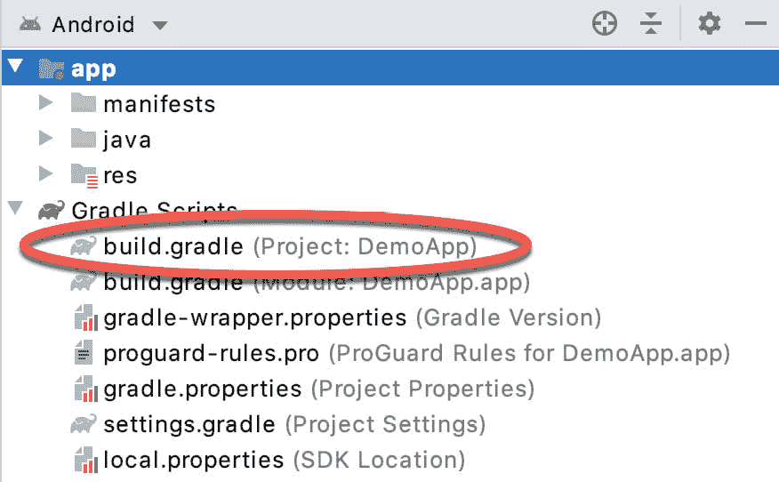

87.安卓工作室 Gradle 概述

到目前为止，安卓工作室将采取必要的步骤来编译和运行已经创建的应用程序项目，这在很大程度上是理所当然的。安卓工作室一直在使用一个名为 Gradle 的系统在后台实现这一点。

现在是时候看看如何使用 Gradle 来编译和打包应用程序项目的各种元素，并开始探索当在 Android Studio 中构建项目需要更高级的需求时，如何配置该系统。

87.1 渐变概述

Gradle 是一个自动化的构建工具包，它允许通过一组构建配置文件来配置和管理构建项目的方式。这包括定义如何构建项目，成功构建项目需要满足哪些依赖性，以及构建过程的最终结果应该是什么。

Gradle 的优势在于它为开发人员提供的灵活性。Gradle 系统是一个独立的、基于命令行的环境，可以通过使用插件集成到其他环境中。在安卓工作室的情况下，Gradle 集成是通过适当命名的安卓工作室插件提供的。

尽管安卓工作室插件允许从安卓工作室内部启动和管理 Gradle 任务，但 Gradle 命令行包装器仍可用于构建基于安卓工作室的项目，包括在未安装安卓工作室的系统上。

构建项目的配置规则在基于 Groovy 编程语言的 Gradle 构建文件和脚本中声明。

87.2 Gradle 和安卓工作室

Gradle 为构建安卓应用项目带来了许多强大的功能。一些关键特性如下:

87.2.1 合理违约

Gradle 实现了一个被称为约定优于配置的概念。这仅仅意味着 Gradle 有一组预定义的合理的默认配置设置，除非它们被构建文件中的设置覆盖，否则将使用这些设置。这意味着可以用开发人员所需的最少配置来执行构建。只有当默认配置不能满足您的生成需求时，才需要对生成文件进行更改。

87.2.2 相关性

Gradle 功能的另一个关键领域是依赖性。例如，考虑安卓工作室项目中的一个模块，它触发了在项目中加载另一个模块的意图。第一个模块实际上依赖于第二个模块，因为如果第二个模块在运行时无法定位和启动，应用程序将无法构建。可以在第一个模块的 Gradle 构建文件中声明这种依赖关系，以便在应用程序构建中包含第二个模块，或者在找不到或构建不到第二个模块的情况下标记错误。依赖关系的其他例子是项目为了编译和运行而依赖的库和 JAR 文件。

梯度依赖可以分为本地或远程。本地依赖项引用正在其上执行构建的计算机系统的本地文件系统上存在的项。远程依赖关系是指远程服务器(通常称为存储库)上存在的项目。

使用另一个名为 Maven 的项目管理工具来处理安卓工作室项目的远程依赖关系。如果使用 Maven 语法在 Gradle 构建文件中声明了远程依赖项，则该依赖项将自动从指定的存储库中下载并包含在构建过程中。例如，下面的依赖项声明会将 AppCompat 库从 Google 存储库添加到项目中:

```java
implementation 'androidx.appcompat:appcompat:1.2.0' 
```

87.2.3 建造变体

除了依赖关系，Gradle 还为 Android Studio 项目提供构建变体支持。这允许从单个项目构建应用程序的多种变体。安卓在许多不同的设备上运行，包括一系列处理器类型和屏幕尺寸。为了针对尽可能广泛的设备类型和尺寸，通常需要构建多种不同的应用程序变体(例如，一种具有手机用户界面，另一种具有平板电脑大小的屏幕)。通过使用 Gradle，现在这在 Android Studio 中是可能的。

87.2.4 清单条目

每个安卓工作室项目都与一个包含应用程序配置细节的 AndroidManifest.xml 文件相关联。可以在 Gradle 构建文件中指定许多清单条目，然后在构建项目时自动生成到清单文件中。这一功能是对构建变体功能的补充，允许为每个构建变体不同地配置应用程序版本号、应用程序标识和软件开发工具包版本信息等元素。

87.2.5 APK 签约

名为[“创建、测试和上传安卓应用捆绑包”](84.html#_idTextAnchor1573)的章节介绍了使用安卓工作室环境创建一个已签署的 APK 版本文件。还可以将通过 Android Studio 用户界面输入的签名信息包含在 Gradle 构建文件中，这样就可以从命令行生成签名的 APK 文件。

87 . 2 . 6Prog guard 支持

ProGuard 是 Android Studio 附带的一个工具，可以优化、缩小和混淆 Java 字节码，使其更高效，更难进行逆向工程(通过分析编译后的 Java 字节码，其他人可以识别应用程序逻辑的方法)。Gradle 构建文件提供了在构建应用程序时控制其是否运行的能力。

87.3 顶级梯度构建文件

一个完整的安卓工作室项目包含了构建安卓应用程序所需的一切，并由模块、库、清单文件和 Gradle 构建文件组成。

每个项目都包含一个顶级的 Gradle 构建文件。该文件被列为 build.gradle(项目:<project name="">)，可以在项目工具窗口中找到，如图 87-1 中突出显示的:</project>



图 87-1

默认情况下，顶级渐变构建文件的内容如下所示:

```java
// Top-level build file where you can add configuration options common to all sub-projects/modules.
buildscript {
    repositories {
        google()
        jcenter()
    }
    dependencies {
        classpath "com.android.tools.build:gradle:4.1.0-rc03"
        // NOTE: Do not place your application dependencies here; they belong
        // in the individual module build.gradle files
    }
}
allprojects {
    repositories {
        google()
        jcenter()
    }
}
task clean(type: Delete) {
    delete rootProject.buildDir
} 
```

目前，该文件所做的只是声明远程库将使用 jcenter 存储库获得，并且构建依赖于 Gradle 的 Android 插件。在大多数情况下，没有必要对此生成文件进行任何更改。

87.4 模块级梯度构建文件

安卓工作室应用项目由一个或多个模块组成。例如，假设一个名为 GradleDemo 的应用程序项目，它包含两个分别名为 Module1 和 Module2 的模块。在这种情况下，每个模块都需要自己的 Gradle 构建文件。就项目结构而言，这些设施的位置如下:

模块 1/构建.梯度

模块 2/构建.梯度

默认情况下，Module1 build.gradle 文件类似于下面的列表:

```java
plugins {
    id 'com.android.application'
}
android {
    compileSdkVersion 29
    buildToolsVersion "30.0.0"
    defaultConfig {
        applicationId "com.ebookfrenzy.demoapp"
        minSdkVersion 26
        targetSdkVersion 29
        versionCode 1
        versionName "1.0"
        testInstrumentationRunner "androidx.test.runner.AndroidJUnitRunner"
    }
    buildTypes {
        release {
            minifyEnabled false
            proguardFiles getDefaultProguardFile('proguard-android-optimize.txt'), 'proguard-rules.pro'
        }
    }
    compileOptions {
        sourceCompatibility JavaVersion.VERSION_1_8
        targetCompatibility JavaVersion.VERSION_1_8
    }
}
dependencies {
    implementation 'androidx.appcompat:appcompat:1.2.0'
    implementation 'com.google.android.material:material:1.2.1'
    implementation 'androidx.constraintlayout:constraintlayout:2.0.1'
    testImplementation 'junit:junit:4.+'
    androidTestImplementation 'androidx.test.ext:junit:1.1.2'
    androidTestImplementation 'androidx.test.espresso:espresso-core:3.3.0'
}
```

从文件内容可以明显看出，构建文件从声明使用 Gradle Android 应用程序插件开始:

```java
plugins {
    id 'com.android.application'
```

然后，文件的 android 部分陈述了 SDK 的版本和构建 Module1 时要使用的构建工具。

```java
android {
    compileSdkVersion 29
    buildToolsVersion "30.0.0"
```

defaultConfig 部分中声明的项定义了在构建过程中要生成到模块的 AndroidManifest.xml 文件中的元素。这些设置可能会在构建文件中进行修改，它们取自首次创建模块时在 Android Studio 中输入的设置:

```java
defaultConfig {
    applicationId "com.ebookfrenzy.demoapp"
    minSdkVersion 26
    targetSdkVersion 29
    versionCode 1
    versionName "1.0"
    testInstrumentationRunner "androidx.test.runner.AndroidJUnitRunner"
}
```

“构建类型”部分包含在构建应用程序的发布版本时，是否以及如何在 APK 文件上运行 ProGuard 的说明:

```java
buildTypes {
    release {
        minifyEnabled false
        proguardFiles getDefaultProguardFile('proguard-android-optimize.txt'), 'proguard-rules.pro'
    }
}
```

按照当前的配置，当构建 Module1 时，ProGuard 将不会运行。要启用 ProGuard，需要将 minifyEnabled 条目从 false 更改为 true。proguard-rules.pro 文件可以在项目的模块目录中找到。对此文件所做的更改会覆盖 proguard-android.txt 文件中的默认设置，该文件位于 sdk/tools/proguard 下的 Android SDK 安装目录中。

由于此文件中没有声明调试构建类型，因此将使用默认值(在没有 ProGuard 的情况下构建，使用调试密钥签名并启用调试符号)。

模块构建文件中还可能包含一个名为 productFlavors 的附加部分，以便创建多个构建变体。

接下来，包含指令来指定构建项目时要使用的 Java 编译器的版本:

```java
compileOptions {
    sourceCompatibility JavaVersion.VERSION_1_8
    targetCompatibility JavaVersion.VERSION_1_8
}
```

最后，依赖项部分列出了模块依赖的任何本地和远程依赖项。上面示例文件中的依赖行指定了需要包含在安卓存储库中的安卓库:

```java
.
.
implementation 'androidx.core:core-ktx:1.3.1'
implementation 'androidx.appcompat:appcompat:1.2.0'
.
.
```

请注意，依赖声明包含版本号，以指示应该包含哪个版本的库。

87.5 在构建文件中配置签名设置

本书的[“创建、测试和上传安卓应用捆绑包”](84.html#_idTextAnchor1573)一章讲述了使用安卓工作室用户界面设置密钥和生成签名版本 APK 文件所涉及的步骤。这些设置也可以在 build.gradle 文件的 signingSettings 部分中声明。例如:

```java
.
.
    defaultConfig {
.
.
    } 
    signingConfigs {
        release {
            storeFile file("keystore.release")
            storePassword "your keystore password here"
            keyAlias "your key alias here"
            keyPassword "your key password here"
        }
    }
    buildTypes {
.
.
.
}
```

上面的示例将密钥密码信息直接嵌入到构建文件中。这种方法的一种替代方法是从系统环境变量中提取这些值:

```java
signingConfigs {
    release {
        storeFile file("keystore.release")
        storePassword System.getenv("KEYSTOREPASSWD")            
        keyAlias "your key alias here"
        keyPassword System.getenv("KEYPASSWD")
    }
}
```

还有一种方法是配置构建文件，以便 Gradle 在构建过程中提示输入密码:

```java
signingConfigs {
    release {
        storeFile file("keystore.release")
        storePassword System.console().readLine
                 ("\nEnter Keystore password: ")        
        keyAlias "your key alias here"
        keyPassword System.console().readLIne("\nEnter Key password: ")
    }
}
```

87.6 从命令行运行渐变任务

每个安卓工作室项目都包含一个渐变包装工具，用于允许从命令行调用渐变任务。该工具位于每个项目文件夹的根目录中。虽然这个包装器在 Windows 系统上是可执行的，但是在使用之前，它需要在 Linux 和 macOS 上启用执行权限。要启用执行权限，请打开终端窗口，将目录更改为需要包装的项目文件夹，并执行以下命令:

```java
chmod +x gradlew
```

一旦文件有了执行权限，文件的位置要么需要添加到$PATH 环境变量中，要么需要以。/以便运行。例如:

```java
./gradlew tasks
```

Gradle 根据许多不同的任务来查看项目构建。通过在项目目录中运行以下命令，可以获得当前项目可用任务的完整列表(如果在 macOS 或 Linux 上运行，请记住在命令前加一个/前缀):

```java
gradlew tasks
```

要构建适用于设备或仿真器测试的项目调试版本，请使用汇编错误选项:

```java
gradlew assembleDebug
```

或者，要构建应用程序的发布版本:

```java
gradlew assembleRelease
```

87.7 总结

在很大程度上，安卓工作室在后台执行应用程序构建，无需开发人员的任何干预。这个构建过程使用 Gradle 系统来处理，Gradle 系统是一个自动化的构建工具包，旨在允许通过一组构建配置文件来配置和管理构建项目的方式。虽然 Gradle 的默认行为足以满足许多基本的项目构建需求，但是对于更复杂的项目，配置构建过程的需求是不可避免的。本章概述了安卓工作室项目中的 Gradle 构建系统和配置文件。