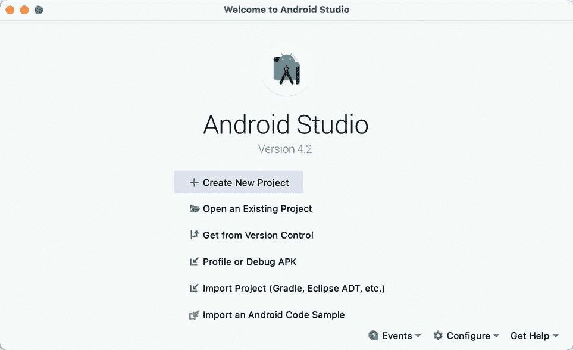
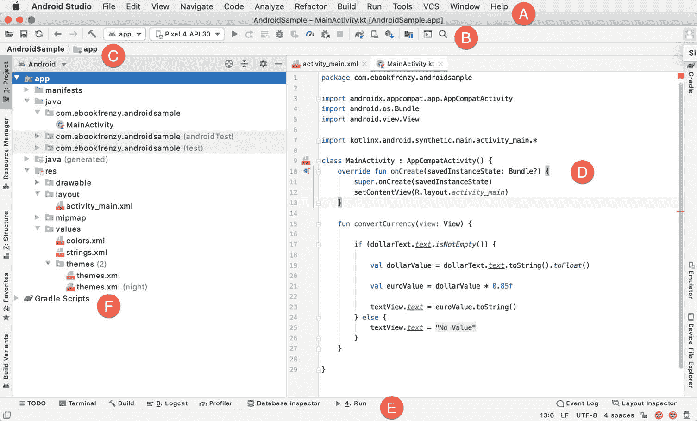
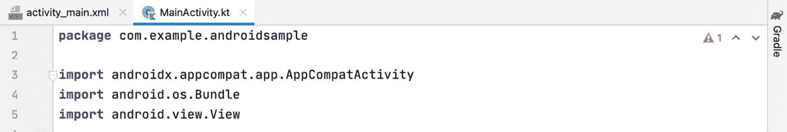
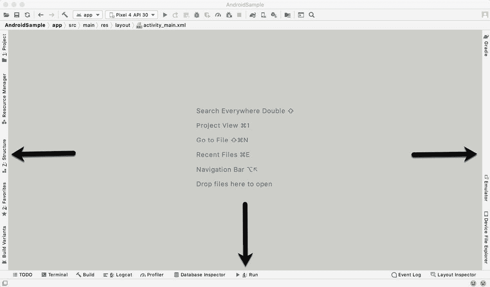
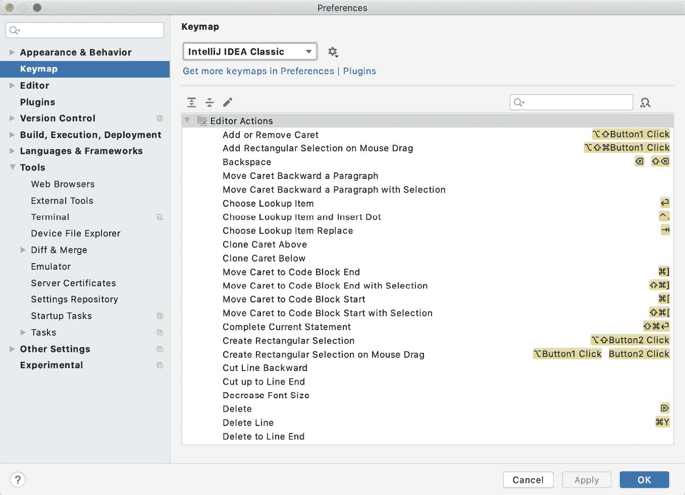
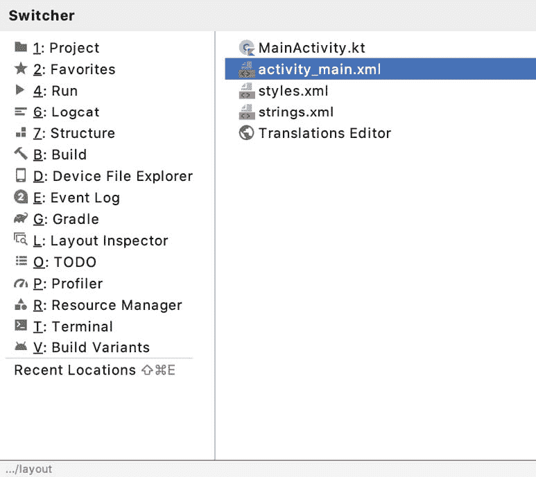
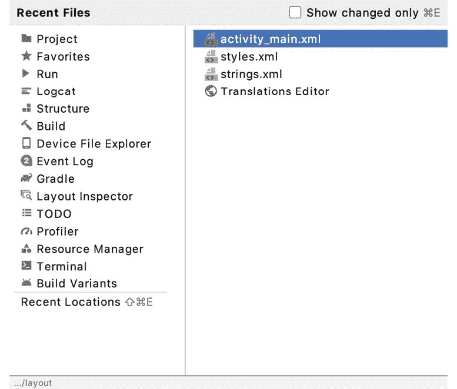

# 六、AndroidStudio 用户界面之旅

虽然很容易投入运行前一章创建的示例应用，但这样做涉及到使用 AndroidStudio 用户界面的一些方面，这些方面最好提前描述。

AndroidStudio 是一个功能强大、功能丰富的开发环境，在很大程度上使用起来很直观。也就是说，现在花时间熟悉 AndroidStudio 用户界面的布局和组织，将大大缩短本书后面章节的学习曲线。考虑到这一点，本章将对构成 AndroidStudio 环境的各个领域和组件进行初步概述。

6.1 欢迎屏幕

欢迎屏幕([图 6-1](#_idTextAnchor137) )在 AndroidStudio 运行的任何时候显示，当前没有打开的项目(打开的项目可以通过选择文件- >关闭项目菜单选项随时关闭)。如果 AndroidStudio 先前在项目仍处于打开状态时退出，该工具将在下次启动时绕过欢迎屏幕，自动打开先前活动的项目。

图 6-1

除了最近项目的列表之外，“快速入门”菜单还提供了一系列选项，用于执行任务，如打开、创建和导入项目，以及访问当前受版本控制的项目。此外，窗口底部的配置菜单提供了对软件开发工具包管理器的访问，以及大量的设置和配置选项。回顾一下这些选项，很快就会发现，AndroidStudio 几乎没有任何方面不能根据您的特定需求进行配置和定制。

“配置”菜单还包括一个选项，用于检查 AndroidStudio 的更新是否可供下载。

6.2 主窗口

当一个新的项目被创建，或者一个现有的项目被打开，AndroidStudio 主窗口将会出现。当多个项目同时打开时，将为每个项目分配自己的主窗口。窗口的精确配置将根据项目上次打开时显示的工具和面板而有所不同，但通常类似于图 6-2 中的。

图 6-2

主窗口的各种元素可以总结如下:

a–菜单栏–包含一系列用于在 AndroidStudio 环境中执行任务的菜单。

b–工具栏–常用操作的快捷方式选择。工具栏按钮可以更快地访问一组选定的菜单栏操作。可以通过右键单击工具栏并选择自定义菜单和工具栏…菜单选项来自定义工具栏。如果工具栏不可见，可以使用视图- >外观- >工具栏菜单选项显示。

c–导航栏–导航栏提供了一种在构成项目的文件和文件夹中移动的便捷方式。单击导航栏中的某个元素将会下拉一个菜单，列出该位置上可供选择的子文件夹和文件。同样，单击类名会显示一个菜单，列出该类中包含的方法。从列表中选择一个方法，将其带到代码编辑器中的相应位置。使用视图- >外观- >导航栏菜单选项隐藏和显示此栏。

d–编辑器窗口–编辑器窗口显示开发人员当前正在处理的文件的内容。然而，在此位置显示的内容会受到上下文的影响。例如，当编辑代码时，将出现代码编辑器。另一方面，当处理用户界面布局文件时，将出现用户界面布局编辑器工具。当打开多个文件时，每个文件由位于编辑器顶部边缘的选项卡表示，如图[图 6-3](#_idTextAnchor142) 所示。

图 6-3

e–状态栏–状态栏显示关于项目和 AndroidStudio 活动的信息消息，以及位于最左上角的工具菜单按钮。将鼠标悬停在状态栏中的项目上将提供该字段的描述。许多字段是交互式的，允许用户单击以执行任务或获取更详细的状态信息。

f–项目工具窗口–项目工具窗口提供项目文件结构的分层概述，允许导航到要执行的特定文件和文件夹。工具栏可用于以多种不同方式显示项目。默认设置是安卓视图，这是本书剩余部分主要使用的模式。

项目工具窗口只是 AndroidStudio 环境中可用的众多工具窗口之一。

6.3 工具窗口

除了项目视图工具窗口，AndroidStudio 还包括许多其他窗口，当启用时，这些窗口会沿着主窗口的底部和侧面显示。将鼠标指针悬停在状态栏最左侧的按钮上([图 6-4](#_idTextAnchor145) )即可访问工具窗口快速访问菜单，无需点击鼠标左键。

图 6-4

从快速访问菜单中选择一个项目将导致相应的工具窗口出现在主窗口中。

或者，通过点击状态栏中的快速访问菜单图标，可以显示一组工具窗口条。这些条出现在主窗口的左、右和底部边缘(如图 6-5 中的箭头所示)，并包含用于显示和隐藏每个工具窗口的按钮。当显示工具窗口条时，再次点击状态栏中的按钮将隐藏 em。

图 6-5

点击按钮将显示相应的工具窗口，而第二次点击将隐藏窗口。以数字为前缀的按钮(例如 1:项目)表示，也可以通过按键盘上的 Alt 键(或 macOS 的 Command 键)和相应的数字一起显示工具窗口。

工具窗口栏中按钮的位置指示窗口显示时窗口将出现的一侧。通过单击按钮并将其拖到其他窗口工具栏中的不同位置，可以更改这些位置。

每个工具窗口沿顶部边缘都有自己的工具栏。这些工具栏中的按钮因工具而异，尽管所有工具窗口都包含一个设置选项，由 cog 图标表示，允许更改窗口的各个方面。[图 6-6](#_idTextAnchor149) 显示项目视图工具窗口的设置菜单。选项是可用的，例如，取消停靠窗口并允许它浮动到 AndroidStudio 主窗口的边界之外，以及移动和调整工具面板的大小。

图 6-6

所有窗口还包括工具栏上的一个最右边的按钮，提供了一种隐藏工具窗口的额外方法。在工具窗口中搜索项目，只需通过单击窗口焦点，然后键入搜索词(例如项目工具窗口中的文件名)即可。搜索框将出现在窗口的工具栏中，与搜索匹配的项目将突出显示。

AndroidStudio 提供了广泛的工具窗口，其中最常用的如下:

项目–项目视图提供了组成项目的文件结构的概述，允许在文件之间快速导航。通常，双击项目视图中的文件会将该文件加载到适当的编辑工具中。

结构–结构工具提供了编辑器中当前显示的源文件结构的高级视图。这些信息包括文件中的类、方法和变量等项目的列表。从结构列表中选择一个项目会将您带到编辑器窗口中源文件中的那个位置。

收藏夹–可以将各种项目项目添加到收藏夹列表中。例如，右键单击项目视图中的文件，可以访问“添加到收藏夹”菜单选项。同样，通过在“结构”工具窗口中右键单击源文件中的方法，可以将其添加为收藏夹。添加到收藏夹列表的任何内容都可以通过此收藏夹工具窗口进行访问。

构建变体–构建变体工具窗口提供了一种为当前应用项目配置不同构建目标的快速方法(例如，用于调试和发布应用版本的不同构建，或者针对不同设备类别的多个构建)。

数据库检查器——对数据库调试特别有用，该工具允许您在应用运行时检查、查询和修改应用的数据库。

待办事项–顾名思义，这个工具提供了一个地方来审查项目中尚未完成的项目。AndroidStudio 通过扫描组成项目的源文件来编译这个列表，以寻找与指定的待办事项模式匹配的注释。通过选择文件- >设置…菜单选项(苹果操作系统上的 AndroidStudio- >首选项…并导航到编辑器下列出的待办事项页面，可以查看和更改这些模式。

Logcat–Logcat 工具窗口提供了对正在运行的应用的监控日志输出的访问，此外还提供了拍摄应用的屏幕截图和视频以及停止和重新启动进程的选项。

终端–提供对运行 AndroidStudio 的系统上的终端窗口的访问。在 Windows 系统上，这是命令提示符界面，而在 Linux 和 macOS 系统上，这是终端提示符的形式。

构建-在编译和打包项目时，构建工具窗口显示关于构建过程的信息，并显示遇到的任何错误的详细信息。

运行–当应用当前正在运行时，运行工具窗口变得可用，并提供运行结果视图以及停止或重新启动正在运行的进程的选项。如果应用无法在设备或仿真器上安装和运行，此窗口通常会提供与问题相关的诊断信息。

事件日志–事件日志窗口显示与 AndroidStudio 内执行的事件和活动相关的消息。例如，项目的成功构建或应用正在运行的事实将在此工具窗口中报告。

渐变–渐变工具窗口提供了构成项目构建配置的渐变任务的视图。该窗口列出了将项目的各种元素编译成可执行应用所涉及的任务。右键单击顶级渐变任务，并选择“打开渐变配置”菜单选项，将当前项目的渐变构建文件加载到编辑器中。Gradle 将在本书后面更详细地介绍。

Profiler–Android Profiler 工具窗口提供实时监控和分析工具，用于识别正在运行的应用中的性能问题，包括 CPU、内存和网络使用情况。当应用当前正在运行时，此选项变为可用。

设备文件浏览器–设备文件浏览器工具窗口提供对当前连接的安卓设备或模拟器的文件系统的直接访问，允许浏览文件系统并将文件复制到本地文件系统。

资源管理器-用于添加和管理资源和资产的工具，如项目中包含的图像、颜色和布局文件。

布局检查器-提供组成用户界面布局的组件层次结构的可视化三维呈现。

仿真器-包含 AVD 仿真器，如果选项已启用，可在工具窗口中运行仿真器，如标题为[“在 Android Studio 中创建 Android 虚拟设备(AVD)”](04.html#_idTextAnchor068)一章所述。

6.4 AndroidStudio 键盘快捷键

AndroidStudio 包含大量键盘快捷键，旨在节省执行常见任务的时间。通过选择帮助->键图参考菜单选项，可以在 AndroidStudio 项目窗口中查看和打印完整的键盘快捷键键图列表。您也可以通过选择文件->设置来列出和修改键盘快捷键...菜单选项(AndroidStudio->首选项...在 macOS 上)，点击如下图[图 6-7](#_idTextAnchor151) 所示的按键映射条目:

图 6-7

6.5 切换器和最近文件导航

在 AndroidStudio 主窗口中导航的另一个有用机制涉及到切换器的使用。通过 Ctrl-Tab 键盘快捷键访问，切换器显示为一个面板，列出了工具窗口和当前打开的文件([图 6-8](#_idTextAnchor154) )。

图 6-8

一旦显示，只要按住 Ctrl 键，切换器就会保持可见。按住 Ctrl 键的同时反复轻按 Tab 键将在各种选择选项之间循环，同时释放 Ctrl 键将导致当前高亮显示的项目被选择并显示在主窗口中。

除了切换器，最近打开的文件的导航由最近文件面板提供([图 6-9](#_idTextAnchor156) )。可以使用 Ctrl-E 键盘快捷键(macOS 上的 Cmd-E)进行访问。一旦显示，鼠标指针可以用来选择一个选项，或者键盘箭头键用来滚动文件名和工具窗口选项。按回车键将选择当前高亮显示的项目。

图 6-9

6.6 改变 AndroidStudio 主题

AndroidStudio 环境的整体主题可以使用配置->设置选项从欢迎屏幕更改，也可以通过主窗口的文件->设置…菜单选项(AndroidStudio->首选项…在苹果电脑上)更改。

显示设置对话框后，在左侧面板中选择外观和行为选项，然后选择外观，然后在单击应用按钮之前更改主题菜单的设置。可用的主题将取决于平台，但通常包括灯光、智能、窗口、高对比度和 Darcula 等选项。[图 6-10](#_idTextAnchor159) 显示了选择了 Darcula 主题的主窗口示例:

图 6-10

6.7 总结

AndroidStudio 环境的主要元素包括欢迎屏幕和主窗口。每个打开的项目都分配有自己的主窗口，主窗口又由菜单栏、工具栏、编辑和设计区域、状态栏和一组工具窗口组成。工具窗口出现在主窗口的侧边和底边，可以使用状态栏中的快速访问菜单或通过可选的工具窗口栏进行访问。

AndroidStudio 内很少有不能通过键盘快捷键触发的动作。在 AndroidStudio 主窗口中，可以随时访问默认键盘快捷键的键盘映射。