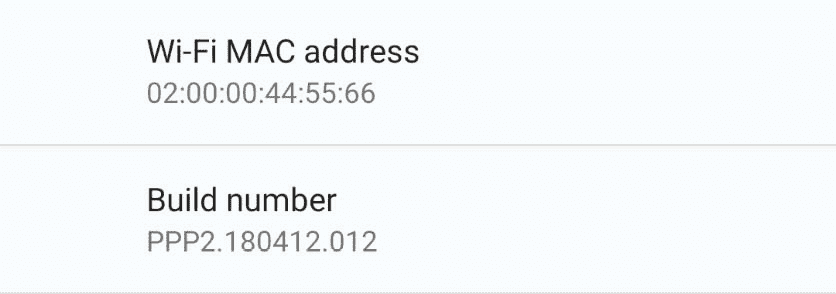
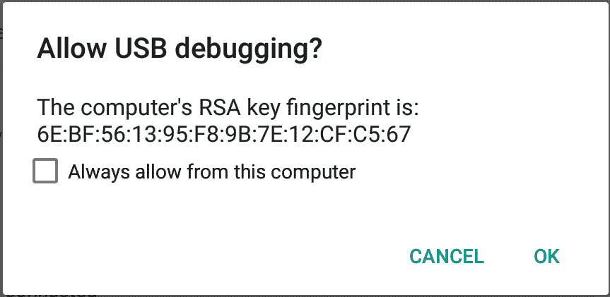
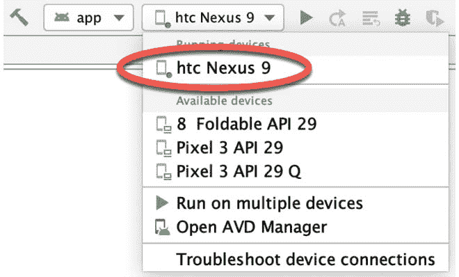

# 七、在物理安卓设备上测试AndroidStudio应用

虽然使用安卓虚拟设备(AVD)测试应用可以取得很大成就，但在物理安卓设备上执行真实世界的应用测试是无可替代的，并且有许多安卓功能仅在物理安卓设备上可用。

与 AVD 实例和连接的安卓设备的通信由安卓调试桥(ADB)处理。在本章中，我们将逐步配置 adb 环境，以便在基于 macOS、Windows 和 Linux 系统的物理 Android 设备上进行应用测试。

7.1 安卓调试桥概述(ADB

ADB 的主要目的是促进开发系统(在本例中是 Android Studio)与 AVD 仿真器和物理 Android 设备之间的交互，以运行和调试应用。

ADB 由一个客户端、一个在开发系统后台运行的服务器进程和一个在 AVDs 或手机、平板等真实安卓设备上运行的后台守护进程组成。

亚行客户可以采取多种形式。例如，以位于 Android SDK 平台-工具子目录中名为 adb 的命令行工具的形式提供了一个客户端。同样，AndroidStudio也有内置客户端。

可以使用 adb 命令行工具执行各种任务。例如，可以使用 devices 命令行参数获得当前活动的虚拟或物理设备的列表。以下命令输出表明系统上存在自动电压调节器，但没有物理设备 :

```kt
$ adb devices
List of devices attached
emulator-5554   device
```

7.2 在基于安卓的设备上启用 ADB

在 ADB 可以连接到安卓设备之前，该设备必须首先配置为允许连接。在运行安卓 6.0 或更高版本的手机和平板设备上，实现这一点的步骤如下:

1.打开设备上的“设置”应用，选择“关于平板电脑”或“关于手机”选项(在较新版本的安卓系统上，这可以在“设置”应用的“系统”页面上找到)。

2.在“关于”屏幕上，向下滚动到“版本号”字段([图 7-1](#_idTextAnchor168) )并点击七次，直到出现一条消息，表明开发人员模式已启用 。如果“关于”屏幕上没有列出内部版本号，可以通过软件信息选项获得。或者，展开列表的“高级”部分(如果可用)。



图 7-1

3.返回主设置屏幕，注意标题为“开发人员选项”的新选项的外观。选择该选项，并在名为【USB 调试】的开发者屏幕上找到设置。启用该项目旁边的开关，如图 7-2 所示:


图 7-2

4.从屏幕顶部向下滑动，显示通知面板([图 7-3](#_idTextAnchor171) )，注意设备当前已连接调试 g。


图 7-3

此时，设备现在配置为接受来自开发系统上 adb 的调试连接。剩下的就是配置开发系统，以便在设备连接时检测设备。虽然这是一个相对简单的过程，但涉及的步骤因开发系统是运行 Windows、macOS 还是 Linux 而异。请注意，以下步骤假设 Android SDK 平台-工具目录包含在操作系统 PATH 环境变量中，如标题为[“设置 Android Studio 开发环境”](02.html#_idTextAnchor005)一章所述。

7.2.1 macOS ADB 配置

要在 macOS 系统上配置 ADB 环境，请使用 USB 电缆将设备连接到计算机系统，打开终端窗口并执行以下命令来重新启动 adb 服务器:

```kt
$ adb kill-server
$ adb start-server
* daemon not running. starting it now on port 5037 *
* daemon started successfully *
```

服务器成功运行后，执行以下命令验证是否检测到设备:

```kt
$ adb devices
List of devices attached
74CE000600000001        offline
```

如果设备被列为离线，请转到安卓设备，检查是否存在[图 7-4](#_idTextAnchor175) 所示的对话框，以获得允许 USB 调试的许可。在单击“确定”之前，请启用该选项旁边的复选框，该选项的内容为“始终允许从该计算机进行操作”。重复 adb devices 命令现在应该会列出可用的设备:

```kt
List of devices attached
015d41d4454bf80c        device
```

如果设备未列出，请尝试注销，然后重新登录到 macOS 桌面，如果问题仍然存在，请重新启动系统。

7.2.2 窗口 ADB 配置

使用 ADB 配置基于 Windows 的开发系统以连接到 Android 设备的第一步是在系统上安装适当的 USB 驱动程序。要安装的通用串行总线驱动程序将取决于安卓设备的型号。如果你有谷歌 Nexus 设备，那么就有必要在你的 Windows 系统上安装和配置谷歌 USB 驱动程序包。以下网页概述了实现这一目标的详细步骤:

[https://developer.android.com/sdk/win-usb.html](http://developer.android.com/sdk/win-usb.html)

对于谷歌 USB 驱动不支持的安卓设备，需要下载设备制造商提供的驱动。驱动程序列表以及下载和安装信息可在线获取，网址为:

[https://developer.android.com/tools/extras/oem-usb.html](http://developer.android.com/tools/extras/oem-usb.html)

安装驱动程序后，设备现在被识别为正确的设备类型，打开命令提示符窗口并执行以下命令:

```kt
adb devices
```

此命令应输出有关连接设备的信息，如下所示:

```kt
List of devices attached
HT4CTJT01906        offline
```

如果设备被列为离线或未授权，请转到设备显示屏，查看在[图 7-4](#_idTextAnchor175) 中显示的对话框，以获得允许 USB 调试 ng 的许可。



图 7-4

在单击“确定”之前，请启用该选项旁边的复选框，该选项的内容为“始终允许从该计算机进行操作”。重复 adb devices 命令现在应该会将设备列为就绪:

```kt
List of devices attached
HT4CTJT01906    device
```

如果设备未列出，请执行以下命令重新启动 ADB 服务器:

```kt
adb kill-server
adb start-server
```

如果设备仍未列出，请尝试执行以下命令:

```kt
android update adb
```

请注意，可能还需要重新启动系统。

7.2.3 Linux adb 配置

为了本章的目的，我们将再次使用 Ubuntu Linux 作为参考示例，在 Linux 上配置 adb 以连接到物理 Android 设备进行应用测试。

Ubuntu Linux 上的物理设备测试需要安装一个名为 android-tools-adb 的包，该包又要求 Android Studio 用户是 plugdev 组的成员。这是大多数 Ubuntu 版本上用户帐户的默认值，可以通过运行 id 命令来验证。如果 plugdev 组未列出，请运行以下命令将您的帐户添加到该组:

```kt
sudo usermod -aG plugdev $LOGNAME
```

满足组成员要求后，可以通过执行以下命令来安装 android-tools-adb 包:

```kt
sudo apt-get install android-tools-adb 
```

完成上述更改后，重新启动 Ubuntu 系统。一旦系统重新启动，打开终端窗口，启动 adb 服务器并检查连接的设备列表:

```kt
$ adb start-server
* daemon not running. starting it now on port 5037 *
* daemon started successfully *
$ adb devices
List of devices attached
015d41d4454bf80c        offline
```

如果设备被列为离线或未授权，进入安卓设备，查看[图 7-4](#_idTextAnchor175) 所示的对话框，寻求允许 USB 调试的许可。

7.3 测试 adb 连接

假设 adb 配置在您选择的开发平台上已经成功，下一步是尝试在设备上运行标题为[“在 Android Studio 中创建示例 Android App”](03.html#_idTextAnchor033)一章中创建的测试应用。启动AndroidStudio，打开安卓样本项目，验证设备是否出现在设备选择菜单中，如[图 7-5](#_idTextAnchor178) 所示:



图 7-5

7.4 总结

虽然安卓虚拟设备模拟器提供了一个出色的测试环境，但请记住，没有真正的替代品可以确保应用在物理安卓设备上正常运行。毕竟，这是应用将在现实世界中使用的地方。

但是，默认情况下，AndroidStudio环境没有配置为将安卓设备检测为目标测试设备。因此，有必要执行一些步骤，以便能够从AndroidStudio开发环境中直接将应用加载到安卓设备上。实现这一目标的具体步骤因所使用的开发平台而异。在本章中，我们已经介绍了基于 Linux、macOS 和 Windows 平台的这些步骤。