8\. AndroidStudio代码编辑器基础

为安卓系统开发应用需要大量的编程工作，顾名思义，包括输入、检查和修改代码行。毫不奇怪，开发人员使用AndroidStudio的大部分时间通常涉及在编辑器窗口中编辑代码。

现代代码编辑器需要远远超出最初的基本输入、删除、剪切和粘贴。如今，代码编辑器的有用性通常是由一些因素来衡量的，例如它减少程序员所需键入的数量、在大型源代码文件中导航的便利性以及编辑器在编写代码时实时检测和突出显示编程错误的能力。正如这一章中所显示的，这些只是AndroidStudio编辑器擅长的几个领域。

虽然不是AndroidStudio编辑器功能的详尽概述，但本章旨在提供该工具关键功能的指南。有经验的程序员会发现，这些特性中有一些是当今大多数代码编辑器所共有的，而有一些是这种特定编辑环境所独有的。

8.1 AndroidStudio编辑器

当选择一个 Java、Kotlin、XML 或其他基于文本的文件进行编辑时，AndroidStudio编辑器会出现在主窗口的中央。[例如，图 8-1](#_idTextAnchor183) 显示了一个典型的编辑器会话，其中加载了一个 Kotlin 源代码文件:

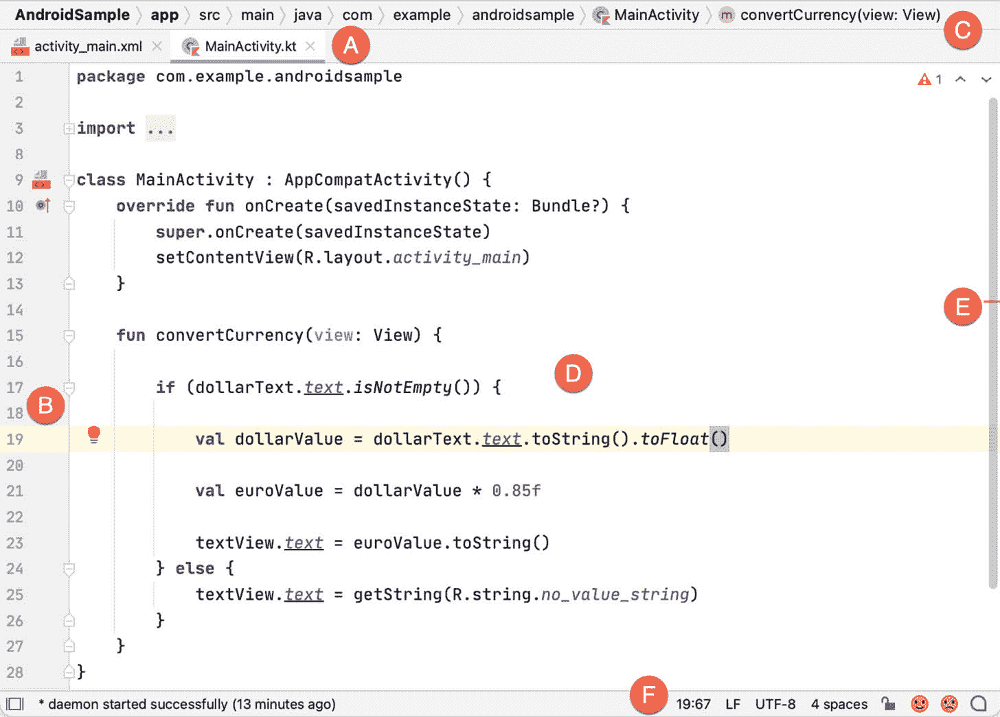

图 8-1

组成编辑器窗口的元素可以总结如下:

a–文档选项卡–AndroidStudio能够同时保存多个打开的文件进行编辑。当每个文件打开时，它会被分配一个文档选项卡，在编辑器窗口顶部边缘的选项卡栏中显示文件名。当没有足够的空间显示所有标签时，标签栏的最右边会出现一个小的下拉菜单。单击此菜单将下拉一个其他打开文件的列表。选项卡中文件名下方的红色波浪线表示文件中的代码包含一个或多个错误，需要先解决这些错误，然后才能编译和运行项目。

在文件之间切换只需点击相应的选项卡或使用 Alt-Left 和 Alt-Right 键盘快捷键即可。文件之间的导航也可以使用切换器机制(可通过 Ctrl-Tab 键盘快捷键访问)来执行。

要将编辑器面板从AndroidStudio主窗口中分离，以便它出现在单独的窗口中，请单击选项卡，并将其拖到主窗口之外的桌面区域。要将编辑器返回到主窗口，请单击独立编辑器窗口中的文件选项卡，并将其拖放到主窗口中的原始编辑器选项卡栏上。

b–编辑器檐槽区域 -檐槽区域由编辑器用来显示信息图标和控件。除其他项目外，出现在此装订线区域的一些典型项目是调试断点标记、折叠和展开代码块的控件、书签、更改标记和行号。默认情况下，行号是打开的，但可以通过在檐槽中单击鼠标右键并选择“显示行号”菜单选项来禁用。

c–代码结构位置-编辑器底部的这个栏显示光标的当前位置，因为它与代码的整体结构相关。例如，在下图中，该条指示当前正在编辑 convertCurrency 方法，并且该方法包含在 MainActivity 类中。

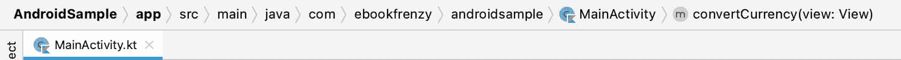

图 8-2

双击栏中的元素会将光标移动到代码文件中的相应位置。例如，双击 convertCurrency 条目会将光标移动到源代码中 convertCurrency 方法的顶部。同样，单击 MainActivity 条目将会下拉一个可供选择的可用代码导航点列表:


图 8-3

d–编辑区–这是用户显示、输入和编辑代码的主要区域。本章后面的部分将详细介绍编辑区域的主要功能。

验证和标记侧边栏——AndroidStudio包含了一个被称为“动态代码分析”的功能。这实际上意味着当您键入代码时，编辑器正在分析代码以检查警告和语法错误。验证侧边栏顶部的指示器将实时更新，以指示添加代码时发现的错误和警告的数量。点击该指示器将显示一个弹出窗口，其中包含编辑器中代码发现的问题摘要，如图 8-4 所示:

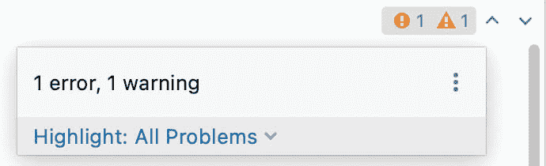

图 8-4

上下箭头可用于在代码内的错误位置之间移动。绿色勾号表示未检测到警告或错误。

侧边栏还在使用相同颜色编码检测到问题的位置显示标记。当代码行在编辑器区域可见时，将鼠标指针悬停在标记上，将显示包含问题描述的弹出窗口([图 8-5](#_idTextAnchor187) ):

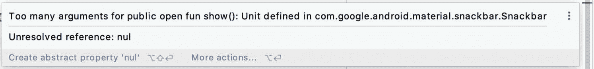

图 8-5

将鼠标指针悬停在当前滚出编辑器查看区域的代码行的标记上，将显示一个“镜头”覆盖图，其中包含问题所在的代码块([图 8-6](#_idTextAnchor189) ),无需滚动到编辑器中的该位置即可查看:

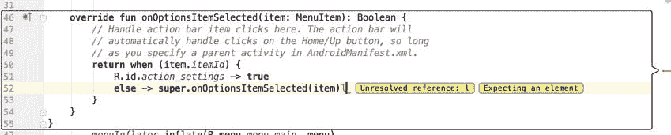

图 8-6

还值得注意的是，镜头覆盖并不限于边栏中的警告和错误。将鼠标悬停在侧边栏的任何部分都会导致出现一个镜头，其中包含源文件中该位置的代码。

f–状态栏–虽然状态栏实际上是主窗口的一部分，而不是编辑器，但它确实包含一些关于当前活动编辑会话的信息。该信息包括光标在行和字符方面的当前位置以及文件的编码格式(UTF-8、ASCII 等)。).单击状态栏中的这些值可以更改相应的设置。例如，单击行号会显示“转到行”对话框。

在概述了构成AndroidStudio编辑器的元素后，本章的剩余部分将更详细地探讨编辑环境的关键特性。

8.2 拆分编辑器窗口

默认情况下，编辑器会显示一个面板，显示当前所选文件的内容。当同时处理多个源代码文件时，一个特别有用的特性是能够将编辑器拆分成多个窗格。要拆分编辑器，右键单击编辑器窗口中的文件选项卡，然后选择垂直拆分或水平拆分菜单选项。[例如，图 8-7](#_idTextAnchor192) 显示了编辑器拆分成三个面板时的拆分器:

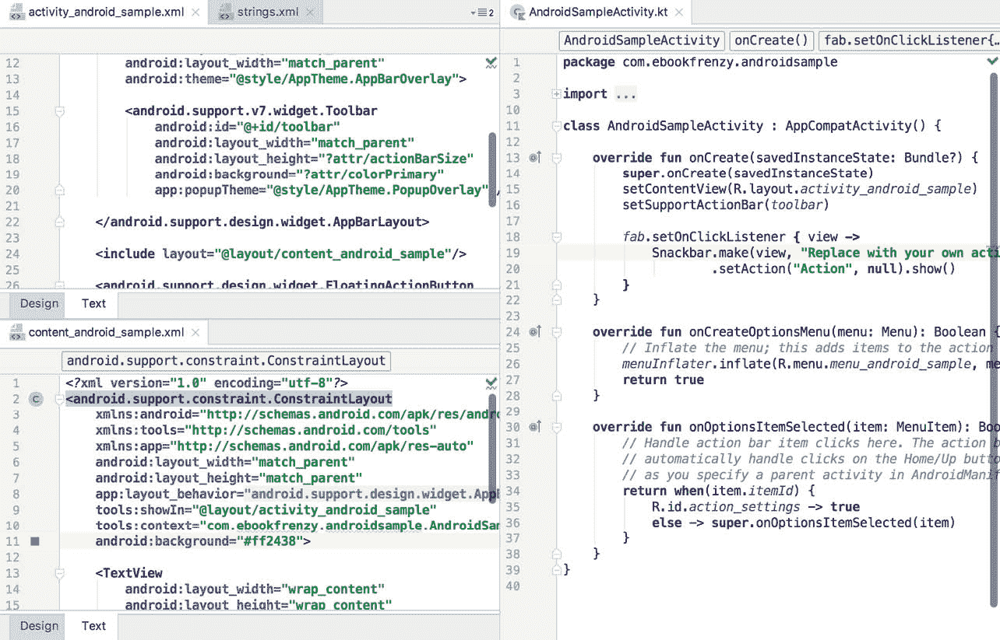

图 8-7

通过右键单击相应的选项卡并选择“更改拆分器方向”菜单选项，可以随时更改拆分面板的方向。重复这些步骤以取消分割单个面板，这次从菜单中选择“取消分割”选项。右键单击任意选项卡并选择“全部取消拆分”菜单选项，可以删除所有拆分面板。

窗口拆分可用于显示不同的文件，或为同一文件提供多个窗口，从而允许同时查看和编辑同一文件的不同区域。

8.3 代码完成

Android Studio 编辑器内置了大量关于 Kotlin 编程语法和组成 Android SDK 的类和方法的知识，以及您自己的代码库的知识。在键入代码时，编辑器会扫描正在键入的内容，并在适当的时候就完成语句或引用可能需要的内容提出建议。当编辑器检测到完成建议时，将出现一个包含建议列表的面板。例如，在[图 8-8](#_idTextAnchor195) 中，编辑正在为字符串声明的开头提出可能性:

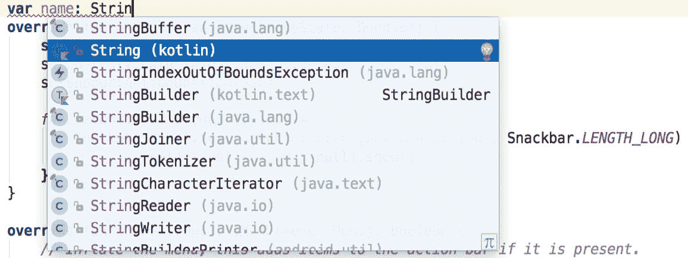

图 8-8

如果没有一个自动完成建议是正确的，只需继续输入，编辑器将继续完善适当的建议。要接受最重要的建议，只需按键盘上的回车键或 Tab 键。要选择不同的建议，请使用箭头键在列表中上下移动，再次使用回车键或 Tab 键选择突出显示的项目。

可以使用 Ctrl-Space 键盘序列手动调用完成建议。这在编辑器中更改单词或声明时非常有用。当光标位于编辑器中的某个单词上时，该单词将自动高亮显示。按下 Ctrl-Space 将显示备选建议列表。要用建议列表中当前突出显示的项目替换当前单词，只需按 Tab 键。

除了实时自动完成功能，AndroidStudio编辑器还提供了一个被称为智能完成的系统。智能补全是使用 Shift-Ctrl-Space 键盘序列调用的，选中后，将根据代码的当前上下文提供更详细的建议。第二次按下 Shift-Ctrl-Space 快捷键序列将从更广泛的可能性中提供更多建议。

对于许多程序员来说，代码完成可能是个人偏好的问题。认识到这一事实，AndroidStudio提供了对自动完成设置的高级控制。可以通过选择文件->设置…菜单选项(或 macOS 上的 Android Studio ->首选项…并从设置面板中选择编辑器->常规->代码完成)来查看和修改这些，如图[图 8-9](#_idTextAnchor197) :

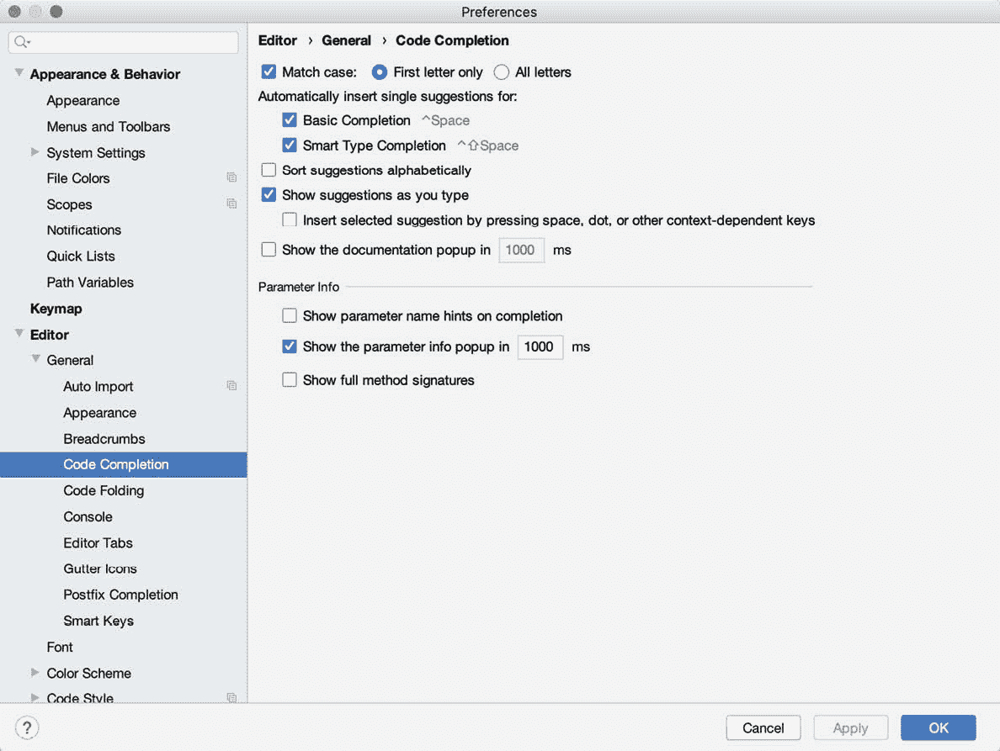

图 8-9

8.4 报表完成T2】

AndroidStudio编辑器提供的另一种自动完成形式是语句完成。这可用于自动填充方法和循环语句等项的括号和大括号。使用 Shift-Ctrl-Enter(在 macOS 上按 Shift-Cmd-Enter)键盘序列调用语句完成。例如，考虑以下代码:

```kt
fun myMethod()
```

将此代码键入编辑器后，触发语句完成将导致编辑器自动将大括号添加到方法中:

```kt
fun myMethod() {

}
```

8.5 参数信息

也可以要求编辑器提供关于方法接受的参数的信息。光标位于方法调用的括号之间时，Ctrl-P(macOS 上的 Cmd-P)键盘序列将显示该方法已知接受的参数，最可能的建议以粗体突出显示:

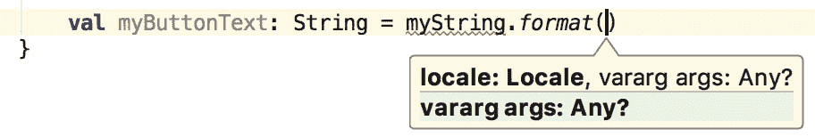

图 8-10

8.6 参数名称提示

代码编辑器可以配置为在方法调用中显示参数名称提示。[例如，图 8-11](#_idTextAnchor202) 突出显示了对 Snackbar 类的 make()和 setAction()方法的调用中的参数名称提示:

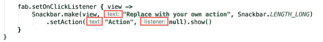

图 8-11

该模式的设置可以通过选择左侧面板中的文件->设置菜单(AndroidStudio->苹果电脑上的首选项)选项，然后选择编辑器->镶嵌提示->柯特林来配置。在结果屏幕上，从列表中选择“参数提示”项目，并启用或禁用“显示参数提示”选项。要调整提示设置，请单击排除列表...链接并进行任何必要的调整。

8.7 代码生成

除了在键入时完成代码之外，编辑器还可以在特定条件下为您生成代码。当光标位于文件中要生成代码的位置时，可以使用 Alt-Insert(MacOS 上的 Ctrl-N)键盘快捷键访问图 8-12 所示的可用代码生成选项列表。

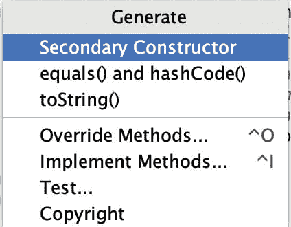

图 8-12

举个例子，考虑一种情况，当我们项目中的一个活动即将被操作系统破坏时，我们希望得到通知。正如将在本书后面章节中概述的，这可以通过重写 Activity 超类的 onStop()生命周期方法来实现。要让 Android Studio 为此生成一个存根方法，只需从代码生成列表中选择 Override Methods…选项，并从可用方法的结果列表中选择 onStop()方法:

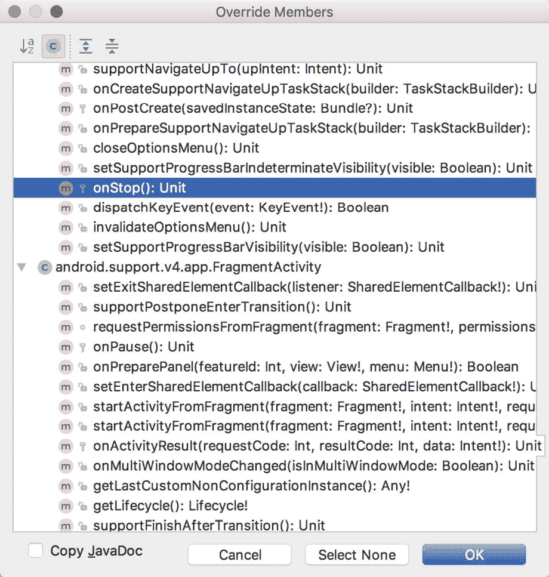

图 8-13

选择要覆盖的方法后，单击确定将在 Kotlin 源文件的当前光标位置生成存根方法，如下所示:

```kt
override fun onStop() {
    super.onStop()
} 
```

8.8 码折叠

一旦源代码文件达到一定的大小，即使是最仔细格式化和组织良好的代码也可能变得势不可挡，难以导航。AndroidStudio认为，并不总是需要让每个代码块的内容在任何时候都可见。通过使用AndroidStudio编辑器的代码折叠功能，代码导航可以变得更加容易。代码折叠是使用出现在源文件中每个代码块开头和结尾的编辑器装订线中的标记来控制的。[例如，图 8-14](#_idTextAnchor209) 突出显示了当前未折叠的方法声明的开始和结束标记:

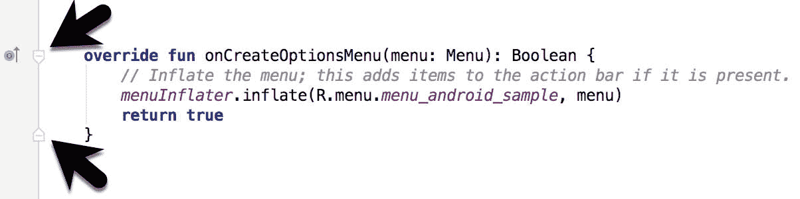

图 8-14

点击这些标记中的任何一个都会折叠该语句，这样只有签名行是可见的，如图 8-15[所示:](#_idTextAnchor211)


图 8-15

要展开折叠的代码段，只需单击编辑器装订线中的“+”标记。要查看隐藏的代码而不展开它，将鼠标指针悬停在“{…}”指示器上，如图 8-16 所示。然后，编辑器将显示包含折叠代码块的镜头覆盖:

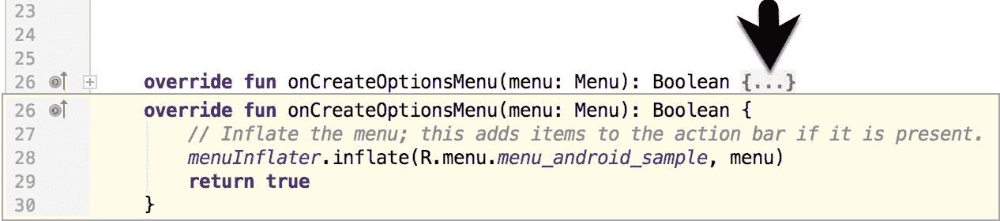

图 8-16

文件中的所有代码块都可以使用 Ctrl-Shift-加号和 Ctrl-Shift-减号键盘序列折叠或展开。

默认情况下，AndroidStudio编辑器会在打开源文件时自动折叠一些代码。要配置发生这种情况的条件，请选择文件->设置…(在 macOS 上的 Android Studio ->首选项…)并在结果设置面板中选择编辑器->常规->代码折叠条目([图 8-17](#_idTextAnchor214) ):

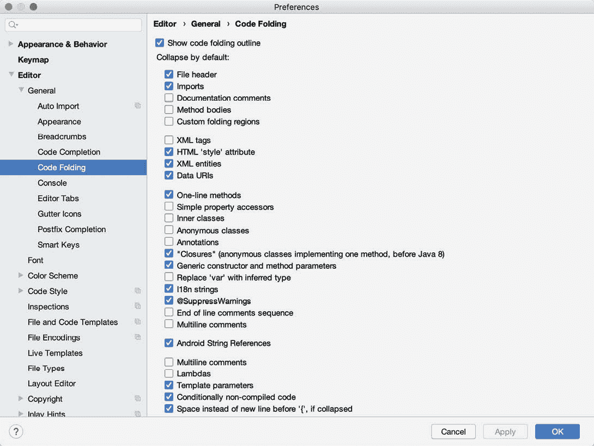

图 8-17

8.9 快速文档查找

通过将光标放在需要文档的声明上并按下 Ctrl-Q 键盘快捷键(macOS 上的 Ctrl-J)，可以访问上下文相关的 Kotlin 和 Android 文档。这将显示一个弹出窗口，其中包含该项目的相关参考文档。[例如，图 8-18](#_idTextAnchor216) 显示了安卓 Snackbar 类的文档。


图 8-18

显示后，文档弹出窗口可以根据需要在屏幕上移动。

8.10 代码重新格式化

一般来说，Android Studio 编辑器在添加语句和代码块时，会自动根据语句和代码块的缩进、间距和嵌套来格式化代码。在需要重新格式化代码行的情况下(这是常见的情况，例如，从网站剪切和粘贴示例代码时)，编辑器提供了源代码重新格式化功能，当选择该功能时，将自动重新格式化代码以匹配当前的代码样式。

要重新格式化源代码，请按下 Ctrl-Alt-L(MacOS 上的 Cmd-Opt-L)键盘快捷键序列。要显示“重新格式化代码”对话框(图 8-19 )，请使用 Ctrl-Alt-Shift-L(在 macOS 上为 Cmd-Opt-Shift-L)。此对话框提供了仅重新格式化当前选定代码、编辑器中当前活动的整个源文件或仅重新格式化因源代码控制更新而更改的代码的选项。


图 8-19

可以在“项目设置”对话框中更改全部代码样式首选项。选择文件->设置菜单选项(AndroidStudio->首选项…在苹果电脑上)，并在左侧面板中选择代码样式，以访问支持的编程和标记语言列表。选择一种语言将提供对大量格式样式选项的访问，所有这些选项都可以从AndroidStudio的默认设置中进行修改，以匹配您喜欢的代码样式。要配置上述对话框中“重新排列代码”选项的设置，例如，展开“代码样式”部分，选择“科特林”，然后从“科特林设置”中选择“排列”选项卡。

8.11 查找样本代码

AndroidStudio编辑器提供了一种方法来访问与代码列表中当前高亮显示的条目相关的示例代码。这个特性对于学习如何使用特定的安卓类或方法非常有用。要查找示例代码，请在编辑器中突出显示一个方法或类名，右键单击它并选择“查找示例代码”菜单选项。“查找样本代码”面板([图 8-20](#_idTextAnchor221) )将出现在编辑器下方，并带有匹配样本的列表。从列表中选择一个样本会将相应的代码加载到右侧面板中:

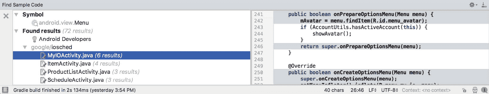

图 8-20

8.12 直播模板

当您编写安卓代码时，您会发现有一些常用的构造。例如，一个常见的要求是使用安卓 Toast 类向用户显示弹出消息。实时模板是常见代码构造的集合，可以通过键入初始字符后跟一个特殊键(默认设置为 Tab 键)来插入模板代码，从而将这些代码构造输入到编辑器中。要体验这一点，请在代码编辑器中键入 toast，然后按 Tab 键，AndroidStudio将在光标位置插入以下代码，准备编辑:

```kt
Toast.makeText(, "", Toast.LENGTH_SHORT).show()
```

要列出和编辑现有模板、更改特殊键或添加您自己的模板，请打开首选项对话框，并从左侧导航面板的编辑器部分选择实时模板:

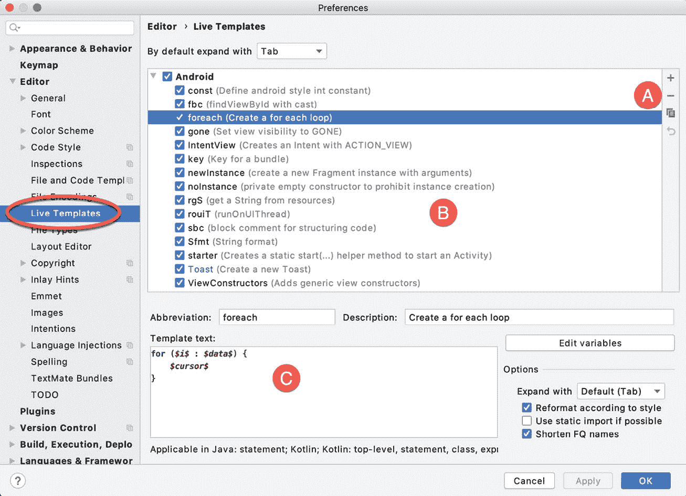

图 8-21

使用上面[图 8-21](#_idTextAnchor223) 中标记为 A 的按钮添加、移除、复制或重置模板。要修改模板，请从列表(B)中选择它，并在标记为 c 的面板中更改设置

8.13 总结

AndroidStudio编辑器花了很长时间来减少编写代码所需的打字量，并使代码更容易阅读和导航。在本章中，我们已经介绍了一些关键的编辑器特性，包括代码完成、代码生成、编辑器窗口拆分、代码折叠、重新格式化、文档查找和实时模板。