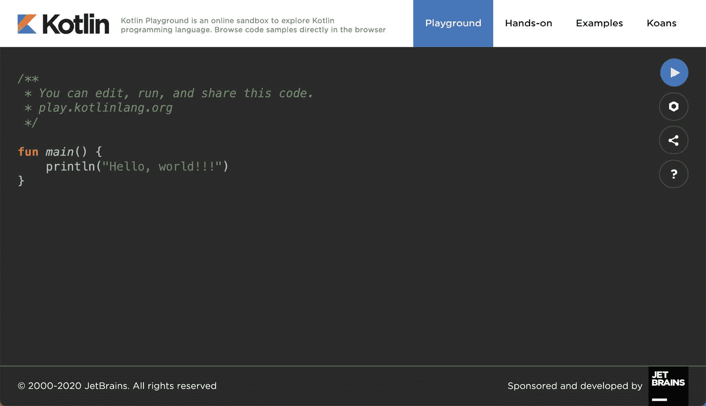
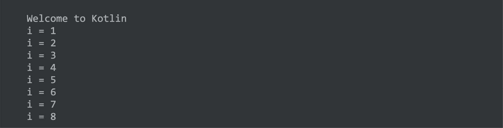

11.柯特林简介

安卓开发主要使用AndroidStudio进行，而AndroidStudio又基于一家名为的公司创建的 IntelliJ IDEA 开发环境。在AndroidStudio 3.0 发布之前，所有安卓应用都是使用AndroidStudio和 Java 编程语言编写的(需要时偶尔会有一些 C++代码)。

然而，自从 Android Studio 3.0 推出以来，开发人员现在可以选择使用另一种名为 Kotlin 的编程语言创建 Android 应用。虽然详细介绍这种语言的所有功能超出了本书的范围(整本书可以而且已经写了，只涵盖了 Kotlin)，但本书和接下来的六章的目标是提供足够的信息，以便开始用 Kotlin 编程，并快速掌握使用这种编程语言开发 Android 应用的速度。

11.1 什么是科特林？

Kotlin 是由位于波罗的海的一个岛屿命名的，它是由 JetBrains 创建的一种编程语言，遵循了 Java 以岛屿命名编程语言的传统。Kotlin 代码旨在更容易理解和编写，也比许多其他编程语言更安全。该语言、编译器和相关工具都是开源的，在 Apache 2 许可下可以免费获得。

Kotlin 语言的主要目标是使代码既简洁又安全。当代码易于阅读和理解时，通常被认为是简洁的。简洁在编写代码时也起着一定的作用，可以让代码写得更快，效率更高。在安全性方面，Kotlin 包括许多特性，这些特性提高了在编写代码时识别潜在问题的机会，而不是导致运行时崩溃。

Kotlin 设计和实现的第三个目标涉及到与 Java 的互操作性。

11.2 科特林和爪哇

Java 最初是由 Sun Microsystems 在 1995 年推出的，到目前为止，它仍然是当今使用的最流行的编程语言。在引入 Kotlin 之前，很可能市面上的每一款安卓应用都是用 Java 编写的。自获得安卓操作系统以来，谷歌投入巨资调整和优化编译和运行时环境，以便在安卓设备上运行基于 Java 的代码。

科特林没有试图重新发明轮子，而是设计成既能与 Java 集成，又能与 Java 一起工作。编译 Kotlin 代码时，它会生成与 Java 编译器生成的字节码相同的字节码，从而能够使用 Java 和 Kotlin 代码的组合来构建项目。这种兼容性还允许从 Kotlin 代码中无缝使用现有的 Java 框架和库，也允许从 Java 中调用 Kotlin 代码。

Kotlin 的创建者也承认，虽然有方法可以改进现有的语言，但是 Java 的许多特性并不需要改变。因此，熟悉 Java 编程的人会发现这些技能中的许多都可以转移到基于 Kotlin 的开发中。有 Swift 编程经验的程序员在学习 Kotlin 时也会发现很多熟悉的东西。

11.3 从 Java 转换到 Kotlin

鉴于 Kotlin 和 Java 之间的高度互操作性，将现有的 Java 代码转换为 Kotlin 并不是必需的，因为这两种语言将在同一个项目中轻松共存。也就是说，Java 代码可以使用内置的 Java 到 Kotlin 转换器从AndroidStudio转换成 Kotlin。要将整个 Java 源文件转换为 Kotlin，请将文件加载到 Android Studio 代码编辑器中，并选择“代码->将 Java 文件转换为 Kotlin 文件”菜单选项。或者，可以通过剪切代码并将其粘贴到 Android Studio 代码编辑器中的现有 Kotlin 文件中，将 Java 代码块转换为 Kotlin。请注意，在执行 Java 到 Kotlin 的转换时，Java 代码不会总是转换成最好的 Kotlin 代码，转换后应该花时间检查和整理代码。

11.4 科特林和AndroidStudio

AndroidStudio内部通过 Kotlin 插件提供对 Kotlin 的支持，默认情况下，该插件集成到AndroidStudio 3.0 或更高版本中。

11.5 用柯特林做实验

当学习一门新的编程语言时，能够输入和执行代码片段通常很有用。使用科特林最好的方法之一是使用位于[https://play.kotlinlang.org](https://play.kotlinlang.org/)的科特林游乐场([图 11-1](#_idTextAnchor257) ):



图 11-1

除了提供一个可以快速输入和执行 Kotlin 代码的环境之外，游乐场还包括一组示例和教程，演示了 Kotlin 的关键功能。

通过打开浏览器窗口，导航到操场，并在主代码面板中输入以下内容，尝试一些 Kotlin 代码:

```kt
fun main(args: Array<String>) {

   println("Welcome to Kotlin")

   for (i in 1..8) {    
       println("i = $i")
   } 
}
```

输入代码后，单击运行按钮，并注意控制台面板中的输出:



图 11-2

11.6 科特林的分号

与 Java 和 C++等编程语言不同，Kotlin 不需要在每个语句或表达式行的末尾使用分号。因此，以下是有效的 Kotlin 代码:

```kt
val mynumber = 10
println(mynumber)
```

只有当多条语句出现在同一行时，才需要分号:

```kt
val mynumber = 10; println(mynumber) 
```

11.7 总结

自从安卓操作系统推出以来，开发者第一次有了用 Java 代码编写应用的替代方法。Kotlin 是一种由 JetBrains 开发的编程语言，该公司创建了 Android Studio 所基于的开发环境。Kotlin 旨在使代码更安全，更容易理解和编写。Kotlin 还与 Java 高度兼容，允许 Java 和 Kotlin 代码在同一个项目中共存。这种互操作性确保了大多数标准的 Java 和基于 Java 的 Android 库和框架都可以在使用 Kotlin 进行开发时使用。

Kotlin 对AndroidStudio的支持是通过与AndroidStudio 3.0 或更高版本捆绑的插件提供的。这个插件还提供了一个将 Java 代码翻译成 Kotlin 的转换器。

学习 Kotlin 时，在线游乐场为快速试用 Kotlin 代码提供了一个有用的环境。