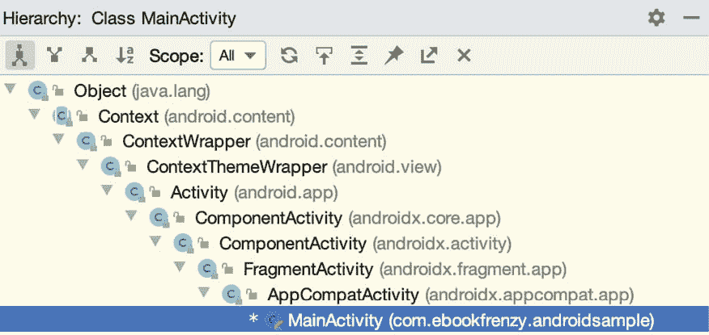
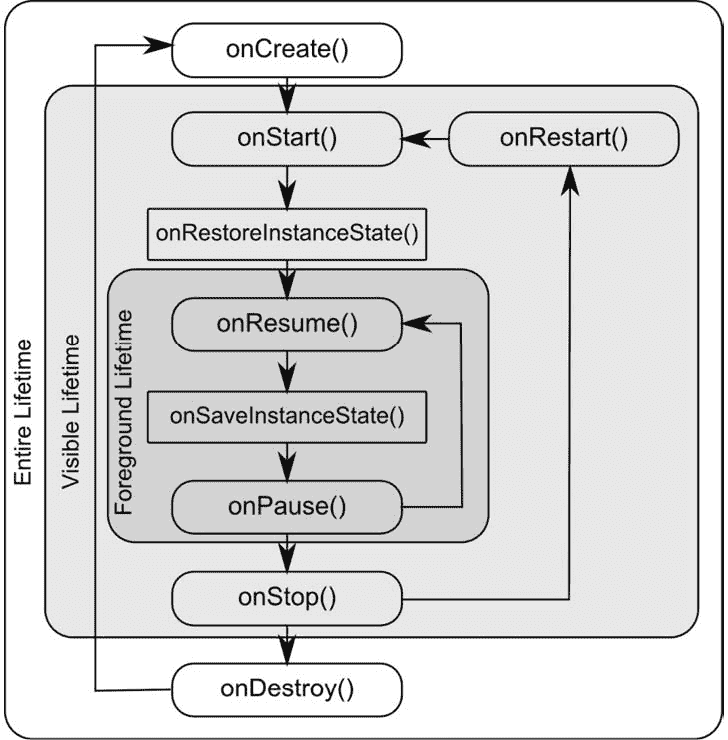

20\. 处理安卓活动状态变化

基于标题为[“了解安卓应用和活动生命周期”](19.html#_idTextAnchor395)一章中概述的信息，现在很明显，组成应用的活动和片段在应用的生命周期中会经历各种不同的状态。从一种状态到另一种状态的变化是由安卓运行时系统强加的，因此在很大程度上超出了活动本身的控制范围。然而，这并不意味着应用程序不能对这些变化做出反应并采取适当的行动。

本章的主要目的是提供一个高级概述，说明通知活动状态变化的方式，并概述保存或恢复状态信息的可取之处。了解了这些信息后，本章将简要介绍活动寿命的主题。

20.1 新旧生命周期技术的对比

直到最近，有一种标准的方法将生命周期意识构建到应用程序中。这是本章介绍的方法，包括在活动或片段实例中实现一组方法(每个生命周期状态一个方法)，当对象的生命周期状态改变时，操作系统会调用这些方法。自安卓操作系统早期以来，这种方法一直保持不变，尽管今天仍然是一个可行的选择，但它确实有一些局限性，这将在本章后面解释。

随着生命周期类和 Jetpack Android 架构组件的引入，现在有了一种更好的生命周期处理方法。这种现代的生命周期管理方法(连同 Jetpack 组件和架构指南)将在后面的章节中详细介绍。然而，理解传统的生命周期方法仍然很重要，原因有二。首先，作为一名安卓开发者，你不会完全脱离传统的生命周期方法，仍然会使用其中的一些方法。更重要的是，理解旧的处理生命周期的方法将为在本书后面开始学习新方法提供良好的知识基础。

20.2 活动 和片段类

除了少数例外，应用程序中的活动和片段分别被创建为安卓应用兼容活动类和片段类的子类。

例如，考虑在[“在 Android Studio 中创建示例 Android 应用程序”](03.html#_idTextAnchor033)中创建并随后转换为使用视图绑定的 AndroidSample 项目。将此项目加载到安卓工作室环境中，并找到 MainActivity.kt 文件(位于 app - > java - > com 中)。<你的领地>。androidsample)。找到文件后，双击该文件将其加载到编辑器中，其内容如下:

```kt
package com.example.androidsample
import androidx.appcompat.app.AppCompatActivity
import android.os.Bundle
import android.view.View
import com.example.androidsample.databinding.ActivityMainBinding

class MainActivity : AppCompatActivity() {

    private lateinit var binding: ActivityMainBinding

    override fun onCreate(savedInstanceState: Bundle?) {
        super.onCreate(savedInstanceState)
        binding = ActivityMainBinding.inflate(layoutInflater)
        setContentView(binding.root)
    }

    fun convertCurrency(view: View) {

        if (binding.dollarText.text.isNotEmpty()) {

            val dollarValue = binding.dollarText.text.toString().toFloat()

            val euroValue = dollarValue * 0.85f

            binding.textView.text = euroValue.toString()
        } else {
            binding.textView.text = getString(R.string.no_value_string)
        }
    }
}
When the project was created, we instructed Android Studio also to create an initial activity named MainActivity. As is evident from the above code, the MainActivity class is a subclass of the AppCompatActivity class. 
```

查看 AppCompatActivity 类的参考文档会发现，它本身就是 Activity 类的子类。这可以在安卓工作室编辑器中使用层次工具窗口进行验证。将 MainActivity.kt 文件加载到编辑器中后，单击类声明行中的 AppCompatActivity，然后按 Ctrl-H 键盘快捷键。随后将出现层次工具窗口，显示所选类的类层次。如图 20-1 中的[所示，AppCompatActivity 显然是从 FragmentActivity 类](#_idTextAnchor420)中派生出来的，而后者本身最终是 Activity 类 ss 的子类:



图 20-1

“活动”和“片段”类包含一系列方法，这些方法旨在由安卓运行时调用，以在对象状态发生变化时通知对象。出于本章的目的，我们将这些称为生命周期方法。活动或片段类只需要覆盖这些方法，并在其中实现必要的功能，以便对状态变化做出相应的反应。

一个这样的方法被命名为 onCreate()，再次回到上面的代码片段，我们可以看到这个方法已经在 MainActivity 类中被覆盖并实现了。在后面的部分中，我们将详细探讨 onCreate()和 Activity 和 Fragment 类的其他相关生命周期方法。

20.3 动态对比持久状态

生命周期管理的一个关键目标是确保在适当的时候保存和恢复活动的状态。当在这个上下文中谈论状态时，我们指的是当前在活动中保存的数据和用户界面的外观。例如，活动可能会在内存中维护一个数据模型，该模型需要保存到数据库、内容提供商或文件中。这样的状态信息，因为它从应用程序的一个调用持续到另一个调用，被称为持续状态。

用户界面的外观(如输入文本字段但尚未提交给应用程序内部数据模型的文本)被称为动态状态，因为它通常仅在应用程序的单次调用期间保留(也称为用户界面状态或实例状态)。

了解这两种状态之间的差异很重要，因为它们的保存方式和保存原因都不同。

保存持久状态的目的是避免由于运行时系统在后台终止某项活动而导致的数据丢失。另一方面，保存和恢复动态状态的原因稍微复杂一些。

例如，假设一个应用程序包含一个活动(我们称之为活动 A)，该活动包含一个文本字段和一些单选按钮。在使用应用程序的过程中，用户在文本字段中输入一些文本，并从单选按钮中进行选择。但是，在执行保存这些更改的操作之前，用户会切换到另一个活动，从而导致活动 A 被下推到活动堆栈中并放入后台。一段时间后，运行时系统确定内存不足，并因此终止活动 A 以释放资源。然而，就用户而言，活动 A 只是被放在背景中，随时可以被移到前台。在将活动 A 返回到前台时，用户会相当合理地期望输入的文本和单选按钮选择被保留。但是，在这种情况下，将会创建一个新的活动实例，如果没有保存和恢复动态状态，先前的用户输入将会丢失。

因此，保存动态状态的主要目的是给出前台和后台活动之间无缝切换的感觉，而不管活动实际上可能已经在用户不知情的情况下被杀死和重启。

保存持久状态和动态状态的机制将在本章的后续章节中变得更加清晰。

20.4 安卓生命周期方法

如前所述，Activity 和 Fragment 类包含许多生命周期方法，当实例的状态改变时，这些方法充当事件处理程序。安卓活动和片段类支持的主要方法如下:

onCreate(savedInstanceState:Bundle？)–首次创建活动时调用的方法，也是执行大多数初始化任务的理想位置。该方法以 Bundle 对象的形式被传递一个参数，该参数可能包含来自先前活动调用的动态状态信息(通常与用户界面的状态相关)。

onRestart()–在运行时系统停止活动后，当活动即将重新启动时调用。

onStart()–总是在调用 onCreate()或 onRestart()方法后立即调用，该方法向活动表明它即将对用户可见。如果活动移动到活动堆栈的顶部，此调用之后将调用 onResume()，如果它被另一个活动推下堆栈，则调用 onStop()。

onResume()–指示活动现在位于活动堆栈的顶部，并且是用户当前正在与之交互的活动。

onPause()–表示前一个活动即将成为前台活动。该调用之后将调用 onResume()或 onStop()方法，具体取决于活动是移回前台还是对用户不可见。可以在该方法中采取步骤来存储应用程序尚未保存的持久状态信息。为了避免在活动之间切换时的延迟，应该在该方法中避免耗时的操作，例如将数据存储到数据库或执行网络操作。此方法还应确保停止任何 CPU 密集型任务，如动画。

onStop()–用户现在不再能看到该活动。此调用之后可能出现的两种情况是，如果活动再次移动到前台，则调用 onRestart()，如果活动正在终止，则调用 onDestroy()。

onDestroy()–活动即将被销毁，这可能是主动的，因为活动已经完成其任务并调用了 finish()方法，也可能是因为运行时正在终止它以释放内存，或者是因为配置更改(例如设备的方向发生变化)。需要注意的是，当活动终止时，并不总是会调用 onDestroy()。

onConfigurationChanged()–当发生配置更改时调用，该配置更改的活动已指示不要重新启动。向该方法传递一个概述新设备配置的 Configuration 对象，然后由活动负责对更改做出反应。

以下生命周期方法仅适用于片段类:

onAttach() -当片段被分配给活动时调用。

onCreateView() -调用以创建并返回片段的用户界面布局视图层次结构。

onActivityCreated() -与片段关联的活动的 onCreate()方法已完成执行。

onview statusreservered()-片段的已保存视图层次结构已恢复。

除了上面概述的生命周期方法，还有两种方法专门用于保存和恢复活动的动态状态:

onrestore instance(savedInstanceState:Bundle？)–如果活动从保存状态的上一次调用重新开始，则在调用 onStart()方法后立即调用该方法。与 onCreate()一样，该方法被传递一个包含先前状态数据的 Bundle 对象。此方法通常用于在 onCreate()和 onStart()中执行活动初始化后恢复到以前的状态更有意义的情况。

on SaveInstancestate(outState:Bundle？)–在活动被破坏之前调用，以便保存当前的动态状态(通常与用户界面相关)。该方法被传递到应保存状态的 Bundle 对象中，该对象随后在活动重新启动时被传递到 onCreate()和 onRestoreInstanceState()方法中。请注意，该方法仅在运行时确定需要保存动态状态的情况下调用。

在重写上述方法时，一定要记住，除了 onRestoreInstanceState()和 onSaveInstanceState()之外，方法实现必须包含对超类中相应方法的调用。例如，以下方法重写 onRestart()方法，但也包括对该方法的超类实例的调用:

```kt
override fun onRestart() {
    super.onRestart()
    Log.i(TAG, "onRestart")
}
```

未能在方法重写中进行此超级类调用将导致运行时在执行期间引发异常。虽然对 onRestoreInstanceState()和 onSaveInstanceState()方法中的超级类的调用是可选的(例如，在实现自定义保存和恢复行为时可以省略它们)，但使用它们有相当大的好处，这一主题将在标题为[“保存和恢复安卓活动的状态”](22.html#_idTextAnchor445)的一章中介绍。

20.5 寿命

要讨论的最后一个主题涉及活动或片段在执行过程中转换的整个可见和前台生存期的概要:

整个生存期–术语“整个生存期”用于描述在对象终止之前对 onCreate()方法的初始调用和对 onDestroy()的调用之间发生的一切。

可见寿命–包括调用 onStart()和 onStop()之间的执行周期。在此期间，活动或片段对用户是可见的，尽管可能不是用户当前与之交互的对象。

前台生存期–指调用 onResume()和 onPause()方法之间的执行周期。

需要注意的是，在整个生命周期中，一个活动或片段可能会多次通过前台和可见生命周期。

寿命和生命周期方法的概念在[图 20-2](#_idTextAnchor425) 中说明:



图 20-2

20.6 可折叠设备和多份简历

如前所述，当活动已经移动到前台并且是用户当前正在与之交互的活动时，该活动被认为处于恢复状态。在标准设备上，一个应用程序在任何时候都可以有一个活动处于恢复状态，而所有其他活动都可能处于暂停或停止状态。

一段时间以来，安卓已经包含了多窗口支持，允许多个活动同时出现在分屏或自由形式的配置中。虽然最初主要用于大屏幕平板设备，但随着可折叠设备的推出，这一功能可能会变得更加流行。

在运行安卓 10 并启用了多窗口支持的设备上(大多数可折叠的情况都是如此)，多个应用程序活动将有可能同时处于恢复状态(这一概念被称为多恢复)，允许这些可见活动继续运行(例如，流式传输内容或更新视觉数据)，即使另一个活动当前有焦点。虽然多个活动可以处于恢复状态，但是这些活动中只有一个将被认为是最顶层的恢复活动(换句话说，用户最近与之交互的活动)。

一个活动可以通过实现 onTopResumedActivityChanged()回调方法来接收它已经获得或失去最顶端的恢复状态的通知。

20.7 禁用配置更改重启

如前所述，在某些配置更改的情况下，活动可能会指示不要重新启动。这是通过向项目清单文件中的活动元素添加 android:configChanges 指令来实现的。例如，以下清单文件摘录表明，在与方向或设备范围字体大小相关的配置发生变化时，不应重新启动活动:

```kt
<activity android:name=".MainActivity"
          android:configChanges="orientation|fontScale"
          android:label="@string/app_name">
```

20.8 生命周期方法限制

正如本章开头所讨论的，生命周期方法已经使用了很多年，直到最近，它还是处理活动和片段的生命周期状态变化的唯一可用机制。然而，这种方法也有缺点。

生命周期方法的一个问题是，它们没有为活动或片段提供一种简单的方法来找出它在应用程序执行过程中任何给定点的当前生命周期状态。相反，对象需要在内部跟踪状态，或者等待下一个生命周期方法调用。

此外，这些方法没有为一个对象提供简单的方法来观察应用程序中其他对象的生命周期状态变化。这是一个需要认真考虑的问题，因为应用程序中的许多其他对象可能会受到给定活动或片段中生命周期状态变化的影响。

生命周期方法也只在片段类和活动类的子类中可用。因此，不可能构建真正了解生命周期的定制类。

最后，生命周期方法导致大部分生命周期处理代码被写入活动或片段中，这可能导致复杂且容易出错的代码。理想情况下，大部分代码应该驻留在受状态变化影响的其他类中。例如，一个传输视频的应用程序可能包含一个专门设计来管理输入流的类。如果应用程序需要在主活动停止时暂停流，那么这样做的代码应该驻留在流类中，而不是主活动中。

所有这些问题以及更多问题都可以通过使用生命周期感知组件来解决，这个主题将从名为[“带有 Jetpack 的现代安卓应用架构”](39.html#_idTextAnchor835)的章节开始讨论。

20.9 总结

所有的活动都是从 Android Activity 类中派生出来的，而 Android Activity 类又包含许多生命周期方法，这些方法被设计为当活动的状态发生变化时，运行时系统会调用这些方法。同样，Fragment 类包含许多类似的方法。通过重写这些方法，活动和片段可以响应状态变化，并在必要时采取措施保存和恢复活动和应用程序的当前状态。生命周期状态可以被认为有两种形式。持久状态指的是应用程序调用之间需要存储的数据(例如文件或数据库)。另一方面，动态状态与用户界面的当前外观有关。

尽管生命周期方法有许多限制，可以通过使用生命周期感知组件来避免，但是为了充分理解本书后面介绍的生命周期管理的新方法，理解这些方法是很重要的。

在本章中，我们强调了活动可用的生命周期方法，并介绍了活动生命周期的概念。在下一章中，标题为[“安卓活动状态通过示例改变”](21.html#_idTextAnchor430)，我们将实现一个示例应用程序，将大部分理论付诸实践。