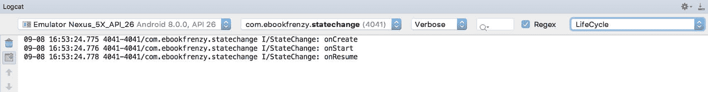

# 二十一、安卓活动状态变化示例

前面几章已经详细讨论了组成安卓应用的活动的不同状态和生命周期。在本章中，我们将通过创建一个示例应用来将处理活动状态变化的理论付诸实践。这个示例应用的目的是提供一个真实世界的活动演示，因为它在安卓运行时中经历了各种不同的状态。在题为[“保存和恢复安卓活动的状态”](22.html#_idTextAnchor445)的下一章中，本章构建的示例项目将被扩展以演示动态活动状态的保存和恢复。

21.1 创建状态变更示例项目

本练习的第一步是创建新项目。首先启动AndroidStudio，如有必要，使用文件->关闭项目菜单选项关闭任何当前打开的项目，以便出现欢迎屏幕。

从欢迎屏幕中选择创建新项目快速启动选项，并在生成的新项目对话框中选择空活动模板，然后单击下一步按钮。

在“名称”字段中输入 StateChange，并将 com . ebookwidue . state change 指定为包名称。在单击完成按钮之前，将最低API级别设置更改为API 26:安卓 8.0(奥利奥)，并将语言菜单更改为Kotlin。项目创建过程完成后，状态更改项目应列在位于AndroidStudio主窗口左侧的项目工具窗口中。使用第 [18.8 节“将项目迁移到视图绑定”](18.html#_idTextAnchor393)中概述的步骤，将项目转换为使用视图绑定。

下一步要做的是设计活动的用户界面。这存储在一个名为 activity_main.xml 的文件中，该文件应该已经加载到布局编辑器工具中。如果不是，请在项目工具窗口中导航到它，在 app -> res -> layout 文件夹中可以找到它。找到后，双击该文件将加载到AndroidStudio布局编辑器工具。


图 21-1

21.2 设计用户界面

随着用户界面布局加载到布局编辑器工具中，现在是时候为示例应用设计用户界面了。而不是“你好世界！”文本视图目前存在于用户界面设计中，该活动实际上需要一个编辑文本视图。在布局编辑器画布中选择文本视图对象，然后按键盘上的删除键将其从设计中移除。

从布局编辑器左侧的调色板中，选择文本类别，然后从文本组件列表中，单击纯文本组件并将其拖动到设备屏幕的视觉表示上。将组件移动到显示屏的中心，使中心指引线出现，并将其放置到位，使布局类似于图 21-2 中的。


图 21-2

使用编辑文本小部件时，需要为视图指定输入类型。这只是定义了用户将要输入的文本或数据的类型。例如，如果输入类型设置为“电话”，用户将被限制在视图中输入数字。或者，如果输入类型设置为文本字符，输入将默认为大写字符。也可以组合输入类型设置。

在这个例子中，我们将设置输入类型来支持一般的文本输入。为此，请在布局中选择编辑文本小部件，并在属性工具窗口中找到输入类型条目。单击当前设置左侧的标志图标，打开选项列表，在列表中，关闭文本人员名称并启用文本，然后单击应用按钮。保持在属性工具窗口中，将视图的 id 更改为编辑文本，并在结果对话框中单击重构按钮。

默认情况下，编辑文本显示的文本为“名称”。保留在“属性”面板中，将其从文本属性字段中删除，以便视图在布局中为空白。

在继续之前，单击布局编辑器工具栏中的“推断约束”按钮，添加任何缺少的约束。

21.3 覆盖活动生命周期方法

此时，项目包含一个名为 MainActivity 的活动，它是从 Android AppCompatActivity 类中派生出来的。此活动的源代码包含在 MainActivity.kt 文件中，该文件应该已经在编辑器会话中打开，并由编辑器选项卡栏中的选项卡表示。如果文件不再打开，请在项目工具窗口面板(app-> Java-> com . ebookwidge . state change-> main activity)中导航到它，然后双击它将文件加载到编辑器中。

到目前为止，唯一被活动覆盖的生命周期方法是 onCreate()方法，该方法被实现为在为活动设置用户界面之前调用该方法的超类实例。我们现在将修改这个方法，以便它在每次执行时都在 Android Studio Logcat 面板中输出一条诊断消息。为此，我们将使用 Log 类，它要求我们导入 android.util.Log 并声明一个标记，使我们能够在日志输出中过滤这些消息:

```kt
package com.example.statechange

import androidx.appcompat.app.AppCompatActivity
import android.os.Bundle
import android.util.Log

import com.ebookfrenzy.statechange.databinding.ActivityMainBinding

class MainActivity : AppCompatActivity() {

    private lateinit var binding: ActivityMainBinding
    private val TAG = "StateChange"

    override fun onCreate(savedInstanceState: Bundle?) {
        super.onCreate(savedInstanceState)
        binding = ActivityMainBinding.inflate(layoutInflater)
        setContentView(binding.root)
        Log.i(TAG, "onCreate")
    }
}
.
.
```

下一个任务是覆盖更多的方法，每个方法包含一个相应的日志调用。这些覆盖方法可以手动添加，也可以使用 Alt-Insert 键盘快捷键生成，如标题为[“Android Studio 代码编辑器的基础知识”](08.html#_idTextAnchor180)一章所述。请注意，如果方法是自动生成的，日志调用仍需要手动添加:

```kt
override fun onStart() {
    super.onStart()
    Log.i(TAG, "onStart")
}

override fun onResume() {
    super.onResume()
    Log.i(TAG, "onResume")
}

override fun onPause() {
    super.onPause()
    Log.i(TAG, "onPause")
}

override fun onStop() {
    super.onStop()
    Log.i(TAG, "onStop")
}

override fun onRestart() {
    super.onRestart()
    Log.i(TAG, "onRestart")
}

override fun onDestroy() {
    super.onDestroy()
    Log.i(TAG, "onDestroy")
}

override fun onSaveInstanceState(outState: Bundle) {
    super.onSaveInstanceState(outState)
    Log.i(TAG, "onSaveInstanceState")
}

override fun onRestoreInstanceState(savedInstanceState: Bundle) {
    super.onRestoreInstanceState(savedInstanceState)
    Log.i(TAG, "onRestoreInstanceState")
}
```

21.4 过滤日志面板

添加到 MainActivity.kt 中被覆盖的方法的代码的目的是将日志信息输出到 Logcat 工具窗口。此输出可配置为显示与设备或模拟器会话相关的所有事件，或仅限于与当前选定应用相关的事件。还可以将输出进一步限制为仅那些与指定过滤器匹配的日志事件。

显示 Logcat 工具窗口，点击过滤器菜单(在[图 21-3](#_idTextAnchor438) 中标记为 B)，查看可用选项。当此菜单设置为仅显示选定的应用时，只有那些与在标记为 A 的菜单中选定的应用相关的消息才会显示在日志面板中。另一方面，选择无过滤器将显示设备或模拟器生成的所有消息。


图 21-3

在运行应用之前，值得演示一下过滤器的创建，当选择该过滤器时，将进一步限制日志输出，以确保只显示那些包含在我们的活动中声明的标记的日志消息。

从过滤器菜单(B)中，选择编辑过滤器配置菜单选项。在创建新的日志文件过滤器对话框中(图 21-4 ，图 21-4)，命名过滤器生命周期，并在日志标签字段中输入在 MainActivity.kt 中声明的标签值(在上面的代码示例中，这是 StateChange)。


图 21-4

在程序包名称字段中输入程序包标识符，更改完成后，单击确定按钮创建过滤器并关闭对话框。现在应该在 Logcat 工具窗口中选择新创建的过滤器，而不是列出“无过滤器”。

21.5 运行应用

为了获得最佳结果，应用应该在物理安卓设备或模拟器上运行。配置好设备并连接到开发计算机后，点击AndroidStudio工具栏中绿色三角形代表的运行按钮，如下图[21-5](#_idTextAnchor441)所示，选择运行- >运行…菜单选项或使用 Shift+F10 快捷键:


图 21-5

从“选择设备”对话框(如果出现)中选择物理安卓设备或模拟器(假设您尚未将其配置为默认目标)。AndroidStudio构建好应用并将其安装到设备上后，它应该会启动并在前台运行。

对 Logcat 面板的审查应表明到目前为止已经触发了哪些方法(注意确保选择前面部分中创建的生命周期过滤器来过滤掉我们当前不感兴趣的日志事件):



图 21-6

21.6 实验活动

随着诊断的进行，现在是时候运行应用，以便了解活动生命周期状态的变化。首先，考虑一下 Logcat 面板中日志事件的初始顺序:

```kt
onCreate
onStart
onResume
```

显然，初始状态的变化与[“了解安卓应用和活动生命周期”](19.html#_idTextAnchor395)中的描述完全一致。但是，请注意，由于安卓运行时检测到在这种情况下没有要恢复的状态，因此没有对 onRestoreInstanceState()进行调用。

点击设备显示屏底部状态栏中的主页图标，注意日志中报告的方法调用顺序，如下所示:

```kt
onPause
onStop
onSaveInstanceState
```

在这种情况下，运行时已经注意到活动不再位于前台，对用户不可见，并且已经停止了活动，但是并不是没有为活动提供保存动态状态的机会。根据运行时最终是销毁了活动还是只是重新启动了活动，活动要么通过调用 onRestart()得到已重新启动的通知，要么在用户返回活动时再次经历创建序列。

如[“了解安卓应用和活动生命周期”](19.html#_idTextAnchor395)中所述，通过对设备进行配置更改，例如从纵向旋转到横向，可以触发活动的销毁和重新创建。要看到这一点，只需在 StateChange 应用处于前台时旋转设备。使用模拟器时，可以使用模拟器工具栏中的旋转按钮来模拟设备旋转。要完成旋转，还需要点击出现在设备或模拟器屏幕工具栏中的旋转按钮，如图[图 21-7](#_idTextAnchor443) :


图 21-7

日志中方法调用的结果序列应如下所示:

```kt
onPause
onStop
onSaveInstanceState
onDestroy
onCreate
onStart
onRestoreInstanceState
onResume
```

很明显，运行时系统已经给了活动一个在被销毁和重启之前保存状态的机会。

21.7 总结

当学习一个新的编程范例时，一张图片胜过千言万语这句古老的格言同样适用于例子。在本章中，我们创建了一个示例安卓应用，目的是演示活动可能经过的不同生命周期状态。在本章开发项目的过程中，我们还研究了从活动中生成诊断日志信息的机制。

在下一章中，我们将扩展 StateChange 示例项目，演示如何保存和恢复活动的动态状态。