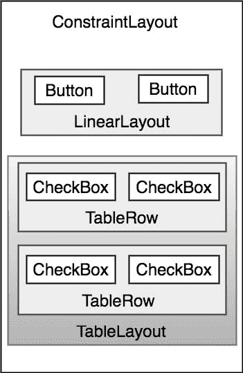
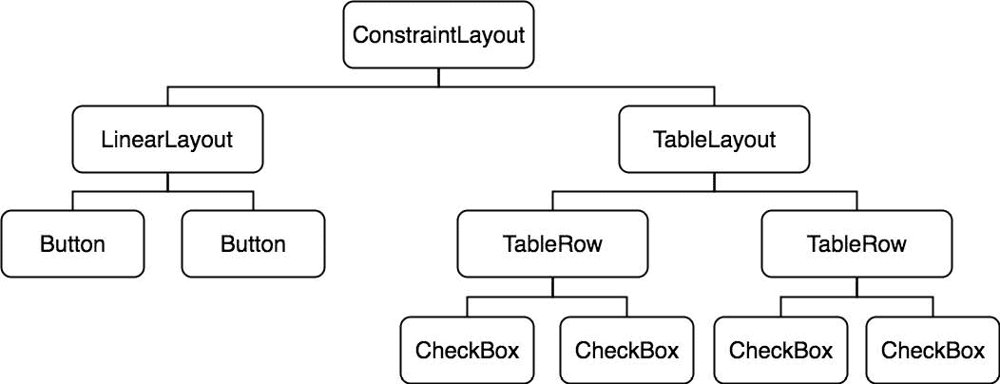

23\. 了解安卓视图、视图组和布局

除了收听流媒体音频之外，用户与安卓设备的交互本质上主要是视觉和触觉的。所有这些交互都是通过设备上安装的应用程序的用户界面进行的，包括内置应用程序和用户安装的任何第三方应用程序。因此，开发安卓应用程序的一个关键因素涉及到用户界面的设计和创建，这应该不足为奇。

在这一章中，将涵盖安卓用户界面结构的主题，以及可以组合在一起组成用户界面的不同元素的概述；即视图、视图组和布局。

23.1 为不同安卓设备设计

“安卓设备”一词涵盖了大量不同屏幕尺寸和分辨率的平板电脑和智能手机产品。因此，现在必须仔细设计应用程序用户界面，以确保在尽可能宽的显示尺寸范围内正确显示。其中一个关键部分是确保用户界面布局在不同设备上运行时能够正确调整大小。这在很大程度上可以通过仔细规划和使用本章中概述的布局管理器来实现。

同样重要的是要记住，大多数基于安卓的智能手机和平板电脑都可以由用户以纵向和横向握持。一个设计良好的用户界面应该能够适应这种变化，并做出合理的布局调整，以利用每个方向的可用屏幕空间。

23.2 视图和视图组

用户界面中的每一项都是安卓视图类的子类。安卓软件开发工具包提供了一组预构建的视图，可用于构建用户界面。典型的例子包括标准项目，如按钮、复选框、进度条和文本视图类。这种视图也被称为小部件或组件。对于软件开发工具包提供的小部件不能满足的需求，可以通过子类化和扩展现有的类来创建新的视图，或者通过直接构建在视图类之上来创建一个全新的组件。

一个视图也可以由多个其他视图组成(也称为复合视图)。这样的视图是从 Android viewGroup 类(android.view.ViewGroup )中子类化出来的，Android ViewGroup 类本身就是 View 的子类。这种视图的一个例子是 RadioGroup，它旨在包含多个 RadioButton 对象，以便在任何时候只有一个对象可以处于“on”位置。就结构而言，复合视图由能够包含其他视图(称为子视图)的单个父视图(从视图组类派生，也称为容器视图或根元素)组成。

基于视图组的容器视图的另一个类别是布局管理器。

23.3 安卓布局管理器

除了上一节讨论的小部件样式视图，SDK 还包括一组称为布局的视图。布局是容器视图(因此是视图组的子类)，设计的唯一目的是控制子视图在屏幕上的位置。

安卓软件开发工具包包括以下可能在安卓用户界面设计中使用的布局视图:

约束布局–在安卓 7 中引入，对于大多数布局要求，建议使用这种布局管理器。约束布局允许通过分配给每个子视图的简单约束设置来定义布局中视图的位置和行为。这种布局的灵活性允许快速轻松地创建复杂的布局，而无需将其他布局类型嵌套在彼此内部，从而提高布局性能。ConstraintLayout 也紧密集成到 Android Studio 布局编辑器工具中。除非另有说明，这是本书大多数例子的选择布局。

线性布局–根据选择的方向，将子视图定位在单行或单列中。可以为每个子级设置一个权重值，以指定该子级相对于其他子级应该占据多少布局空间。

TableLayout–将子视图排列成行和列的网格格式。表中的每一行都由一个 TableRow 对象子对象表示，该对象子对象又包含每个单元格的视图对象。

框架布局–框架布局的目的是分配一个屏幕区域，通常用于显示单个视图。如果添加了多个子视图，默认情况下，它们将在布局区域的左上角一个位于另一个之上。通过在每个子视图上设置重力值，可以实现各个子视图的交替定位。例如，在子级上设置 center _ 垂直重心值将导致它位于包含框架布局视图的垂直中心。

relative layout–relative layout 通过指定子视图上的对齐方式和边距，允许子视图相对于彼此和包含布局视图进行定位。例如，子视图 A 可以被配置为位于包含相对视图的垂直和水平中心。另一方面，视图 B 也可以被配置为在布局视图中水平居中，但位于视图 A 的上边缘上方 30 像素处，从而使垂直位置相对于视图 A 的垂直位置。当设计必须在各种屏幕大小和方向上工作的用户界面时，相对布局管理器可能特别有用。

绝对布局–允许子视图位于包含布局视图内的特定 X 和 Y 坐标。不鼓励使用这种布局，因为它缺乏响应屏幕大小和方向变化的灵活性。

网格布局–网格布局实例由不可见的线划分，这些线形成包含单元格的行和列的网格。子视图然后被放置在单元格中，并且可以被配置为水平和垂直地覆盖多个单元格，从而允许快速和容易地实现广泛的布局选项。网格布局中组件之间的间隙可以通过将一种称为空间视图的特殊类型的视图放置到相邻的单元格中，或者通过设置边距参数来实现。

CoordinatorLayout–作为 Android 5.0 的 Android 设计支持库的一部分推出，coordinator layout 专门用于协调应用程序屏幕顶部的应用程序栏的外观和行为以及其他视图元素。使用基本活动模板创建新活动时，主布局中的父视图将使用坐标布局实例实现。该布局管理器将从标题为[“使用浮动操作按钮和 Snackbar”](52.html#_idTextAnchor1040)的章节开始进行更详细的介绍。

当考虑在安卓应用程序的用户界面中使用布局时，值得记住的是，正如将在下一节中概述的，这些布局可以相互嵌套，以创建几乎任何必要复杂程度的用户界面设计。

23.4 视图层次结构

用户界面中的每个视图代表显示器的一个矩形区域。视图负责矩形中绘制的内容，并响应屏幕该部分中发生的事件(如触摸事件)。

用户界面屏幕由视图层次结构组成，根视图位于树的顶部，子视图位于下面的分支上。容器视图的子视图出现在其父视图的顶部，并被限制在父视图显示区域的边界内。例如，考虑在图 23-1 中显示的用户界面 illu :

图 23-1

除了可见按钮和复选框视图之外，用户界面实际上还包括许多布局视图，用于控制可见视图的位置。[图 23-2](#_idTextAnchor463) 显示了用户界面的另一个视图，这一次突出显示了与子视图相关的布局视图:

图 23-2

如前所述，用户界面是以视图层次结构的形式构建的，根视图位于顶部。在这种情况下，我们还可以将上面的用户界面示例可视化为视图树插图[中的图 23-3](#_idTextAnchor465) :

图 23-3

视图层次图可能给出了组成用户界面的各种视图之间关系的最清晰的概述，如图 23-1 所示。当向用户显示用户界面时，安卓运行时会遍历视图层次结构，从根视图开始，并在呈现每个视图时沿着树向下工作。

23.5 创建用户界面

随着对视图、布局和视图层次的概念有了更清晰的理解，接下来的几章将重点介绍为安卓活动创建用户界面所涉及的步骤。事实上，用户界面设计有三种不同的方法:使用 Android Studio 布局编辑器工具、手写 XML 布局资源文件或编写 Kotlin 代码，每种方法都将被涵盖。

23.6 总结

安卓应用程序的用户界面屏幕中的每个元素都是一个视图，该视图最终从安卓视图类中子类化。每个视图代表设备显示的一个矩形区域，并负责该矩形中出现的内容以及处理视图边界内发生的事件。可以组合多个视图来创建单个复合视图。复合视图中的视图是容器视图的子视图，容器视图通常是 android.view.ViewGroup 的子类(它本身是 android.view.View 的子类)。用户界面由视图层次结构形式的视图组成。

安卓软件开发工具包包括一系列预建视图，可用于创建用户界面。除了一系列可用于控制子视图定位的布局管理器之外，这些组件还包括文本字段和按钮等基本组件。如果提供的视图不符合特定要求，可以通过扩展或组合现有视图，或者通过子类化 android.view.View 并创建一个全新的视图类来创建自定义视图。

用户界面可以使用安卓工作室布局编辑器工具、手写 XML 布局资源文件或通过编写科特林代码来创建。这些方法中的每一种都将在后面的章节中介绍。