26\. 安卓工作室使用约束布局指南

正如前几章不止一次提到的，谷歌对安卓工作室布局编辑器工具进行了重大更改，其中许多更改完全是为了支持使用 ConstraintLayout 的用户界面布局设计。既然在上一章中已经概述了约束布局的基本概念，本章将更详细地探讨这些概念，同时也概述了布局编辑器工具允许设计和实现基于约束布局的用户界面的方式。

26.1 设计和布局视图

标题为[“安卓工作室布局编辑器工具指南”](24.html#_idTextAnchor468)的章节解释说，安卓工作室布局编辑器工具提供了两种方式，以设计和布局(也称为蓝图)视图的形式查看活动的用户界面布局。布局的这些视图可以单独显示，或者如图 26-1 所示，并排显示:

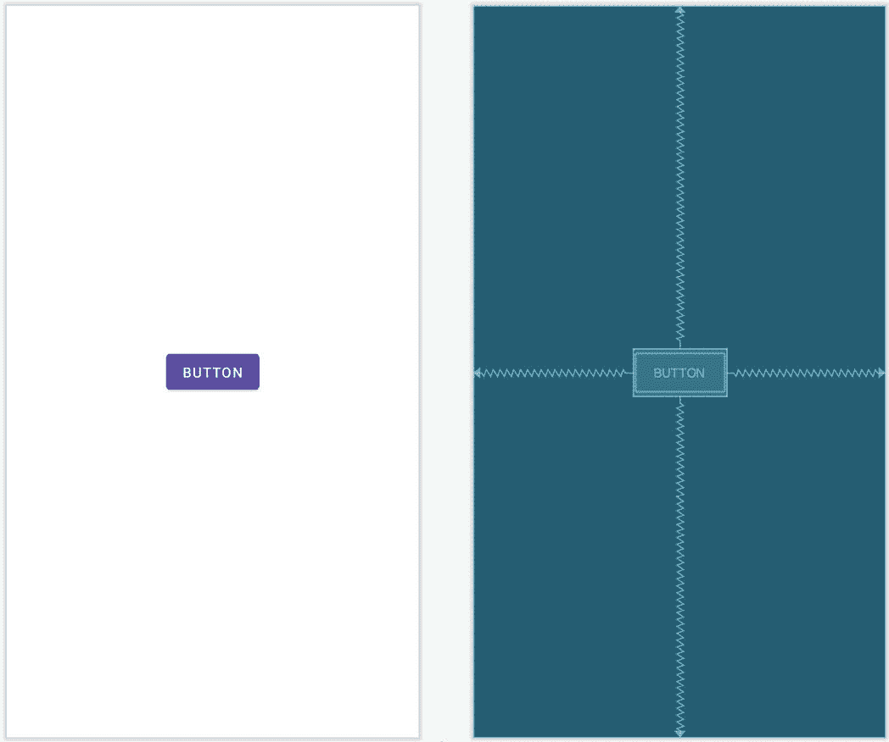

图 26-1

“设计”视图(位于上图的左侧)呈现了布局的“所见即所得”表示，其中布局会在运行的应用程序中显示。另一方面，布局视图显示蓝图样式的视图，其中小部件由阴影轮廓表示。如上面的[图 26-1](#_idTextAnchor570) 所示，布局视图还显示了约束连接(在这种情况下，相反的约束用于在布局中居中按钮)。当选择布局中的特定小部件或当鼠标指针悬停在设计区域上时，这些约束也会覆盖到设计视图上，如图 26-2[所示](#_idTextAnchor571):

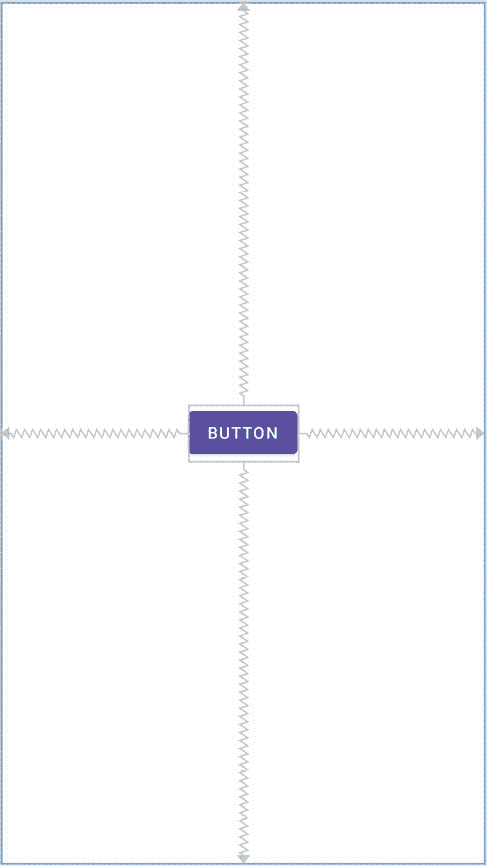

图 26-2

使用[图 26-3](#_idTextAnchor572) 所示的视图选项菜单，可以改变两个视图中约束连接的外观:

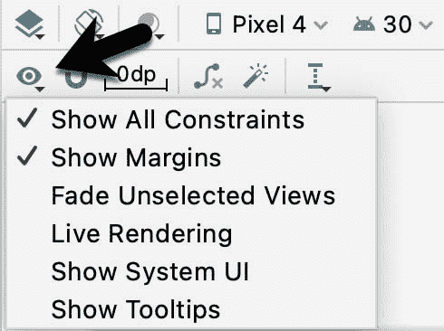

图 26-3

除了显示用户界面布局的两种模式之外，布局编辑器工具还提供了三种不同的方式来建立特定布局设计所需的约束。

26.2 自动连接模式

顾名思义，自动连接会在项目添加到布局时自动建立约束连接。使用[图 26-4](#_idTextAnchor574) 所示的工具栏按钮，可以启用和禁用自动连接模式:

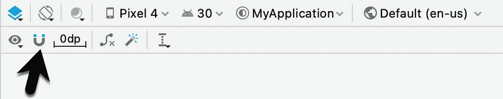

图 26-4

自动连接模式使用算法根据小部件的位置以及小部件与父布局两侧和布局中其他元素的接近程度来决定要建立的最佳约束。如果任何自动约束连接未能提供所需的行为，可以手动更改，如本章后面所述。

26.3 推理模式

推理模式使用涉及算法和概率的启发式方法，在小部件已经添加到布局之后自动实现约束连接。当自动连接功能已关闭，并且对象已添加到布局中而没有任何约束连接时，通常使用此模式。这允许通过简单地将对象从调色板拖放到布局画布上来设计布局，并进行大小和位置更改，直到布局根据需要出现。本质上，这包括“画”布局，而不用担心约束。推理模式也可以在设计过程中的任何时候使用，以填充布局中缺少的约束。

单击“推断约束”按钮(图 26-5 )时，约束会自动添加到布局中:

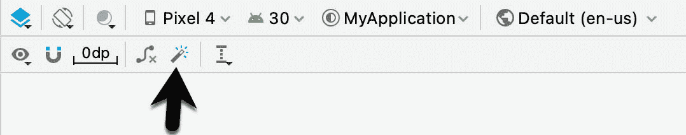

图 26-5

与自动连接模式一样，布局编辑器工具总是有可能推断出不正确的约束，尽管这些约束可能会被手动修改和更正。

26.4 手动操作约束

实现约束连接的第三种选择是手动进行。这样做时，了解布局编辑器工具中小部件周围出现的各种句柄将会很有帮助。例如，考虑[图 26-6](#_idTextAnchor578) 所示的小部件:

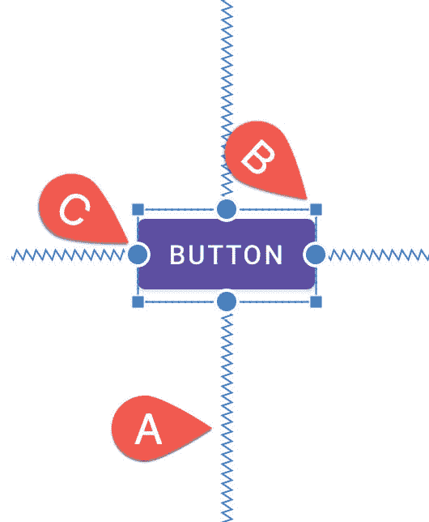

图 26-6

很明显，像弹簧一样的线(A)表示从小部件的侧面到目标的已建立的约束连接。对象每个角上的小方形标记(B)是调整大小手柄，当单击和拖动时，用于调整小部件的大小。小部件两侧的小圆形手柄(C)是侧约束锚点。如[图 26-7](#_idTextAnchor579) 所示，要创建约束连接，点击手柄，将结果线拖动到要连接约束的元素上(如指引线或父布局或另一个部件的侧面)。当连接到另一个小部件的侧面时，只需将线条拖到该小部件的侧面约束手柄上，并在小部件和手柄高亮显示时释放线条。


图 26-7

如果约束线被拖动到小部件并被释放，但未附加到约束控制柄，布局编辑器将显示一个菜单，其中包含约束可能附加到的边的列表。例如在[图 26-8](#_idTextAnchor580) 中，约束可以附加到目标按钮部件的顶部或底部边缘:

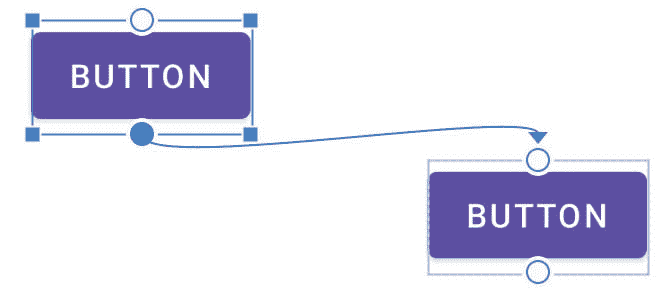

图 26-8

一个额外的标记指示基线约束的锚点，由此小部件内的内容(相对于外部边缘)被用作对齐点。要显示此标记，只需右键单击小部件并选择“显示基线”菜单选项。要从基线约束手柄建立约束连接，只需将鼠标指针悬停在手柄上，直到它开始闪烁，然后单击并拖动到目标(如[图 26-9](#_idTextAnchor581) 所示的另一个小部件的基线锚点)。当目标锚点开始闪烁绿色时，释放鼠标按钮进行约束连接:


图 26-9

要隐藏基线锚点，请再次右键单击小部件，并选择“隐藏基线”菜单选项。

26.5 在检查器中添加约束

也可以使用位于属性工具窗口中的检查器面板将约束添加到安卓工作室布局编辑器工具内的视图中，如图 26-10 所示。中间的正方形代表当前选定的视图和正方形周围的区域。约束(如果有)应用于视图的相应边:

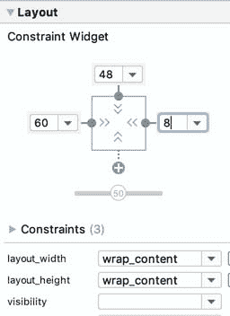

图 26-10

视图一侧缺少约束由一条虚线表示，该虚线指向一个包含加号的蓝色圆圈(上图中视图的底边就是这种情况)。要添加一个约束，只需点击这个蓝色的圆圈，布局编辑器将添加一个连接到它认为是布局中最合适的目标的约束。

26.6 在属性窗口中查看约束

通过显示属性工具窗口的约束部分，可以查看当前选择的小部件上配置的约束列表，如下图[26-11](#_idTextAnchor585)所示:

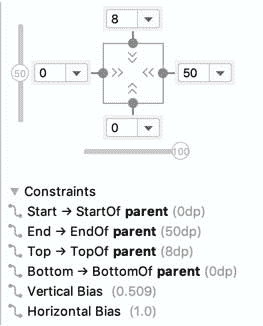

图 26-11

单击列表中的约束将在设计布局中选择该约束。

26.7 删除约束

要删除单个约束，只需在设计布局或属性工具窗口中选择约束，使其高亮显示(例如，在[图 26-12](#_idTextAnchor587) 中，最右边的约束已被选中)，然后点击键盘上的删除键。该约束将从布局中移除。

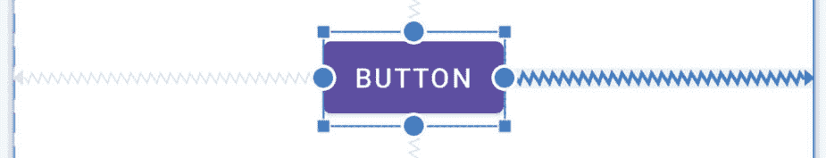

图 26-12

另一个选项是将鼠标指针悬停在约束锚点上，同时按住 Ctrl(macOS 上的 Cmd)键，并在锚点变红后单击它:

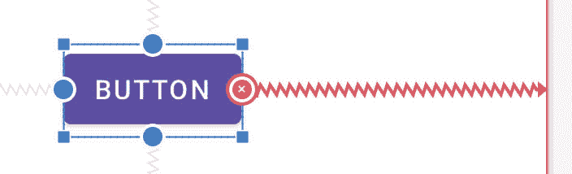

图 26-13

或者，通过右键单击小部件并选择清除选择的约束菜单选项，删除小部件上的所有约束。

要删除布局中每个小部件的所有约束，请使用在[图 26-14](#_idTextAnchor588) 中高亮显示的工具栏按钮:

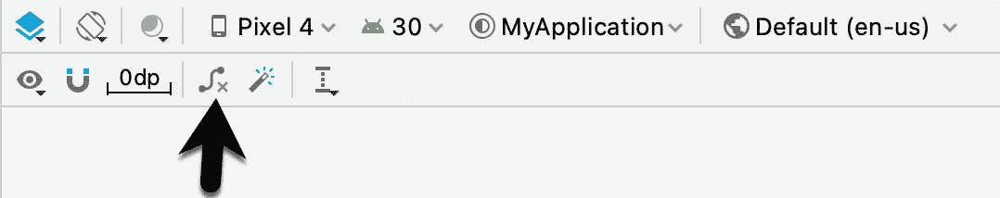

图 26-14

26.8 调整约束偏差

在前一章中，概述了使用偏置设置来支持一个相反约束而不是另一个的概念。安卓工作室布局编辑器工具中的偏差使用位于属性工具窗口中的检查器进行调整，如图 26-15 所示。图中箭头指示的两个滑块用于控制当前选定小部件的垂直和水平相对约束的偏差。

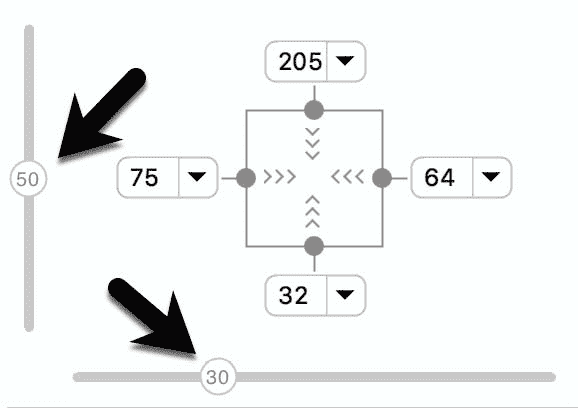

图 26-15

26.9 理解约束布局边距

约束可以与边距结合使用，以实现小部件和另一个元素(如另一个小部件、一个指导方针或父布局的侧面)之间的固定间隙。例如，考虑应用于[图 26-16](#_idTextAnchor592) 中按钮对象的水平约束:

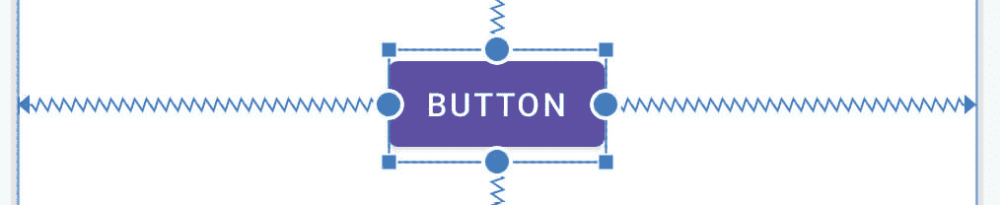

图 26-16

按照当前配置，水平约束延伸到父约束布局的左边缘和右边缘。因此，小部件具有相反的水平约束，这表明在运行时，约束布局引擎在小部件的实际定位方面有一定的判断力。这使得布局具有一定的灵活性，以适应不同的屏幕尺寸和设备方向。水平偏移设置也能够控制小部件的位置，直到布局的右侧。[例如，图 26-17](#_idTextAnchor593) 显示了施加 100%水平偏置的相同按钮:


图 26-17

ConstraintLayout 边距可以出现在约束连接的末尾，并表示一个固定的间隙，即使在调整偏差或响应活动中其他地方的布局更改时，小部件也不能移动到该间隙中。在[图 26-18](#_idTextAnchor594) 中，右侧约束现在包括 50dp 余量，即使偏差仍然设置为 100%，小部件也不能移动到该余量中。

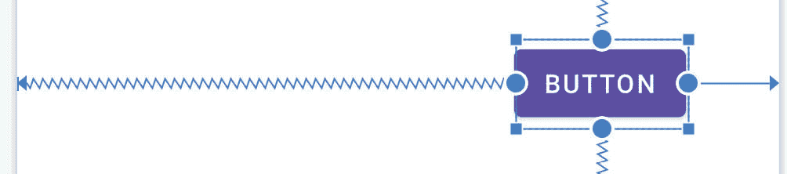

图 26-18

小部件上的现有边距值可以在检查器中修改。从[图 26-19](#_idTextAnchor595) 中可以看到，一个下拉菜单被用来将当前选择的小部件的右边距更改为 16dp。或者，单击当前值也允许在字段中键入数字。


图 26-19

使用[图 26-20](#_idTextAnchor596) 中突出显示的工具栏中的选项，可以随时更改新约束的默认边距:

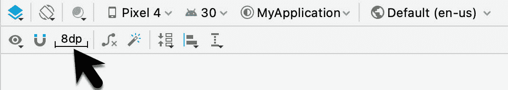

图 26-20

26.10 对立约束和偏见的重要性

如前一章所述，当使用约束布局时，相反的约束、边距和偏差构成了安卓中响应布局设计的基石。当一个小部件被约束而没有相反的约束连接时，这些约束本质上是边界约束。如图 26-21 所示，这在布局编辑器工具中用实线表示，并附有边距测量值。


图 26-21

上述约束基本上将小部件固定在那个位置。这样做的结果是，如果设备旋转到横向方向，小部件将不再可见，因为垂直约束将其推到设备屏幕的顶部边缘之外(如图 26-22 中的)。如果应用程序运行在屏幕比设计过程中使用的屏幕小的设备上，也会出现类似的问题。


图 26-22

当实现相反的约束时，约束连接由类似弹簧的锯齿状线表示(弹簧隐喻旨在指示小部件的位置不固定为绝对 X 和 Y 坐标):

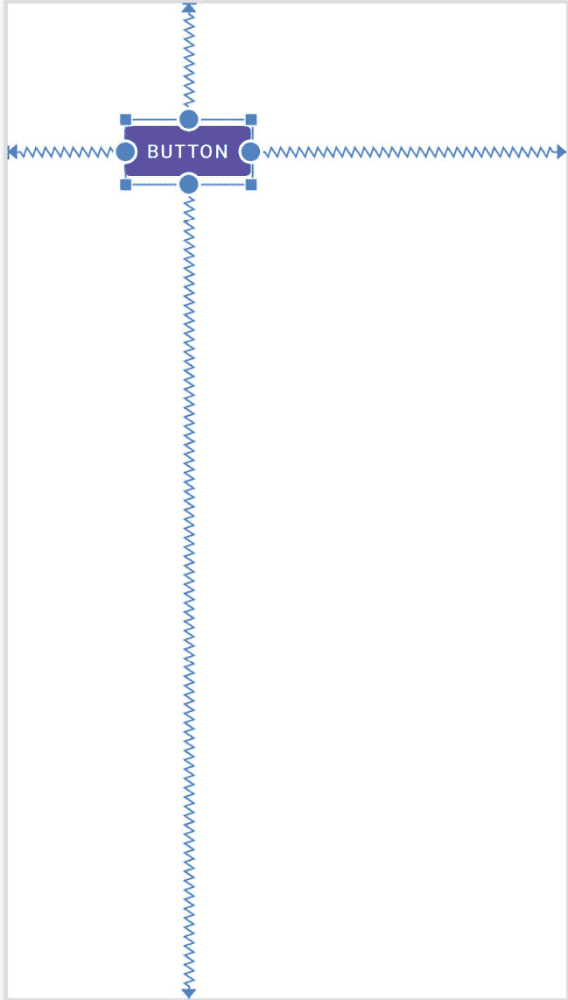

图 26-23

在上面的布局中，已经配置了垂直和水平偏移设置，使得小部件将始终位于距底部 90%的距离和距父布局左侧边缘 35%的距离处。因此，旋转时，小部件仍然可见，并且相对于屏幕尺寸位于相同的位置:


图 26-24

当设计响应性和适应性强的用户界面布局时，在手动设计用户界面布局和对自动创建的约束进行修正时，考虑偏差和相反的约束是很重要的。

26.11 配置小部件尺寸

约束布局内的小部件的内部尺寸也可以使用检查器进行配置。如前一章所述，小部件维度可以设置为包装内容、固定或匹配约束模式。当前选定部件上每个尺寸的主要设置显示在检查器中代表部件的方块内，如图 26-25 所示:


图 26-25

在上图中，水平和垂直尺寸都被设置为环绕内容模式(由向内指向的人字指示)。检查员使用以下视觉指示器来表示三维模式:

<colgroup><col> <col></colgroup> 
| 固定尺寸 | 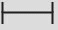 |
| 匹配约束 | 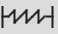 |
| 包装内容 |  |

表 26-1

要更改当前设置，只需点击指示器，在三种不同的设置之间循环。当布局编辑器中视图的尺寸设置为匹配约束模式时，视图的相应边用类似弹簧的线而不是通常的直线绘制。例如在[图 26-26](#_idTextAnchor603) 中，只有视图的宽度被设置为匹配约束:

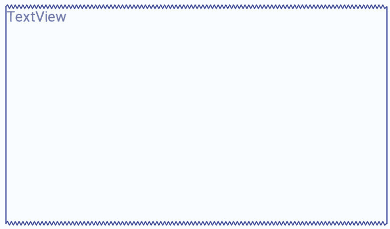

图 26-26

此外，小部件的大小可以水平或垂直扩展到约束和布局中的其他小部件使用水平扩展和垂直扩展选项所允许的最大值。右键单击布局中的小部件，并从结果菜单中选择“组织”选项，即可访问这些选项(图 26-27 )。使用时，当前选定的小部件将水平或垂直增加大小，以填充其周围的可用空间。

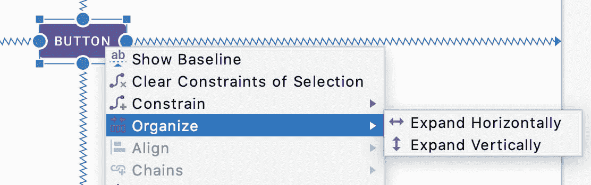

图 26-27

26.12 设计时间工具定位

名为[“安卓工作室布局编辑器工具指南”](24.html#_idTextAnchor468)的章节介绍了工具命名空间的概念，并解释了如何使用它来设置仅在布局编辑器中生效的可见性属性。在幕后，安卓工作室还使用工具属性来保持小部件在布局上不受限制时的位置。例如，想象一下，当自动连接模式被禁用时，一个按钮被放置在布局上。虽然小部件会出现在预览画布中的正确位置，但当应用程序运行时，它会出现在屏幕的左上角。这是因为小部件没有约束来告诉 ConstraintLayout 父级它的位置。

之所以小部件在布局编辑器中出现在正确的位置，是因为安卓工作室设置了绝对 X 和 Y 定位工具属性，以将其保持在正确的位置，直到可以添加约束。在 XML 布局文件中，这可能如下所示:

```kt
<Button
    android:id="@+id/button4"
    android:layout_width="wrap_content"
    android:layout_height="wrap_content"
    android:text="Button"
    tools:layout_editor_absoluteX="111dp"
    tools:layout_editor_absoluteY="88dp" />
```

一旦向小部件添加了足够的约束，布局编辑器将移除这些工具属性。一个不用等到应用运行就能快速识别哪些小部件缺少约束的有用技术是点击[图 26-28](#_idTextAnchor607) 中高亮显示的按钮来切换工具位置可见性。任何跳转到左上角的小部件都没有被完全约束，而是被临时工具绝对的 X 和 Y 定位属性固定住了。

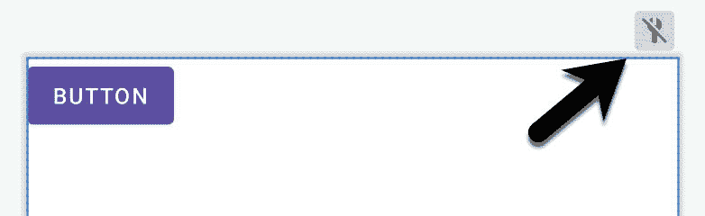

图 26-28

26.13 增加指引

顾ideline提供约束可以锚定的附加元素。通过右键单击布局并选择垂直指南或水平指南菜单选项或使用工具栏菜单选项来添加指南，如图[图 26-29](#_idTextAnchor610) :

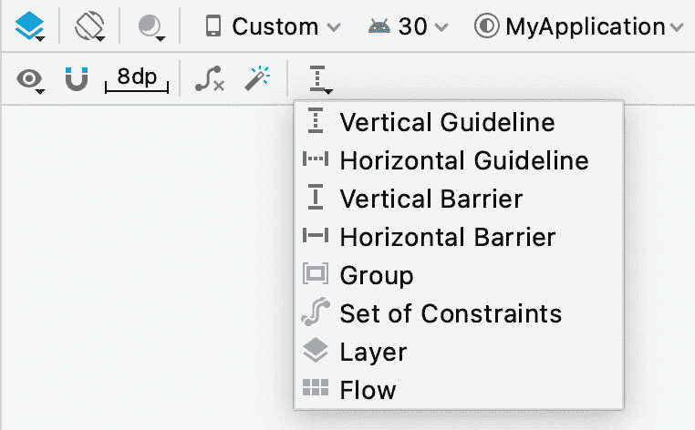

图 26-29

或者，可以从组件面板的帮助器部分拖动水平和垂直指南，并将其放到布局画布或组件树面板上:

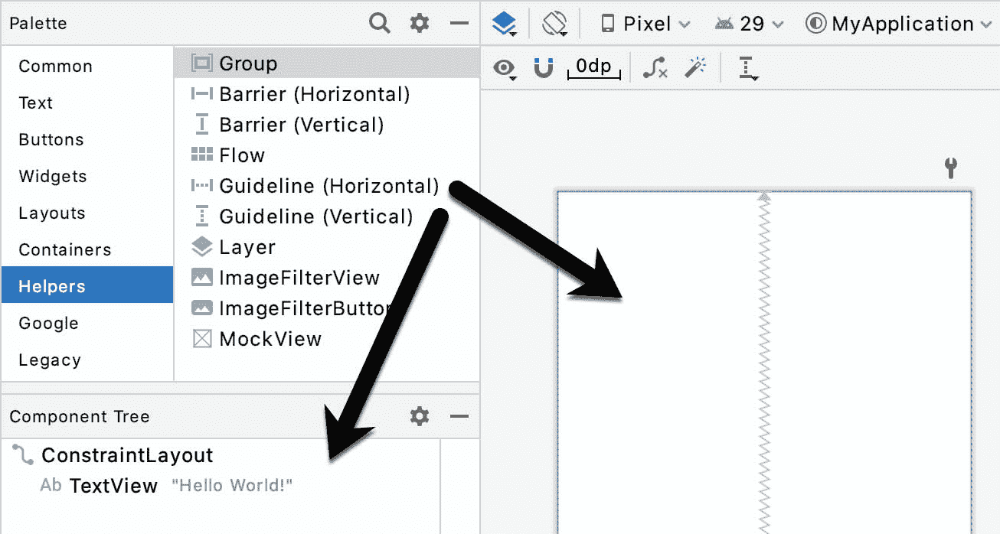

图 26-30

添加后，指引线将在布局中显示为虚线，只需单击并拖动该线即可移动。要建立与指引线的约束连接，请在小部件的约束处理程序中单击，并在释放前拖动到指引线。在[图 26-31](#_idTextAnchor611) 中，两个按钮的左侧通过约束连接到一个垂直指引线。

垂直参考线的位置可以指定为距父布局左侧或右侧(或水平参考线的顶部或底部)的绝对距离。例如，上图中的垂直指引线位于距父对象左侧边缘 96dp 的位置。

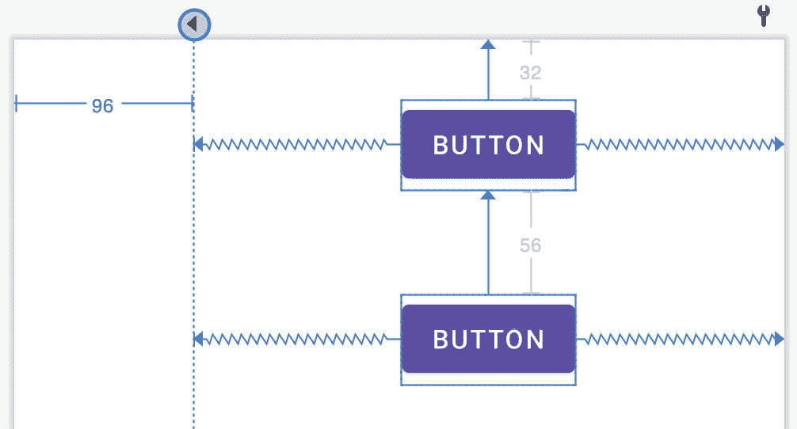

图 26-31

或者，该指引可以被定位为父布局的总宽度或高度的百分比。要在这三种模式之间切换，请选择指引线，然后单击指引线顶部或起点的圆圈(取决于指引线是垂直的还是水平的)。[例如，图 26-32](#_idTextAnchor612) 显示了基于百分比定位的指南:

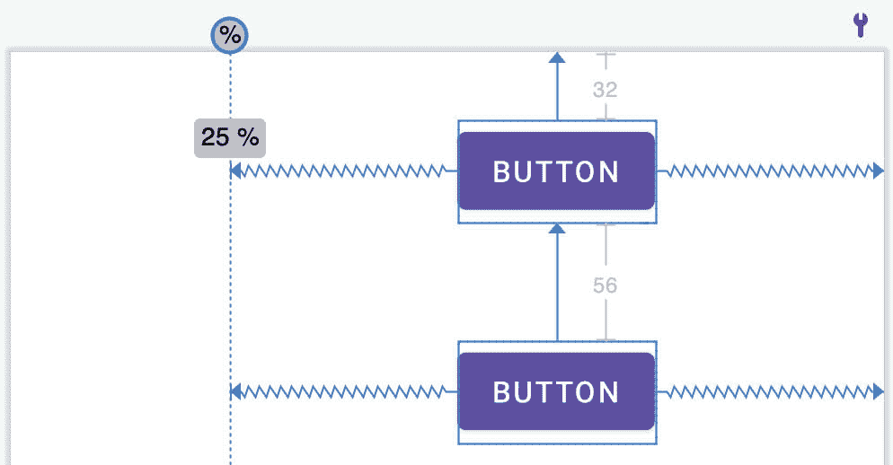

图 26-32

26.14 增加障碍

通过右键单击布局并从“添加助手”中选择“垂直障碍”或“水平障碍”选项来添加障碍...菜单，或使用工具栏菜单选项如前[图 26-29](#_idTextAnchor610) 所示。或者，在组件面板的帮助器部分找到障碍类型，并将它们拖放到布局画布或组件树面板上。

将屏障添加到布局后，它将在“组件树”面板中显示为一个条目:

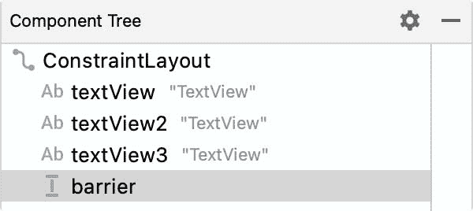

图 26-33

要添加视图作为参考视图(换句话说，控制屏障位置的视图)，只需将组件树中的小部件拖到屏障条目上。在[图 26-34](#_idTextAnchor614) 中，例如，名为 textView1 和 textView2 的小部件被指定为 barrier1 的参考小部件:

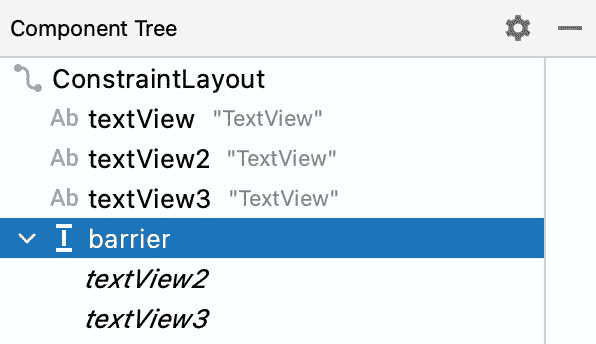

图 26-34

添加参考视图后，需要配置障碍物，以指定障碍物相对于这些视图的方向。这是屏障方向设置，当在“组件树”面板中选择屏障时，在“属性”工具窗口中定义:

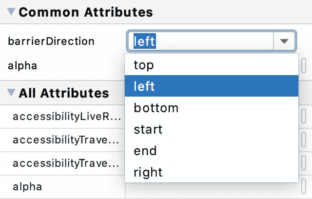

图 26-35

下图显示了一个布局，其中包含一个声明的屏障，文本视图 1 和文本视图 2 作为参考视图，文本视图 3 作为约束视图。由于屏障正从参考视图的末端向受约束视图推进，因此屏障方向已设置为结束:


图 26-36

26.15 添加组

要将组添加到布局，请右键单击该布局，然后从“添加助手”中选择“组”选项..菜单，或使用工具栏菜单选项如前[图 26-29](#_idTextAnchor610) 所示。或者，在组件面板的帮助器部分找到组项目，并将其拖放到布局画布或组件树面板上。

要向组中添加小部件，请在组件树中选择它们，并将它们拖放到组条目中。[例如，图 26-37](#_idTextAnchor616) 显示了三个选定的小部件被添加到一个组中:


图 26-37

该组引用的任何小部件将在组件树中的组条目下以斜体显示，如图 26-38 所示。要从组中删除小部件，只需选择它并轻按键盘上的删除键:


图 26-38

将小部件分配到组后，使用属性工具窗口的约束部分修改可见性设置:


图 26-39

26.16 与流量助手一起工作

可以使用菜单或调色板添加流程助手，如前面针对其他助手所述。与组助手([图 26-37](#_idTextAnchor616) )一样，通过在组件树中将小部件拖动到流条目中，可以将它们添加到流实例中。添加流帮助器并为其分配小部件后，在组件树中选择它，并使用属性工具窗口的通用属性部分来配置流布局行为:

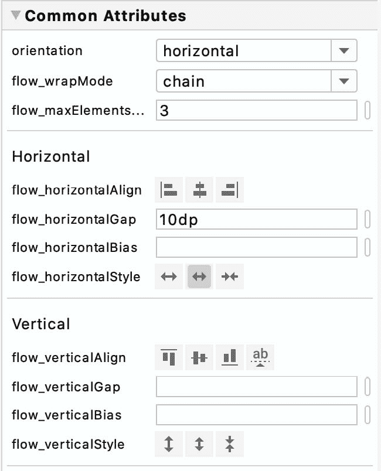

图 26-40

26.17 小部件组对齐和分布

Android Studio 布局编辑器工具提供了一系列对齐和分发操作，当在布局中选择两个或更多小部件时，可以执行这些操作。只需按住 shift 键点按要包含在操作中的每个小部件，右键点按布局，并从“对齐”菜单中显示的许多选项中进行选择:

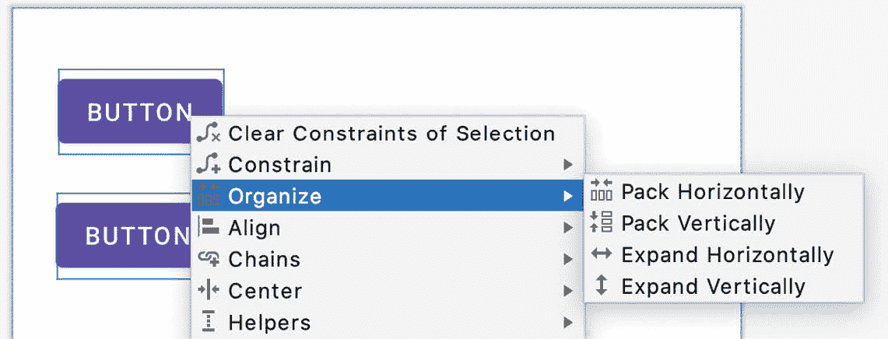

图 26-41

如下图[26-42](#_idTextAnchor622)所示，也可以通过布局编辑器工具栏中的对齐按钮访问这些选项:

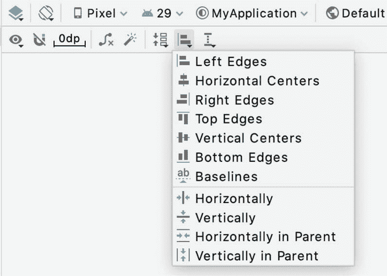

图 26-42

同样，打包菜单([图 26-43](#_idTextAnchor623) )可用于集中重新定位选定的小部件，使它们垂直或水平紧密打包在一起。它通过改变小部件的绝对 x 和 y 坐标来实现这一点，但不应用任何约束。另一方面，“打包”菜单中的两个分布选项移动选定的小部件，使它们在垂直或水平轴上均匀间隔，并在视图之间应用约束来保持这种间隔。

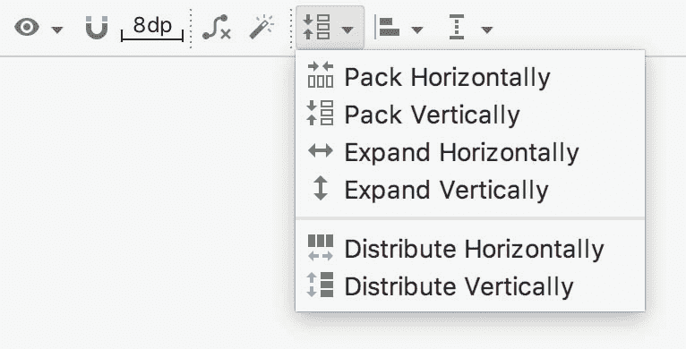

图 26-43

26.18 将其他布局转换为约束布局

对于使用一个或多个其他安卓布局类(如相对布局或线性布局)的现有用户界面布局，布局编辑器工具提供了一个将用户界面转换为使用约束布局的选项。

当“布局编辑器”工具打开并处于设计模式时，“组件树”面板显示在选项板下方。要将布局转换为约束布局，请在组件树中找到它，右键单击它并选择将<current layout="">转换为约束布局菜单选项:</current>


图 26-44

当选择此菜单选项时，Android Studio 将把选定的布局转换为 ConstraintLayout，并使用推理来建立旨在匹配原始布局类型的布局行为的约束。

26.19 总结

重新设计的布局编辑器工具与约束布局相结合，使使用安卓工作室设计复杂的用户界面布局成为一个相对快速和直观的过程。本章更详细地介绍了约束、边距和偏差的概念，同时还探讨了将基于约束布局的设计集成到布局编辑器工具中的方法。