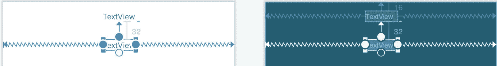

34\. 安卓触控和多点触控事件处理

大多数基于安卓的设备使用触摸屏作为用户和设备之间的主要界面。前一章介绍了一种机制，通过这种机制，屏幕上的触摸可以转化为正在运行的安卓应用中的动作。然而，触摸事件处理远不止对视图对象上的单个手指点击做出响应。例如，大多数安卓设备可以一次检测多个触摸。触摸也不限于设备显示器上的单个点。当然，当用户在屏幕表面滑动一个或多个接触点时，触摸可以是动态的。

触摸也可以被应用解释为手势。例如，考虑水平滑动通常用于翻转电子书的页面，或者如何使用挤压运动来放大和缩小屏幕上显示的图像。

本章将解释涉及运动的触摸处理，并探讨拦截多个并发触摸的概念。识别不同手势的主题将在下一章讨论。

34.1 拦截触摸事件

通过注册一个 onTouchListener 事件监听器并实现相应的 onTouch() 回调方法或 lambda，视图对象可以截获触摸事件。例如，下面的代码确保对名为 myLayout 的 ConstraintLayout 视图实例的任何接触都会导致对 lambda 表达式的调用:

```kt
binding.myLayout.setOnTouchListener {v: View, m: MotionEvent ->
            // Perform tasks here
            true
}
```

当然，上面的代码也可以通过使用函数而不是 lambda 来实现，如下所示，尽管 lambda 方法产生了更紧凑和可读的代码:

```kt
binding.myLayout.setOnTouchListener(object : View.OnTouchListener {
    override fun onTouch(v: View, m: MotionEvent): Boolean {
        // Perform tasks here
        return true
    }
})
```

如代码示例中所示，lambda 表达式需要返回一个布尔值，该值向 Android 运行时系统指示该事件是否应该传递给在同一视图上注册的其他事件侦听器或被丢弃。该方法被传递一个对触发事件的视图的引用和一个类型为 MotionEvent 的对象。

34.2 运动事件对象

传递给 onTouch() 回调方法的 MotionEvent 对象是获取事件信息的关键。对象中包含的信息包括触摸在视图中的位置和执行的动作类型。MotionEvent 对象也是处理多次触摸的关键。

34.3 理解触摸动作

触摸事件处理的一个重要方面涉及能够识别用户执行的动作类型。与事件相关联的动作类型可以通过调用 MotionEvent 对象的 getActionMasked()方法来获得，该方法被传递给 onTouch()回调方法。当视图上发生第一次触摸时，MotionEvent 对象将包含 ACTION_DOWN 的动作类型以及触摸的坐标。当触摸从屏幕上抬起时，会产生一个 ACTION_UP 事件。动作向下和动作向上事件之间的任何触摸动作将由动作移动事件表示。

当在视图上同时执行多个触摸时，这些触摸被称为指针。在多点触控场景中，指针分别以动作 _ 指针 _ 向下和动作 _ 指针 _ 向上类型的事件动作开始和结束。为了识别触发事件的指针的索引，必须调用 MotionEvent 对象的 getActionIndex()回调方法。

34.4 处理多次触摸

标题为[“安卓事件处理概述和示例”](33.html#_idTextAnchor734)的章节开始在单一触摸事件的狭窄背景下探索事件处理。实际上，大多数安卓设备都具有对多个连续触摸做出响应的能力(尽管需要注意的是，可以检测到的同时触摸的数量因设备而异)。

如前所述，多点触控情况下的每一次触控都被安卓框架视为一个指针。每个指针又被一个索引值引用，并被赋予一个标识。通过调用当前 MotionEvent 对象的 getPointerCount()方法，可以获得当前的指针数量。当前指针列表中特定索引处指针的标识可以通过调用 MotionEvent getPointerId()方法获得。例如，以下代码摘录获取指针计数和索引 0 处指针的标识:

```kt
binding.myLayout.setOnTouchListener {v: View, m: MotionEvent ->
    val pointerCount = m.pointerCount
    val pointerId = m.getPointerId(0)
    true
}
```

请注意，触发 onTouch 侦听器时，指针计数将始终大于或等于 1(因为要触发回调，必须至少有一次触摸)。

在与屏幕的接触点被提起之前，对视图的触摸，尤其是涉及屏幕上的运动的触摸，将产生一连串事件。因此，应用可能需要跟踪多个触摸事件上的单个触摸。虽然特定触摸手势的 ID 不会从一个事件到下一个事件发生变化，但重要的是要记住，索引值会随着其他触摸事件的发生而变化。因此，当在多个事件上使用触摸手势时，必须将标识值用作触摸参考，以确保跟踪相同的触摸。当调用需要索引值的方法时，这应该通过调用 MotionEvent 对象的 findPointerIndex()方法将触摸的标识转换为相应的索引值来获得。

34.5 多点触控应用示例

本章剩余部分中创建的示例应用将在两个触摸手势在布局视图中移动时对其进行跟踪。当每次触摸的事件被触发时，每次触摸的坐标、索引和标识将显示在屏幕上。

从欢迎屏幕中选择创建新项目快速启动选项，并在生成的新项目对话框中选择空活动模板，然后单击下一步按钮。

在“名称”字段中输入 MotionEvent，并将 com . ebookwidge . motion event 指定为包名。在单击完成按钮之前，将最低API级别设置更改为API 26:安卓 8.0(奥利奥)，并将语言菜单更改为科特林。

调整项目以使用视图绑定，如第 [18.8 节将项目迁移到视图绑定](18.html#_idTextAnchor393)中所述。

34.6 设计活动用户界面

应用唯一活动的用户界面由包含两个文本视图对象的约束布局视图组成。在项目工具窗口中，导航到 app -> res -> layout，双击 activity_main.xml 布局资源文件，将其加载到 Android Studio 布局编辑器工具中。

选择并删除默认的“你好世界！”文本视图小部件，然后在启用自动连接的情况下，拖放新的文本视图小部件，使其水平居中，并位于布局顶部边缘的 16dp 边距线上:


图 34-1

拖动第二个文本视图小部件，定位并约束它，使其与第一个小部件的底部相距 32dp:



图 34-2

使用属性工具窗口，将文本视图小部件的标识分别更改为文本视图 1 和文本视图 2。将小部件上显示的文本更改为“触摸一个状态”和“触摸两个状态”，并使用布局编辑器右上角的警告按钮将字符串提取到资源中。

在组件树中选择约束布局条目，并使用属性面板将标识更改为 activity_main。

34.7 实现触摸事件监听器

为了接收触摸事件通知，需要在 MainActivity 活动类的 onCreate()方法中的布局视图上注册一个触摸监听器。从AndroidStudio编辑器面板中选择 MainActivity.kt 选项卡，显示源代码。在 onCreate()方法中，添加代码来注册 touch 侦听器并实现代码，在本例中，该代码将调用名为 handleTouch()的第二个方法，MotionEvent 对象将被传递给该方法:

```kt
package com.ebookfrenzy.motionevent

import androidx.appcompat.app.AppCompatActivity
import android.os.Bundle
import android.view.MotionEvent

import com.ebookfrenzy.motionevent.databinding.ActivityMainBinding

class MainActivity : AppCompatActivity() {

    private lateinit var binding: ActivityMainBinding

    override fun onCreate(savedInstanceState: Bundle?) {
        super.onCreate(savedInstanceState)
        binding = ActivityMainBinding.inflate(layoutInflater)
        setContentView(binding.root)

        binding.activityMain.setOnTouchListener {_, m: MotionEvent ->
            handleTouch(m)
            true
        }
    }
}
```

测试应用之前的最后一项任务是实现侦听器调用的 handleTouch()方法。此方法的代码如下所示:

```kt
private fun handleTouch(m: MotionEvent)
{
    val pointerCount = m.pointerCount

    for (i in 0 until pointerCount)
    {
        val x = m.getX(i)
        val y = m.getY(i)
        val id = m.getPointerId(i)
        val action = m.actionMasked
        val actionIndex = m.actionIndex
        var actionString: String

        when (action)
        {
            MotionEvent.ACTION_DOWN -> actionString = "DOWN"
            MotionEvent.ACTION_UP -> actionString = "UP"
            MotionEvent.ACTION_POINTER_DOWN -> actionString = "PNTR DOWN"
            MotionEvent.ACTION_POINTER_UP -> actionString = "PNTR UP"
            MotionEvent.ACTION_MOVE -> actionString = "MOVE"
            else -> actionString = ""
        }

        val touchStatus = 
                  "Action: $actionString Index: $actionIndex ID: $id X: $x Y: $y"

        if (id == 0)
            binding.textView1.text = touchStatus
        else
            binding.textView2.text = touchStatus
    }
}
```

在编译和运行应用之前，花点时间系统地浏览这段代码以突出显示正在执行的任务是值得的。

代码首先确定视图上当前有多少指针处于活动状态:

```kt
val pointerCount = m.pointerCount
```

接下来，指针计数变量用于启动 for 循环，该循环为每个活动指针执行一组任务。循环的前几行获得触摸的 X 和 Y 坐标以及相应的事件 ID、动作类型和动作索引。最后，声明一个字符串变量:

```kt
for (i in 0 until pointerCount)
{
    val x = m.getX(i)
    val y = m.getY(i)
    val id = m.getPointerId(i)
    val action = m.actionMasked
    val actionIndex = m.actionIndex
    var actionString: String
```

由于操作类型等同于整数值，因此使用 when 语句将操作类型转换为更有意义的字符串值，该值存储在之前声明的 actionString 变量中:

```kt
when (action)
{
    MotionEvent.ACTION_DOWN -> actionString = "DOWN"
    MotionEvent.ACTION_UP -> actionString = "UP"
    MotionEvent.ACTION_POINTER_DOWN -> actionString = "PNTR DOWN"
    MotionEvent.ACTION_POINTER_UP -> actionString = "PNTR UP"
    MotionEvent.ACTION_MOVE -> actionString = "MOVE"
    else -> actionString = ""
}
```

最后，使用动作字符串值、动作索引、触摸标识以及 X 和 Y 坐标来构建字符串消息。然后使用标识值来决定字符串应该显示在第一个还是第二个文本视图对象上:

```kt
val touchStatus = 
   "Action: $actionString Index: $actionIndex ID: $id X: $x Y: $y"

if (id == 0)
    binding.textView1.text = touchStatus
else
    binding.textView2.text = touchStatus
```

34.8 运行示例应用

编译并运行应用，一旦启动，在屏幕上进行单触和多触实验，注意文本视图会更新以反映事件，如图 34-3 所示。在模拟器上运行时，可以通过按住 Ctrl(macOS 上的 Cmd)键并单击鼠标按钮来模拟多次触摸(请注意，如果模拟器在工具窗口中运行，模拟多次触摸可能不起作用):


图 34-3

34.9 总结

活动通过注册一个 onTouchListener 事件侦听器并实现 onTouch()回调方法来接收触摸事件的通知，反过来，当安卓运行时调用该回调方法时，它会被传递给一个 MotionEvent 对象。该对象包含关于触摸的信息，例如触摸事件的类型、触摸的坐标以及当前与视图接触的触摸次数的计数。

当涉及多个触摸时，每个接触点被称为指针，每个点被分配一个索引和一个标识。虽然触摸的索引可以从一个事件更改为另一个事件，但标识将保持不变，直到触摸结束。

本章已经创建了一个示例安卓应用，用于在设备显示器上显示最多两次同时触摸的坐标和动作类型。

概括介绍了触摸后，下一章(标题为[“使用安卓手势检测器类检测常见手势”](35.html#_idTextAnchor762))将进一步研究通过手势识别的实现来处理触摸屏事件。