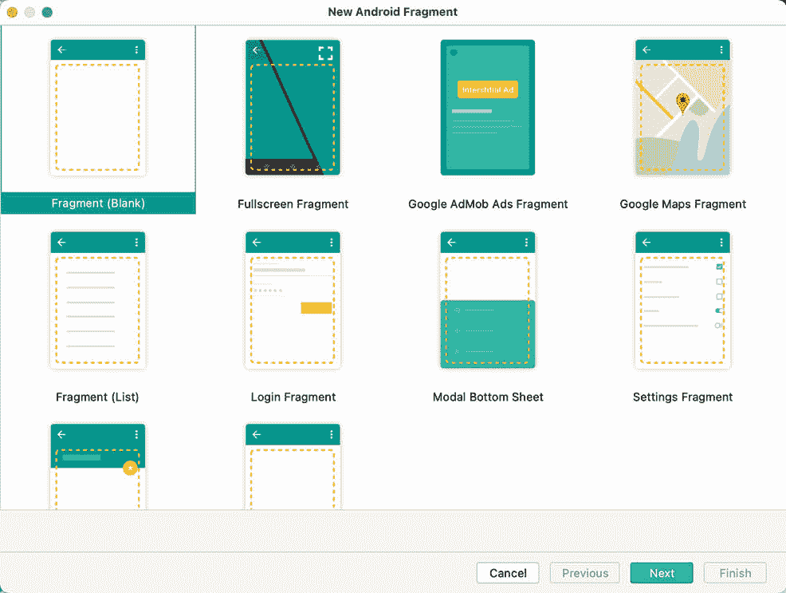
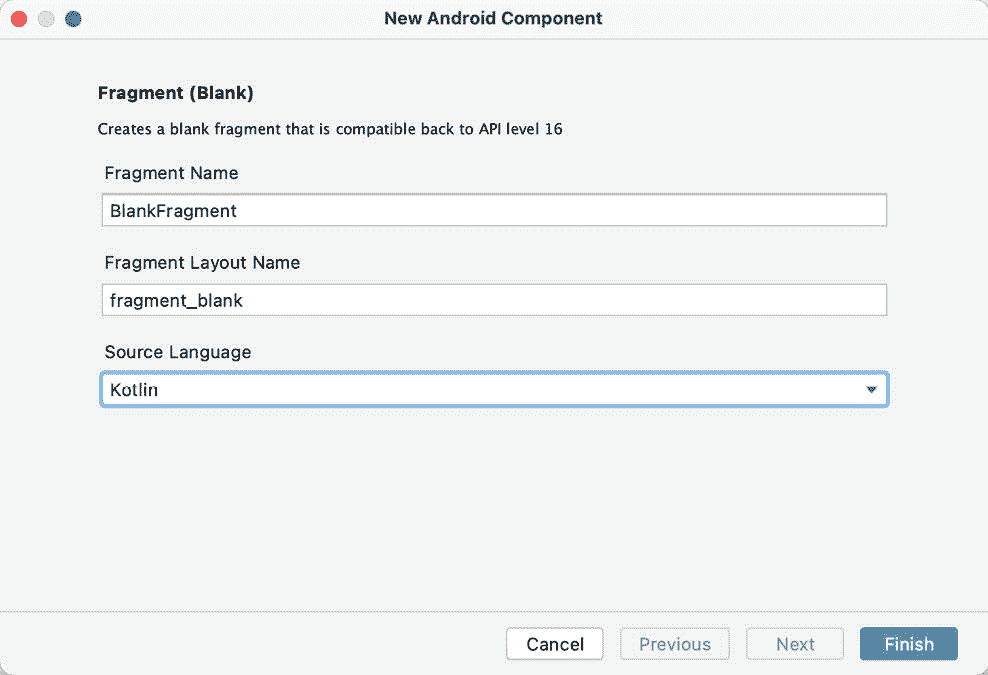
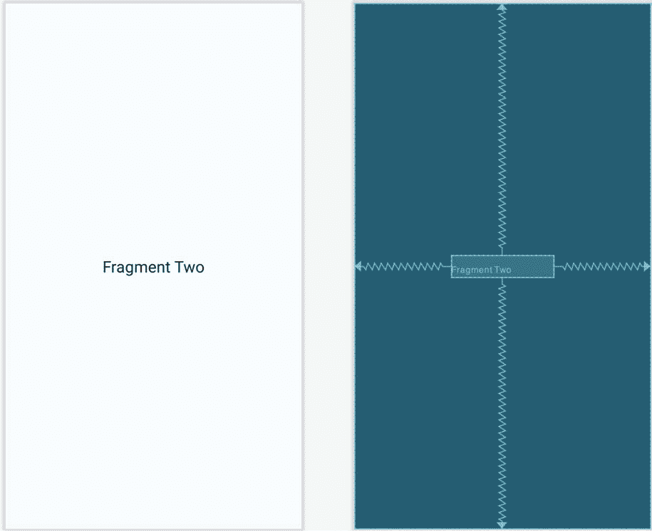

38\. 在安卓工作室使用碎片-一个例子

如前一章所述，片段提供了一种方便的机制来创建应用程序功能的可重用模块，该模块由用户界面的两个部分和相应的行为组成。一旦创建，片段就可以嵌入到活动中。

在上一章探索了片段的整体理论后，本章的目标是使用 Android Studio 创建一个示例 Android 应用程序，旨在演示创建和使用片段以及在活动中实现一个片段和另一个片段之间的通信所涉及的实际步骤。

38.1 关于示例片段应用

本章中创建的应用程序将由一个活动和两个片段组成。第一个片段的用户界面将包含一个由编辑文本视图、搜索栏和按钮组成的工具栏，所有这些都包含在一个约束布局视图中。第二个片段将只包含一个文本视图对象，也包含在一个约束布局视图中。

这两个片段将被嵌入到应用程序的主要活动和实现的通信中，使得当按下第一个片段中的按钮时，输入到编辑文本视图中的文本将出现在第二个片段的文本视图中，使用由第一个片段中的 SeekBar 的位置决定的字体大小。

由于该应用程序旨在用于早期版本的安卓系统，因此也有必要使用适当的安卓支持库。

38.2 创建示例项目

从欢迎屏幕中选择创建新项目快速启动选项，并在生成的新项目对话框中选择空活动模板，然后单击下一步按钮。

在“名称”字段中输入 FragmentExample，并将 com . ebookwidge . FragmentExample 指定为包名。在单击完成按钮之前，将最低应用编程接口级别设置更改为应用编程接口 26:安卓 8.0(奥利奥)，并将语言菜单更改为科特林。使用第 [18.8 节“将项目迁移到视图绑定”](18.html#_idTextAnchor393)中概述的步骤，修改项目以使用视图绑定。

返回到 gradale Scripts-> build . gradale(Module:FragmentExample)文件，并将以下指令添加到依赖项部分(请记住，现在可能有该库的更新版本):

实现' androidx . navigation:navigation-fragment-ktx:2 . 3 . 5 '

38.3 创建第一个片段布局

下一步是为将在我们的活动中使用的第一个片段创建用户界面。

这个用户界面将由一个 XML 布局文件和一个片段类组成。虽然这些可以手动添加，但让安卓工作室为我们创建它们会更快。在项目工具窗口中，找到 app-> Java-> com . ebookwidue . fragmentexample 条目并右键单击它。从结果菜单中，选择新建->片段->图库...显示如下图 38-1 所示对话框的选项:



图 38-1

在单击“下一步”按钮之前，选择片段(空白)模板。在随后的屏幕上，用名为 fragment_toolbar 的布局文件命名片段 ToolbarFragment:



图 38-2

使用设计模式将 fragment_toolbar.xml 文件加载到布局编辑器中，右键单击组件树面板中的框架布局条目，并选择将框架布局转换为约束布局菜单选项，接受确认对话框中的默认设置。将 id 从框架布局更改为约束布局。选择并删除默认的文本视图，向布局中添加纯文本编辑、按钮和搜索栏，并将视图 id 分别更改为编辑文本 1、按钮 1 和搜索栏 1。

将按钮上的文本更改为“更改文本”，将文本提取到名为 change_text 的字符串资源中，并从编辑文本视图中删除名称文本。最后，将 Seekbar 的 layout_width 属性设置为 match_constraint，左右边缘的边距设置为 16dp。

使用“推断约束”工具栏按钮添加任何缺失的约束，此时布局应与下图[图 38-3](#_idTextAnchor822) 所示相匹配:


图 38-3

38.4 将片段迁移到视图绑定

与空活动模板一样，当新片段添加到项目中时，安卓工作室 4.2 不支持视图绑定。因此，在进入本教程的下一步之前，我们需要执行迁移。首先编辑 ToolbarFragment.kt 文件，然后导入片段的绑定，如下所示:

```kt
import com.ebookfrenzy.fragmentexample.databinding.FragmentToolbarBinding
Next, locate the onCreateView() method and make the following declarations and changes (which also include adding the onDestroyView() method to ensure that the binding reference is removed when the fragment is destroyed):
.
.
private var _binding: FragmentToolbarBinding? = null
private val binding get() = _binding!!

override fun onCreateView(
    inflater: LayoutInflater, container: ViewGroup?,
    savedInstanceState: Bundle?
): View? {
    return inflater.inflate(R.layout.fragment_toolbar, container, false)
    _binding = FragmentToolbarBinding.inflate(inflater, container, false)
    return binding.root
}

override fun onDestroyView() {
    super.onDestroyView()
    _binding = null
}
```

一旦这些更改完成，片段就可以使用视图绑定了。

38.5 添加第二个片段

重复用于创建工具栏片段的步骤，添加另一个名为 TextFragment 的空片段，布局文件名为 fragment_text。再次，将框架布局容器转换为约束布局(将 id 更改为约束布局 2)，并删除默认的文本视图。

将文本视图小部件从调色板拖放到布局的中心，使用“推断约束”按钮添加任何缺少的约束。将文本视图的 id 更改为文本视图 2，文本为“片段二”，并将文本外观属性修改为大。

完成后，布局应符合[图 38-4](#_idTextAnchor825) 所示:



图 38-4

重复上一节中执行的步骤，迁移文本片段类以使用视图绑定，如下所示:

```kt
.
.
import com.ebookfrenzy.fragmentexample.databinding.FragmentTextBinding
.
.
private var _binding: FragmentTextBinding? = null
private val binding get() = _binding!!

override fun onCreateView(
    inflater: LayoutInflater, container: ViewGroup?,
    savedInstanceState: Bundle?
): View? {
    return inflater.inflate(R.layout.fragment_text, container, false)
    _binding = FragmentTextBinding.inflate(inflater, container, false)
    return binding.root
}
```

38.6 向活动添加片段

应用程序的主活动与一个名为 activity_main.xml 的 XML 布局文件相关联。在本例中，片段将使用该文件中的<fragment>元素添加到活动中。使用项目工具窗口，导航到 FragmentExample 项目的 app -> res ->布局部分，双击 activity_main.xml 文件将其加载到 Android Studio 布局编辑器工具中。</fragment>

在设计模式下使用布局编辑器工具，从布局中选择并删除默认的文本视图对象，并在选项板中选择“常用”类别。将片段容器视图组件从视图列表中拖放到布局中，使其水平居中，并定位为虚线显示顶部布局边距:


图 38-5

将片段放到布局上时，将出现一个对话框，显示当前项目中可用的片段列表，如图 38-6 所示:


图 38-6

从列表中选择工具栏片段条目，然后单击确定按钮关闭片段对话框。添加后，单击布局编辑器右上角的红色警告按钮，显示警告面板。将列出一条未知片段消息([图 38-7](#_idTextAnchor829) )，指示布局编辑器工具需要知道在预览会话期间显示哪个片段。点击消息中的使用@布局/工具栏 _ 片段链接，显示工具栏片段:


图 38-7

选择片段后，将 layout_width 属性更改为 match_constraint，使其占据整个屏幕宽度。单击并拖动调色板中的另一个片段容器视图条目，并将其定位，使其水平居中，并位于第一个片段的底边下方。出现提示时，在单击确定按钮之前，从片段对话框中选择文本片段条目。再次显示错误面板，并单击使用@布局/片段 _ 文本选项。使用“推断约束”按钮建立任何缺失的布局约束。

注意，碎片现在在布局中是可见的，如图 38-8 所示:


图 38-8

在继续下一步之前，在布局中选择文本片段实例，并在属性工具窗口中将片段的标识更改为文本片段。

38.7 让工具栏片段与活动对话

当用户触摸工具栏片段中的按钮时，片段类将需要从编辑文本视图中获取文本和 SeekBar 的当前值，并将它们发送到文本片段。正如[《安卓碎片介绍》](37.html#_idTextAnchor800)中所概述的，碎片之间不应该直接通信，而应该使用嵌入它们的活动作为中介。

这个过程的第一步是确保工具栏片段响应被点击的按钮。我们还需要实现一些代码来跟踪 SeekBar 视图的价值。出于本例的目的，我们将在 ToolbarFragment 类中实现这些侦听器。选择 ToolbarFragment.kt 文件并对其进行修改，使其如下列表所示:

```kt
package com.ebookfrenzy.fragmentexample

import android.os.Bundle
import androidx.fragment.app.Fragment
import android.view.LayoutInflater
import android.view.View
import android.view.ViewGroup
import android.widget.SeekBar
import android.content.Context
.
.
class ToolbarFragment : Fragment(), SeekBar.OnSeekBarChangeListener {
.
.
    var seekvalue = 10
.
.
    override fun onActivityCreated(savedInstanceState: Bundle?) {
        super.onActivityCreated(savedInstanceState)

        binding.seekBar1.setOnSeekBarChangeListener(this)
        binding.button1.setOnClickListener { v: View -> buttonClicked(v) }
    }

    private fun buttonClicked(view: View) {

    }

    override fun onProgressChanged(seekBar: SeekBar, progress: Int,
                                   fromUser: Boolean) {
        seekvalue = progress
    }

    override fun onStartTrackingTouch(arg0: SeekBar) {
    }

    override fun onStopTrackingTouch(arg0: SeekBar) {
    }
.
.
}
```

在继续之前，我们需要花一些时间来解释上面的代码更改。首先，该类被声明为实现 OnSeekBarChangeListener 接口。这是因为用户界面包含一个 SeekBar 实例，当用户滑动滚动条更改字体大小时，片段需要接收通知。OnSeekBarChangeListener 接口的实现需要实现 onProgressChanged()，onStartTrackingTouch()和 onStopTrackingTouch()方法。这些方法已经实现，但实际上只需要 onProgressChanged()方法来执行任务，在这种情况下，将新值存储在一个名为 seekvalue 的变量中，该变量已在类的开头声明。还声明了一个变量，用于存储对编辑文本对象的引用。

onActivityCreated()方法用于在按钮上设置 onClickListener，该按钮被配置为在检测到单击事件时调用名为 buttonClicked()的方法。然后也实现了这个方法，尽管此时它没有做任何事情。

这个过程的下一个阶段是设置侦听器，当单击按钮时，该侦听器将允许片段调用活动。这遵循了前一章中概述的机制:

```kt
class ToolbarFragment : Fragment(), SeekBar.OnSeekBarChangeListener {

    var seekvalue = 10

    var activityCallback: ToolbarFragment.ToolbarListener? = null

    interface ToolbarListener {
        fun onButtonClick(position: Int, text: String)
    }

    override fun onAttach(context: Context) {
        super.onAttach(context)
        try {
            activityCallback = context as ToolbarListener
        } catch (e: ClassCastException) {
            throw ClassCastException(context.toString() 
                                    + " must implement ToolbarListener")
        }
    }
.
. 
    private fun buttonClicked(view: View) {
        activityCallback?.onButtonClick(seekvalue,
                binding.editText1.text.toString())
    }
.
.
}
```

上面的实现将导致用户单击按钮时调用属于活动类的名为 onButtonClick()的方法。因此，剩下的就是声明活动类实现了新创建的 ToolbarListener 接口，并实现了 onButtonClick()方法。

由于安卓支持库在早期的安卓版本中用于片段支持，活动也需要从 FragmentActivity 改为子类，而不是 AppCompatActivity。将这些需求放在一起会产生以下修改后的 MainActivity.kt 文件:

```kt
package com.ebookfrenzy.fragmentexample

import androidx.appcompat.app.AppCompatActivity
import androidx.fragment.app.FragmentActivity
import android.os.Bundle

class MainActivity : FragmentActivity(), 
                                ToolbarFragment.ToolbarListener {
.
.
    override fun onButtonClick(fontsize: Int, text: String) {

    }
}
```

随着当前代码的变化，工具栏片段将检测用户何时单击按钮，并通过编辑文本字段的内容和 SeekBar 视图的当前设置调用活动的方法。现在，活动的工作是与文本片段进行通信，并传递这些值，以便片段可以相应地更新文本视图对象。

38.8 让活动与文本片段对话

如[“安卓片段介绍”](37.html#_idTextAnchor800)中所述，一个活动可以通过获取片段类实例的引用，然后调用对象上的公共方法来与片段进行通信。因此，在 TextFragment 类中，我们现在将实现一个名为 changeTextProperties()的公共方法，该方法将字体大小的整数和要显示的新文本的字符串作为参数。该方法将使用这些值来修改文本视图对象。在 Android Studio 编辑面板中，找到并修改 TextFragment.kt 文件以添加这个新方法:

```kt
package com.ebookfrenzy.fragmentexample
.
.
class TextFragment : Fragment() {
.
. 
    fun changeTextProperties(fontsize: Int, text: String)
    {
        binding.textView2.textSize = fontsize.toFloat()
        binding.textView2.text = text
    }
.
.
}
```

当文本片段被放置在活动的布局中时，它被赋予了一个文本片段的标识。使用这个标识，活动现在可以获取对片段实例的引用，并调用对象上的 changeTextProperties()方法。编辑 MainActivity.kt 文件并修改 onButtonClick()方法，如下所示:

```kt
override fun onButtonClick(fontsize: Int, text: String) {

    val textFragment = supportFragmentManager.findFragmentById(
				R.id.text_fragment) as TextFragment

    textFragment.changeTextProperties(fontsize, text)
}
```

38.9 测试应用

这个项目的编码现在已经完成，剩下的最后一项任务是运行应用程序。当应用程序启动时，主活动将开始，并依次创建和显示两个片段。当用户触摸工具栏片段中的按钮时，工具栏片段将调用活动的 onButtonClick()方法，并传递来自 EditText 视图的文本和 SeekBar 的当前值。然后，该活动将调用第二个片段的 changeTextProperties()方法，该方法将修改 TextView 以反映新的文本和字体大小:


图 38-9

38.10 总结

本章的目标是创建一个示例项目，专门演示在安卓应用程序中使用片段所涉及的步骤。涵盖的主题包括在引入片段之前使用安卓支持库与安卓版本兼容、在活动布局中包含片段以及实现片段间通信。