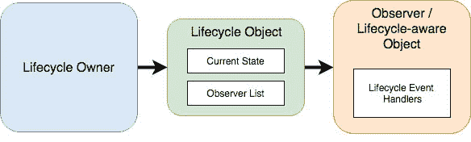

# 四十五、使用安卓生命周期感知组件

题为[“了解安卓应用和活动生命周期”](19.html#_idTextAnchor395)的前一章描述了使用生命周期方法来跟踪用户界面控制器(如活动或片段)中的生命周期状态变化。这些方法的主要问题之一是，它们将处理生命周期变更的负担放在了用户界面控制器上。从表面上看，这似乎是合乎逻辑的方法，因为用户界面控制器毕竟是经历状态变化的对象。然而，事实是，通常受状态变化影响的代码总是驻留在应用的其他类中。这导致复杂的代码出现在用户界面控制器中，需要管理和操作其他对象来响应生命周期状态的变化。显然，在遵循安卓架构准则时，最好避免这种情况。

一个更加清晰和合理的方法是让应用中的对象能够观察其他对象的生命周期状态，并负责采取任何必要的措施来响应这些变化。例如，负责跟踪用户位置的类可以观察用户界面控制器的生命周期状态，并在控制器进入暂停状态时暂停位置更新。当控制器进入恢复状态时，跟踪将重新开始。这是由与安卓架构组件捆绑在一起的生命周期包提供的类和接口实现的。

本章将介绍能够在安卓应用中构建生命周期感知的术语和关键组件。

45.1 生命周期意识

如果一个对象能够检测和响应应用中其他对象的生命周期状态的变化，那么它就被称为生命周期感知的。一些安卓组件已经具备生命周期感知能力，LiveData 就是一个很好的例子。通过在类中实现 LifecycleObserver 接口，还可以将任何类配置为生命周期感知的。

45.2 生命周期所有者

生命周期感知组件只能观察生命周期所有者对象的状态。生命周期所有者实现生命周期所有者接口，并被分配一个伴随的生命周期对象，该对象负责存储组件的当前状态，并向生命周期观察者提供状态信息。大多数标准的安卓框架组件(如活动和片段类)都是生命周期所有者。自定义类也可以通过使用生命周期注册类并实现生命周期服务器接口来配置为生命周期所有者。例如:

```kt
class SampleOwner: LifecycleOwner {

    private val lifecycleRegistry: LifecycleRegistry

    init {
        lifecycleRegistry = LifecycleRegistry(this)
        lifecycle.addObserver(DemoObserver())
    }

    override fun getLifecycle(): Lifecycle {
        return lifecycleRegistry
    }
}
```

除非生命周期所有者是另一个生命周期感知组件的子类，否则该类将需要通过调用 LifecycleRegistry 类的方法来触发生命周期状态更改。markState()方法可用于通过新的状态值触发生命周期状态更改:

```kt
fun resuming() {
    lifecycleRegistry.markState(Lifecycle.State.RESUMED)
}
```

上述调用还将导致对相应事件处理程序的调用。或者，可以调用 LifecycleRegistry handleLifecycleEvent()方法并传递要触发的生命周期事件(这也会导致生命周期状态发生变化)。例如:

```kt
lifecycleRegistry.handleLifecycleEvent(Lifecycle.Event.ON_START)
```

45.3 生命周期观察者

为了让生命周期感知组件观察生命周期所有者的状态，它必须实现 LifecycleObserver 接口，并包含它需要观察的任何生命周期更改事件的事件侦听器处理程序。

```kt
class DemoObserver: LifecycleObserver {
    // Lifecycle event methods go here
}
```

然后创建该观察器类的一个实例，并将其添加到由生命周期对象维护的观察器列表中。

```kt
lifecycle.addObserver(DemoObserver())
```

如果观察者不再需要跟踪生命周期状态，也可以随时将其从生命周期对象中移除。

[图 45-1](#_idTextAnchor916) 说明了提供生命周期感知的关键元素之间的关系:



图 45-1

45.4 生命周期状态和事件

当生命周期所有者的状态更改时，分配的生命周期对象将更新为新状态。在任何给定时间，生命周期所有者都将处于以下五种状态之一:

生命周期。State . INITIALIZED

生命周期。State.CREATED

生命周期。State.STARTED

生命周期。state . RECEIVED

生命周期。State . DESTROYED

当组件在不同的状态之间转换时，生命周期对象将触发添加到列表中的任何观察器上的事件。以下事件可在生命周期观察器中实现:

生命周期。事件。开 _ 创建

生命周期。事件。开 _ 开始

生命周期。事件。开 _ 恢复

生命周期。事件。开 _ 暂停

生命周期。事件。开 _ 停

生命周期。事件。打开 _ 销毁

生命周期。事件。开 _ 任何

观察者类中使用注释将方法与生命周期事件相关联。例如，以下代码在观察器中配置了一个方法，该方法将被调用以响应 ON_RESUME 生命周期事件:

```kt
@OnLifecycleEvent(Lifecycle.Event.ON_RESUME)
fun onResume() {
    // Perform tasks in response to change to RESUMED status
}
```

将为所有生命周期事件调用分配给 ON_ANY 事件的方法。此事件类型的方法被传递给生命周期所有者的引用和可用于查找当前状态和事件类型的事件对象。例如，以下方法提取当前状态和事件的名称:

```kt
@OnLifecycleEvent(Lifecycle.Event.ON_ANY)
fun onAny(owner: LifecycleOwner, event: Lifecycle.Event) {
    var currentState = owner.lifecycle.currentState.name
    var eventName = event.name
}
```

当所有者状态需要处于某个生命周期级别时，也可以使用当前状态对象的 isAtLeast()方法:

```kt
if (owner.lifecycle.currentState.isAtLeast(Lifecycle.State.STARTED)) {

}
```

[图 45-2](#_idTextAnchor918) 中的流程图说明了生命周期所有者的状态变化顺序，以及在每个状态转换之间观察者将触发的生命周期事件:


图 45-2

45.5 总结

本章介绍了生命周期感知的基础知识以及安卓 Jetpack 中包含的安卓生命周期包的类和接口。该包包含许多类和接口，用于创建生命周期所有者、生命周期观察者和生命周期感知组件。生命周期所有者为其分配了一个生命周期对象，该对象维护所有者状态的记录和订阅观察者的列表。当所有者的状态发生变化时，观察者会通过生命周期事件方法得到通知，这样它就可以对变化做出响应。

下一章将创建一个 AndroidStudio 项目，演示如何使用和创建生命周期感知组件，包括创建生命周期观察者和所有者，以及处理生命周期状态变化和事件。