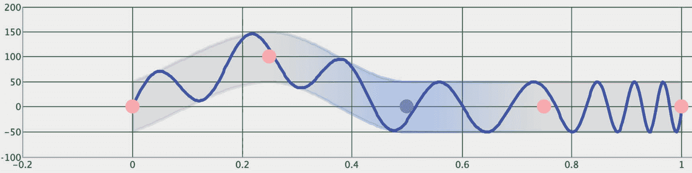
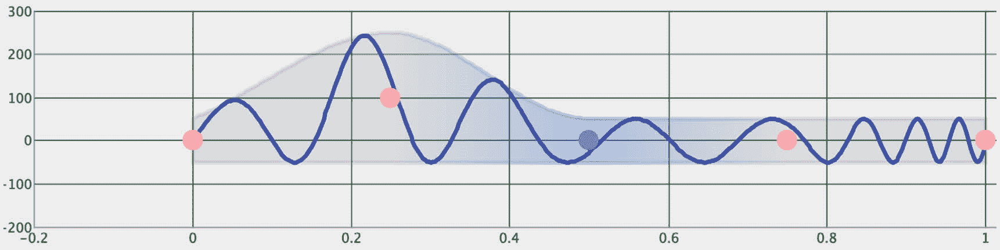
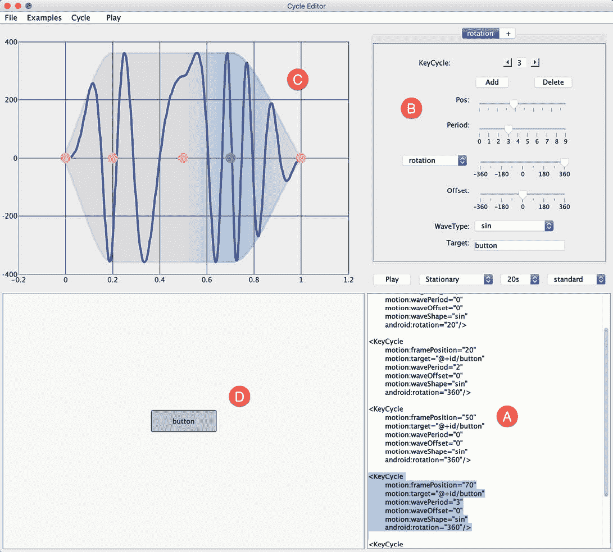
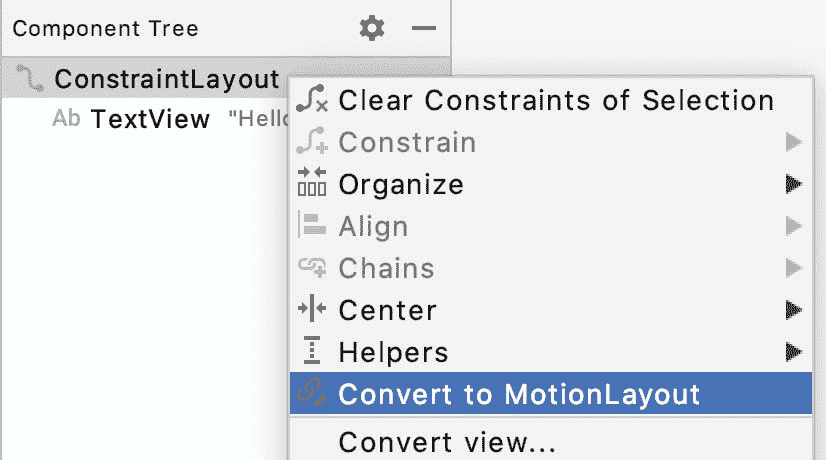
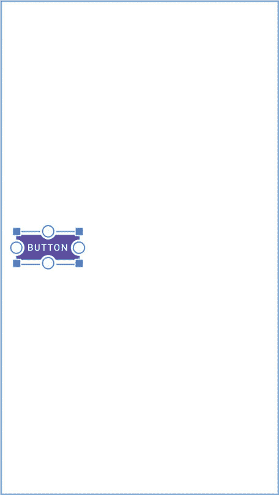
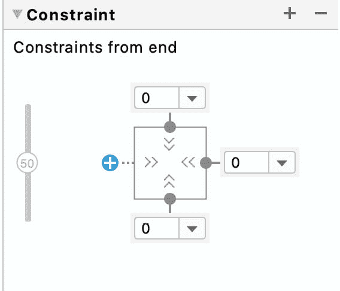
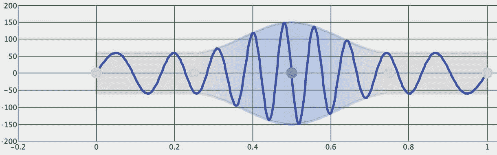
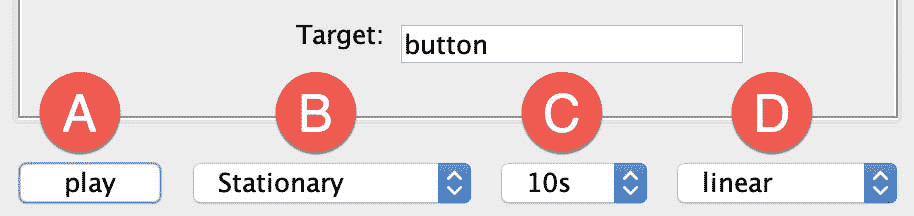

51.一运动布局T3】关键周期教程

前面几章介绍并演示了使用 MotionLayout 容器结合 Android Studio MotionLayout 编辑器的功能将动画集成到 Android 应用用户界面中的概念。标题为[“运动布局介绍”](49.html#_idTextAnchor968)的章节简要提到了周期(KeyTimeCycle)和时间周期(KeyTimeCycle)关键帧，并解释了如何使用它们来实现涉及大量重复状态变化的动画。

本章将更详细地介绍循环关键帧，然后演示如何在使用AndroidStudio和循环编辑器的示例项目中使用它们。

51.1 循环关键帧概述

显然，位置关键帧可用于将中间状态变化添加到动画时间线中。虽然这对于少量的状态变化很有效，但是大量实现起来会很麻烦。例如，要使按钮在轻击时摇动 50 次以指示发生了错误，需要手动创建 100 个位置关键帧来执行小的顺时针和逆时针旋转。同样，当视图在屏幕上移动时，在视图上实现反弹效果也是一项同样耗时的任务。

对于需要重复执行状态更改的情况，运动布局包括周期和时间周期关键帧。两者执行相同的任务，除了关键周期帧基于动画路径内的帧位置，而 关键时间周期基于每秒的周期数(赫兹)。

使用这些关键周期帧，动画时间线基本上被分成子部分(称为周期)，每个子部分包含一个或多个波，这些波定义了如何在整个时间线中修改视图的属性。要创建关键周期，需要以下信息:

目标视图-要进行更改的视图的 id。

帧位置-时间线中周期开始的位置。

波浪周期-周期中包含的波浪数量。

属性-要被波浪修改的视图属性。

波形偏移-从关键帧基线偏移指定量的周期。

波形-波形(正弦、余弦、锯齿、方形、三角形、弹跳或反向锯齿)

考虑以下循环关键帧集:

```kt
<KeyFrameSet>
   <KeyCycle
       motion:framePosition="0"
       motion:motionTarget="@+id/button"
       motion:wavePeriod="1"
       motion:waveOffset="0dp"
       motion:waveShape="sin"
       android:translationY="50dp"/>
   <KeyCycle
       motion:framePosition="25"
       motion:motionTarget="@+id/button"
       motion:wavePeriod="1"
       motion:waveOffset="0dp"
       motion:waveShape="sin"
       android:translationY="50dp"/>
   <KeyCycle
       motion:framePosition="50"
       motion:motionTarget="@+id/button"
       motion:wavePeriod="1"
       motion:waveOffset="0dp"
       motion:waveShape="sin"
       android:translationY="50dp"/>
   <KeyCycle
       motion:framePosition="75"
       motion:motionTarget="@+id/button"
       motion:wavePeriod="1"
       motion:waveOffset="0dp"
       motion:waveShape="sin"
       android:translationY="50dp"/>
   <KeyCycle
       motion:framePosition="100"
       motion:motionTarget="@+id/button"
       motion:wavePeriod="1"
       motion:waveOffset="0dp"
       motion:waveShape="sin"
       android:translationY="50dp"/>
</KeyFrameSet>
```

上面的关键帧集将时间轴分成四个相等的周期。每个周期被配置为包含一个正弦波形，用于调整按钮 50dp 的平移属性。执行时，此动画将导致按钮在指定范围内垂直振荡多次。该关键帧集合可以可视化，如图[图 51-1](#_idTextAnchor1022) 所示，其中五个点代表关键帧位置:


图 51-1

按照目前的做法，每个周期包含一个单一的波。假设在最后一个周期内，我们需要四个波，而不是这些均匀分布的波。这可以通过如下增加最后一个关键周期元素的波周期属性来容易地实现:

```kt
.
.
    <KeyCycle
       motion:framePosition="75"
       motion:motionTarget="@+id/button"
       motion:wavePeriod="4"
       motion:waveOffset="0dp"
       motion:waveShape="sin"
       android:translationY="50dp"/>
.
.
```

进行此更改后，帧集可以以波形呈现，如下所示:


图 51-2

到目前为止，本章中的例子一直在使用正弦波。事实上，在 MotionLayout 中处理循环关键帧时，有许多不同的波形可供使用。[例如，图 51-3](#_idTextAnchor1023) 说明了将所有循环关键帧的波形属性更改为锯齿波形的效果:


图 51-3

除了正弦和锯齿之外，运动布局还支持三角形、正方形、弹跳和反向平滑波形。

在上面的示例中，每个循环都会在同一范围内沿 Y 轴移动按钮。然而，假设我们需要第二个周期来沿着正 Y 轴移动按钮更大的距离。这包括对第二周期的波偏移属性进行如下调整:

```kt
<KeyCycle 
        motion:framePosition="25"
        motion:target="@+id/button"
        motion:wavePeriod="1"
        motion:waveOffset="100dp"
        motion:waveShape="sin"
        android:translationY="50dp"/>
```

通过进行这一更改，我们最终得到一个类似于[图 51-4](#_idTextAnchor1024) 的时间线:



图 51-4

在第二个周期中，按钮的移动现在在 Y 轴上大约在 0 到 150 度之间。如果我们仍然需要范围的低端来匹配其他波，我们当然可以将 translationY 值增加 100dp:

```kt
<KeyCycle 
        motion:framePosition="25"
        motion:target="@+id/button"
        motion:wavePeriod="1"
        motion:waveOffset="100dp"
        motion:waveShape="sin"
        android:translationY="150dp"/>
```

这种变化现在给出了以下波形:



图 51-5

51.2 使用 循环编辑器

虽然不是特别复杂，但是通过直接在 MotionScene 文件中编辑 XML KeyCycle 条目，可能需要一些时间来获得您需要的确切周期配置。认识到这一事实，谷歌的安卓工程师开发了循环编辑器。这是一个独立的基于 Java 的实用程序，还不是AndroidStudio的一部分。循环编辑器允许您可视化地设计和测试循环关键帧集。

循环编辑器工具是以 Java 档案(jar)文件的形式提供的，这需要在您的开发系统上安装 Java 运行时。安装 Java 的步骤会因您的操作系统而异。

安装 Java 后，可以从以下网址下载 CycleEditor.jar 文件:

[https://github . com/Google samples/Android-ConstraintLayoutExamples/releases/download/1.0/cycle editor . jar](https://github.com/googlesamples/android-ConstraintLayoutExamples/releases/download/1.0/CycleEditor.)

下载后，打开命令提示符或终端窗口，将目录更改为 jar 文件的位置，并运行以下命令:

```kt
java -jar CycleEditor.jar
```

一旦工具加载完毕，将出现图 51-6 所示的屏幕:



图 51-6

上图中标记为 A 的面板显示关键帧集的 XML，可以直接编辑，也可以使用面板 b 中的控件进行编辑。面板 C 以波形显示循环的渲染。不幸的是，随着更改的进行，这并没有实时重绘。相反，必须通过选择文件->解析 XML 菜单选项来刷新它。当单击面板 B 中的播放按钮时，标记为 D 的面板将显示循环动画的实时渲染。“示例”菜单提供对示例关键帧集的访问，这些关键帧集既可用于学习目的，也可作为您自己动画的基础。

为了演示“循环关键帧”和“循环编辑器”的使用，本章的剩余部分将创建一个示例项目，实现基于关键循环的动画效果。

51.3 创建关键循环项目

从欢迎屏幕中选择创建新项目快速启动选项，并在生成的新项目对话框中选择空活动模板，然后单击下一步按钮。

在“名称”字段中输入 keycycledemo，并指定 com .ebook 狂潮. KeyCycleDemo 作为包名。在单击完成按钮之前，将最低API级别设置更改为API 26:安卓 8.0(奥利奥)，并将语言菜单更改为科特林。

在布局编辑器处于设计模式并且 activity_main.xml 文件打开的情况下，右键单击约束布局条目并选择转换为运动布局菜单选项:



图 51-7

做出选择后，单击确认对话框中的转换按钮。

51.4 配置开始和结束约束

本教程的目标是制作按钮从设备屏幕一侧移动到另一侧的动画，包括使视图也沿 Y 轴上下移动的关键周期效果。第一步是配置开始和结束约束。

将 activity_main.xml 文件加载到 MotionLayout 编辑器中，选择并删除默认的 TextView 小部件。在从调色板中拖放按钮视图之前，确保选择了运动布局框(在下面的[图 51-9](#_idTextAnchor1029) 中标记为 E)，以便它垂直居中并沿着布局画布的左侧边缘放置:



图 51-8

要为起点配置约束，请在编辑器窗口中选择起始约束集条目(在[图 51-9](#_idTextAnchor1029) 中标记为 A):


图 51-9

接下来，在约束集列表中选择按钮条目。在按钮条目仍处于选中状态的情况下，单击编辑按钮(C)，然后从菜单中选择创建约束。

在按钮仍处于选中状态的情况下，使用属性工具窗口在视图的顶部、左侧和底部设置约束，如下所示:


图 51-10

选择结束约束集条目(在上面的[图 51-9](#_idTextAnchor1029) 中标记为 D)，并重复步骤创建新的约束，这次在按钮的顶部、底部和右侧边缘有约束:



图 51-11

51.5 创建循环

下一步是使用循环编辑器为动画生成循环关键帧。循环编辑器运行时，参见下图[图 51-12](#_idTextAnchor1031) 所示的控制面板:


图 51-12

使用标记为 A 的菜单，将要修改的属性从旋转更改为平移。

接下来，使用“关键周期”控件(B)选择周期 0，以便面板中其他地方所做的更改将应用于第一个周期。如[图 51-13](#_idTextAnchor1032) 所示，将“周期”滑块移动到 1，将“平移”滑块移动到 60(移动滑块时，请参考 XML 面板查看平移值的精确设置):


图 51-13

要查看图形中到目前为止的变化，请选择文件->解析 XML 菜单选项。使用[表 51-1](#_idTextAnchor1033) 中列出的值，配置关键帧 1 到 4 的设置(请记住，您已经在关键帧周期 0 列中配置了设置):

<colgroup><col> <col> <col> <col> <col> <col></colgroup> 
|  | 关键周期 0 | 关键周期 1 | 关键周期 2 | 关键周期 3 | 关键周期 4 |
| --- | --- | --- | --- | --- | --- |
| 位置 | Zero | Twenty-five | Fifty | Seventy-five | One hundred |
| 时期 | one | Two | three | Two | one |
| 翻译 | Sixty | Sixty | One hundred and fifty | Sixty | Sixty |

表 51-1

完成这些更改后，关键帧集 XML 应如下所示:

```kt
<KeyFrameSet>
   <KeyCycle
       motion:framePosition="0"
       motion:motionTarget="@+id/button"
       motion:wavePeriod="1"
       motion:waveOffset="0dp"
       motion:waveShape="sin"
       android:translationY="60dp"/>
   <KeyCycle
       motion:framePosition="25"
       motion:motionTarget="@+id/button"
       motion:wavePeriod="2"
       motion:waveOffset="0dp"
       motion:waveShape="sin"
       android:translationY="60dp"/>
   <KeyCycle
       motion:framePosition="50"
       motion:motionTarget="@+id/button"
       motion:wavePeriod="3"
       motion:waveOffset="0dp"
       motion:waveShape="sin"
       android:translationY="150dp"/>
   <KeyCycle
       motion:framePosition="75"
       motion:motionTarget="@+id/button"
       motion:wavePeriod="2"
       motion:waveOffset="0dp"
       motion:waveShape="sin"
       android:translationY="60dp"/>
   <KeyCycle
       motion:framePosition="100"
       motion:motionTarget="@+id/button"
       motion:wavePeriod="1"
       motion:waveOffset="0dp"
       motion:waveShape="sin"
       android:translationY="60dp"/>
</KeyFrameSet>
```

要查看具有新周期的图表，选择文件->解析 XML 菜单选项来刷新现在应该出现的波形，如图 51-14 所示:



图 51-14

51.6 预览动画

现在可以在循环编辑器工具中预览基于循环的动画。点击播放按钮(在[图 51-15](#_idTextAnchor1036) 中标记为 A)开始动画运行。要将循环与水平移动相结合，请将第二个菜单(B)从“静止”更改为“西向东”。此外，花一些时间试验时间和线性设置(C 和 D)。



图 51-15

51.7 将 关键帧集添加到运动场景

在循环编辑器中，突出显示并复制 XML 面板中的关键循环元素，并将它们粘贴到AndroidStudio中 RES-> XML-> activity _ main _ scene . XML 文件的过渡部分，以便它们被放置在现有的关键帧集标记之间。还要注意增加的持续时间设置和增加的 OnClick 处理程序来启动动画:

```kt
<Transition
    motion:constraintSetEnd="@+id/end"
    motion:constraintSetStart="@id/start"
    motion:duration="7000">
    <KeyFrameSet>
       <KeyCycle
           motion:framePosition="0"
           motion:motionTarget="@+id/button"
           motion:wavePeriod="1"
           motion:waveOffset="0dp"
           motion:waveShape="sin"
           android:translationY="60dp"/>
           <KeyCycle
               motion:framePosition="25"
.
.
   </KeyFrameSet>
   <OnClick motion:targetId="@id/button"
            motion:clickAction="toggle" />
.
.
```

在继续之前，请检查每个目标属性是否正确声明。在撰写本文时，循环编辑器正在使用过时的运动:目标标签。例如:

```kt
motion:target="@+id/button"
```

五个关键周期中的每一个都需要更改，如下所示:

```kt
motion:motionTarget="@+id/button"
```

完成这些更改后，在设备或模拟器上编译并运行应用，然后单击按钮开始观看动画。

请注意，在AndroidStudio运动布局编辑器中也可以查看关键周期波形，如下图[51-16](#_idTextAnchor1038)所示:


图 51-16

每个动画的关键周期帧集不限于一个。例如，将以下关键帧集添加到 activity_main_scene.xml 文件的“过渡”部分，以便在按钮移动时为其添加一些旋转效果:

```kt
<KeyFrameSet>
    <KeyCycle
        motion:framePosition="0"
        motion:motionTarget="@+id/button"
        motion:wavePeriod="1"
        motion:waveOffset="0dp"
        motion:waveShape="sin"
        android:translationY="60dp"
        android:rotation="45"/>
    <KeyCycle
        motion:framePosition="25"
        motion:motionTarget="@+id/button"
        motion:wavePeriod="2"
        motion:waveOffset="0dp"
        motion:waveShape="sin"
        android:translationY="60dp"
        android:rotation="80"/>
    <KeyCycle
        motion:framePosition="50"
        motion:motionTarget="@+id/button"
        motion:wavePeriod="3"
        motion:waveOffset="0dp"
        motion:waveShape="sin"
        android:translationY="150dp"
        android:rotation="45"/>
    <KeyCycle
        motion:framePosition="75"
        motion:motionTarget="@+id/button"
        motion:wavePeriod="2"
        motion:waveOffset="0dp"
        motion:waveShape="sin"
        android:translationY="60dp"
        android:rotation="80"/>
    <KeyCycle
        motion:framePosition="100"
        motion:motionTarget="@+id/button"
        motion:wavePeriod="1"
        motion:waveOffset="0dp"
        motion:waveShape="sin"
        android:translationY="60dp"
        android:rotation="45"/>
</KeyFrameSet>
```

51.8 总结

循环关键帧为构建帧动画提供了一种有用的方法，它可能涉及大量与波形模式匹配的状态变化。如本章所述，通过使用循环编辑器应用，可以显著简化生成这些循环关键帧的过程。