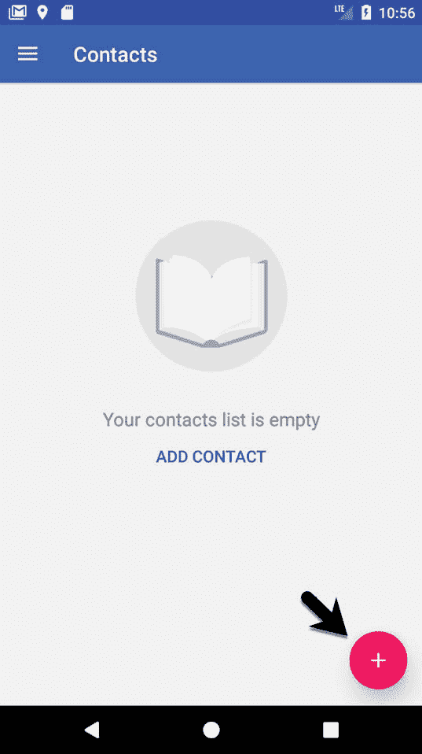
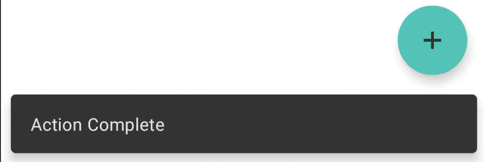

52\. 使用浮动动作按钮和 Snackbar

本章的目标之一是概述材料设计的概念。最初是作为安卓 5.0 的一部分引入的，材质设计是一套设计准则，规定了安卓用户界面以及运行在安卓上的应用程序的外观和行为。

作为材料设计概念实施的一部分，谷歌还推出了安卓设计支持库。该库包含许多不同的组件，允许将材料设计的许多关键特性内置到安卓应用程序中。其中两个组件，浮动动作按钮和 Snackbar ，也将在本章中介绍，然后在后续章节中介绍许多其他组件。

52.1 材料设计

安卓环境的整体外观由材质设计原则定义。材质设计由谷歌的安卓团队创建，规定构成安卓用户界面的元素以及运行在其上的应用程序在行为、阴影、动画和风格方面以某种方式出现和表现。材料设计的原则之一是，用户界面的元素看起来有物理深度，并且感觉项目是用物理材料层构建的。例如，通过使用阴影效果，一个按钮看起来被提升到它所在布局的表面之上。按下按钮会导致按钮弯曲和抬起，就像由一种薄材料制成，释放时会产生波纹。

材料设计还规定了许多标准用户界面元素的布局和行为。一个关键的例子是位于屏幕顶部的应用程序栏的显示方式，以及它在活动的主要内容中滚动活动时的行为方式。

事实上，材质设计涵盖了广泛的领域，从推荐的颜色样式到对象的动画制作方式。材料设计概念和指南的完整描述可在以下链接在线找到，建议所有安卓开发者阅读:

[https://material.io/design/introduction](https://material.io/design/introduction)

52.2 设计库

实现采用材料设计原则的安卓应用程序所需的许多构件都包含在安卓设计支持库中。该库包含一组用户界面组件，可以包含在安卓应用程序中，以实现材料设计的大部分外观、感觉和行为。本章将介绍这个库中的两个组件，浮动操作按钮和 Snackbar，其他组件将在后面的章节中介绍。

52.3 浮动动作按钮(FAB)

浮动动作按钮是一个看起来浮动在应用程序用户界面表面上方的按钮，通常用于促进用户界面屏幕内最常见的动作。例如，可以在屏幕上放置一个浮动操作按钮，允许用户在联系人列表中添加条目或从应用程序中发送电子邮件。[例如，图 52-1](#_idTextAnchor1047) 突出显示了浮动动作按钮，该按钮允许用户在标准安卓联系人 ap p 中添加新联系人:



图 52-1

为了符合材料设计准则，在使用浮动动作按钮时应遵循许多规则。浮动动作按钮 必须是圆形的，大小可以是 56 x 56dp(默认)或 40 x 40dp(迷你)。在手机上，该按钮应位于离屏幕边缘至少 16dp 的位置，在台式机和平板设备上应为 24dp。无论大小如何，按钮必须包含一个 24x24dp 大小的内部图标，建议每个用户界面屏幕只有一个浮动操作按钮。

浮动动作按钮可以是动画的，也可以设计成在触摸时变形为其他项目。例如，浮动动作按钮可以在轻击时旋转，或者变形为另一个元素，例如列出相关动作的工具栏或面板。

52.4 蛇形杆

Snackbar 组件提供了一种以面板形式向用户呈现信息的方式，该面板出现在屏幕底部，如图 52-2 所示。Snackbar 实例包含一条简短的文本消息和一个可选的操作按钮，当用户点击该按钮时，该按钮将执行一项任务。一旦显示，Snackbar 将自动超时，或者可以由用户通过滑动操作手动移除。在 Snackbar 出现期间，应用程序将继续运行，并以正常的 ma 模式响应用户交互。


图 52-2

在本章的剩余部分，将创建一个示例应用程序，该应用程序利用浮动操作按钮和 Snackbar 的基本功能向项目列表添加条目。

52.5 创建示例项目

从欢迎屏幕中选择创建新项目快速启动选项，并在生成的新项目对话框中选择基本活动模板，然后单击下一步按钮。

在“名称”字段中输入 FabExample，并将 com . ebookwidge . fab example 指定为包名。在单击完成按钮之前，将最低应用编程接口级别设置更改为应用编程接口 26:安卓 8.0(奥利奥)，并将语言菜单更改为科特林。

52.6 项目评审

由于选择了基本活动模板，该活动包含四个布局文件。activity_main.xml 文件包含一个 CoordinatorLayout 管理器，其中包含应用程序栏、工具栏和浮动操作按钮的条目。

content_main.xml 文件表示活动内容区域的布局，并包含一个 NavHostFragment 实例。该文件通过以下 include 指令嵌入到 activity_main.xml 文件中:

```kt
<include layout="@layout/content_main" />
```

activity_main.xml 文件中的浮动操作按钮元素如下所示:

```kt
<com.google.android.material.floatingactionbutton.FloatingActionButton
    android:id="@+id/fab"
    android:layout_width="wrap_content"
    android:layout_height="wrap_content"
    android:layout_gravity="bottom|end"
    android:layout_margin="@dimen/fab_margin"
    app:srcCompat="@android:drawable/ic_dialog_email" />
```

这表明该按钮将出现在屏幕的右下角，其边距由 values/dimens.xml 文件中的 fab_margin 标识符表示(在本例中该标识符设置为 16dp)。XML 进一步声明按钮的内部图标采用标准的可绘制内置电子邮件图标的形式。

空白模板还配置了浮动操作按钮，以便在用户点击时显示 Snackbar 实例。实现这一点的代码可以在 MainActivity.kt 文件的 onCreate()方法中找到，内容如下:

```kt
binding.fab.setOnClickListener { view ->
    Snackbar.make(view, "Replace with your own action", Snackbar.LENGTH_LONG)
        .setAction("Action", null).show()
}
```

代码通过视图绑定访问浮动操作按钮，并向其中添加一个 onClickListener 处理程序，当点击按钮时将调用该处理程序。这个方法只是显示一个配置了消息但没有操作的 Snackbar 实例。

项目编译运行后，屏幕底部会出现浮动动作按钮，如图[图 52-3](#_idTextAnchor1054) :


图 52-3

轻按浮动操作按钮将触发 onClickListener 处理程序方法，使 Snackbar 出现在 sc 屏幕的底部:


图 52-4

当挡水条出现在较窄的设备上时(如上图 52-4 中的情况)，注意浮动动作按钮向上移动，为挡水条的出现留出空间。这由 activity_main.xml 布局资源文件中的 CoordinatorLayout 容器自动为我们处理。

52.7 移除导航功能

如[“安卓工作室布局编辑器工具指南”](24.html#_idTextAnchor468)所述，基本活动模板包含多个片段和按钮，用于从一个片段导航到另一个片段。就本教程而言，这些功能是不必要的，如果不删除，将在以后引起问题。在继续学习教程之前，请按如下方式修改项目:

1.在项目工具窗口中，导航并双击 app-> RES-> navigation-> nav _ graph . XML 文件，将其加载到导航编辑器中。

2.在编辑器中，选择“组件树”面板中的第二个片段条目，并点击键盘上的删除键将其从图表中删除。

3.定位并删除 second fragment . kt(app-> Java-><package name="">-> second fragment)和 fragment _ second . XML(app-> RES-> layout-> fragment _ second . XML)文件。</package>

4.找到 FirstFragment.kt 文件，双击它将其加载到编辑器中，并从 onViewCreated()方法中移除代码，使其如下所示:

```kt
override fun onViewCreated(view: View, savedInstanceState: Bundle?) {
    super.onViewCreated(view, savedInstanceState)

    binding.buttonFirst.setOnClickListener {
        findNavController().navigate(R.id.action_FirstFragment_to_SecondFragment)
    }
}
```

52.8 改变浮动动作按钮

由于此示例的目的是配置浮动操作按钮以向列表添加条目，因此需要将按钮上当前显示的电子邮件图标更改为更能指示正在执行的操作的内容。将用于按钮的图标名为 ic_add_entry.png，可在示例代码下载的 project_icons 文件夹中找到，该文件夹可从以下网址获得:

[https://www.ebookfrenzy.com/retail/as42kotlin/index.php](https://www.ebookfrenzy.com/retail/as42kotlin/index.php)

在操作系统的文件系统导航器中找到该映像，并复制该映像文件。右键单击项目工具窗口中的应用程序->资源->可绘制条目，并从菜单中选择粘贴以将文件添加到文件夹:


图 52-5

接下来，编辑 activity_main.xml 文件，并将图标的图像来源从@ Android:draw able/IC _ dialog _ email 更改为@drawable/ic_add_entry，如下所示:

```kt
<com.google.android.material.floatingactionbutton.FloatingActionButton
    android:id="@+id/fab"
    android:layout_width="wrap_content"
    android:layout_height="wrap_content"
    android:layout_gravity="bottom|end"
    android:layout_margin="@dimen/fab_margin"
    app:srcCompat="@drawable/ic_add_entry" />
```

在布局预览中，按钮的内部图标将变为加号。

我们还可以通过向 OnClickListener 添加代码，让浮动操作按钮在被单击时做任何事情。例如，对 MainActivity.kt 文件的以下更改调用一个名为 displayMessage()的方法，以便在每次单击按钮时显示一条吐司消息:

```kt
.
.
import android.widget.Toast
.
. 
binding.fab.setOnClickListener { view ->
    displayMessage("Fab clicked")
    Snackbar.make(view, "Replace with your own action", Snackbar.LENGTH_LONG)
        .setAction("Action", null).show()
}
.
.
fun displayMessage(message: String) {
    Toast.makeText(this@MainActivity,message,Toast.LENGTH_SHORT).show()
}
```

52.9 向 Snackbar 添加动作

当用户点击时，动作也可以被添加到执行任务的 Snackbar。编辑 MainActivity.kt 文件并修改 Snackbar 创建代码，以添加一个名为“我的操作”的操作，该操作配置有一个名为 actionOnClickListener 的 OnClickListener，该 onClickListener 将依次显示一条祝酒信息:

```kt
binding.fab.setOnClickListener { view ->
    displayMessage("FAB Clicked")
    Snackbar.make(view, "Action complete", Snackbar.LENGTH_LONG)
        .setAction("My Action", actionOnClickListener).show()
}
```

在 MainActivity.kt 文件中添加侦听器处理程序:

```kt
.
.
import android.view.View
.
.
var actionOnClickListener: View.OnClickListener = View.OnClickListener { view ->
    displayMessage("Action clicked")
    Snackbar.make(view, "Action complete", Snackbar.LENGTH_LONG)
            .setAction("My Action", null).show()
}
```

运行该应用程序并点击浮动操作按钮，此时吐司信息和 Snackbar 都将出现。当任务栏可见时，轻按任务栏中的“我的操作”按钮，并验证任务栏上的文本是否更改为“操作完成”:



图 52-6

52.10 总结

本章提供了材料设计、浮动动作按钮和 Snackbar 的一般概述，然后介绍了一个使用这些功能的示例项目。

浮动动作按钮和 Snackbar 都是安卓用户界面实现的素材设计方法的一部分。浮动操作按钮提供了一种在安卓应用程序的特定屏幕内提升最常见操作的方式。Snackbar 为应用程序提供了一种既向用户呈现信息又允许用户对其采取行动的方式。