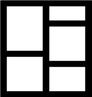
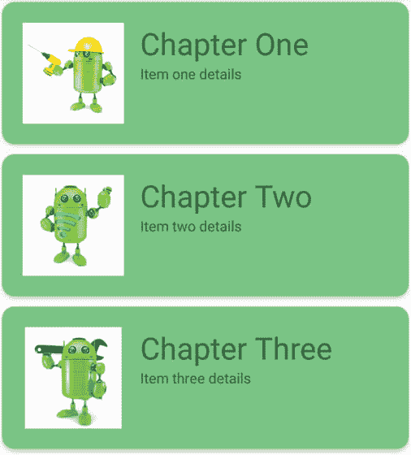

54\. 使用回收视图和卡片视图小部件

RecyclerView 和 CardView 小部件协同工作，向用户提供可滚动的信息列表，其中信息以单个卡片的形式呈现。在完成一个示例项目的设计和实现之前，这两个类的细节将在本章中介绍。

54.1 回收视图概述

与标题为[“使用浮动操作按钮和滚动条”](52.html#_idTextAnchor1040)一章中概述的 ListView 类非常相似，RecyclerView 的目的是允许信息以可滚动列表的形式呈现给用户。然而，与列表视图相比，回收视图提供了许多优势。特别是，RecyclerView 在管理组成列表的视图方面效率明显更高，如果创建新的视图(因此得名“recycler”)，则基本上重用组成列表项的现有视图。这既提高了性能，又减少了列表所使用的资源，当向用户呈现大量数据时，这一特性尤其有益。

与列表视图不同，RecyclerView 还提供了三种内置布局管理器来控制向用户显示列表项目的方式:

线性布局管理器–列表项目以水平或垂直滚动列表的形式呈现。


图 54-1

网格布局管理器–列表项以网格格式显示。当列表项大小一致时，最好使用此管理器。


图 54-2

交错网格布局管理器 -列表项目以交错网格格式呈现。当列表项的大小不一致时，最好使用此管理器。



图 54-3

对于三个内置管理器都不能提供必要布局的情况，可以通过子类化 RecyclerView 来实现自定义布局管理器。LayoutManager 类。

回收视图中显示的每个列表项都被创建为视图持有者类的一个实例。ViewHolder 实例包含了 RecyclerView 显示列表项所需的所有内容，包括要显示的信息和用于显示该项目的视图布局。

与列表视图一样，回收视图依赖于一个适配器来充当回收视图实例和要向用户显示的数据之间的中介。适配器是作为 RecyclerView 的子类创建的。适配器类，并且必须至少实现以下方法，这些方法将由分配给适配器的 RecyclerView 对象在不同的点调用:

getItemCount()–该方法必须返回要在列表中显示的项目数的计数。

oncreateViewHolder()–该方法创建并返回一个 viewpholder 对象，该对象使用用于显示数据的视图进行初始化。这个视图通常是通过扩展 XML 布局文件来创建的。

OnBindViewHolder()–该方法被传递给由 onCreateViewHolder()方法创建的 Viewholder 对象以及一个指示将要显示的列表项的整数值。包含在 ViewHolder 对象中的是 onCreateViewHolder()方法分配的布局。onBindViewHolder()方法的职责是用与指定项目相对应的文本和图形填充布局中的视图，并将对象返回到将呈现给用户的 RecyclerView。

向布局添加一个 recycle view只需将适当的元素添加到它要出现的活动的 XML 内容布局文件中。例如:

```kt
<?xml version="1.0" encoding="utf-8"?>
<androidx.constraintlayout.widget.ConstraintLayout 
    xmlns:android="http://schemas.android.com/apk/res/android"
    xmlns:app="http://schemas.android.com/apk/res-auto"
    xmlns:tools="http://schemas.android.com/tools"
    android:layout_width="match_parent"
    android:layout_height="match_parent"
    app:layout_behavior="@string/appbar_scrolling_view_behavior"
    tools:context=".MainActivity"
    tools:showIn="@layout/activity_card_demo">

    <androidx.recyclerview.widget.RecyclerView
        android:id="@+id/recycler_view"
        android:layout_width="0dp"
        android:layout_height="0dp"
        app:layout_constraintBottom_toBottomOf="parent"
        app:layout_constraintEnd_toEndOf="parent"
        app:layout_constraintStart_toStartOf="parent"
        app:layout_constraintTop_toTopOf="parent"
        tools:listItem="@layout/card_layout" />

</androidx.constraintlayout.widget.ConstraintLayout>
.
.
```

在上面的例子中，回收视图已经与应用栏和工具栏一起嵌入到主活动布局文件的协调布局中。这提供了一些额外的功能，例如配置工具栏和应用栏，以便当用户在 RecyclerView 中向上滚动时，工具栏和应用栏滚动出屏幕(在标题为[“使用应用栏和折叠工具栏布局”](57.html#_idTextAnchor1123)的章节中更详细地讨论了这个主题)。

54.2 卡片视图概述

卡片视图类是一个用户界面视图，允许使用卡片隐喻将信息分组呈现。卡片通常使用 RecyclerView 实例显示在列表中，并且可以配置为带有阴影效果和圆角。[例如，图 54-4](#_idTextAnchor1095) 显示了三个配置为显示由一个图像视图和两个特克斯视图组成的布局的卡片视图实例:



图 54-4

要呈现给 CardView 实例的用户界面布局是在 XML 布局资源文件中定义的，并在运行时加载到 CardView 中。使用标准布局管理器，如相对布局和线性布局，卡片视图布局可以包含任何复杂的布局。下面的 XML 布局文件表示由一个 RelativeLayout 和一个 ImageView 组成的卡片视图布局。该卡被配置为抬高以产生阴影效果，并呈现圆角:

```kt
<?xml version="1.0" encoding="utf-8"?>
    <androidx.cardview.widget.CardView
        xmlns:card_view="http://schemas.android.com/apk/res-auto"
        xmlns:android="http://schemas.android.com/apk/res/android"
        android:id="@+id/card_view"
        android:layout_width="match_parent"
        android:layout_height="wrap_content"
        android:layout_margin="5dp"
        card_view:cardCornerRadius="12dp"
        card_view:cardElevation="3dp"
        card_view:contentPadding="4dp">

        <RelativeLayout
            android:layout_width="match_parent"
            android:layout_height="wrap_content"
            android:padding="16dp" >

            <ImageView
                android:layout_width="100dp"
                android:layout_height="100dp"
                android:id="@+id/item_image"
                android:layout_alignParentLeft="true"
                android:layout_alignParentTop="true"
                android:layout_marginRight="16dp" />
        </RelativeLayout>
</androidx.cardview.widget.CardView>
```

当与回收视图结合创建可滚动的卡片列表时，回收视图的 onCreateViewHolder()方法将展开卡片的布局资源文件，将其分配给视图持有者实例，并将其返回给回收视图实例。

54.3 总结

本章介绍了安卓回收视图和卡片视图组件。回收视图提供了一种在安卓应用中显示可滚动视图列表的资源高效方式。当以卡片的形式呈现数据组(如姓名和地址列表)时，卡片视图非常有用。如前所述，并在下一章包含的教程中进行了演示，回收视图和卡片视图在结合使用时特别有用。