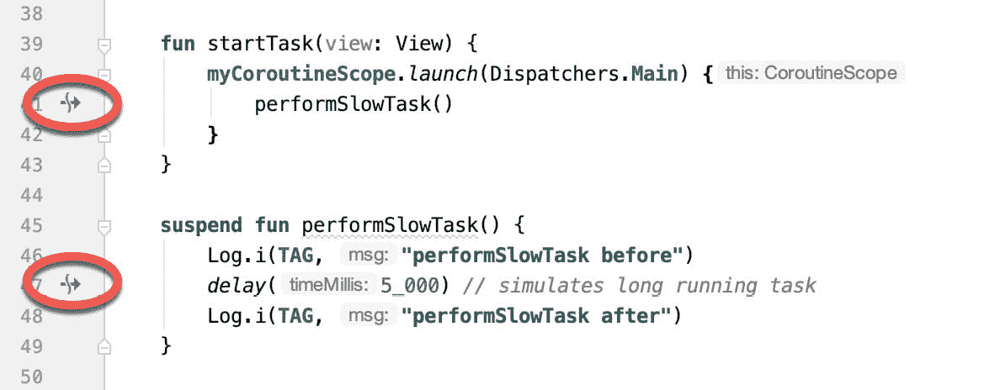

63.柯特林简介花冠

前一章介绍了安卓上线程的概念，并解释了应用的用户界面是如何在主线程上运行的。为了避免降低或中断用户界面响应，重要的是耗时的任务不要阻塞主线程的执行。如前一章所述，一种选择是在后台线程上运行任何这样的任务，从而让主线程继续管理用户界面。这可以通过直接使用线程处理程序或者使用 AsyncTask 类来实现。

虽然异步任务和线程处理程序提供了一种在不同线程上执行任务的方法，但实现起来可能很耗时，并且在应用项目中读取和维护相关代码会令人困惑。当应用需要大量线程时，这种方法也不是最有效的解决方案。

幸运的是，Kotlin 以 Coroutines 的形式提供了一个轻量级的替代方案。在本章中，我们将介绍 Coroutines 的基本概念，包括诸如 dispatchers、coroutine 作用域、suspend 函数、coroutine 构建器和结构化并发等术语。本章还将介绍协同程序之间基于通道的通信的基本概念。

63.1 什么是花冠？

协同程序是异步执行的代码块，不会阻塞启动它们的线程。可以实现 Coroutines，而不必担心构建复杂的 AsyncTask 实现或直接管理多个线程。由于它们的实现方式，协同程序比使用传统的多线程选项要高效得多，资源消耗也更少。Coroutines 还使代码更容易编写、理解和维护，因为它允许代码按顺序编写，而不必编写回调来处理与线程相关的事件和结果。

虽然是 Kotlin 相对较新的成员，但 coroutines 并没有什么新的或创新的。从 20 世纪 60 年代开始，某种形式的协同程序就已经存在于编程语言中，并且是基于一种被称为通信顺序过程(CSP)的模型。事实上，Kotlin 仍然在幕后使用多线程，尽管它的效率非常高。

63.2 螺纹对螺纹

线程的一个问题是，就 CPU 能力和系统开销而言，它们是一种昂贵的有限资源。在后台，创建、调度和销毁线程涉及大量工作。虽然现代的 CPU 能够运行大量的线程，但是任何一次能够并行运行的线程实际数量受到 CPU 内核数量的限制(虽然较新的 CPU 有 8 个内核，但大多数 Android 设备包含 4 个内核的 CPU)。当需要的线程比 CPU 内核多时，系统必须执行线程调度，以决定如何在可用内核之间共享这些线程的执行。

为了避免这些开销，Kotlin 不是为每个协同程序启动一个新线程，然后在协同程序退出时销毁它，而是维护一个活动线程池，并管理如何将协同程序分配给这些线程。当一个活动的协同程序被挂起时，它会被 Kotlin 运行时保存，而另一个协同程序会恢复到原来的位置。当协同恢复时，它只是恢复到池中现有的未被占用的线程，继续执行，直到它完成或被挂起。使用这种方法，有限数量的线程被有效地用于执行异步任务，有可能执行大量并发任务，而不会出现使用标准多线程时固有的性能退化。

63.3 科罗廷范围

所有的协同工作必须在一个特定的范围内运行，这个范围允许它们作为一个组来管理，而不是作为单独的协同工作来管理。这在取消和清理协同程序时尤其重要，例如当一个片段或活动被销毁时，并确保协同程序不会“泄漏”(换句话说，当应用不再需要它们时，它们会继续在后台运行)。例如，通过将协同程序分配给一个作用域，当不再需要它们时，它们都可以被批量取消。

Kotlin 提供了一些内置的作用域，以及使用 CoroutineScope 类创建自定义作用域的选项。内置范围可以总结如下:

全局范围–全局范围用于启动与应用整个生命周期相关的顶级协同程序。因为这个范围内的协同程序有可能在不需要时继续运行(例如，当活动退出时)，所以不建议在安卓应用中使用这个范围。在全局范围内运行的协同程序被认为是使用非结构化并发。

视图模型范围–专门为使用 Jetpack 架构视图模型组件时在视图模型实例中使用而提供。当相应的视图模型实例被销毁时，Kotlin 运行时系统会自动取消从视图模型实例中启动的协同程序。

对于所有其他要求。很可能会使用自定义范围。例如，下面的代码创建了一个名为 myCoroutineScope 的自定义范围:

```kt
private val myCoroutineScope = CoroutineScope(Dispatchers.Main)
```

coroutineScope 声明了将用于运行 coroutine 的调度程序(尽管这可以被覆盖)，如果要将 coroutine 包含在作用域中，则每次启动 coroutine 时都必须引用它。通过调用作用域实例的 cancel()方法，可以取消作用域中所有正在运行的协同程序:

```kt
myCoroutineScope.cancel()
```

63.4 暂停功能

挂起函数是一种特殊类型的柯特林函数，它包含一个协同函数的代码。它是使用 Kotlin suspend 关键字声明的，该关键字向 Kotlin 表明该函数可以暂停并在以后恢复，从而允许长时间运行的计算在不阻塞主线程的情况下执行。

以下是挂起功能的示例:

```kt
suspend fun mySlowTask() {
    // Perform long running task here    
}
```

63.5corroutine dispatchers

Kotlin 为不同类型的异步活动维护线程，当启动协同程序时，需要从以下选项中选择合适的调度程序:

调度员。main–在主线程上运行协同程序，适用于需要对用户界面进行更改的协同程序，并作为执行轻量级任务的通用选项。

调度员。IO–推荐用于执行网络、磁盘或数据库操作的协同程序。

调度员。默认值–适用于 CPU 密集型任务，如排序数据或执行复杂计算。

调度程序负责将协同工作分配给适当的线程，并在协同工作的生命周期中暂停和恢复协同工作。除了预定义的调度程序，还可以为您自己的自定义线程池创建调度程序。

63.6Coroutine Builders

协同构建器将到目前为止涵盖的所有组件集合在一起，并实际启动协同，以便它们开始执行。为此，科特林提供了以下六个构建器:

启动–在不阻塞当前线程的情况下启动协同程序，并且不向调用方返回结果。当从传统函数中调用挂起函数时，以及当不需要处理协同程序的结果时(有时称为“激发并忘记”协同程序)，使用这个构建器。

异步–启动一个协同程序，允许调用者使用 await()函数等待结果，而不阻塞当前线程。当您有多个需要并行运行的协同程序时，请使用异步。异步生成器只能在另一个挂起函数中使用。

带上下文–允许协同程序在与父协同程序不同的上下文中启动。例如，使用主上下文运行的协同程序可以使用这个构建器在默认上下文中启动一个子协同程序。当从协同程序返回结果时，withContext 生成器也为异步提供了一个有用的替代方法。

coroutineScope–coroutineScope 构建器非常适合于挂起功能启动多个并行运行的 coroutine，并且只有当所有 coroutine 都完成时才需要执行某些操作的情况。如果这些协同工作是使用协同工作生成器启动的，那么调用函数在所有子协同工作完成之前不会返回。当使用 coroutineScope 时，任何一个 coroutine 的失败都会导致所有其他 coroutine 的取消。

监管者范围–类似于上面概述的协同范围，除了一个孩子的失败不会导致其他协同的取消。

运行阻塞——启动一个协同程序，阻塞当前线程，直到协同程序完成。这通常与 coroutines 想要的正好相反，但是对于测试代码以及集成遗留代码和库非常有用。否则要避免。

63.7 工作

对协同构建器的每次调用(如启动或异步)都会返回一个作业实例，该实例又可用于跟踪和管理相应协同的生命周期。从协同工作中进行的后续构建器调用将创建新的作业实例，这些实例将成为直接父作业的子作业，形成父子关系树，取消父作业将递归地取消其所有子作业。但是，取消子级不会取消父级，尽管使用启动生成器创建的子级中的未捕获异常可能会导致父级的取消(对于使用异步生成器创建的子级，情况并非如此，异步生成器将异常封装在返回给父级的结果中)。

协同作业的状态可以通过访问相关作业对象的活动、完成和取消属性来识别。除了这些属性，作业实例上还有许多方法可用。例如，可以通过调用 Job 对象的 cancel()方法来取消一个作业及其所有子作业，而调用 cancelChildren()方法将取消所有子协同作业。

可以调用 join()方法来挂起与作业相关联的协同作业，直到它的所有子作业都完成。要执行此任务并在所有子作业完成后取消作业，只需调用取消连接()方法。

这种分层的作业结构与协同作用域一起构成了结构化并发的基础，其目标是确保协同作用不会运行超过所需的时间，而不需要手动保存对每个协同作用域的引用。

63.8 验尸官-暂停和恢复

为了更好地理解协同暂停，看看一些协同作用的例子会有所帮助。首先，让我们假设一个简单的安卓应用包含一个按钮，当点击该按钮时，会调用一个名为 startTask()的函数。这个函数的职责是使用主协同调度器调用名为 performSlowTask()的挂起函数。这方面的代码如下:

```kt
private val myCoroutineScope = CoroutineScope(Dispatchers.Main)
fun startTask(view: View) {
    myCoroutineScope.launch(Dispatchers.Main) {
        performSlowTask()
    }
}
```

在上面的代码中，在对启动生成器的调用中声明并引用了一个自定义范围，启动生成器又调用 performSlowTask()挂起函数。请注意，由于 startTask()不是挂起函数，所以必须使用启动生成器而不是异步生成器来启动协同程序。

接下来，我们可以如下声明 performSlowTask()挂起函数:

```kt
suspend fun performSlowTask() {
    Log.i(TAG, "performSlowTask before")
    delay(5_000) // simulates long running task
    Log.i(TAG, "performSlowTask after")
}
```

实现后，所有功能都是在执行 5 秒延迟之前和之后输出诊断消息，模拟长时间运行的任务。当 5 秒延迟生效时，用户界面将继续响应，因为主线程没有被阻塞。要理解为什么，探究幕后发生的事情是有帮助的。

首先，执行 startTask()函数，并作为协同程序启动 performSlowTask()挂起函数。然后，该函数通过传递时间值来调用 Kotlin delay()函数。事实上，内置的 Kotlin delay()函数本身是作为一个挂起函数实现的，因此也是由 Kotlin 运行时环境作为一个协同程序启动的。代码执行现在已经到达所谓的挂起点，这将导致 performSlowTask()协同程序在延迟协同程序运行时被挂起。这将释放运行 performSlowTask()的线程，并将控制权返回给主线程，从而使用户界面不受影响。

一旦 delay()函数完成，挂起的协同程序将被恢复，并从池中恢复到一个线程，在该线程中可以显示 Log 消息并返回 startTask()函数。

在 Android Studio 中使用 coroutines 时，代码编辑器中的挂起点会被标记，如下图所示:



图 63-1

63.9 从验尸官处返回结果

上面的例子运行了一个挂起函数作为协同程序，但是没有演示如何返回结果。但是，假设 performSlowTask()函数需要返回一个字符串值，该值将通过 TextView 对象显示给用户。

为此，我们需要重写 suspend 函数来返回一个 delivered 对象。延迟对象本质上是承诺在未来某个时候提供一个值。通过对延迟对象调用 await()函数，当 coroutine 返回值时，Kotlin 运行时将传递该值。因此，我们的 startTask()函数中的代码可能会重写如下:

```kt
fun startTask(view: View) {
    coroutineScope.launch(Dispatchers.Main) {
        statusText.text = performSlowTask().await()
    }
}
```

现在的问题是，我们不得不使用启动生成器来启动协同程序，因为 startTask()不是一个挂起函数。如本章前面所述，只有在使用异步生成器时才可能返回结果。为了解决这个问题，我们必须调整 suspend 函数，使用异步生成器来启动另一个返回延迟结果的协同程序:

```kt
suspend fun performSlowTask(): Deferred<String> =
    coroutineScope.async(Dispatchers.Default) {
        Log.i(TAG, "performSlowTask before")
        delay(5_000)
        Log.i(TAG, "performSlowTask after")
    return@async "Finished"
}
```

现在，当应用运行时，当 performSlowTask()协同工作完成时，“已完成”结果字符串将显示在 TextView 对象上。同样，对结果的等待将在后台进行，而不会阻塞主线程。

63.10 使用配合上下文

正如我们所看到的，协同程序是在指定的范围内使用特定的调度程序启动的。默认情况下，任何子协同程序都将继承父协同程序使用的调度程序。考虑下面的代码，该代码旨在从一个挂起函数中调用多个函数:

```kt
fun startTask(view: View) {
    coroutineScope.launch(Dispatchers.Main) {
        performTasks()
    }
}

suspend fun performTasks() {
    performTask1()
    performTask2()
    performTask3()
}

suspend fun performTask1() {
    Log.i(TAG, "Task 1 ${Thread.currentThread().name}")
}

suspend fun performTask2() {
    Log.i(TAG, "Task 2 ${Thread.currentThread().name}")
}

suspend fun performTask3 () {
    Log.i(TAG, "Task 3 ${Thread.currentThread().name}")
}
```

由于 performTasks()函数是使用 Main dispatcher 启动的，因此这三个函数都将默认为主线程。为了证明这一点，已经编写了函数来输出运行它们的线程的名称。在执行时，Logcat 面板将包含以下输出:

```kt
Task 1 main
Task 2 main
Task 3 main
```

然而，假设 performTask2()函数执行一些更适合 IO 调度程序的网络密集型操作。这可以很容易地通过使用 withContext 启动器来实现，该启动器允许在保持相同协同作用域的同时更改协同作用的上下文。以下更改将 performTask2()协同程序切换到一个输入输出线程:

```kt
suspend fun performTasks() {
    performTask1()
    withContext(Dispatchers.IO) { performTask2() }
    performTask3()
}
```

执行时，输出将如下所示，表示任务 2 协同程序不再在主线程上:

```kt
Task 1 main
Task 2 DefaultDispatcher-worker-1
Task 3 main
```

withContext 生成器还提供了一个有趣的替代方法，在返回结果时使用异步生成器和延迟对象 wait()调用。使用 withContext，上一节的代码可以重写如下:

```kt
fun startTask(view: View) {
    coroutineScope.launch(Dispatchers.Main) {
          statusText.text = performSlowTask()
    }
}

suspend fun performSlowTask(): String =
    withContext(Dispatchers.Main) {
        Log.i(TAG, "performSlowTask before")
        delay(5_000)
        Log.i(TAG, "performSlowTask after")

        return@withContext "Finished"
    }
```

63.11 协同渠道沟通

通道提供了一种简单的方法来实现包括数据流在内的协同程序之间的通信。最简单的形式是创建一个通道实例，并调用 send()方法发送数据。发送后，可以通过调用同一通道实例的 receive()方法在另一个协同程序中接收传输的数据。

例如，下面的代码将六个整数从一个循环传递到另一个循环:

```kt
import kotlinx.coroutines.channels.*
.
.
val channel = Channel<Int>()

suspend fun channelDemo() {
    coroutineScope.launch(Dispatchers.Main) { performTask1() }
    coroutineScope.launch(Dispatchers.Main) { performTask2() }
}

suspend fun performTask1() {
    (1..6).forEach {
        channel.send(it)
    }
}
suspend fun performTask2() {
    repeat(6) {
        Log.d(TAG, "Received: ${channel.recieve()}")
    }
}
```

执行时，将生成以下 logcat 输出:

```kt
Received: 1
Received: 2
Received: 3
Received: 4
Received: 5
Received: 6
```

63.12 总结

Kotlin coroutines 提供了一种比传统多线程更简单、更有效的方法来执行异步任务。Coroutines 允许以结构化的方式实现异步任务，而不需要实现与典型的基于线程的任务相关联的回调。本章介绍了协同程序的基本概念，包括作业、范围、构建器、挂起函数、结构化并发和基于通道的通信。