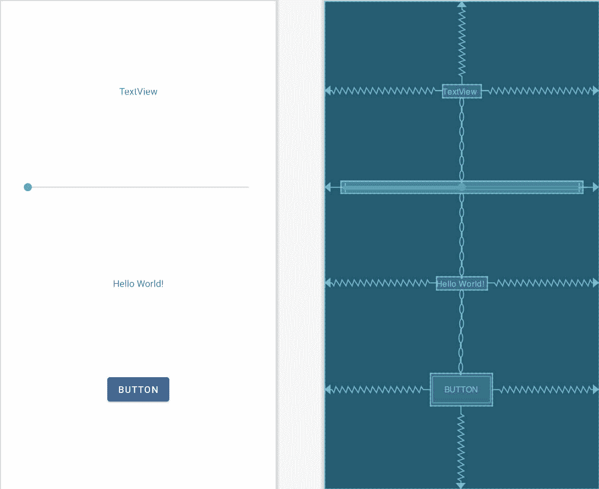
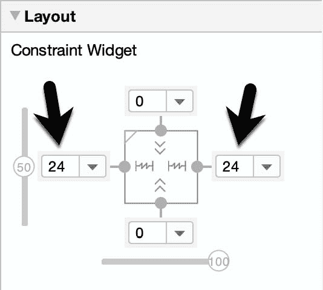

64.安安卓科特林课件

前一章介绍了使用 Kotlin coroutines 在 Android 应用中执行异步任务的关键概念。本章将在这些知识的基础上创建一个示例应用，一个按钮就可以启动成千上万个协同程序。

64.1 创建协同示例应用

从欢迎屏幕中选择创建新项目快速启动选项，并在生成的新项目对话框中选择空活动模板，然后单击下一步按钮。

在“名称”字段中输入 CoroutineDemo，并将 com . ebookwidue . CoroutineDemo 指定为包名。在单击完成按钮之前，将最低API级别设置更改为API 26:安卓 8.0(奥利奥)，并将语言菜单更改为科特林。使用[“将项目迁移到视图绑定”](18.html#_idTextAnchor393)一节中概述的步骤，将项目迁移到视图绑定。

64.2 为本项目增加协同支持

AndroidStudio的当前版本不自动在新创建的项目中包含对协同程序的支持。因此，在继续之前，请编辑 Gradle Scripts-> build . Gradle(Module:coroutinedemo . app)文件，并在 dependencies 部分添加以下几行(注意，与往常一样，可能会有更新版本的库):

```kt
dependencies {
.
.
    implementation 'org.jetbrains.kotlinx:kotlinx-coroutines-core:1.4.1'
    implementation 'org.jetbrains.kotlinx:kotlinx-coroutines-android:1.4.1'
.
.
}
```

进行更改后，单击编辑器面板顶部的“立即同步”链接提交更改。

64.3 设计用户界面

用户界面将由一个启动协同程序的按钮和一个 Seekbar 组成，Seekbar 指定每次点击按钮时异步启动多少个协同程序。当协同程序执行时，当单个协同程序开始和结束时，一个文本视图将会更新。

首先加载 activity_main.xml 布局文件，添加 Button、TextView 和 SeekBar 对象，使布局类似于[图 64-1](#_idTextAnchor1246) 所示:



图 64-1

要实现上面显示的布局约束，首先使用工具栏按钮清除布局上的所有约束。按住 Shift 键点按四个对象，使所有对象都被选中，右键点按最上面的文本视图，然后选择中心->水平菜单选项。再次右键单击，这次选择链->创建垂直链选项。

选择 SeekBar，将 layout_width 属性更改为 0dp (match_constraints)，然后在左右两侧添加 24dp 边距，如图[图 64-2](#_idTextAnchor1247) :



图 64-2

修改按钮的 onClick 属性以调用名为 launchCoroutines 的方法，并将最上面的文本视图、seekBar 和较低的文本视图的 id 分别更改为 countText、SeekBar 和 statusText。最后，将按钮上的文本改为“启动协同程序”，并将文本提取到字符串资源中。

64.4 实施 SeekBar

SeekBar 控制每次单击按钮时启动的异步协同程序的数量，范围从 1 到 2000。保留在 activity_main.xml 文件中，选择 SeekBar 并使用属性工具窗口将 max 属性更改为 2000。接下来，编辑 MainActivity.kt 文件，添加一个变量来存储当前滑块设置，并修改 onCreate()方法来添加 SeekBar 侦听器:

```kt
.
.
import android.widget.SeekBar
.
. 
class MainActivity : AppCompatActivity() {

    private lateinit var binding: ActivityMainBinding
    private var count: Int = 1

    override fun onCreate(savedInstanceState: Bundle?) {
        super.onCreate(savedInstanceState)
        binding = ActivityMainBinding.inflate(layoutInflater)
        setContentView(binding.root)

        binding.seekBar.setOnSeekBarChangeListener(object :
            SeekBar.OnSeekBarChangeListener {
            override fun onProgressChanged(seek: SeekBar,
                                           progress: Int, fromUser: Boolean) {
                count = progress
                binding.countText.text = "${count} coroutines"
            }

            override fun onStartTrackingTouch(seek: SeekBar) {
            }

            override fun onStopTrackingTouch(seek: SeekBar) {
            }
        })
    }
.
.
```

当 seekbar 滑动时，当前值将存储在 count 变量中，并显示在 countText 视图中。

64.5 增加暂停功能

当用户点击按钮时，应用将需要启动在 SeekBar 中选择的协同程序的数量。launchcorutines()onClick 方法将使用 coroutine 启动生成器执行挂起功能来实现这一点。由于挂起函数将返回一个显示在 statusText TextView 对象上的状态字符串，因此需要使用异步生成器来实现它。所有这些操作都需要在一个协同作用的范围内执行，这个范围也需要声明。在 MainActivity.kt 文件中进行以下更改:

```kt
.
.
import kotlinx.coroutines.*
.
.
class MainActivity : AppCompatActivity() {
    private val coroutineScope = CoroutineScope(Dispatchers.Main)
.
.
    suspend fun performTask(tasknumber: Int): Deferred<String> =
        coroutineScope.async(Dispatchers.Main) {
            delay(5_000)
            return@async "Finished Coroutine ${tasknumber}"
        }
.
.
}
```

假设该函数只执行一个小任务，并且涉及到用户界面的更改，那么协同程序是使用 Main dispatcher 执行的。它被传递要启动的协同程序的序列号，延迟 5 秒，然后返回一个字符串，指示编号的协同程序已经完成。

64.6 实施启动协调方法

测试应用之前的最后一个任务是添加 launchCoroutines()方法，单击 Button 对象时会调用该方法。这个方法应该添加到 MainActivity.kt 文件中，如下所示:

```kt
.
.
import android.view.View
.
.
    fun launchCoroutines(view: View) {

        (1..count).forEach {
            binding.statusText.text = "Started Coroutine ${it}"
            coroutineScope.launch(Dispatchers.Main) {
                binding.statusText.text = performTask(it).await()
            }
        }
    }
.
.
```

该方法实现了一个循环来启动请求的协同程序数量，并在每次通过 await()方法调用从完成的协同程序返回结果时更新状态文本视图。

64.7 测试应用

在设备或模拟器上构建和运行应用，并在点击启动按钮之前将 SeekBar 移动到一个较低的数字(例如 10)。每次启动协同程序时，状态文本都会更新，直到达到最大值。在每次协同完成 5 秒钟的延迟后，状态文本将更新，直到所有 10 个都完成(实际上，这些状态更新发生得如此之快，以至于很难看到状态变化)。

在 SeekBar 设置为 2000 的情况下重复该过程，这一次在 coroutines 运行时来回滑动 seekbar，以验证主线程仍在运行并且没有被阻塞。

最后，在显示 Logcat 面板的情况下，将 SeekBar 设置为 2000，并重复单击启动按钮。点击大约 15 次后，Logcat 面板将开始显示类似以下内容的消息:

```kt
I/Choreographer: Skipped 52 frames!  The application may be doing too much work on its main thread.
```

尽管应用继续运行，但显然应用中运行的大量协同程序开始使主线程过载。这种情况只在数万个协同程序同时执行时发生，这一事实证明了 Kotlin 协同程序的效率。然而，当这个消息开始出现在你自己的应用中时，它可能是一个信号，要么是运行了太多的协同程序，要么是正在执行的异步工作负载对于主线程来说太重了。在这种情况下，可能需要使用不同的调度程序，可能是通过使用 withContext 构建器。

64.8 总结

在[“Kotlin Coroutines 简介”](63.html#_idTextAnchor1221)中所包含的信息的基础上，本章逐步创建了一个示例应用，演示了 Kotlin Coroutines 在安卓应用中的使用。该示例演示了如何使用 Main dispatcher 启动数千个异步协同程序，包括返回结果。