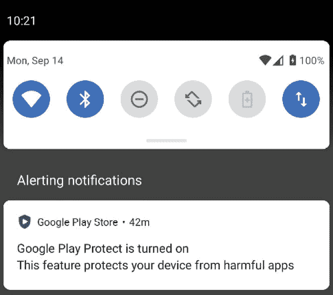
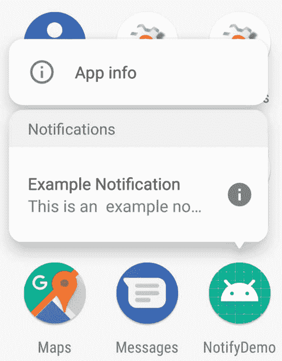
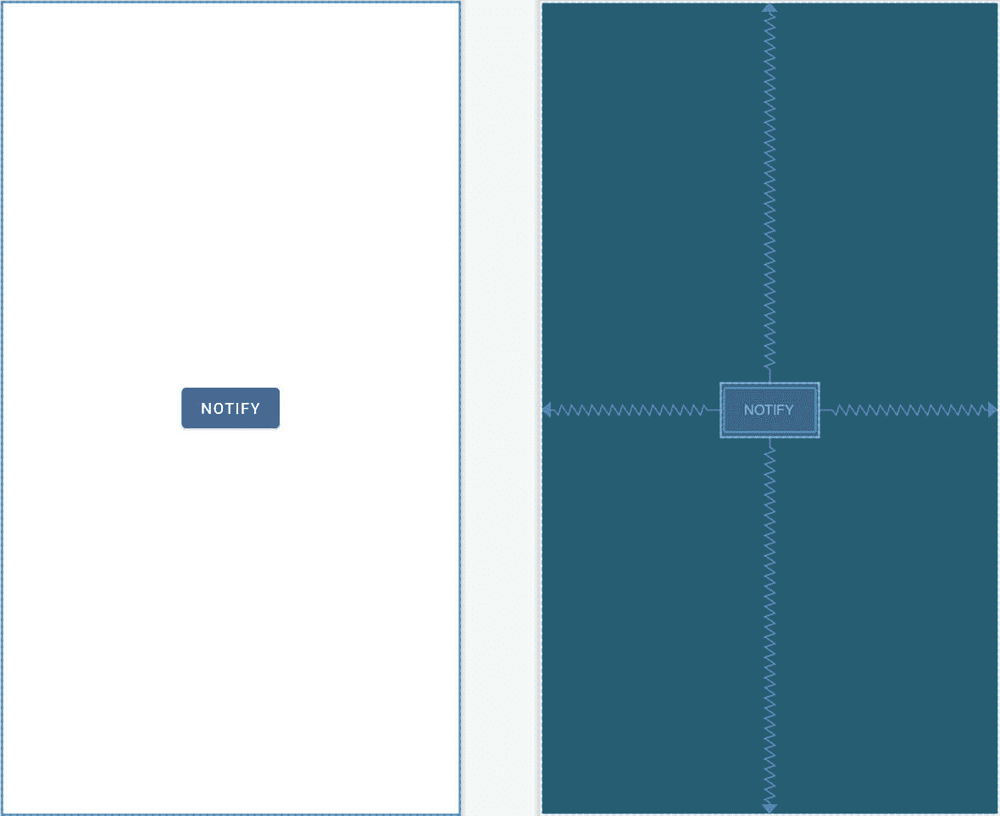
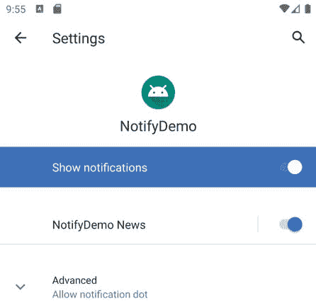
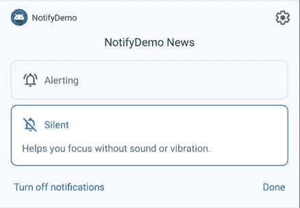

# 六十九、安卓通知教程

通知提供了一种方式，当应用没有运行或当前处于后台时，应用可以向用户传达消息。例如，消息应用可能会发出通知，让用户知道联系人发来了新消息。通知可以分为本地通知和远程通知。本地通知由运行它的设备上的应用本身触发。另一方面，远程通知由远程服务器发起，并传送到设备以呈现给用户。

通知出现在从屏幕状态栏下拉的通知抽屉中，每个通知都可以包括打开发送通知的应用的按钮等操作。安卓还支持直接回复通知，该功能允许用户在通知面板中键入并提交对通知的响应。

本章的目标是概述和演示安卓应用中本地通知的实现。下一章([“一个安卓直接回复通知教程”](70.html#_idTextAnchor1321))将讲述直接回复通知的实现。

69.1 通知概述

当通知在安卓设备上启动时，它会在状态栏中显示为一个图标。[例如，图 69-1](#_idTextAnchor1304) 显示了带有多个通知图标的状态栏:


图 69-1

要查看通知，用户从状态栏开始向下滑动，下拉通知抽屉，如图[图 69-2](#_idTextAnchor1305) :



图 69-2

在运行 Android 8 或更高版本的设备中，长按应用启动器图标将显示与该应用相关的任何未决通知，如图 69-3 所示:



图 69-3

安卓 8 和更高版本还支持通知点，当通知等待用户看到时，通知点会出现在应用启动器图标上。

一个典型的通知将只是显示一条消息，当点击时，启动负责发出通知的应用。通知还可能包含操作按钮，当点击时，这些按钮会执行特定于相应应用的任务。[例如，图 69-4](#_idTextAnchor1307) 显示了一个包含两个操作按钮的通知，允许用户删除或保存传入消息。


图 69-4

用户也可以在通知中输入一个内嵌的文本回复，发送到 app，如下图[图 69-5](#_idTextAnchor1308) 所示。这允许用户响应通知，而不必将相应的应用启动到前台。


图 69-5

本章的其余部分将介绍创建和发布包含操作的简单通知所涉及的步骤。直接回复支持的主题将在下一章[“安卓直接回复通知教程”](70.html#_idTextAnchor1321)中讨论。

69.2 创建通知演示项目

从欢迎屏幕中选择启动新的AndroidStudio项目快速启动选项，并在生成的新项目对话框中选择空活动模板，然后单击下一步按钮。

在“名称”字段中输入 NotifyDemo，并将 com . ebookwidue . notify demo 指定为包名。在单击完成按钮之前，将最低API级别设置更改为API 26:安卓 8.0(奥利奥)，并将语言菜单更改为Kotlin。

69.3 设计用户界面

主要活动将包含一个按钮，其目的是创建和发布一个意图。找到 activity_main.xml 文件并将其加载到布局编辑器工具中，然后删除默认的 TextView 小部件。

启用自动连接后，将按钮对象从面板拖放到布局画布的中心，如图 69-6 所示。

在布局中选择按钮小部件后，使用属性面板配置 onClick 属性，以调用名为 sendNotification 的方法。



图 69-6

选择按钮小部件，将属性工具窗口中的文本属性更改为“通知”，并将属性值提取到字符串资源中。

69.4 创建第二个活动

在本例中，应用将包含第二个活动，该活动将由用户从通知中启动。通过右键单击位于 app -> java 中的 com . ebookwidge . notify demo 包名，并选择新建->活动->空活动菜单选项来显示新建安卓活动对话框，从而将新活动添加到项目中。

在活动名称字段中输入结果活动，并命名布局文件活动 _ 结果。由于此活动不会在应用启动时启动(而是通过通知中的一个意图启动)，因此在单击“完成”按钮之前，务必确保“启动器活动”选项已禁用。使用第 [18.8 节“将项目迁移到视图绑定”](18.html#_idTextAnchor393)中的步骤，将视图绑定支持添加到 build.gradle 和 ResultActivity.kt 文件中(请记住，绑定名称将是 ResultActivityBinding，而不是 ActivityMainBinding)。

打开第二个活动的布局(app-> RES-> layout-> activity _ result . XML)，拖放一个 TextView 小部件，使其位于布局的中心。编辑文本视图的文本，使其显示为“结果活动”，并将属性值提取到字符串资源中。

69.5 创建通知渠道

在应用可以发送通知之前，它必须首先创建一个通知通道。通知频道由唯一标识应用内频道的 ID、频道名称和频道描述(用户只能看到后两者)组成。通道是通过配置通知通道实例，然后将该对象传递给通知管理器类的 createNotificationChannel()方法来创建的。对于本例，该应用将包含一个名为“通知演示新闻”的通知频道。编辑 MainActivity.kt 文件并实现代码，以便在应用启动时创建频道:

```kt
.
.
import android.app.NotificationChannel
import android.app.NotificationManager
import android.content.Context
import android.graphics.Color

class MainActivity : AppCompatActivity() {

    private var notificationManager: NotificationManager? = null

    override fun onCreate(savedInstanceState: Bundle?) {
.
.
        notificationManager = 
                  getSystemService(
                   Context.NOTIFICATION_SERVICE) as NotificationManager

        createNotificationChannel(
                "com.ebookfrenzy.notifydemo.news",
                "NotifyDemo News",
                "Example News Channel")
    }

    private fun createNotificationChannel(id: String, name: String,
                                            description: String) {

        val importance = NotificationManager.IMPORTANCE_LOW
        val channel = NotificationChannel(id, name, importance)

        channel.description = description
        channel.enableLights(true)
        channel.lightColor = Color.RED
        channel.enableVibration(true)
        channel.vibrationPattern = 
            longArrayOf(100, 200, 300, 400, 500, 400, 300, 200, 400)
        notificationManager?.createNotificationChannel(channel)
    }
}
```

该代码声明并初始化一个 NotificationManager 实例，然后使用配置的名称和描述属性创建具有低重要性级别(其他选项为高、最大、最小和无)的新通道。频道中还添加了一系列可选设置，以自定义通知到达时提醒用户的方式。这些设置适用于发送到此频道的所有通知。最后，通过将通知通道对象传递给通知管理器实例的 createNotificationChannel()方法来创建通道。

代码更改完成后，在运行安卓 10 或更高版本的设备或模拟器上编译并运行该应用。应用启动后，将其放入后台并打开设置应用。在设置应用中，选择应用和通知选项，然后选择应用信息。在应用信息屏幕上，找到并选择通知演示项目，然后在后续屏幕上点击通知条目。通知屏幕应列出对用户有效的通知演示新闻类别:



图 69-7

在继续之前，请检查高级设置，以确保应用启用了通知点和气泡。

虽然不是本例的要求，但值得注意的是，可以通过调用通知管理器的 deleteNotificationChannel()方法，传递要删除的通道的 ID，从应用中删除通道:

```kt
val channelID = "com.ebookfrenzy.notifydemo.news"
notificationManager?.deleteNotificationChannel(channelID)
```

69.6 创建和发布通知

通知是使用通知创建的。生成器类，并且必须包含图标、标题和内容。打开 MainActivity.kt 文件，按照如下方式实现 sendNotification()方法来构建基本通知:

```kt
.
.
import android.app.Notification
import android.view.View
.
.
fun sendNotification(view: View) {

    val channelID = "com.ebookfrenzy.notifydemo.news"

    val notification = Notification.Builder(this@MainActivity,
            channelID)
            .setContentTitle("Example Notification")
            .setContentText("This is an  example notification.")
            .setSmallIcon(android.R.drawable.ic_dialog_info)
            .setChannelId(channelID)
            .build() 
}
```

一旦建立了通知，就需要使用 NotificationManager 实例的 notify()方法发出通知。访问通知管理器并发出通知的代码需要添加到 sendNotification()方法中，如下所示:

```kt
fun sendNotification(view: View) {

    val notificationID = 101
    val channelID = "com.ebookfrenzy.notifydemo.news"

    val notification = Notification.Builder(this@MainActivity,
            channelID)
            .setContentTitle("Example Notification")
            .setContentText("This is an example notification.")
            .setSmallIcon(android.R.drawable.ic_dialog_info)
            .setChannelId(channelID)
            .build()

    notificationManager?.notify(notificationID, notification)
}
```

请注意，发出通知时，会为其分配一个通知标识。这可以是任何整数，可以在以后更新通知时使用。

编译并运行应用，点击主活动上的按钮。当通知图标出现在状态栏中时，从状态栏向下触摸并拖动以查看完整的通知:


图 69-8

单击通知并向右滑动，然后选择设置齿轮图标以查看有关通知的其他信息:



图 69-9

接下来，将应用放在背景中，导航到显示所有应用启动器图标的主屏幕，注意 NotifyDemo 启动器图标上出现了一个通知点，如[图 69-10](#_idTextAnchor1315) 中的箭头所示:


图 69-10

如果点不存在，请检查设置应用中通知演示的通知选项，以确认通知点已启用，如本章前面所述。如果圆点仍未出现，触摸并按住设备主屏幕的空白区域，从结果菜单中选择主设置选项，并启用通知圆点选项。

长按启动器图标将显示包含通知的弹出窗口:


图 69-11

如果一个应用有多个通知待处理，长按菜单弹出窗口将包含通知数量的计数(在上图中突出显示)。在构建通知时，可以通过调用 setNumber()方法在应用中配置此号码:

```kt
val notification = Notification.Builder(this@MainActivity,
        channelID)
        .setContentTitle("Example Notification")
        .setContentText("This is an  example notification.")
        .setSmallIcon(android.R.drawable.ic_dialog_info)
        .setChannelId(channelID)
        .setNumber(10)
        .build()
```

按照目前的实施方式，无论在哪里访问，点击通知都没有效果。下一步是将通知配置为在点击时启动活动。

69.7 从通知中启动活动

理想情况下，通知应该允许用户执行某种形式的操作，例如启动相应的应用，或者采取某种其他形式的操作来响应通知。一个常见的要求是，当用户点击通知时，只需启动属于该应用的活动。

这种方法需要启动一项活动，并配置启动该活动的意图。假设一个应用包含一个名为 ResultActivity 的活动，意图将如下创建:

```kt
val resultIntent = Intent(this, ResultActivity::class.java)
```

然后，这个意图需要被包装在一个挂起的内容实例中。PendingIntent 对象旨在允许将意图传递给其他应用，本质上是授予这些应用在未来某个时间点执行意图的权限。在这种情况下，挂起事件对象用于为通知系统提供一种方法，当用户点击通知面板时，可以启动结果活动活动:

```kt
val pendingIntent = PendingIntent.getActivity(
                this,
                0,
                resultIntent,
                PendingIntent.FLAG_UPDATE_CURRENT)
```

剩下的就是在通知构建过程中使用 setContentIntent()方法分配 PendingIntent 对象。

将这些更改放在一起会产生一个修改的 sendNotification()方法，内容如下:

```kt
.
.
import android.app.PendingIntent
import android.content.Intent
import android.graphics.drawable.Icon
.
.
class MainActivity : AppCompatActivity() {

    fun sendNotification(view: View) {

        val notificationID = 101
        val resultIntent = Intent(this, ResultActivity::class.java)

        val pendingIntent = PendingIntent.getActivity(
                this,
                0,
                resultIntent,
                PendingIntent.FLAG_UPDATE_CURRENT
        )

        val channelID = "com.ebookfrenzy.notifydemo.news"

        val notification = Notification.Builder(this@MainActivity,
                channelID)
                .setContentTitle("Example Notification")
                .setContentText("This is an  example notification.")
                .setSmallIcon(android.R.drawable.ic_dialog_info)
                .setChannelId(channelID)
                .setContentIntent(pendingIntent)
                .build()

        notificationManager?.notify(notificationID, notification)
    }
.
.
```

再次编译并运行应用，点击按钮并显示通知抽屉。但是，这一次点击通知将会启动结果活动。

69.8 向通知添加操作

向通知添加交互性的另一种方法是创建操作。这些按钮显示在通知消息下方，并被编程为在用户点击时触发特定意图。以下代码如果添加到 sendNotification()方法中，将添加一个标记为“打开”的操作按钮，该按钮在被选择时启动引用的待定意图:

```kt
val icon: Icon = Icon.createWithResource(this, android.R.drawable.ic_dialog_info)

val action: Notification.Action = 
        Notification.Action.Builder(icon, "Open", pendingIntent).build()

val notification = Notification.Builder(this@MainActivity,
        channelID)
        .setContentTitle("Example Notification")
        .setContentText("This is an  example notification.")
        .setSmallIcon(android.R.drawable.ic_dialog_info)
        .setChannelId(channelID)
        .setContentIntent(pendingIntent)
        .setActions(action)
        .build()

notificationManager?.notify(notificationID, notification)
```

将上述代码添加到方法中并运行应用。发出通知并注意通知中打开操作的外观(根据安卓版本，可能需要下拉通知面板以显示打开操作):


图 69-12

轻按该操作将触发待定意图并启动结果活动。

69.9 捆绑通知

如果某个应用倾向于定期发布通知，那么这些通知很有可能会迅速使状态栏和通知抽屉变得混乱，从而为用户提供不太理想的体验。新闻或消息应用尤其如此，每当有突发新闻或联系人发来新消息时，这些应用都会发送通知。例如，考虑[图 69-13](#_idTextAnchor1319) 中的通知:


图 69-13

现在想象一下，如果有十条甚至二十条新信息到达。为了避免这种问题，安卓允许将通知捆绑在一起分组。

要捆绑通知，必须通过 setGroup()方法将每个通知指定为属于同一个组，并且必须发出一个附加通知并将其配置为摘要通知。例如，下面的代码创建并发布了上面的[图 69-13](#_idTextAnchor1319) 中所示的三个通知，但是将它们捆绑到同一个组中。该代码还发出一个通知作为摘要:

```kt
val GROUP_KEY_NOTIFY = "group_key_notify"

var builderSummary: Notification.Builder = Notification.Builder(this, channelID)
        .setSmallIcon(android.R.drawable.ic_dialog_info)
        .setContentTitle("A Bundle Example")
        .setContentText("You have 3 new messages")
        .setGroup(GROUP_KEY_NOTIFY)
        .setGroupSummary(true)

var builder1: Notification.Builder = Notification.Builder(this, channelID)
        .setSmallIcon(android.R.drawable.ic_dialog_info)
        .setContentTitle("New Message")
        .setContentText("You have a new message from Kassidy")
        .setGroup(GROUP_KEY_NOTIFY)

var builder2: Notification.Builder = Notification.Builder(this, channelID)
        .setSmallIcon(android.R.drawable.ic_dialog_info)
        .setContentTitle("New Message")
        .setContentText("You have a new message from Caitlyn")
        .setGroup(GROUP_KEY_NOTIFY)

var builder3: Notification.Builder = Notification.Builder(this, channelID)
        .setSmallIcon(android.R.drawable.ic_dialog_info)
        .setContentTitle("New Message")
        .setContentText("You have a new message from Jason")
        .setGroup(GROUP_KEY_NOTIFY)

var notificationId0 = 100
var notificationId1 = 101
var notificationId2 = 102
var notificationId3 = 103

notificationManager?.notify(notificationId1, builder1.build())
notificationManager?.notify(notificationId2, builder2.build())
notificationManager?.notify(notificationId3, builder3.build())
notificationManager?.notify(notificationId0, builderSummary.build())
```

执行代码时，状态栏中会出现一个通知图标，即使应用实际上已经发出了四个通知。在通知抽屉中，会显示一个摘要通知，列出每个捆绑通知中的信息:


图 69-14

进一步向下拉动通知条目会展开面板，以显示每个捆绑通知的详细信息:


图 69-15

69.10 总结

通知为应用提供了一种在应用未运行或当前处于后台时向用户传递消息的方式。通知出现在状态栏和通知抽屉中。本地通知由正在运行的应用在设备上触发，而远程通知由远程服务器发起并传送到设备。使用 NotificationCompat 创建本地通知。生成器类，并使用 NotificationManager 服务发出。

正如本章中所演示的，可以配置通知，通过使用操作、意图和挂起事件类为用户提供选项(如启动活动或保存消息)。通知捆绑提供了一种将通知分组在一起的机制，从而为发出更多通知的应用提供更好的体验。