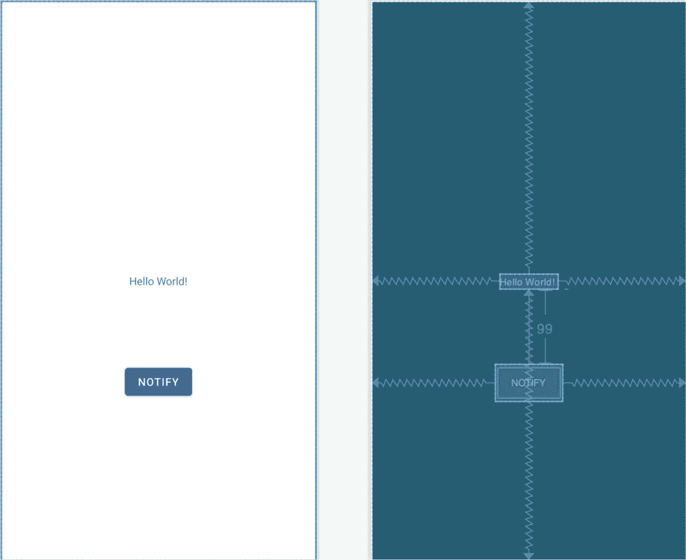

70\. 一个安卓直接回复通知教程

直接回复 是安卓 7 中引入的一项功能，允许用户在通知中输入文本，并将其发送到与该通知相关联的应用程序。这允许用户回复通知中的消息，而不需要在应用程序中启动活动。本章将在前一章中获得的知识的基础上，创建一个利用此通知功能的示例应用程序。

70.1 创建直接回复项目

从欢迎屏幕中选择创建新项目快速启动选项，并在生成的新项目对话框中选择空活动模板，然后单击下一步按钮。

在“名称”字段中输入 DirectReply，并将 com . ebookwidue . direct reply 指定为包名。在单击完成按钮之前，将最低应用编程接口级别设置更改为应用编程接口 26:安卓 8.0(奥利奥)，并将语言菜单更改为科特林。使用第 [18.8 节“将项目迁移到视图绑定”](18.html#_idTextAnchor393)中概述的步骤，修改项目以支持视图绑定。

70.2 设计用户界面

将 activity_main.xml 布局文件加载到布局工具中。启用自动连接后，在现有的“你好世界”下添加一个按钮对象标签如[图 70-1](#_idTextAnchor1327) 所示。在布局中选择按钮小部件后，使用属性工具窗口设置 onClick 属性来调用名为 sendNotification 的方法。如有必要，使用“推断约束”按钮将任何缺失的约束添加到布局中。继续之前，选择“你好世界！”文本视图并将 id 属性更改为文本视图，并将按钮上的文本修改为“通知”。



图 70-1

70.3 创建通知通道

与前一章中的示例一样，在发送通知之前，必须创建一个通道。编辑 MainActivity.kt 文件并添加代码来创建一个新通道，如下所示:

```kt
.
.
import android.app.NotificationChannel
import android.app.NotificationManager
import android.content.Context
import android.graphics.Color
.
.
class MainActivity : AppCompatActivity() {

    private lateinit var binding: ActivityMainBinding
    private var notificationManager: NotificationManager? = null
    private val channelID = "com.ebookfrenzy.directreply.news"

    override fun onCreate(savedInstanceState: Bundle?) {
        super.onCreate(savedInstanceState)
        binding = ActivityMainBinding.inflate(layoutInflater)
        setContentView(binding.root)

        notificationManager = 
                  getSystemService(
                   Context.NOTIFICATION_SERVICE) as NotificationManager

        createNotificationChannel(channelID,
                "DirectReply News", "Example News Channel")
    }

    private fun createNotificationChannel(id: String,
                                            name: String, description: String) {

        val importance = NotificationManager.IMPORTANCE_HIGH
        val channel = NotificationChannel(id, name, importance)

        channel.description = description
        channel.enableLights(true)
        channel.lightColor = Color.RED
        channel.enableVibration(true)
        channel.vibrationPattern = 
                  longArrayOf(100, 200, 300, 400, 500, 400, 300, 200, 400)

        notificationManager?.createNotificationChannel(channel)
    }
.
.
}
```

70.4 构建远程输入对象

通知中直接回复内嵌文本的关键元素是 RemoteInput 类。前面几章介绍了 PendingIntent 类，并解释了它如何允许一个应用程序创建一个意图，然后授予其他应用程序或服务从原始应用程序之外启动该意图的能力。在名为[“安卓通知教程”](69.html#_idTextAnchor1300)的那一章中，创建了一个待定的意图，允许从通知中启动原始应用程序中的活动。RemoteInput 类允许将用户输入请求与意图一起包含在 PendingIntent 对象中。当 PendingIntent 对象中的意图被触发时，例如启动一个活动，该活动也会被传递用户提供的任何输入。

在通知中实现直接回复的第一步是创建远程输入对象。这是使用远程输入实现的。建设者()方法。要构建一个远程输入对象，需要一个密钥字符串，用于从结果意图中提取输入。该对象还需要一个标签字符串，该字符串将出现在通知的文本输入字段中。编辑 MainActivity.kt 文件，并开始实现 sendNotification()方法。还要注意一些导入指令和变量的添加，它们将在本章后面使用:

```kt
package com.ebookfrenzy.directreply
.
.
import android.content.Intent
import android.app.RemoteInput
import android.view.View
import android.app.PendingIntent

class MainActivity : AppCompatActivity() {

    private val notificationId = 101
    private val KEY_TEXT_REPLY = "key_text_reply"
.
.
    fun sendNotification(view: View) {

        val replyLabel = "Enter your reply here"
        val remoteInput = RemoteInput.Builder(KEY_TEXT_REPLY)
                .setLabel(replyLabel)
                .build()
    }
.
.
}
```

现在已经创建了 RemoteInput 对象，并用一个键和一个标签字符串初始化了它，它将需要被放在一个通知操作对象中。但是，在执行该步骤之前，需要创建挂起的内容实例。

70.5 创建待定内容

创建挂起内容的步骤与[“安卓通知教程”](69.html#_idTextAnchor1300)一章中概述的步骤相同，除了意图将被配置为启动主活动。保留在 MainActivity.kt 文件中，添加如下代码来创建挂起内容:

```kt
fun sendNotification(view: View) {
.
.
    val resultIntent = Intent(this, MainActivity::class.java)

    val resultPendingIntent = PendingIntent.getActivity(
            this,
            0,
            resultIntent,
            PendingIntent.FLAG_UPDATE_CURRENT
    )
}
```

70.6 创建回复动作

在线回复可通过操作按钮在通知中访问。现在需要创建此操作，并用图标、出现在按钮上的标签、挂起的内容对象和远程输入对象进行配置。修改 sendNotification()方法以添加代码来创建此操作:

```kt
.
.
import android.graphics.drawable.Icon
import android.app.Notification
.
.
fun sendNotification(view: View) {
.
.
    val icon = Icon.createWithResource(this@MainActivity,
            android.R.drawable.ic_dialog_info)

    val replyAction = Notification.Action.Builder(
            icon,
            "Reply", resultPendingIntent)
            .addRemoteInput(remoteInput)
            .build()
    }
.
.
```

在本教程的这个阶段，我们已经构建了远程输入、挂起内容和通知操作对象，并准备使用。下一个阶段是构建通知并发布它:

```kt
.
.
import androidx.core.content.ContextCompat
.
.
fun sendNotification(view: View) {
.
.
    val newMessageNotification = Notification.Builder(this, channelID)
            .setColor(ContextCompat.getColor(this,
                    R.color.design_default_color_primary))
            .setSmallIcon(
                    android.R.drawable.ic_dialog_info)
            .setContentTitle("My Notification")
            .setContentText("This is a test message")
            .addAction(replyAction).build()

    val notificationManager = getSystemService(
       Context.NOTIFICATION_SERVICE) as NotificationManager

    notificationManager.notify(notificationId,
            newMessageNotification)
}
```

做出更改后，编译并运行应用程序，并测试点击按钮是否成功发出通知。查看通知抽屉时，通知应出现如[图 70-2](#_idTextAnchor1333) 所示:


图 70-2

轻按“回复”操作按钮，以使文本输入字段出现，显示创建远程输入对象时嵌入其中的回复标签。


图 70-3

输入一些文本，然后点击位于输入栏末端的发送箭头按钮。

70.7 接收直接回复输入

现在通知成功地从用户那里获得了输入，应用程序需要用这些输入做一些事情。本教程的目标是让用户在通知中输入的文本出现在活动用户界面的文本视图小部件上。

当用户输入文本并点击发送按钮时，主活动通过包含在挂起内容对象中的意图启动。嵌入在这一意图中的是用户通过通知输入的文本。在活动的 onCreate()方法中，对 getIntent()方法的调用将返回启动活动的意图的副本。将此传递给 remote input . getresultsfrominent()方法将依次返回一个 Bundle 对象，该对象包含可以提取并分配给 TextView 小部件的回复文本。这导致在 MainActivity.kt 文件中修改了 onCreate()方法，其内容如下:

```kt
.
.
override fun onCreate(savedInstanceState: Bundle?) {
.
.
    handleIntent()
}

private fun handleIntent() {

    val intent = this.intent

    val remoteInput = RemoteInput.getResultsFromIntent(intent)

    if (remoteInput != null) {

        val inputString = remoteInput.getCharSequence(
                KEY_TEXT_REPLY).toString()

        binding.textView.text = inputString
    }
}
.
.
```

进行这些代码更改后，再次构建并运行应用程序。单击按钮发出通知，并在通知面板中输入和发送一些文本。请注意，主活动中的文本视图小部件已更新，以显示输入的内嵌文本。

70.8 更新通知

在通知内发送回复后，您可能已经注意到进度指示器继续在通知面板内旋转，如图 70-4 中突出显示的那样:


图 70-4

通知显示此指示器，因为它正在等待确认收到发送文本的活动的响应。执行此任务的推荐方法是用新消息更新通知，指示已收到并处理回复。由于原始通知在发出时被分配了一个标识，因此可以再次使用它来执行更新。向 handleIntent()方法添加以下代码来执行此任务:

```kt
private fun handleIntent() {
.
.
    if (remoteInput != null) {

        val inputString = remoteInput.getCharSequence(
                KEY_TEXT_REPLY).toString()

        textView.text = inputString

        val repliedNotification = Notification.Builder(this, channelID)
                .setSmallIcon(
                        android.R.drawable.ic_dialog_info)
                .setContentText("Reply received")
                .build()

        notificationManager?.notify(notificationId,
                repliedNotification)
    }
}
```

最后测试应用程序一次，并验证在线回复文本发送后进度指示器消失，并且出现一个新面板，指示已收到回复:


图 70-5

70.9 总结

直接回复通知功能允许用户在通知中输入文本，并通过意图传递给相应应用程序的活动。RemoteInput 类使直接回复成为可能，它的一个实例可以嵌入到一个操作中，并与通知捆绑在一起。当使用直接回复通知时，让 NotificationManager 服务知道已经收到并处理了回复是很重要的。实现这一点的最佳方式是使用首次发出通知时提供的通知标识来更新通知消息。