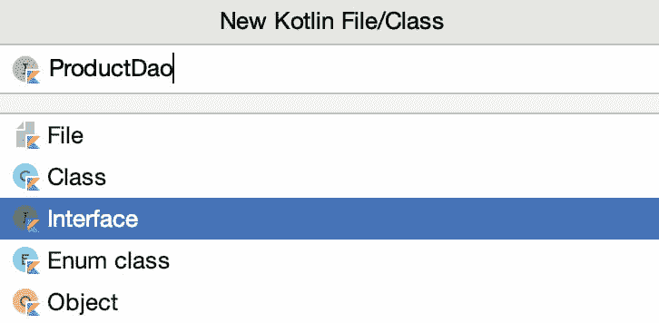
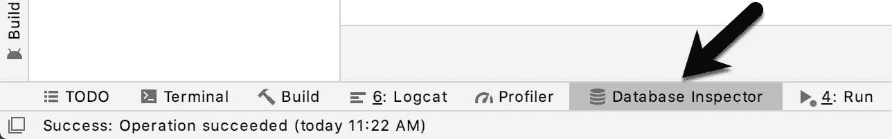
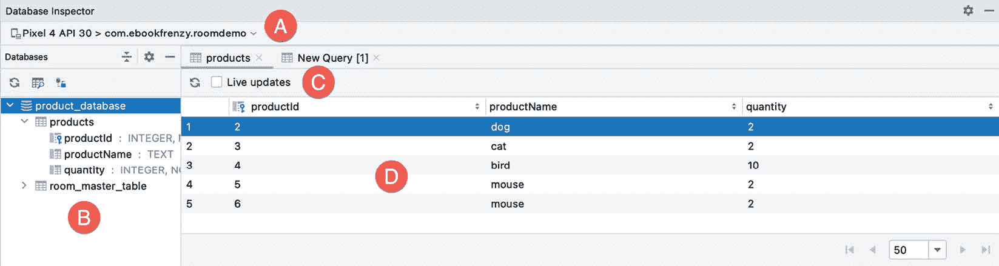
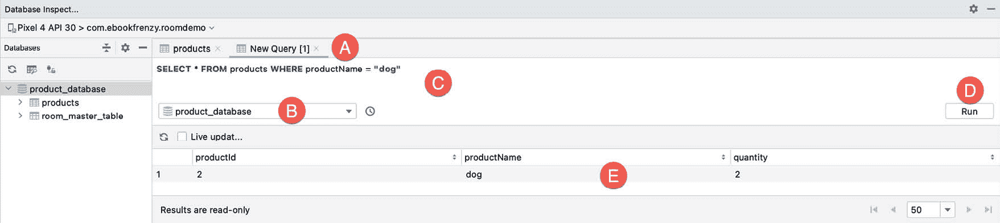

# 七十五、安卓Room数据库和仓库教程

本章将结合在名为[“安卓Room持久化库”](73.html#_idTextAnchor1373)一章中获得的知识和在前一章中创建的初始项目，提供一个详细的教程，演示如何使用Room持久化库实现基于 SQLite 的数据库存储。根据安卓架构指南，该项目将使用视图模型和存储库。本教程将利用[“安卓Room持久化库”](73.html#_idTextAnchor1373)中包含的所有元素，包括实体、数据访问对象、Room数据库和异步数据库查询。

75.1 关于Room演示项目

在前一章中创建的用户界面布局是创建用于存储产品名称和数量的初级库存应用的第一步。完成后，该应用将提供添加、删除和搜索数据库条目的能力，同时还显示数据库中当前存储的所有产品的可滚动列表。随着数据库条目的添加或删除，该产品列表将自动更新。

75.2 修改构建配置

首先启动AndroidStudio，并打开上一章开始的 RoomDemo 项目。在向项目中添加任何新类之前，第一步是向构建配置中添加一些额外的库，包括Room持久化库。现在也是在 build.gradle 文件中启用视图绑定的好时机。找到并编辑模块级 build.gradle 文件(app-> Gradle Scripts-> build . Gradle(Module:roodemo . app))并按如下方式进行修改:

```kt
plugins {
    id 'com.android.application'
    id 'kotlin-android'
    id 'kotlin-kapt'
}
.
.
android {

    buildFeatures {
        viewBinding true
    }
.
.
dependencies {
.
.
    implementation "androidx.room:room-runtime:2.3.0"
    implementation "androidx.fragment:fragment-ktx:1.3.3"
    kapt "androidx.room:room-compiler:2.3.0"
.
.
}
```

75.3 构建实体

这个项目将从创建定义数据库表模式的实体开始。该实体将由一个用于产品 id 的整数、一个用于保存产品名称的字符串列和另一个用于存储数量的整数值组成。产品 id 列将作为主键，并将自动生成。[表 75-1](#_idTextAnchor1421) 总结了实体的结构:

<colgroup><col> <col></colgroup> 
| 圆柱 | 数据类型 |
| 产品 id | 整数/主键/自动增量 |
| 产品名称 | 线 |
| 产量 | 整数 |

表 75-1

通过右键单击项目工具窗口中的 app-> Java-> com . ebookwidue . room demo 条目，并选择新建-> Kotlin 文件/类菜单选项，为实体添加类文件。在“新建类”对话框中，命名类“产品”，在列表中选择“类”条目，然后按键盘回车键生成文件。

当产品. kt 文件在编辑器中打开时，对其进行修改，使其如下所示:

```kt
package com.ebookfrenzy.roomdemo
class Product {

    var id: Int = 0
    var productName: String? = null
    var quantity: Int = 0

    constructor() {}

    constructor(id: Int, productname: String, quantity: Int) {
        this.productName = productname
        this.quantity = quantity
    }
    constructor(productname: String, quantity: Int) {
        this.productName = productname
        this.quantity = quantity
    }
}
```

该类现在拥有数据库表列的变量以及匹配的 getter 和 setter 方法。当然，这个类在被注释之前不会成为一个实体。在编辑器中类文件仍然打开的情况下，添加注释和相应的导入语句:

```kt
package com.ebookfrenzy.roomdemo

import androidx.annotation.NonNull
import androidx.room.ColumnInfo
import androidx.room.Entity
import androidx.room.PrimaryKey

@Entity(tableName = "products")
class Product {

    @PrimaryKey(autoGenerate = true)
    @NonNull
    @ColumnInfo(name = "productId")
    var id: Int = 0

    @ColumnInfo(name = "productName")
    var productName: String? = null
    var quantity: Int = 0

    constructor() {}

    constructor(id: Int, productname: String, quantity: Int) {
        this.id = id
        this.productName = productname
        this.quantity = quantity
    }
    constructor(productname: String, quantity: Int) {
        this.productName = productname
        this.quantity = quantity
    }
}
```

这些注释将其声明为名为 products 的表的实体，并为 id 和 name 变量分配列名。id 列也被配置为主键并自动生成。因为主键永远不能为空，所以也应用@NonNull 注释。由于在 SQL 查询中不需要引用数量列，因此没有为数量变量指定列名。

75.4 创建数据访问对象

定义了产品实体后，下一步是创建 DAO 接口。再次参考项目工具窗口，右键单击应用-> Java-> com . ebookwidue . roodemo 条目，并选择新建-> Kotlin 文件/类菜单选项。在新建类对话框中，在名称字段输入 ProductDao，从列表中选择接口，如图[图 75-1](#_idTextAnchor1423) 所示:



图 75-1

单击“确定”以生成新界面，并将 ProductDao.kt 文件加载到代码编辑器中，进行以下更改:

```kt
package com.ebookfrenzy.roomdemo

import androidx.lifecycle.LiveData
import androidx.room.Dao
import androidx.room.Insert
import androidx.room.Query

@Dao
interface ProductDao {

    @Insert
    fun insertProduct(product: Product)

    @Query("SELECT * FROM products WHERE productName = :name")
    fun findProduct(name: String): List<Product>

    @Query("DELETE FROM products WHERE productName = :name")
    fun deleteProduct(name: String)

    @Query("SELECT * FROM products")
    fun getAllProducts(): LiveData<List<Product>>
}
```

DAO 实现了从产品数据库中插入、查找和删除记录的方法。插入方法传递给包含要存储的数据的产品实体对象，而查找和删除记录的方法传递给包含要执行操作的产品名称的字符串。getAllProducts()方法返回一个包含数据库中所有记录的 LiveData 对象。此方法将用于保持用户界面布局中的 RecyclerView 产品列表与数据库同步。

75.5 添加Room数据库

将存储库添加到项目之前的最后一项任务是实现Room数据库实例。向名为 ProductRoomDatabase 的项目中添加一个新类，这次选择了“类”选项。

文件生成后，使用[“安卓Room持久化库”](73.html#_idTextAnchor1373)一章中概述的步骤进行如下修改:

```kt
package com.ebookfrenzy.roomdemo

import android.content.Context
import androidx.room.Database
import androidx.room.Room
import androidx.room.RoomDatabase
import com.ebookfrenzy.roomdemo.Product
import com.ebookfrenzy.roomdemo.ProductDao

@Database(entities = [(Product::class)], version = 1)
abstract class ProductRoomDatabase: RoomDatabase() {

    abstract fun productDao(): ProductDao

    companion object {

        private var INSTANCE: ProductRoomDatabase? = null

        internal fun getDatabase(context: Context): ProductRoomDatabase? {
            if (INSTANCE == null) {
                synchronized(ProductRoomDatabase::class.java) {
                    if (INSTANCE == null) {
                        INSTANCE = 
                           Room.databaseBuilder<ProductRoomDatabase>(
                            context.applicationContext,
                                ProductRoomDatabase::class.java, 
                                    "product_database").build()
                    }
                }
            }
            return INSTANCE
        }
    }
}
```

75.6 添加存储库

选择“类”选项，向项目中添加名为“产品存储库”的新类。

存储库类将代表视图模型负责与Room数据库交互，并且需要提供使用 DAO 插入、删除和查询产品记录的方法。除了 getAllProducts() DAO 方法(它返回一个 LiveData 对象)之外，这些数据库操作将需要在与主线程不同的线程上执行。

保留在 ProductRepository.kt 文件中，进行以下更改:

```kt
package com.ebookfrenzy.roomdemo

import android.app.Application
import androidx.lifecycle.LiveData
import androidx.lifecycle.MutableLiveData
import kotlinx.coroutines.*

class ProductRepository(application: Application) {

    val searchResults = MutableLiveData<List<Product>>()
}
```

上面声明了一个名为 searchResults 的可变数据变量，每当异步搜索任务完成时，搜索操作的结果都会存储到该变量中(在本教程的后面，视图模型中的一个观察者将监视这个活动数据对象)。

存储库类现在需要提供一些方法，视图模型可以调用这些方法来启动这些操作。然而，为了能够做到这一点，存储库需要通过 ProductRoomDatabase 实例获取 DAO 引用。向 ProductRepository 类中添加一个构造函数方法来执行这些任务:

```kt
.
.
class ProductRepository(application: Application) {

    val searchResults = MutableLiveData<List<Product>>()
    private var productDao: ProductDao?

    init {
        val db: ProductRoomDatabase? = 
                   ProductRoomDatabase.getDatabase(application)
        productDao = db?.productDao()
    }
.
.
```

为了避免在主线程上执行数据库操作，存储库将使用 coroutines(一个主题包含在标题为“Kotlin Coroutines 简介”的章节中)。因此，在继续处理存储库类之前，需要向项目中添加一些额外的库。首先编辑 gradale Scripts-> build . gradale(Module:roodemo . app)文件，将以下几行添加到依赖项部分:

```kt
dependencies {
.
.
    implementation 'org.jetbrains.kotlinx:kotlinx-coroutines-core:1.4.1'
    implementation 'org.jetbrains.kotlinx:kotlinx-coroutines-android:1.4.1'
.
.
}
```

进行更改后，单击编辑器面板顶部的“立即同步”链接提交更改。

通过引用存储的 DAO 并添加适当的库，这些方法可以添加到 ProductRepository 类文件中，如下所示:

```kt
.
.
val searchResults = MutableLiveData<List<Product>>()
private var productDao: ProductDao?
private val coroutineScope = CoroutineScope(Dispatchers.Main)
.
.
fun insertProduct(newproduct: Product) {
    coroutineScope.launch(Dispatchers.IO) {
        asyncInsert(newproduct)
    }
}

private suspend fun asyncInsert(product: Product) {
    productDao?.insertProduct(product)
}

fun deleteProduct(name: String) {
    coroutineScope.launch(Dispatchers.IO) {
        asyncDelete(name)
    }
}

private suspend fun asyncDelete(name: String) {
    productDao?.deleteProduct(name)
}

fun findProduct(name: String) {
    coroutineScope.launch(Dispatchers.Main) {
        searchResults.value = asyncFind(name).await()
    }
}

private suspend fun asyncFind(name: String): Deferred<List<Product>?> =

    coroutineScope.async(Dispatchers.IO) {
        return@async productDao?.findProduct(name)
    }
.
.
```

对于添加和删除数据库操作，上面的代码添加了两个方法，一个是标准方法，另一个是协同挂起方法。在每种情况下，标准方法都会调用 suspend 方法在主线程之外执行协程(使用 IO dispatcher)，以便在执行任务时不阻塞应用。在查找操作的情况下，asyncFind()挂起方法还利用延迟值将搜索结果返回给 findProduct()方法。因为 findProduct()方法需要访问 searchResults 变量，所以对 asyncFind()方法的调用被调度到主线程，主线程又使用 IO 调度器执行数据库操作。

最后一项任务是完成存储库类。用户界面布局中的回收视图需要能够保持数据库中存储的产品的最新列表。ProductDao 类已经包含了一个名为 getAllProducts()的方法，该方法使用一个 SQL 查询来选择所有的数据库记录，并将它们包装在一个 LiveData 对象中返回。存储库需要在初始化时调用该方法一次，并将结果存储在一个 LiveData 对象中，该对象可以被视图模型观察到，进而被用户界面控制器观察到。设置好之后，每次数据库表发生变化时，用户界面控制器观察者都会得到通知，并且可以使用最新的产品列表更新回收视图。保留在 ProductRepository.kt 文件中，添加一个 LiveData 变量，并调用构造函数中的 DAO getAllProducts()方法:

```kt
.
.
class ProductRepository(application: Application) {
.
.
    val allProducts: LiveData<List<Product>>?

    init {
        val db: ProductRoomDatabase? = 
                ProductRoomDatabase.getDatabase(application)
        productDao = db?.productDao()
        allProducts = productDao?.getAllProducts()
    }
.
.
```

75.7 修改视图模型

视图模型负责创建存储库的实例，并提供用户界面控制器可以用来保持用户界面与底层数据库同步的方法和实时数据对象。正如在 ProductRepository.kt 中实现的那样，存储库构造函数需要访问应用上下文，以便能够获得一个 Room 数据库实例。为了使应用上下文可以在视图模型中访问，以便它可以被传递给存储库，视图模型需要子类化 AndroidViewModel，而不是视图模型。因此，首先编辑 MainViewModel.kt 文件(位于 app-> Java-> com . ebookwidge . roodemo-> ui . main 下的项目工具窗口中)，并更改类以扩展 AndroidViewModel 并实现默认构造函数:

```kt
package com.ebookfrenzy.roomdemo.ui.main

import android.app.Application
import androidx.lifecycle.AndroidViewModel
import androidx.lifecycle.LiveData
import androidx.lifecycle.MutableLiveData
import com.ebookfrenzy.roomdemo.Product
import com.ebookfrenzy.roomdemo.ProductRepository
import androidx.lifecycle.ViewModel

class MainViewModel(application: Application) : AndroidViewModel(application) {

    private val repository: ProductRepository = ProductRepository(application)
    private val allProducts: LiveData<List<Product>>?
    private val searchResults: MutableLiveData<List<Product>>

    init {
        allProducts = repository.allProducts
        searchResults = repository.searchResults
    }
}
```

构造函数本质上是创建一个存储库实例，然后使用它来获取对结果和活动数据对象的引用，以便用户界面控制器可以观察到它们。现在视图模型中剩下的就是实现方法，这些方法将在用户界面控制器中响应按钮点击和在 LiveData 对象上设置观察器时调用:

```kt
fun insertProduct(product: Product) {
    repository.insertProduct(product)
}

fun findProduct(name: String) {
    repository.findProduct(name)
}

fun deleteProduct(name: String) {
    repository.deleteProduct(name)
}

fun getSearchResults(): MutableLiveData<List<Product>> {
    return searchResults
}

fun getAllProducts(): LiveData<List<Product>>? {
    return allProducts
}
```

75.8 创建产品项目布局

数据库中每个产品的名称将出现在主用户界面的回收视图列表中。这将需要一个包含文本视图的布局资源文件，用于列表中的每一行。通过右键单击项目工具窗口中的应用->资源->布局条目并选择新建->布局资源文件菜单选项，立即添加此文件。命名文件 product_list_item，并将根元素更改为 LinearLayout，然后单击“确定”创建文件并将其加载到布局编辑器中。布局编辑器处于设计模式时，将文本视图对象从选项板拖到布局上，默认情况下，它将出现在布局的顶部:


图 75-2

在布局中选择文本视图后，使用属性工具窗口将视图的标识设置为产品行，布局高度设置为 30dp。在组件树窗口中选择线性布局条目，并将布局高度属性设置为环绕内容。

75.9 添加回收视图适配器

正如标题为[“使用 RecyclerView 和 CardView 小部件”](54.html#_idTextAnchor1090)一章中详细描述的那样，RecyclerView 实例需要一个适配器类来提供要显示的数据。在项目工具窗口中右键单击应用->Java->com . ebookwidge . roodemo->ui . main 条目，然后选择新建- > Kotlin 文件/类，即可添加此类...菜单。在对话框中，命名产品列表适配器类，并在按键盘回车键之前从列表中选择类。将生成的 ProductListAdapter.kt 类加载到编辑器中，按如下方式实现该类:

```kt
package com.ebookfrenzy.roomdemo.ui.main

import android.view.LayoutInflater
import android.view.View
import android.view.ViewGroup
import android.widget.TextView
import androidx.recyclerview.widget.RecyclerView
import com.ebookfrenzy.roomdemo.Product
import com.ebookfrenzy.roomdemo.R

class ProductListAdapter(private val productItemLayout: Int) : 
               RecyclerView.Adapter<ProductListAdapter.ViewHolder>() {

    private var productList: List<Product>? = null

    override fun onBindViewHolder(holder: ViewHolder, listPosition: Int) {
        val item = holder.item
        productList.let {
            item.text = it!![listPosition].productName
        }
    }

    override fun onCreateViewHolder(parent: ViewGroup, viewType: Int): 
                                                             ViewHolder {
        val view = LayoutInflater.from(parent.context).inflate(
                                   productItemLayout, parent, false)
        return ViewHolder(view)
    }

    fun setProductList(products: List<Product>) {
        productList = products
        notifyDataSetChanged()
    }

    override fun getItemCount(): Int { 
        return if (productList == null) 0 else productList!!.size
    }

    class ViewHolder(itemView: View) : RecyclerView.ViewHolder(itemView) {
        var item: TextView = itemView.findViewById(R.id.product_row)
    }
}
```

75.10 准备主片段

剩下的最后一个要修改的组件是 MainFragment 类，它需要在按钮视图上配置监听器，并在位于 ViewModel 类中的实时数据对象上配置观察器。在添加这段代码之前，需要进行一些准备工作来添加一些导入、变量和获取视图 id 的引用。我们还需要修改片段以利用视图绑定。编辑 MainFragment.kt 文件，并对其进行如下修改:

```kt
package com.ebookfrenzy.roomdemo.ui.main
.
.
import androidx.lifecycle.Observer
import androidx.recyclerview.widget.LinearLayoutManager
import com.ebookfrenzy.roomdemo.Product
import androidx.fragment.app.viewModels 

import java.util.*

import com.ebookfrenzy.roomdemo.databinding.MainFragmentBinding 

class MainFragment : Fragment() {

    private var adapter: ProductListAdapter? = null
.
.
    private lateinit var viewModel: MainViewModel
    val viewModel: MainViewModel by viewModels()
    private var _binding: MainFragmentBinding? = null
    private val binding get() = _binding!!

   override fun onCreateView(
        inflater: LayoutInflater, container: ViewGroup?,
        savedInstanceState: Bundle?
    ): View {
        return inflater.inflate(R.layout.main_fragment, container, false)
        _binding = MainFragmentBinding.inflate(inflater, container, false)
        return binding.root
    }

    override fun onActivityCreated(savedInstanceState: Bundle?) {
        super.onActivityCreated(savedInstanceState)
        viewModel = ViewModelProvider(this).get(MainViewModel::class.java)

        listenerSetup()
        observerSetup()
        recyclerSetup()
    }
.
.
```

在代码的不同阶段，应用需要清除用户界面中显示的产品信息。为了避免代码重复，添加以下 clearFields()便利函数:

```kt
private fun clearFields() {
    binding.productID.text = ""
    binding.productName.setText("")
    binding.productQuantity.setText("")
} 
```

在构建和测试应用之前，需要将上面的 onActivityCreated()方法调用的三个设置方法添加到类中。

75.11 添加按钮监听器

主片段的用户界面布局包含三个按钮，当用户单击每个按钮时，需要执行特定的任务。编辑 MainFragment.kt 文件并添加 listenerSetup()方法:

```kt
private fun listenerSetup() {

    binding.addButton.setOnClickListener {
        val name = binding.productName.text.toString()
        val quantity = binding.productQuantity.text.toString()

        if (name != "" && quantity != "") {
            val product = Product(name, Integer.parseInt(quantity))
            viewModel.insertProduct(product)
            clearFields()
        } else {
            binding.productID.text = "Incomplete information"
        }
    }
    binding.findButton.setOnClickListener { viewModel.findProduct(
                              binding.productName.text.toString()) }

    binding.deleteButton.setOnClickListener {
        viewModel.deleteProduct(binding.productName.text.toString())
        clearFields()
    }
}
```

添加按钮监听器执行一些基本验证，以确保用户输入了产品名称和数量，并使用这些数据创建新的产品实体对象(请注意，数量字符串被转换为整数以匹配实体数据类型)。然后，在清除字段之前，调用视图模型插入产品()方法并传递产品对象。

查找按钮和删除按钮侦听器将产品名称传递给视图模型查找产品()或删除产品()方法。

75.12 添加实时数据观察器

用户界面现在需要添加观察器，以与视图模型中的搜索结果和所有产品实时数据对象保持同步。保留在 Mainfragment.kt 文件中，按如下方式实现观察者设置方法:

```kt
private fun observerSetup() {

    viewModel.getAllProducts()?.observe(this, Observer { products ->
        products?.let  {
            adapter?.setProductList(it)
        }
    })

    viewModel.getSearchResults().observe(this, Observer { products ->

        products?.let {
            if (it.isNotEmpty()) {
                binding.productID.text = String.format(Locale.US, "%d", it[0].id)
                binding.productName.setText(it[0].productName)
                binding.productQuantity.setText(String.format(Locale.US, "%d",
                    it[0].quantity))
            } else {
                binding.productID.text = "No Match"
            }
        }
    })
}
```

“所有产品”观察器只需将当前产品列表传递给 RecyclerAdapter 的 setProductList()方法，显示的列表将在该方法中更新。

“搜索结果”观察器检查数据库中是否至少有一个匹配结果，从列表中提取第一个匹配的产品实体对象，从该对象中获取数据，必要时进行转换，并将其分配给布局中的文本视图和编辑文本视图。如果产品搜索失败，将通过产品标识文本视图上显示的消息通知用户。

75.13 初始化回收视图

添加最终设置方法来初始化和配置回收视图和适配器，如下所示:

```kt
private fun recyclerSetup() {
    adapter = ProductListAdapter(R.layout.product_list_item)
    binding.productRecycler.layoutManager = LinearLayoutManager(context)
    binding.productRecycler.adapter = adapter
}
```

75.14 测试Room演示应用

在设备或模拟器上编译和运行应用，添加一些产品，并确保它们自动出现在回收视图中。搜索现有产品，并验证产品标识和数量字段是否相应更新。最后，输入现有产品的名称，将其从数据库中删除，并确认其已从回收视图产品列表中删除。

75.15 使用数据库检查器

如先前在[“安卓Room持久化库”](73.html#_idTextAnchor1373)中所述，数据库检查器工具窗口可用于检查与正在运行的应用相关联的Room数据库的内容，并执行微小的数据更改。使用 RoomDemo 应用添加一些数据库记录后，使用[图 75-3](#_idTextAnchor1435) 中指示的选项卡按钮显示数据库检查器工具窗口:



图 75-3

在检查器窗口中，从以下图 75-4 中标记为“A”的菜单中选择运行中的应用:



图 75-4

在“数据库”面板中，双击“产品”表，查看当前存储在数据库中的表行。启用实时更新选项(丙)，然后使用正在运行的应用向数据库添加更多记录。注意数据库检查器实时更新表格数据(D)以反映变化。

关闭实时更新，使表格不再是只读的，双击表格行的数量单元格，并在按键盘回车键之前更改值。返回到正在运行的应用并搜索产品，以确认在检查器中对数量所做的更改已保存到数据库表中。

最后点击表查询按钮(如下图[中箭头所示)显示新的查询页签(A)，确定选择了 product _ database)，在查询文本字段(C)输入 SQL 语句，点击 Run 按钮(D):](#_idTextAnchor1437)



图 75-5

行列表应该更新以反映 SQL 查询的结果。

75.16 总结

本章演示了如何使用 Room 持久化库在 SQLite 数据库中存储数据。完成的项目利用一个存储库将视图模型从所有数据库操作中分离出来，并演示了实体、DAO 和Room数据库实例的创建，包括在执行一些数据库操作时异步任务的使用。