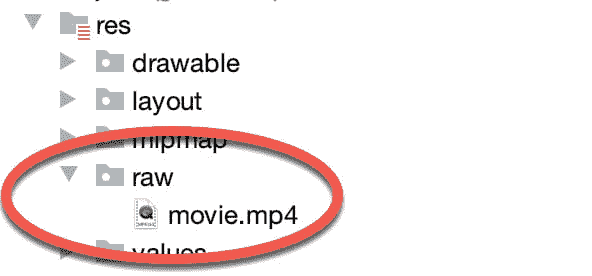
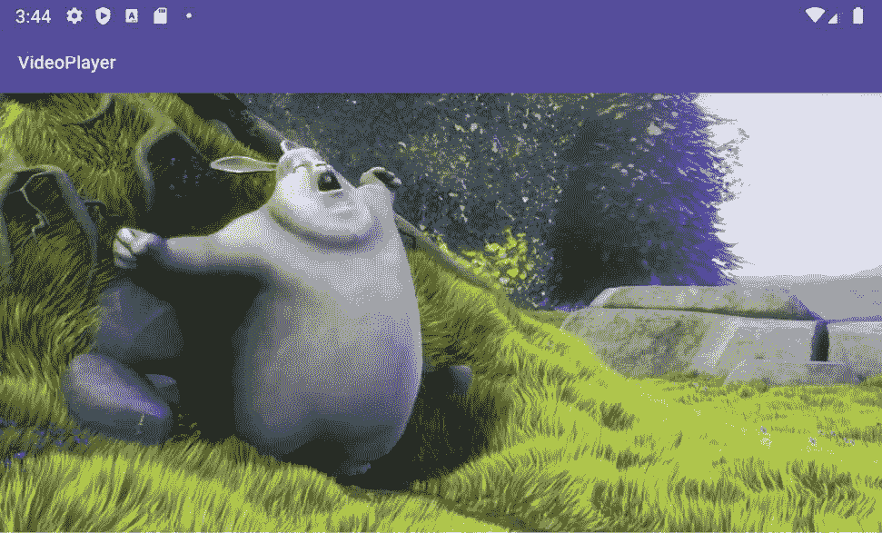

78.使用视频视图和媒体控制器类在安卓系统上播放视频

智能手机和平板电脑的主要用途之一是提供在线内容访问。视频是广泛使用的一种关键内容形式，尤其是在平板设备中。

Android SDK 包括两个类，使得在开发应用时，在 Android 设备上实现视频播放变得极其容易。在创建视频播放应用之前，本章将对这两个类(视频视图和媒体控制器)进行概述。

78.1 介绍安卓视频查看类

到目前为止，在安卓应用中显示视频的最简单方法是使用 VideoView 类。这是一个视觉组件，当添加到活动的布局中时，它提供了一个可以播放视频的表面。安卓目前支持以下视频格式:

氢 263

H.264 自动电压控制

h.265 hevc

MPEG-4 SP

VP8

VP9

VideoView 类有多种方法可以调用来管理视频的回放。一些更常用的方法如下:

设置视频路径(字符串路径)–指定要播放的视频媒体的路径(字符串形式)。这可以是远程视频文件的网址，也可以是设备本地的视频文件。

setvideo Uri(Uri)–执行与 setVideoPath()方法相同的任务，但将 Uri 对象作为参数而不是字符串。

start()–开始视频播放。

停止回放()–停止视频播放。

暂停()–暂停视频播放。

isPlaying()–返回一个布尔值，指示视频当前是否正在播放。

setOnPreparedListener(MediaPlayer。OnPreparedListener)–允许在视频准备播放时调用回调方法。

setonerorlistener(media player。允许在视频播放过程中出现错误时调用回调方法。

设置完成监听器(媒体播放器。OnCompletionListener) -允许在视频结束时调用回调方法。

getDuration()–返回视频的持续时间。除非从 OnPreparedListener()回调方法中调用，否则通常会返回-1。

getCurrentPosition()–返回一个指示当前播放位置的整数值。

设置媒体控制器(媒体控制器)–指定一个媒体控制器实例，允许向用户显示回放控制。

78.2 推出安卓媒体控制器类

如果只使用 VideoView 类播放视频，用户将无法控制播放，播放将一直持续到视频结束。这个问题可以通过将 MediaController 类的一个实例附加到 VideoView 实例来解决。然后，媒体控制器将提供一组控件，允许用户管理回放(如暂停和在视频时间线上向前/向后搜索)。

通过将控制器实例锚定到用户界面布局中的特定视图来指定控件的位置。一旦附加和锚定，控件将在回放开始时短暂出现，并且随后可以通过用户轻按实例所锚定的视图在任何点恢复。

该类的一些关键方法如下:

设置锚视图(视图视图)–指定控制器要锚定的视图。这指定了屏幕上控件的位置。

show()–显示控件。

显示(int time out)–控件显示指定的持续时间(毫秒)。

hide()–对用户隐藏控制器。

isShowing()–返回一个布尔值，指示控件当前是否对用户可见。

78.3 创建视频回放示例

本章的剩余部分将创建一个示例应用，用于使用视频视图和媒体控制器类来播放 MPEG-4 视频文件。

从欢迎屏幕中选择创建新项目快速启动选项，并在生成的新项目对话框中选择空活动模板，然后单击下一步按钮。

在“名称”字段中输入 VideoPlayer，并将 com . ebookwidue . video player 指定为包名称。在单击完成按钮之前，将最低API级别设置更改为API 26:安卓 8.0(奥利奥)，并将语言菜单更改为Kotlin。使用第 [18.8 节“将项目迁移到视图绑定”](18.html#_idTextAnchor393)中的步骤为项目启用视图绑定。

78.4 设计视频播放器布局

主要活动的用户界面将仅由 VideoView 类的一个实例组成。使用项目工具窗口找到应用-> res ->布局-> activity_main.xml 文件，双击它，将布局编辑器工具切换到设计模式，并删除默认的文本视图小部件。

从调色板面板的小部件类别中，将一个视频视图实例拖放到布局上，使其填充可用的画布区域，如图 78-1 所示。使用“属性”面板，将布局宽度和布局高度属性分别更改为匹配约束和环绕内容。此外，删除连接视频视图底部和父约束布局底部的约束。最后，将组件的 ID 改为 videoView 1。


图 78-1

78.5 下载视频文件

将由视频播放器应用播放的视频是一个以 MPEG-4 格式编码的动画短片。使用网络浏览器，导航到以下网址播放视频:

[https://www.ebookfrenzy.com/android_book/movie.mp4](https://www.ebookfrenzy.com/android_book/movie.mp4)

停留在浏览器窗口中，右键单击视频回放，选择将视频保存或下载到本地文件的选项，并选择合适的临时文件系统位置，将文件命名为 movie.mp4。

在AndroidStudio中，在项目工具窗口中找到 res 文件夹，右键单击它，选择新建->目录菜单选项，并在名称字段中输入 raw，然后单击确定按钮。使用操作系统的文件系统导航器，找到上面下载的 movie.mp4 文件并复制它。返回AndroidStudio，右键单击新创建的原始目录，选择粘贴选项，将视频文件复制到项目中。添加后，原始文件夹应与项目工具窗口中的[图 78-2](#_idTextAnchor1475) 相匹配:



图 78-2

78.6 配置视频视图

下一步是用要播放的视频路径配置 VideoView，然后开始播放。这将在主活动初始化后执行，因此将 MainActivity.kt 文件加载到编辑器中，并按照下面的清单进行修改:

```kt
package com.ebookfrenzy.videoplayer
.
.
import android.net.Uri

class MainActivity : AppCompatActivity() {

    private lateinit var binding: ActivityMainBinding

    override fun onCreate(savedInstanceState: Bundle?) {
        super.onCreate(savedInstanceState)
        binding = ActivityMainBinding.inflate(layoutInflater)
        setContentView(binding.root)

        configureVideoView()
    }

    private fun configureVideoView() {

        binding.videoView1.setVideoURI(Uri.parse("android.resource://" 
                       + getPackageName() + "/" + R.raw.movie))

        binding.videoView1.start()
    }
}
```

这段代码所做的只是获取对布局中 VideoView 实例的引用，为其分配一个引用原始资源目录中的电影文件的 URI 对象，然后开始播放视频。

通过在物理安卓设备上运行应用来测试它。应用启动后，视频内容在回放开始前可能会有短暂的延迟(图 78-3 ) 。



图 78-3

这表明将视频播放集成到安卓应用中是多么容易。到目前为止，这个例子中的所有内容都是使用一个视频视图实例和三行代码实现的。

78.7 将媒体控制器 r 添加到视频视图

就目前的 VideoPlayer 应用而言，用户无法控制回放。如前所述，这可以通过使用 MediaController 类来实现。要向视频视图添加控制器，请再次修改 configureVideoView()方法:

```kt
package com.ebookfrenzy.videoplayer 
.
.
import android.widget.MediaController
.
. 
class MainActivity : AppCompatActivity() {

   private var mediaController: MediaController? = null
.
.
    private fun configureVideoView() {

        binding.videoView1.setVideoURI(Uri.parse("android.resource://" 
                       + getPackageName() + "/" + R.raw.movie))

        mediaController = MediaController(this)
        mediaController?.setAnchorView(binding.videoView1)
        binding.videoView1.setMediaController(mediaController)
        binding.videoView1.start()
    }
}
```

当应用启动并实现这些更改时，轻按视频视图画布将导致媒体控件出现在视频回放上。这些控件应该包括 seekbar 以及快进、快退和播放/暂停按钮。控件从视图中消失后，可以通过再次点击 VideoView 画布随时恢复它们。只需三行代码，我们的视频播放器应用现在就有了媒体控件，如图 78-4 所示:


图 78-4

78.8 设置已准备好的 Listener

作为使用基于视频的媒体的最后一个示例，现在将进一步扩展该活动，以演示配置监听器的机制。在这种情况下，将实现一个监听器，用于在AndroidStudio日志面板中将视频的持续时间作为消息输出。收听者还会将视频播放配置为连续循环播放:

```kt
package com.ebookfrenzy.videoplayer 
.
.
import android.util.Log
.
. 
class MainActivity : AppCompatActivity() {

    private var TAG = "VideoPlayer"
.
.
    private fun configureVideoView() {

        binding.videoView1.setVideoURI(Uri.parse("android.resource://" 
                       + getPackageName() + "/" + R.raw.movie))

        mediaController = MediaController(this)
        mediaController?.setAnchorView(binding.videoView1)
        binding.videoView1.setMediaController(mediaController)

        binding.videoView1.setOnPreparedListener { mp ->
            mp.isLooping = true
            Log.i(TAG, "Duration = " + binding.videoView1.duration)
        }
        binding.videoView1.start()
    }
}
```

现在，就在视频播放开始之前，AndroidStudio日志面板中将出现一条消息，内容大致如下，视频将在播放结束后重新开始:

```kt
11-05 10:27:52.256 12542-12542/com.ebookfrenzy.videoplayer I/VideoPlayer: Duration = 13504
```

78.9 总结

安卓设备是向用户传递内容的绝佳平台，尤其是以视频媒体的形式。如本章所述，安卓软件开发工具包提供了两个类，即视频视图和媒体控制器，它们结合在一起，使视频回放与安卓应用的集成变得快速简单，通常只涉及几行 Kotlin 代码。