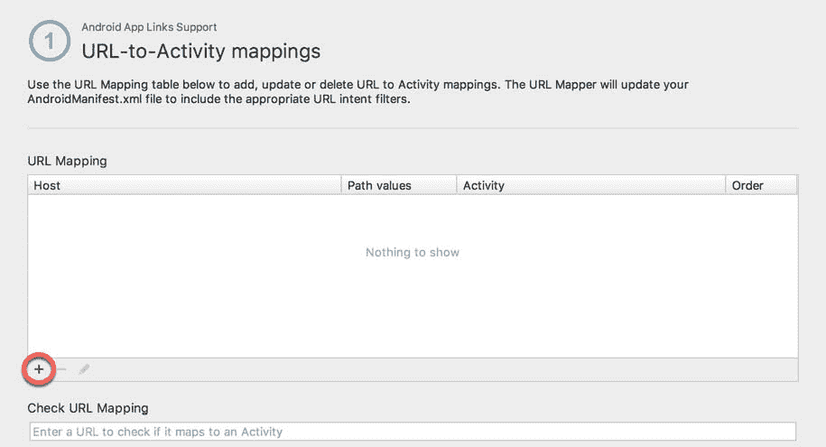
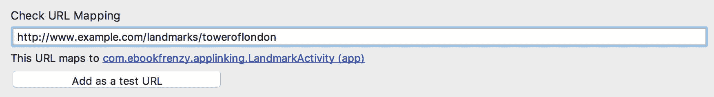
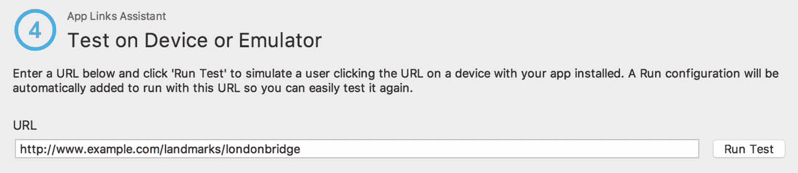
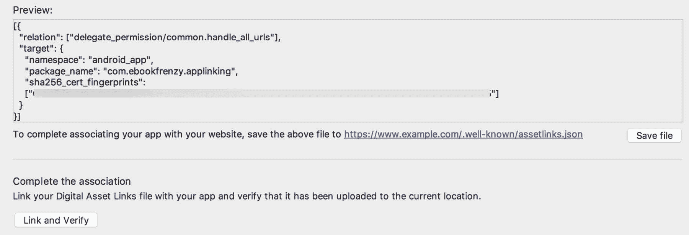

87\. 一款AndroidStudio应用链接教程

本章的目标是提供安卓应用链接和AndroidStudio应用链接助手T2 的实际演示。

本章将向现有的安卓应用添加应用链接支持，允许通过应用链接网址启动活动。除了启动活动之外，显示的内容将在 URL 的路径中指定。

87.1 关于示例应用

本章中使用的项目名为 AppLinking，是一个基础应用，旨在让用户了解伦敦地标的信息。该应用使用通过标准安卓内容提供商类访问的 SQLite 数据库。该应用提供了一个现有的数据库，其中包含伦敦一些热门旅游景点的一组记录。除了现有的数据库条目，该应用还允许用户添加和删除地标描述。

在目前的形式下，该应用允许搜索现有记录，并添加和删除新记录。

该项目包括两个名为“应用活动”和“土地标记活动”的活动。AppLinkingActivity 是应用启动时启动的主要活动。此活动允许用户输入搜索标准，并向数据库添加其他记录。当搜索找到匹配的记录时，LandmarkActivity 会启动并显示相关地标的信息。

本章的目标是增强应用，增加对应用链接的支持，以便 URL 可以用来显示应用中的特定地标记录。

87.2 数据库模式

示例应用的数据包含在名为 landmarks.db 的文件中，该文件位于项目层次结构的 app-> assets –> databases 文件夹中。数据库包含一个名为 locations 的单一表，其结构在[表 87-1](#_idTextAnchor1610) 中有概述:

<colgroup><col> <col> <col></colgroup> 
| 圆柱 | 类型 | 描述 |
| _id | 线 | 主索引，此列包含唯一标识数据库中地标的字符串值。 |
| 标题 | 线 | 地标的名称(如伦敦桥)。 |
| 描述 | 线 | 地标的描述。 |
| 个人的 | 布尔代数学体系的 | 指示记录是个人记录还是公共记录。对于用户添加的所有记录，该值都设置为 true。数据库提供的现有记录被设置为 false。 |

表 87-1

87.3 加载和运行项目

该项目包含在示例源代码下载归档的应用文件夹中，该文件夹位于以下网址:

[https://www.ebookfrenzy.com/retail/as42kotlin/index.php](http://www.ebookfrenzy.com/retail/as42kotlin/index.php)

找到文件夹后，在AndroidStudio中打开它，并在设备或模拟器上运行该应用。一旦应用启动，将出现下图[图 87-1](#_idTextAnchor1612) 所示的画面:


图 87-1

按照目前的实施方式，地标是使用该位置的标识来定位的。默认数据库配置当前包含由 IdS“London bridge”和“toweroflondon”引用的两条记录。通过在 ID 字段中输入 londonbridge 并单击“查找”按钮来测试搜索功能。当找到匹配的记录时，将启动第二个活动(LandmarkActivity)，并传递关于要显示的记录的信息。该信息采用添加到意图对象的额外数据的形式。LandmarkActivity 使用该信息从数据库中提取记录，并使用[图 87-2](#_idTextAnchor1613) 所示的屏幕显示给用户。


图 87-2

87.4 添加网址映射

现在，该应用已经加载到AndroidStudio并进行测试，该项目已经准备好添加应用链接支持。目的是让“土地标记活动”屏幕响应应用链接点击启动并显示信息。这是通过将一个网址映射到 LandmarkActivity 来实现的。对于本例，网址的格式如下:

```kt
http://<website domain>/landmarks/<landmarkId>
```

例如，当所有步骤完成后，以下网址应该会使应用显示伦敦塔的信息:

```kt
http://www.yourdomain.com/landmarks/toweroflondon
```

要将网址映射添加到项目中，首先使用工具->应用链接助手菜单选项打开应用链接助手。一旦打开，助手应出现如图[图 87-3](#_idTextAnchor1615) :


图 87-3

单击打开网址映射编辑器按钮，开始将网址映射到活动。在映射屏幕内，点击“+”按钮(在[图 87-4](#_idTextAnchor1616) 中高亮显示)添加新的网址:



图 87-4

在“添加网址映射”对话框的“主机”字段中，输入您的网站的域名或 http://www.example.com(如果您没有)。

路径字段(在下面的[图 87-5](#_idTextAnchor1617) 中标记为 A)是声明网址路径成分的地方。该路径必须在该字段中加上前缀/so enter/landmark。

路径菜单提供了以下三个路径匹配选项:

路径–网址必须与网址的路径组件完全匹配，才能启动活动。例如，如果路径设置为/landmarks，则 http://www.example.com/landmarks 将被视为匹配。然而，http://www.example.com/landmarks/londonbridge,的网址不会被视为匹配。

路径前缀–指定的路径仅被视为前缀。在/landmarks 组件之后可以包括附加的路径组件(例如，http://www.example.com/landmarks/londonbridge 仍然被认为是匹配的)。

路径模式–允许使用基本正则表达式和通配符形式的模式匹配来指定路径，例如地标/*/[l-L]ondon/*

由于本例中的路径是地标标识组件的前缀，因此选择路径前缀菜单选项。

最后，使用“活动”菜单(丙)选择“陆地活动”作为响应应用链接而启动的活动:


图 87-5

完成对话框中的设置后，单击确定按钮提交更改。通过在映射屏幕的检查网址映射字段中输入以下网址，检查网址格式是否正确，并将其分配给适当的活动(其中<your domain="">设置为上面主机字段中指定的域) :</your>

```kt
http://<your domain>/landmarks/toweroflondon
```

如果映射配置正确，LandmarkActivity 将被列为映射的活动:



图 87-6

最新版本的安卓要求为 HTTP 和 HTTPS 协议声明应用链接，即使只使用了一个。因此，在继续下一步之前，请重复上述步骤，将 HTTPS 版本的网址添加到列表中。

下一步也将在应用链接助手的网址映射屏幕中执行，因此保持屏幕处于选中状态。

87.5 添加意图过滤器

如前一章所述，需要一个意图过滤器来允许目标活动响应应用链接点击而启动。事实上，当添加 URL 映射时，意图过滤器会自动添加到项目清单文件中。在应用链接助手网址映射列表中选择网址映射后，向下滚动屏幕，直到出现意图过滤器预览部分。预览应该包含修改后的 AndroidManifest.xml 文件，其中包括新添加的意图过滤器:


图 87-7

87.6 添加意图处理代码

到目前为止采取的步骤确保响应于适当格式的应用链接 URL 启动正确的活动。下一步是处理 LandmarkActivity 类中的意图，以便从数据库中提取正确的记录并显示给用户。在对 LandmarkActivity.kt 文件中的代码进行任何更改之前，值得回顾一下现有代码的某些方面。在代码编辑器中打开 LandmarkActivity.kt 文件，找到 onCreate()和 handleIntent()方法，这些方法当前应该如下所示:

```kt
override fun onCreate(savedInstanceState: Bundle?) {
    super.onCreate(savedInstanceState)
    binding = ActivityLandmarkBinding.inflate(layoutInflater)
    setContentView(binding.root) 

    handleIntent(intent)
}

private fun handleIntent(intent: Intent) {

    val landmarkId = intent.getStringExtra(AppLinkingActivity.LANDMARK_ID)
    displayLandmark(landmarkId)
}
```

在当前的形式中，代码期望在意图包的额外数据中找到地标标识。由于活动现在也可以通过应用链接启动，因此需要更改代码来处理这两种情况。首先删除 onCreate()方法中对 handleIntent()的调用:

```kt
override fun onCreate(savedInstanceState: Bundle?) {
.
.
    handleIntent(intent)
}
```

要添加初始应用链接意图处理代码，请返回应用链接助手面板，并单击步骤 2 下列出的选择活动按钮。在活动选择对话框中，选择土地标记活动条目，然后单击插入代码按钮:


图 87-8

返回 LandmarkActivity.kt 文件，注意以下代码已经插入到 onCreate()方法中(注意，如果 Android Studio 无法完成请求，您可以手动添加此代码):

```kt
// ATTENTION: This was auto-generated to handle app links.
val appLinkIntent = intent
val appLinkAction = appLinkIntent.action
val appLinkData = appLinkIntent.data
```

这段代码访问意图对象，并提取操作字符串和 Uri。如果活动启动是应用链接的结果，操作字符串将被设置为 android.intent.action.VIEW，它与添加到清单文件的意图过滤器中声明的操作相匹配。另一方面，如果活动是由主活动的 findLandmark()方法中的标准意图启动代码启动的，则操作字符串将为空。通过检查分配给操作字符串的值，可以编写代码来识别启动活动的方式并采取适当的操作:

```kt
override fun onCreate(savedInstanceState: Bundle?) {
    super.onCreate(savedInstanceState)
    binding = ActivityLandmarkBinding.inflate(layoutInflater)
    setContentView(binding.root) 

    // ATTENTION: This was auto-generated to handle app links.
    val appLinkIntent = intent
    val appLinkAction = appLinkIntent.action
    val appLinkData = appLinkIntent.data

    val landmarkId = appLinkData?.lastPathSegment

    if (landmarkId != null) {
        displayLandmark(landmarkId)
    }
}
```

剩下的就是在方法中添加一些额外的代码来标识应用链接 URL 路径中的最后一个组件，并在查询数据库时将其用作地标 ID:

```kt
override fun onCreate(savedInstanceState: Bundle?) {
.
.
    // ATTENTION: This was auto-generated to handle app links.
    val appLinkIntent = intent
    val appLinkAction = appLinkIntent.action
    val appLinkData = appLinkIntent.data

    if (appLinkAction != null) {

        if (appLinkAction == "android.intent.action.VIEW") {

            val landmarkId = appLinkData?.lastPathSegment

            if (landmarkId != null) {
                displayLandmark(landmarkId)
            }
        }
    } else {
        handleIntent(appLinkIntent)
    }
}
```

如果操作字符串不为空，在提取 Uri 路径的最后一个组件之前，将进行检查以验证它是否设置为 android.intent.action.VIEW。然后，在进行数据库查询时，该组件被用作地标标识。另一方面，如果操作字符串为空，则调用现有的 handleIntent()方法从意图数据中提取标识。

识别活动启动方式的另一种选择是修改位于 AppLinkingActivity.kt 文件中的 findLandmark()方法，以便它也使用查看意图操作触发启动:

```kt
fun findLandmark(view: View) {

    if (idText?.text.toString() != "") {
        val landmark = dbHandler?.findLandmark(idText?.text.toString())

        if (landmark != null) {
            val uri = Uri.parse("http://<your_domain>/landmarks/" + landmark.id)
            val intent = Intent(Intent.ACTION_VIEW, uri)
            startActivity(intent)
        } else {
            binding.titleText.setText("No Match")
        }
    }
}
```

这种技术的优点是不需要编写代码来识别活动是如何启动的，但也有缺点，除非应用链接与网站相关联，否则它可能会触发下面的[图 87-10](#_idTextAnchor1621) 所示的活动选择面板。

87.7 测试应用链接

通过在工具栏中选择合适的设备或仿真器作为部署目标，返回到应用链接助手面板并单击测试应用链接按钮，测试意图处理是否有效。当提示输入要测试的网址时，在单击“运行测试”按钮之前，输入伦敦大桥地标标识的网址(使用应用链接映射中引用的域):



图 87-9

在活动出现之前，安卓很可能会显示一个面板([图 87-10](#_idTextAnchor1621) )，在该面板中需要选择如何处理应用链接:


图 87-10

除非用户选择“始终”选项，否则在应用链接与网站相关联之前，安卓将在每次使用查看意图操作启动活动时显示该选择面板。

87.8 将应用链接与网站相关联

如前一章所述，通过创建数字资产链接文件并将其安装在网站上，应用链接可以与网站相关联。尽管本章将介绍生成此文件的步骤，但只有使用您自己的应用(具有唯一的应用标识)并且您可以访问基于 https 的 web 服务器(资产文件可以安装在该服务器上)，才能测试这些说明。

要生成数字资产链接文件，请显示应用链接助手，然后单击打开数字资产链接文件生成器按钮。这将显示如图 87-11 所示的面板:


图 87-11

输入要上传资产文件的站点的网址，并验证应用标识是否与包名匹配。为您的项目选择一个包含 SHA 签名密钥的密钥库文件，或者使用菜单选择AndroidStudio使用的发布或调试签名配置，请记住，在您将应用发布到谷歌游戏商店之前，调试密钥需要被发布密钥替换。

如果您的应用使用谷歌登录或其他受支持的登录提供商来验证用户身份，并使用谷歌的智能锁功能来存储密码，选择支持在应用和网站之间共享凭据选项将允许用户存储登录凭据，以便在两个平台上登录时使用。

配置好资产文件后，点击生成数字资产链接文件按钮，预览并保存文件:



图 87-12

保存文件后，将其上传到上图中预览面板下方指定的路径，然后单击链接和验证按钮完成该过程。

数字资产链接文件链接并验证后，安卓在启动地标活动之前不应再显示选择面板。

87.9 总结

本章演示了在安卓应用项目中实现应用链接支持的步骤。本章涵盖的领域包括在AndroidStudio中使用应用链接助手、应用链接网址映射、意图过滤器、使用数字资产文件条目处理网站关联以及应用链接测试。